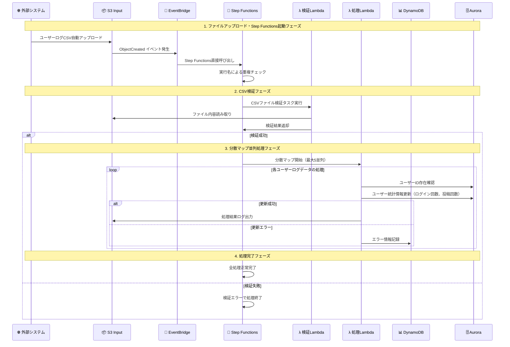

# CSVファイル並列処理システムアーキテクチャ設計書（AWSアイコン版）

## 1. システム概要

### 1.1 アーキテクチャ概要
外部システムから送信されるユーザーのログイン回数や投稿回数を含む1000行レベルのCSVファイルをAWS Step Functions分散マップ機能で並列処理し、Aurora DBにユーザー統計情報を反映するシステムです。外部システムからS3への自動ファイルアップロードをトリガーとして、最大5並列でのデータ処理とデータベース更新を実行します。

## 2. システム構成図

### 2.1 全体アーキテクチャ（AWSアイコン版）

```mermaid
---
title: CSVユーザーログ並列処理システムアーキテクチャ
config:
  theme: neutral
  flowchart:
    nodeSpacing: 15
    rankSpacing: 40
---
flowchart TB

external-system@{img: "https://api.iconify.design/material-symbols/cloud-sync.svg",label: "外部システム",pos: "b",w: 60,h: 60,constraint: "on"}

subgraph aws["AWS (ap-northeast-1)"]
  subgraph vpc-main["VPC (10.0.0.0/16)"]
    subgraph group-private-1[" "]
      aurora-primary@{img: "https://api.iconify.design/logos/aws-rds.svg",label: "Aurora<br/>ServerlessV2<br/>(Primary)",pos: "b",w: 60,h: 60,constraint: "on"}
    end
    subgraph group-private-2[" "]
      aurora-reader@{img: "https://api.iconify.design/logos/aws-rds.svg",label: "Aurora<br/>ServerlessV2<br/>(Reader)",pos: "b",w: 60,h: 60,constraint: "on"}
    end
    subgraph group-endpoints[" "]
      vpc-endpoints@{img: "https://api.iconify.design/material-symbols/hub.svg",label: "VPC<br/>Endpoints",pos: "b",w: 50,h: 50,constraint: "on"}
    end
  end
  
  subgraph group-storage[" "]
    s3-input@{img: "https://api.iconify.design/logos/aws-s3.svg",label: "S3<br/>Input Bucket",pos: "b",w: 60,h: 60,constraint: "on"}
    s3-output@{img: "https://api.iconify.design/logos/aws-s3.svg",label: "S3<br/>Output Bucket",pos: "b",w: 60,h: 60,constraint: "on"}
  end
  
  subgraph group-orchestration[" "]
    eventbridge@{img: "https://api.iconify.design/logos/aws-eventbridge.svg",label: "EventBridge",pos: "b",w: 60,h: 60,constraint: "on"}
    stepfunctions@{img: "https://api.iconify.design/logos/aws-step-functions.svg",label: "Step Functions<br/>分散マップ",pos: "b",w: 60,h: 60,constraint: "on"}
  end
  
  subgraph group-compute[" "]
    lambda-validator@{img: "https://api.iconify.design/logos/aws-lambda.svg",label: "Lambda<br/>CSV検証",pos: "b",w: 60,h: 60,constraint: "on"}
    lambda-processor@{img: "https://api.iconify.design/logos/aws-lambda.svg",label: "Lambda<br/>ユーザーログ処理<br/>(最大5並列)",pos: "b",w: 60,h: 60,constraint: "on"}
  end
  
  subgraph group-database[" "]
    dynamodb@{img: "https://api.iconify.design/logos/aws-dynamodb.svg",label: "DynamoDB<br/>エラー管理",pos: "b",w: 60,h: 60,constraint: "on"}
  end
  
  subgraph group-monitoring[" "]
    cloudwatch@{img: "https://api.iconify.design/logos/aws-cloudwatch.svg",label: "CloudWatch<br/>ログ・メトリクス",pos: "b",w: 60,h: 60,constraint: "on"}
  end
  
  subgraph group-security[" "]
    iam@{img: "https://api.iconify.design/logos/aws-iam.svg",label: "IAM<br/>権限管理",pos: "b",w: 60,h: 60,constraint: "on"}
    kms@{img: "https://api.iconify.design/material-symbols/key.svg",label: "KMS<br/>暗号化キー",pos: "b",w: 50,h: 50,constraint: "on"}
  end
end

%% フロー定義
external-system -.->|"ユーザーログCSV<br/>自動アップロード"| s3-input
s3-input -->|"オブジェクト作成イベント"| eventbridge
eventbridge -->|"直接呼び出し"| stepfunctions
stepfunctions -->|"最初のLambda検証"| lambda-validator
stepfunctions -->|"分散マップ開始"| lambda-processor
lambda-processor -->|"ユーザー統計更新"| aurora-primary
lambda-processor -->|"処理結果"| s3-output
lambda-processor -->|"エラー情報"| dynamodb
aurora-primary -.->|"レプリケーション"| aurora-reader

%% VPC接続
lambda-processor -.->|"プライベート接続"| aurora-primary
vpc-endpoints -.->|"プライベートAPIアクセス"| s3-input
vpc-endpoints -.-> dynamodb

%% 監視・セキュリティ
stepfunctions -.-> cloudwatch
lambda-processor -.-> cloudwatch
iam -.-> lambda-processor
iam -.-> stepfunctions
kms -.-> s3-input
kms -.-> dynamodb
kms -.-> aurora-primary

%% グループの配置
group-private-1 ~~~ group-private-2 ~~~ group-endpoints
group-storage ~~~ group-orchestration ~~~ group-compute
group-database ~~~ group-monitoring ~~~ group-security

%% スタイル定義
classDef default fill:#fff
style aws fill:#fff,color:#345,stroke:#345,stroke-width:2px
style vpc-main fill:#e8f4fd,color:#0a5490,stroke:#0a5490,stroke-width:2px
classDef group fill:none,stroke:none
class group-private-1,group-private-2,group-endpoints,group-storage,group-orchestration,group-compute,group-database,group-monitoring,group-security group

%% クリックイベント(オプション)
click s3-input href "https://aws.amazon.com/s3/" _blank
click stepfunctions href "https://aws.amazon.com/step-functions/" _blank
click lambda-processor href "https://aws.amazon.com/lambda/" _blank
click aurora-primary href "https://aws.amazon.com/rds/aurora/" _blank
click dynamodb href "https://aws.amazon.com/dynamodb/" _blank
```

### 2.2 データフロー詳細



### 2.3 ネットワーク構成詳細（AWSアイコン版）

```mermaid
---
title: ネットワーク構成図
config:
  theme: neutral
  flowchart:
    nodeSpacing: 20
    rankSpacing: 50
---
flowchart TB

subgraph internet["🌐 インターネット"]
  external-systems@{img: "https://api.iconify.design/material-symbols/cloud-sync.svg",label: "外部システム",pos: "b",w: 60,h: 60,constraint: "on"}
end

subgraph aws-region["AWS リージョン (ap-northeast-1)"]
  subgraph vpc["VPC (10.0.1.0/24)"]
    subgraph az1["Availability Zone 1a"]
      subgraph private-subnet-1["Private Subnet 1a (10.0.1.0/27)"]
        aurora-1@{img: "https://api.iconify.design/logos/aws-rds.svg",label: "Aurora<br/>Primary<br/>10.0.1.10",pos: "b",w: 60,h: 60,constraint: "on"}
      end
      subgraph public-subnet-1["Public Subnet 1a (10.0.1.32/27)"]
        nat-gateway-1@{img: "https://api.iconify.design/material-symbols/router.svg",label: "NAT<br/>Gateway<br/>10.0.1.40",pos: "b",w: 50,h: 50,constraint: "on"}
      end
    end
    
    subgraph az2["Availability Zone 1c"]
      subgraph private-subnet-2["Private Subnet 1c (10.0.1.64/27)"]
        aurora-2@{img: "https://api.iconify.design/logos/aws-rds.svg",label: "Aurora<br/>Reader<br/>10.0.1.70",pos: "b",w: 60,h: 60,constraint: "on"}
      end
      subgraph public-subnet-2["Public Subnet 1c (10.0.1.96/27)"]
        nat-gateway-2@{img: "https://api.iconify.design/material-symbols/router.svg",label: "NAT<br/>Gateway<br/>10.0.1.100",pos: "b",w: 50,h: 50,constraint: "on"}
      end
    end
    
    subgraph vpc-endpoints-group["VPC Endpoints"]
      s3-endpoint@{img: "https://api.iconify.design/logos/aws-s3.svg",label: "S3<br/>Gateway<br/>Endpoint",pos: "b",w: 50,h: 50,constraint: "on"}
      dynamodb-endpoint@{img: "https://api.iconify.design/logos/aws-dynamodb.svg",label: "DynamoDB<br/>Gateway<br/>Endpoint",pos: "b",w: 50,h: 50,constraint: "on"}
    end
    
    igw@{img: "https://api.iconify.design/material-symbols/language.svg",label: "Internet<br/>Gateway",pos: "b",w: 50,h: 50,constraint: "on"}
  end
  
  subgraph managed-services["マネージドサービス"]
    s3-service@{img: "https://api.iconify.design/logos/aws-s3.svg",label: "S3<br/>Buckets",pos: "b",w: 60,h: 60,constraint: "on"}
    dynamodb-service@{img: "https://api.iconify.design/logos/aws-dynamodb.svg",label: "DynamoDB",pos: "b",w: 60,h: 60,constraint: "on"}
    lambda-service@{img: "https://api.iconify.design/logos/aws-lambda.svg",label: "Lambda<br/>Functions",pos: "b",w: 60,h: 60,constraint: "on"}
    stepfunctions-service@{img: "https://api.iconify.design/logos/aws-step-functions.svg",label: "Step<br/>Functions",pos: "b",w: 60,h: 60,constraint: "on"}
  end
end

%% 接続定義
external-systems -.->|"API/HTTPS"| igw
igw --> nat-gateway-1
igw --> nat-gateway-2

nat-gateway-1 -.-> aurora-1
nat-gateway-2 -.-> aurora-2

%% VPC Endpoint接続
lambda-service -.->|"プライベート接続"| s3-endpoint
lambda-service -.->|"プライベート接続"| dynamodb-endpoint

s3-endpoint --> s3-service
dynamodb-endpoint --> dynamodb-service

%% Lambda VPC接続
lambda-service -.->|"VPC接続"| aurora-1
lambda-service -.->|"VPC接続"| aurora-2

%% Aurora レプリケーション
aurora-1 -.->|"レプリケーション"| aurora-2

%% スタイル
classDef public fill:#90EE90,stroke:#006400,stroke-width:2px
classDef private fill:#FFB6C1,stroke:#8B0000,stroke-width:2px
classDef managed fill:#87CEEB,stroke:#000080,stroke-width:2px
classDef vpc-style fill:#e8f4fd,color:#0a5490,stroke:#0a5490,stroke-width:2px

style vpc vpc-style
style aws-region fill:#fff,color:#345,stroke:#345,stroke-width:2px
style private-subnet-1 private
style private-subnet-2 private
style public-subnet-1 public
style public-subnet-2 public
style managed-services managed
```

## 3. AWSリソース仕様概要

### 3.1 主要コンポーネント

| サービス | 用途 | 設定概要 |
|---------|------|----------|
| **Amazon S3** | CSVファイル入力・出力 | 暗号化有効、ライフサイクル設定 |
| **Amazon EventBridge** | S3イベント配信 | ObjectCreated イベント検知 |
| **AWS Lambda** | CSV検証・ユーザーログ処理 | Python 3.11、VPC接続 |
| **AWS Step Functions** | 分散マップ並列処理 | 最大5並列、分散モード |
| **Amazon Aurora ServerlessV2** | ユーザー統計データ管理 | PostgreSQL、ACU 0.5-2.0 |
| **Amazon DynamoDB** | 監査ログ・エラー情報管理 | オンデマンド課金、TTL設定（6ヶ月） |
| **Amazon VPC** | ネットワーク分離 | プライベートサブネット配置 |
| **AWS IAM** | 権限管理 | 最小権限の原則 |
| **AWS KMS** | 暗号化管理 | データ暗号化 |

### 3.2 処理フロー概要

1. **ファイルアップロード**: 外部システムがS3にCSVファイルを自動アップロード
2. **イベント検知**: EventBridgeがS3イベントを検知
3. **Step Functions開始**: EventBridgeが直接Step Functionsを呼び出し
4. **CSV検証**: Step Functionsの最初のステートでCSV検証Lambdaを実行
5. **並列処理**: 検証後、分散マップで最大5並列処理を開始
6. **データ更新**: 各Lambda関数がAurora DBのユーザー統計を更新
7. **結果出力**: 処理結果をS3に出力、全処理ログをDynamoDBに記録

### 3.3 セキュリティ・監視

- **ネットワークセキュリティ**: VPC内プライベート配置、Security Group制御
- **データ暗号化**: KMSによる保存時・転送時暗号化
- **アクセス制御**: IAMによる最小権限設定
- **監視**: CloudWatchによるログ・メトリクス収集
- **コスト最適化**: Serverless構成、個人開発向け設定

## 4. データベース設計

### 4.1 Aurora PostgreSQL テーブル構成

#### 4.1.1 ユーザーデータテーブル

```sql
-- ユーザー基本情報
CREATE TABLE users (
    user_id VARCHAR(10) PRIMARY KEY,
    username VARCHAR(100) NOT NULL,
    email VARCHAR(255) UNIQUE NOT NULL,
    created_at TIMESTAMP DEFAULT CURRENT_TIMESTAMP,
    updated_at TIMESTAMP DEFAULT CURRENT_TIMESTAMP
);

-- ユーザー統計情報（CSVから更新）
CREATE TABLE user_statistics (
    user_id VARCHAR(10) PRIMARY KEY REFERENCES users(user_id),
    login_count INTEGER DEFAULT 0,
    post_count INTEGER DEFAULT 0,
    last_updated TIMESTAMP DEFAULT CURRENT_TIMESTAMP
);

-- インデックス設定
CREATE INDEX idx_user_statistics_last_updated ON user_statistics(last_updated);
CREATE INDEX idx_users_created_at ON users(created_at);
```

### 4.2 DynamoDB テーブル設計

#### 4.2.1 監査ログテーブル（ProcessingLogs）

```json
{
  "TableName": "ProcessingLogs",
  "KeySchema": [
    {"AttributeName": "executionName", "KeyType": "HASH"},
    {"AttributeName": "timestamp", "KeyType": "RANGE"}
  ],
  "AttributeDefinitions": [
    {"AttributeName": "executionName", "AttributeType": "S"},
    {"AttributeName": "timestamp", "AttributeType": "S"},
    {"AttributeName": "userId", "AttributeType": "S"}
  ],
  "GlobalSecondaryIndexes": [
    {
      "IndexName": "UserIdIndex",
      "KeySchema": [
        {"AttributeName": "userId", "KeyType": "HASH"},
        {"AttributeName": "timestamp", "KeyType": "RANGE"}
      ],
      "Projection": {"ProjectionType": "ALL"}
    }
  ],
  "BillingMode": "ON_DEMAND",
  "TimeToLiveSpecification": {
    "AttributeName": "ttl",
    "Enabled": true
  }
}
```

#### 4.2.2 DynamoDBレコード例

```json
{
  "executionName": "user-log-20250802-093000",
  "timestamp": "2025-08-02T09:30:15.123Z",
  "userId": "U00001",
  "processingType": "login_update",
  "oldValue": 10,
  "newValue": 12,
  "status": "success",
  "ttl": 1740787815,
  "executionArn": "arn:aws:states:ap-northeast-1:123456789012:execution:csv-user-log-processor:user-log-20250802-093000"
}
```

## 5. Step Functionsワークフロー設計

### 5.1 ステートマシン定義

```json
{
  "Comment": "CSVユーザーログ並列処理ワークフロー",
  "StartAt": "CSVFileValidation",
  "States": {
    "CSVFileValidation": {
      "Type": "Task",
      "Resource": "arn:aws:lambda:${AWS::Region}:${AWS::AccountId}:function:user-log-csv-validator",
      "Parameters": {
        "bucket.$": "$.detail.bucket.name",
        "key.$": "$.detail.object.key"
      },
      "ResultPath": "$.validation",
      "Retry": [
        {
          "ErrorEquals": ["Lambda.ServiceException", "Lambda.AWSLambdaException"],
          "IntervalSeconds": 2,
          "MaxAttempts": 3,
          "BackoffRate": 2.0
        }
      ],
      "Catch": [
        {
          "ErrorEquals": ["ValidationError"],
          "Next": "ValidationFailed",
          "ResultPath": "$.error"
        },
        {
          "ErrorEquals": ["States.ALL"],
          "Next": "ProcessingFailed",
          "ResultPath": "$.error"
        }
      ],
      "Next": "CheckValidationResult"
    },
    "CheckValidationResult": {
      "Type": "Choice",
      "Choices": [
        {
          "Variable": "$.validation.isValid",
          "BooleanEquals": true,
          "Next": "UserLogDistributedMap"
        }
      ],
      "Default": "ValidationFailed"
    },
    "UserLogDistributedMap": {
      "Type": "Map",
      "Mode": "DISTRIBUTED",
      "MaxConcurrency": 5,
      "ItemReader": {
        "Resource": "arn:aws:states:::s3:getObject",
        "Parameters": {
          "Bucket.$": "$.detail.bucket.name",
          "Key.$": "$.detail.object.key"
        },
        "ReaderConfig": {
          "InputType": "CSV",
          "CSVHeaderLocation": "FIRST_ROW",
          "CSVHeaders": ["ユーザーID", "ログイン回数", "投稿回数"]
        }
      },
      "ResultWriter": {
        "Resource": "arn:aws:states:::s3:putObject",
        "Parameters": {
          "Bucket": "${OutputBucket}",
          "Prefix": "results/"
        }
      },
      "ItemProcessor": {
        "StartAt": "ProcessUserLog",
        "States": {
          "ProcessUserLog": {
            "Type": "Task",
            "Resource": "arn:aws:lambda:${AWS::Region}:${AWS::AccountId}:function:user-log-processor",
            "Parameters": {
              "userId.$": "$.ユーザーID",
              "loginCount.$": "$.ログイン回数",
              "postCount.$": "$.投稿回数",
              "executionName.$": "$$.Execution.Name"
            },
            "Retry": [
              {
                "ErrorEquals": ["DatabaseError"],
                "IntervalSeconds": 1,
                "MaxAttempts": 3,
                "BackoffRate": 2.0
              }
            ],
            "Catch": [
              {
                "ErrorEquals": ["States.ALL"],
                "ResultPath": "$.error",
                "Next": "LogError"
              }
            ],
            "End": true
          },
          "LogError": {
            "Type": "Task",
            "Resource": "arn:aws:states:::dynamodb:putItem",
            "Parameters": {
              "TableName": "ProcessingLogs",
              "Item": {
                "executionName": {"S.$": "$$.Execution.Name"},
                "timestamp": {"S.$": "$$.State.EnteredTime"},
                "userId": {"S.$": "$.ユーザーID"},
                "processingType": {"S": "user_update"},
                "status": {"S": "failed"},
                "errorMessage": {"S.$": "$.error.Error"},
                "ttl": {"N.$": "$.ttlTimestamp"}
              }
            },
            "End": true
          }
        }
      },
      "ToleratedFailurePercentage": 5,
      "ToleratedFailureCount": 50,
      "Next": "ProcessingCompleted"
    },
    "ProcessingCompleted": {
      "Type": "Pass",
      "Result": {
        "status": "SUCCESS",
        "message": "CSV processing completed successfully"
      },
      "End": true
    },
    "ValidationFailed": {
      "Type": "Pass",
      "Result": {
        "status": "VALIDATION_FAILED",
        "message": "CSV validation failed"
      },
      "End": true
    },
    "ProcessingFailed": {
      "Type": "Pass",
      "Result": {
        "status": "PROCESSING_FAILED",
        "message": "Processing failed due to system error"
      },
      "End": true
    }
  }
}
```

### 5.2 EventBridgeルール設定

```json
{
  "Name": "s3-csv-upload-rule",
  "EventPattern": {
    "source": ["aws.s3"],
    "detail-type": ["Object Created"],
    "detail": {
      "bucket": {
        "name": ["${InputBucketName}"]
      },
      "object": {
        "key": [
          {
            "suffix": ".csv"
          }
        ]
      }
    }
  },
  "Targets": [
    {
      "Id": "1",
      "Arn": "arn:aws:states:${AWS::Region}:${AWS::AccountId}:stateMachine:csv-user-log-processor",
      "RoleArn": "arn:aws:iam::${AWS::AccountId}:role/EventBridgeStepFunctionsRole",
      "InputTransformer": {
        "InputPathsMap": {
          "bucket": "$.detail.bucket.name",
          "key": "$.detail.object.key"
        },
        "InputTemplate": "{\"detail\": {\"bucket\": {\"name\": \"<bucket>\"}, \"object\": {\"key\": \"<key>\"}}}"
      }
    }
  ]
}
```

### 5.3 メリットとデメリット

#### メリット
- **シンプルな構成**: EventBridgeから直接Step Functionsを呼び出し
- **状態管理**: Step Functions内で全体の処理状態を一元管理
- **エラーハンドリング**: 各ステートで適切なエラー処理
- **コスト効率**: Lambda関数の呼び出し回数を削減
- **可視性**: Step Functionsコンソールで実行状況を視覚的に確認

#### デメリット
- **初期設定の複雑さ**: Step FunctionsのASL定義が複雑
- **デバッグ**: ローカルテストが困難

## 6. 運用・保守

### 5.1 監視項目
- Lambda実行時間・エラー率
- Step Functions実行状況
- Aurora DB接続・パフォーマンス
- DynamoDBエラー件数

### 5.2 コスト最適化
- Aurora ServerlessV2による自動スケーリング（ユーザーデータのみ）
- Lambda適切なメモリサイズ設定
- DynamoDBオンデマンド課金（監査ログ用、月額$2-3程度）
- DynamoDB TTL自動削除（6ヶ月後）
- S3ライフサイクル管理

### 5.3 監査ログ設計のメリット
- **Aurora processing_logsテーブル削除**: ストレージコスト削減
- **DynamoDB監査ログ**: 全処理履歴を自動TTL管理
- **コスト効率**: 月額$2-3でcomprehensive audit trail
- **運用簡素化**: 手動アーカイブ処理不要

この設計により、AWSアイコンを使用した視覚的に分かりやすいアーキテクチャ図と、実用的なユーザーログ処理システムを実現します。