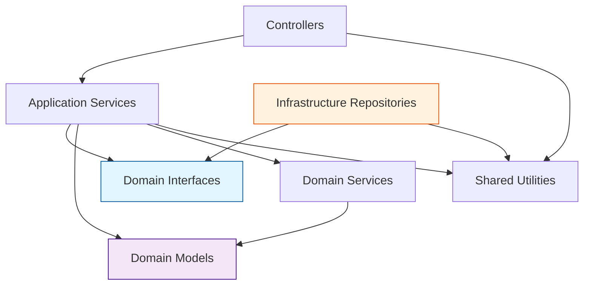

# Lambda開発標準仕様書

## 1. 開発環境とツール選定

### 1-1. 基本方針

#### 1-1-1. 開発環境統一
```typescript
// 統一開発環境
- Node.js: 22.x (AWS Lambda対応最新版)
- TypeScript: 5.3.x以上
- Package Manager: npm (v10.x以上)
- Runtime: nodejs22.x
- Architecture: arm64 (Graviton2でコスト削減)
- IaC Tools: AWS SAM + Terraform
- Local Development: SAM CLI
```

#### 1-1-2. コード品質方針
- **型安全性**: TypeScript strict mode必須
- **テスタビリティ**: 依存性逆転の原則（DIP）による単体テスト容易性
- **保守性**: DIP適用レイヤードアーキテクチャによる関心の分離
- **可読性**: ESLint + Prettier による統一フォーマット

#### 1-1-3. セキュリティ方針
- **最小権限の原則**: IAMロールによる必要最小限の権限付与
- **機密情報管理**: AWS Parameter Store / Secrets Manager使用
- **ログ制御**: 機密情報のログ出力禁止
- **依存関係**: 定期的な脆弱性スキャン実施

#### 1-1-4. アーキテクチャ方針
- **依存性逆転の原則（DIP）**: ドメイン層でインターフェース定義、インフラ層で実装
- **統合Lambda関数**: 複数機能を1つのLambda関数内で管理
- **レイヤー分離**: AWS SAM Layersによる共通コードの再利用

### 1-2. バージョン管理

#### 1-2-1. Semantic Versioning
```json
{
  "version": "1.0.0",
  "description": "MAJOR.MINOR.PATCH"
}
```

| バージョン | 変更内容 | 例 |
|-----------|----------|-----|
| **MAJOR** | 破壊的変更 | API仕様変更、インターフェース変更 |
| **MINOR** | 機能追加 | 新機能追加、オプション追加 |
| **PATCH** | バグ修正 | 不具合修正、ドキュメント修正 |

#### 1-2-2. Git Branch戦略
```
main ブランチ (本番用)
├── develop ブランチ (開発統合用)
│   ├── feature/csv-validator (機能開発用)
│   ├── feature/user-processor (機能開発用)
│   └── feature/error-handler (機能開発用)
└── hotfix/emergency-fix (緊急修正用)
```

#### 1-2-3. Lambda関数バージョニング
```typescript
// package.jsonでのバージョン管理例
{
  "name": "csv-user-log-processor",
  "version": "1.2.3",
  "description": "CSV User Log Processing Lambda",
  "main": "dist/index.js",
  "scripts": {
    "build": "tsc && npm run bundle",
    "bundle": "esbuild src/index.ts --bundle --outfile=dist/index.js --platform=node --target=node22",
    "test": "jest",
    "deploy": "aws lambda update-function-code --function-name csv-user-log-processor --zip-file fileb://deployment-package.zip"
  }
}
```

#### 1-2-4. Lambda関数エイリアス戦略
```bash
# 環境別エイリアス管理
aws lambda create-alias \
  --function-name csv-user-log-processor \
  --name PROD \
  --function-version 3 \
  --description "Production version"

aws lambda create-alias \
  --function-name csv-user-log-processor \
  --name DEV \
  --function-version $LATEST \
  --description "Development version"
```

### 1-3. パッケージ管理

#### 1-3-1. 依存関係管理方針
```json
{
  "dependencies": {
    "@aws-sdk/client-dynamodb": "^3.x.x",
    "@aws-sdk/client-rds-data": "^3.x.x",
    "@aws-sdk/client-s3": "^3.x.x",
    "csv-parser": "^3.0.0",
    "zod": "^3.22.0"
  },
  "devDependencies": {
    "@types/node": "^22.x.x",
    "@typescript-eslint/eslint-plugin": "^6.x.x",
    "@typescript-eslint/parser": "^6.x.x", 
    "eslint": "^8.x.x",
    "jest": "^29.x.x",
    "prettier": "^3.x.x",
    "typescript": "^5.3.x"
  }
}
```

#### 1-3-2. パッケージ選定基準
| カテゴリ | パッケージ | 選定理由 |
|----------|------------|----------|
| **AWS SDK** | @aws-sdk/client-* | 公式SDK、Tree-shaking対応 |
| **バリデーション** | zod | TypeScript親和性、実行時型安全性 |
| **CSV処理** | csv-parser | 軽量、ストリーミング対応 |
| **ログ** | built-in console | CloudWatch連携、追加依存なし |
| **テスト** | jest | 標準的、豊富な機能 |
| **型定義** | @types/* | TypeScript型定義 |

#### 1-3-3. パッケージアップデート戦略
```json
{
  "scripts": {
    "audit": "npm audit --audit-level=moderate",
    "update-check": "npm outdated",
    "update-patch": "npm update",
    "update-minor": "npx npm-check-updates -u -t minor",
    "security-scan": "npm audit fix"
  }
}
```

## 2. DIP適用レイヤードアーキテクチャ設計

### 2-1. モジュール分割

#### 2-1-1. DIP適用レイヤードアーキテクチャ構成
```
sam/src/
├── functions/                    # Lambda関数
│   └── csv-processor/           # 統合Lambda関数
│       ├── index.ts             # エントリーポイント
│       ├── handler.ts           # イベント振り分け
│       ├── controllers/         # Presentation Layer
│       │   ├── validation-controller.ts
│       │   ├── processing-controller.ts
│       │   ├── audit-controller.ts
│       │   ├── aggregation-controller.ts
│       │   └── error-controller.ts
│       ├── services/            # Application Service Layer
│       │   ├── csv-validation-service.ts
│       │   ├── user-processing-service.ts
│       │   └── audit-service.ts
│       ├── domain/              # Domain Layer（重要！）
│       │   ├── models/          # ドメインモデル
│       │   │   ├── User.ts
│       │   │   ├── ProcessingLog.ts
│       │   │   └── ValidationResult.ts
│       │   ├── interfaces/      # ドメインインターフェース
│       │   │   ├── IUserRepository.ts
│       │   │   ├── IAuditLogRepository.ts
│       │   │   └── IS3Repository.ts
│       │   └── services/        # ドメインサービス
│       │       └── UserDomainService.ts
│       ├── infrastructure/      # Infrastructure Layer
│       │   ├── repositories/    # インターフェース実装
│       │   │   ├── UserRepository.ts
│       │   │   ├── AuditLogRepository.ts
│       │   │   └── S3Repository.ts
│       │   └── aws/
│       │       ├── AuroraClient.ts
│       │       └── DynamoDBClient.ts
│       └── utils/               # 関数内共通ユーティリティ
│           ├── event-parser.ts
│           └── response-formatter.ts
├── layers/                      # Lambda Layers
│   ├── common-layer/           # 共通ライブラリ
│   ├── business-layer/         # ビジネスロジック
│   └── infrastructure-layer/   # インフラ実装
└── shared/                     # 全体共通
    ├── types/
    ├── constants/
    ├── schemas/
    └── interfaces/
```

#### 2-1-2. DIP適用依存性の方向


#### 2-1-3. 依存性逆転の実現
- **ドメイン層**でインターフェースを定義
- **インフラ層**がドメインインターフェースを実装
- **アプリケーション層**はドメインインターフェースに依存
- **プレゼンテーション層**はアプリケーション層に依存

#### 2-1-4. DIP適用各層の責務定義

##### Controllers層（Presentation Layer）
```typescript
// 責務: AWS Lambda固有の処理、イベント振り分け
// - イベント解析・振り分け
// - レスポンス形式変換
// - 初期エラーハンドリング

export class ValidationController {
  constructor(private csvValidationService: CsvValidationService) {}

  async validate(event: any): Promise<ValidationResult> {
    const s3Event = EventParser.parseS3Event(event);
    return await this.csvValidationService.validate(s3Event);
  }
}
```

##### Application Services層（Application Service Layer）
```typescript
// 責務: アプリケーション固有のビジネスロジック
// - ユースケースの実装
// - ドメインサービスの協調
// - トランザクション制御

export class UserProcessingService {
  constructor(
    private userRepo: IUserRepository,      // ドメインインターフェースに依存
    private auditRepo: IAuditLogRepository, // ドメインインターフェースに依存
    private userDomainService: UserDomainService
  ) {}

  async processUserLog(userLog: UserLogInput): Promise<ProcessingResult> {
    // ドメインオブジェクトの取得
    const user = await this.userRepo.findById(userLog.userId);
    if (!user) {
      throw new UserNotFoundError(userLog.userId);
    }

    // ドメインサービスを使用してビジネスルールを適用
    const updatedUser = this.userDomainService.updateStatistics(
      user, 
      userLog.loginCount, 
      userLog.postCount
    );
    
    // リポジトリ経由でデータ永続化
    await this.userRepo.update(updatedUser);
    
    // 監査ログ記録
    await this.auditRepo.record(
      ProcessingLog.createSuccessLog(userLog.userId, updatedUser.statistics)
    );

    return ProcessingResult.fromUser(updatedUser);
  }
}
```

##### Domain Layer（ドメイン層）- 重要！
```typescript
// domain/interfaces/IUserRepository.ts
// 責務: ドメインの抽象化定義
export interface IUserRepository {
  findById(userId: string): Promise<User | null>;
  update(user: User): Promise<void>;
}

// domain/models/User.ts  
// 責務: ドメインオブジェクト、純粋なビジネスルール
export class User {
  constructor(
    public readonly id: string,
    public readonly username: string,
    public readonly email: string,
    private _statistics: UserStatistics,
    public readonly createdAt: Date,
    public readonly updatedAt: Date
  ) {}

  get statistics(): UserStatistics {
    return this._statistics;
  }

  // ドメインロジック: 統計更新のビジネスルール
  updateStatistics(loginCount: number, postCount: number): void {
    if (loginCount < 0 || postCount < 0) {
      throw new InvalidStatisticsError('統計値は0以上である必要があります');
    }
    
    if (loginCount < this._statistics.loginCount) {
      throw new InvalidStatisticsError('ログイン回数は減少できません');
    }
    
    this._statistics = new UserStatistics(loginCount, postCount);
  }
}

// domain/services/UserDomainService.ts
// 責務: 複数のドメインオブジェクトを跨ぐビジネスルール
export class UserDomainService {
  updateStatistics(user: User, loginCount: number, postCount: number): User {
    // ドメインルールの適用
    user.updateStatistics(loginCount, postCount);
    return user;
  }
}
```

##### Infrastructure Layer（インフラ層）
```typescript
// infrastructure/repositories/UserRepository.ts
// 責務: ドメインインターフェースの具体実装
import { IUserRepository } from '../../domain/interfaces/IUserRepository';
import { User } from '../../domain/models/User';

export class UserRepository implements IUserRepository {
  constructor(private auroraClient: IAuroraClient) {}

  async findById(userId: string): Promise<User | null> {
    const result = await this.auroraClient.query(
      'SELECT * FROM users u JOIN user_statistics us ON u.user_id = us.user_id WHERE u.user_id = $1',
      [userId]
    );
    
    return result.records.length > 0 
      ? this.toDomainModel(result.records[0])
      : null;
  }

  async update(user: User): Promise<void> {
    await this.auroraClient.transaction([
      {
        sql: 'UPDATE user_statistics SET login_count = $1, post_count = $2, last_updated = NOW() WHERE user_id = $3',
        params: [user.statistics.loginCount, user.statistics.postCount, user.id]
      }
    ]);
  }

  private toDomainModel(record: any): User {
    return new User(
      record.user_id,
      record.username,
      record.email,
      new UserStatistics(record.login_count, record.post_count),
      new Date(record.created_at),
      new Date(record.updated_at)
    );
  }
}
```

### 2-2. SAM構成とDI実装

#### 2-2-1. SAM統合Lambda関数の依存性注入（DI）パターン
```typescript
// functions/csv-processor/di/DIContainer.ts
export class DIContainer {
  private static instance: DIContainer;
  
  private constructor() {}
  
  static getInstance(): DIContainer {
    if (!DIContainer.instance) {
      DIContainer.instance = new DIContainer();
    }
    return DIContainer.instance;
  }

  // Controllers作成
  createValidationController(): ValidationController {
    const csvValidationService = this.createCsvValidationService();
    return new ValidationController(csvValidationService);
  }

  createProcessingController(): ProcessingController {
    const userProcessingService = this.createUserProcessingService();
    return new ProcessingController(userProcessingService);
  }

  // Application Services作成
  private createUserProcessingService(): UserProcessingService {
    const userRepo = this.createUserRepository();
    const auditRepo = this.createAuditLogRepository();
    const userDomainService = new UserDomainService();
    
    return new UserProcessingService(userRepo, auditRepo, userDomainService);
  }

  private createCsvValidationService(): CsvValidationService {
    const s3Repo = this.createS3Repository();
    return new CsvValidationService(s3Repo);
  }

  // Infrastructure Layer作成（ドメインインターフェースを実装）
  private createUserRepository(): IUserRepository {
    const auroraClient = new AuroraClient(Environment.getDatabaseConfig());
    return new UserRepository(auroraClient);
  }

  private createAuditLogRepository(): IAuditLogRepository {
    const dynamoClient = new DynamoDBClient(Environment.getDynamoConfig());
    return new AuditLogRepository(dynamoClient);
  }

  private createS3Repository(): IS3Repository {
    const s3Client = new S3Client(Environment.getS3Config());
    return new S3Repository(s3Client);
  }
}
```

#### 2-2-2. 統合Lambda Handlerの実装
```typescript
// functions/csv-processor/handler.ts
import { Context } from 'aws-lambda';
import { DIContainer } from './di/DIContainer';
import { EventParser } from './utils/event-parser';
import { ResponseFormatter } from './utils/response-formatter';
import { Logger } from '/opt/nodejs/lib/utils/logger';

// Lambda関数レベルでDIコンテナを初期化（Cold Start最適化）
let diContainer: DIContainer;

export const handler = async (event: any, context: Context) => {
  const logger = new Logger(context.awsRequestId);
  
  try {
    // DIコンテナの初期化（初回のみ）
    if (!diContainer) {
      diContainer = DIContainer.getInstance();
    }
    
    // イベントタイプを解析
    const eventType = EventParser.parseEventType(event);
    logger.info('Processing event', { eventType });

    let result;
    
    switch (eventType) {
      case 'CSV_VALIDATION':
        const validationController = diContainer.createValidationController();
        result = await validationController.validate(event);
        break;
        
      case 'CSV_CHUNK_PROCESSING':
        const processingController = diContainer.createProcessingController();
        result = await processingController.processChunk(event);
        break;
        
      case 'AUDIT_LOGGING':
        const auditController = diContainer.createAuditController();
        result = await auditController.logAudit(event);
        break;
        
      case 'RESULT_AGGREGATION':
        const aggregationController = diContainer.createAggregationController();
        result = await aggregationController.aggregateResults(event);
        break;
        
      default:
        throw new Error(`Unknown event type: ${eventType}`);
    }
    
    logger.info('Processing completed', { result });
    return ResponseFormatter.success(result);
    
  } catch (error) {
    logger.error('Processing failed', { error });
    const errorController = diContainer.createErrorController();
    return errorController.handleError(error, event);
  }
};
```

#### 2-2-2. インターフェース定義
```typescript
// リポジトリインターフェース
export interface IUserRepository {
  findById(userId: string): Promise<User | null>;
  updateStatistics(userId: string, stats: UserStatistics): Promise<void>;
}

export interface IAuditLogRepository {
  record(log: AuditLog): Promise<void>;
  findByExecutionName(executionName: string): Promise<AuditLog[]>;
}

export interface IS3Repository {
  getObject(bucket: string, key: string): Promise<string>;
  putObject(bucket: string, key: string, content: string): Promise<void>;
}

// クライアントインターフェース
export interface IAuroraClient {
  query(sql: string, params: any[]): Promise<QueryResult>;
  transaction(queries: TransactionQuery[]): Promise<void>;
}

export interface IDynamoDBClient {
  putItem(tableName: string, item: any): Promise<void>;
  query(params: QueryParams): Promise<QueryResult>;
}
```

#### 2-2-3. 設定管理
```typescript
// 環境設定の集約管理
export class Environment {
  static getDatabaseConfig(): DatabaseConfig {
    return {
      host: process.env.AURORA_HOST!,
      database: process.env.AURORA_DATABASE!,
      secretArn: process.env.AURORA_SECRET_ARN!,
      region: process.env.AWS_REGION!,
    };
  }

  static getDynamoConfig(): DynamoConfig {
    return {
      region: process.env.AWS_REGION!,
      tableName: process.env.DYNAMODB_TABLE_NAME!,
    };
  }

  static getS3Config(): S3Config {
    return {
      region: process.env.AWS_REGION!,
      inputBucket: process.env.INPUT_BUCKET_NAME!,
      outputBucket: process.env.OUTPUT_BUCKET_NAME!,
    };
  }
}
```

#### 2-2-4. エラーハンドリング統一
```typescript
// カスタムエラークラス
export abstract class DomainError extends Error {
  abstract readonly code: string;
  abstract readonly statusCode: number;
}

export class UserNotFoundError extends DomainError {
  readonly code = 'USER_NOT_FOUND';
  readonly statusCode = 404;
  
  constructor(userId: string) {
    super(`User not found: ${userId}`);
  }
}

export class ValidationError extends DomainError {
  readonly code = 'VALIDATION_ERROR';
  readonly statusCode = 400;
  
  constructor(message: string, public readonly details: any) {
    super(message);
  }
}

// エラーハンドラー
export class ErrorHandler {
  static handle(error: Error): ErrorResponse {
    if (error instanceof DomainError) {
      return {
        statusCode: error.statusCode,
        body: JSON.stringify({
          error: error.code,
          message: error.message
        })
      };
    }

    // 予期しないエラー
    console.error('Unexpected error:', error);
    return {
      statusCode: 500,
      body: JSON.stringify({
        error: 'INTERNAL_SERVER_ERROR',
        message: 'An unexpected error occurred'
      })
    };
  }
}
```

#### 2-2-5. ログ管理統一
```typescript
// 統一ログ管理
export class Logger {
  constructor(
    private requestId: string,
    private functionName: string
  ) {}

  info(message: string, meta?: any): void {
    console.log(JSON.stringify({
      level: 'INFO',
      timestamp: new Date().toISOString(),
      requestId: this.requestId,
      functionName: this.functionName,
      message,
      ...meta
    }));
  }

  error(message: string, error?: Error | any): void {
    console.error(JSON.stringify({
      level: 'ERROR',
      timestamp: new Date().toISOString(),
      requestId: this.requestId,
      functionName: this.functionName,
      message,
      error: error instanceof Error ? {
        name: error.name,
        message: error.message,
        stack: error.stack
      } : error
    }));
  }
}
```

#### 2-2-6. TypeScript設定
```json
// tsconfig.json
{
  "compilerOptions": {
    "target": "ES2023",
    "module": "commonjs",
    "lib": ["ES2023"],
    "strict": true,
    "esModuleInterop": true,
    "skipLibCheck": true,
    "forceConsistentCasingInFileNames": true,
    "outDir": "./dist",
    "rootDir": "./src",
    "resolveJsonModule": true,
    "declaration": true,
    "declarationMap": true,
    "sourceMap": true,
    "experimentalDecorators": true,
    "emitDecoratorMetadata": true,
    "strictNullChecks": true,
    "noImplicitReturns": true,
    "noUnusedLocals": true,
    "noUnusedParameters": true
  },
  "include": ["src/**/*"],
  "exclude": ["node_modules", "dist", "tests"]
}
```

#### 2-2-7. ESLint + Prettier設定
```json
// .eslintrc.json
{
  "extends": [
    "@typescript-eslint/recommended",
    "prettier"
  ],
  "parser": "@typescript-eslint/parser",
  "plugins": ["@typescript-eslint"],
  "rules": {
    "@typescript-eslint/no-unused-vars": "error",
    "@typescript-eslint/explicit-function-return-type": "warn",
    "@typescript-eslint/no-explicit-any": "warn",
    "prefer-const": "error",
    "no-var": "error"
  }
}

// .prettierrc
{
  "semi": true,
  "trailingComma": "es5",
  "singleQuote": true,
  "printWidth": 80,
  "tabWidth": 2
}
```

## 3. Shared層詳細設計

### 3-1. 共通型定義（types）
```typescript
// src/shared/types/common.ts
export type Result<T, E = Error> = 
  | { success: true; value: T }
  | { success: false; error: E };

export type AsyncResult<T, E = Error> = Promise<Result<T, E>>;

export type Nullable<T> = T | null;
export type Optional<T> = T | undefined;

// AWS Lambda関連の型
export interface LambdaResponse {
  statusCode: number;
  body: string;
  headers?: Record<string, string>;
}

// ページネーション関連
export interface PageRequest {
  limit: number;
  nextToken?: string;
}

export interface PageResponse<T> {
  items: T[];
  nextToken?: string;
  hasMore: boolean;
}
```

### 3-2. 共通ユーティリティ（utils）
```typescript
// src/shared/utils/date.ts
export class DateUtil {
  static toISOString(date: Date): string {
    return date.toISOString();
  }

  static addDays(date: Date, days: number): Date {
    const result = new Date(date);
    result.setDate(result.getDate() + days);
    return result;
  }

  static getDynamoTTL(daysFromNow: number): number {
    const ttlDate = this.addDays(new Date(), daysFromNow);
    return Math.floor(ttlDate.getTime() / 1000);
  }
}

// src/shared/utils/retry.ts
export class RetryUtil {
  static async withRetry<T>(
    fn: () => Promise<T>,
    options: {
      maxAttempts?: number;
      delay?: number;
      backoff?: number;
    } = {}
  ): Promise<T> {
    const { maxAttempts = 3, delay = 1000, backoff = 2 } = options;
    
    let lastError: Error;
    
    for (let attempt = 1; attempt <= maxAttempts; attempt++) {
      try {
        return await fn();
      } catch (error) {
        lastError = error as Error;
        
        if (attempt === maxAttempts) {
          throw lastError;
        }
        
        const waitTime = delay * Math.pow(backoff, attempt - 1);
        await new Promise(resolve => setTimeout(resolve, waitTime));
      }
    }
    
    throw lastError!;
  }
}

// src/shared/utils/validation.ts
import { z, ZodError } from 'zod';

export class ValidationUtil {
  static validate<T>(schema: z.ZodSchema<T>, data: unknown): Result<T, ValidationError> {
    try {
      const result = schema.parse(data);
      return { success: true, value: result };
    } catch (error) {
      if (error instanceof ZodError) {
        return {
          success: false,
          error: new ValidationError('Validation failed', error.errors)
        };
      }
      throw error;
    }
  }

  static isValidUserId(userId: string): boolean {
    return /^U\d{5}$/.test(userId);
  }

  static isPositiveInteger(value: any): boolean {
    return Number.isInteger(value) && value >= 0;
  }
}
```

### 3-3. 共通エラー定義（errors）
```typescript
// src/shared/errors/base.ts
export abstract class BaseError extends Error {
  abstract readonly code: string;
  abstract readonly statusCode: number;
  readonly timestamp: string;

  constructor(message: string) {
    super(message);
    this.name = this.constructor.name;
    this.timestamp = new Date().toISOString();
    Error.captureStackTrace(this, this.constructor);
  }

  toJSON() {
    return {
      code: this.code,
      message: this.message,
      timestamp: this.timestamp,
      stack: this.stack,
    };
  }
}

// src/shared/errors/domain.ts
export class UserNotFoundError extends BaseError {
  readonly code = 'USER_NOT_FOUND';
  readonly statusCode = 404;

  constructor(userId: string) {
    super(`User not found: ${userId}`);
  }
}

export class ValidationError extends BaseError {
  readonly code = 'VALIDATION_ERROR';
  readonly statusCode = 400;

  constructor(message: string, public readonly details: any[]) {
    super(message);
  }
}

export class DatabaseError extends BaseError {
  readonly code = 'DATABASE_ERROR';
  readonly statusCode = 500;

  constructor(message: string, public readonly originalError?: Error) {
    super(message);
  }
}

// src/shared/errors/handler.ts
export class ErrorHandler {
  static handle(error: Error): LambdaResponse {
    if (error instanceof BaseError) {
      return {
        statusCode: error.statusCode,
        body: JSON.stringify({
          error: error.code,
          message: error.message,
          timestamp: error.timestamp,
        }),
      };
    }

    // 予期しないエラー
    console.error('Unexpected error:', error);
    return {
      statusCode: 500,
      body: JSON.stringify({
        error: 'INTERNAL_SERVER_ERROR',
        message: 'An unexpected error occurred',
        timestamp: new Date().toISOString(),
      }),
    };
  }
}
```

### 3-4. 定数定義
```typescript
// src/shared/constants/index.ts
export const CSV_HEADERS = {
  USER_ID: 'ユーザーID',
  LOGIN_COUNT: 'ログイン回数',
  POST_COUNT: '投稿回数',
} as const;

export const PROCESSING_STATUS = {
  SUCCESS: 'success',
  FAILED: 'failed',
  SKIPPED: 'skipped',
} as const;

export const PROCESSING_TYPE = {
  LOGIN_UPDATE: 'login_update',
  POST_UPDATE: 'post_update',
  USER_UPDATE: 'user_update',
} as const;

export const LIMITS = {
  MAX_CSV_SIZE_MB: 100,
  MAX_CSV_ROWS: 10000,
  MAX_PARALLEL_EXECUTIONS: 5,
  LAMBDA_TIMEOUT_SECONDS: 300,
} as const;

export const TTL_DAYS = {
  AUDIT_LOG: 180, // 6ヶ月
  ERROR_LOG: 30,  // 30日
} as const;
```

## 4. 単体テスト設計

### 4-1. テスト構成
```
tests/
├── unit/                    # 単体テスト
│   ├── handlers/
│   ├── services/
│   ├── repositories/
│   └── models/
├── fixtures/              # テストデータ
│   ├── csv/
│   └── users/
├── mocks/                # モック定義
│   ├── awsClients.ts
│   └── repositories.ts
└── helpers/              # テストヘルパー
    ├── setup.ts
    └── builders/
```

### 4-2. Jest設定
```json
// jest.config.js
module.exports = {
  preset: 'ts-jest',
  testEnvironment: 'node',
  roots: ['<rootDir>/src', '<rootDir>/tests'],
  testMatch: ['**/unit/**/*.test.ts'],
  collectCoverageFrom: [
    'src/**/*.ts',
    '!src/**/*.d.ts',
    '!src/**/index.ts',
  ],
  coverageThreshold: {
    global: {
      branches: 80,
      functions: 80,
      lines: 80,
      statements: 80,
    },
  },
  setupFilesAfterEnv: ['<rootDir>/tests/helpers/setup.ts'],
  moduleNameMapper: {
    '^@/(.*)$': '<rootDir>/src/$1',
    '^@test/(.*)$': '<rootDir>/tests/$1',
  },
};

// package.jsonのスクリプト
{
  "scripts": {
    "test": "jest",
    "test:coverage": "jest --coverage",
    "test:watch": "jest --watch"
  }
}
```

### 4-3. 単体テスト実装例
```typescript
// tests/unit/services/UserProcessingService.test.ts
import { UserProcessingService } from '../../../src/services/UserProcessingService';
import { MockUserRepository } from '../../mocks/repositories';
import { MockAuditLogRepository } from '../../mocks/repositories';
import { UserBuilder } from '../../helpers/builders/UserBuilder';
import { UserNotFoundError } from '../../../src/shared/errors/domain';

describe('UserProcessingService', () => {
  let service: UserProcessingService;
  let userRepo: MockUserRepository;
  let auditRepo: MockAuditLogRepository;

  beforeEach(() => {
    userRepo = new MockUserRepository();
    auditRepo = new MockAuditLogRepository();
    service = new UserProcessingService(userRepo, auditRepo);
  });

  describe('processUserLog', () => {
    it('should successfully update user statistics', async () => {
      // Arrange
      const existingUser = UserBuilder.create()
        .withId('U00001')
        .withStatistics({ loginCount: 10, postCount: 20 })
        .build();
      
      userRepo.mockFindById(existingUser);

      const userLog = {
        userId: 'U00001',
        loginCount: 12,
        postCount: 25,
        executionName: 'test-execution',
      };

      // Act
      const result = await service.processUserLog(userLog);

      // Assert
      expect(result.userId).toBe('U00001');
      expect(result.statistics.loginCount).toBe(12);
      expect(result.statistics.postCount).toBe(25);
      
      expect(userRepo.updateStatistics).toHaveBeenCalledWith('U00001', {
        loginCount: 12,
        postCount: 25,
      });

      expect(auditRepo.record).toHaveBeenCalledWith(
        expect.objectContaining({
          userId: 'U00001',
          oldStats: { loginCount: 10, postCount: 20 },
          newStats: { loginCount: 12, postCount: 25 },
          status: 'success',
        })
      );
    });

    it('should throw UserNotFoundError when user does not exist', async () => {
      // Arrange
      userRepo.mockFindById(null);

      const userLog = {
        userId: 'U99999',
        loginCount: 5,
        postCount: 10,
        executionName: 'test-execution',
      };

      // Act & Assert
      await expect(service.processUserLog(userLog))
        .rejects
        .toThrow(UserNotFoundError);
    });
  });
});
```


### 4-4. テストフィクスチャ
```typescript
// tests/fixtures/csv/valid.csv
export const VALID_CSV_CONTENT = `ユーザーID,ログイン回数,投稿回数
U00001,5,10
U00002,3,7
U00003,8,15`;

// tests/fixtures/csv/invalid.csv
export const INVALID_CSV_CONTENT = `ユーザーID,ログイン回数,投稿回数
U00001,5,10
INVALID_ID,3,7
U00003,-1,15`;

// tests/fixtures/users/index.ts
export const TEST_USERS = [
  {
    userId: 'U00001',
    username: 'testuser1',
    email: 'test1@example.com',
    loginCount: 10,
    postCount: 20,
  },
  {
    userId: 'U00002',
    username: 'testuser2',
    email: 'test2@example.com',
    loginCount: 5,
    postCount: 15,
  },
];
```

### 4-5. モック定義
```typescript
// tests/mocks/repositories.ts
export class MockUserRepository implements IUserRepository {
  private users = new Map<string, User>();
  
  mockFindById(user: User | null): void {
    if (user) {
      this.users.set(user.id, user);
    }
  }

  async findById(userId: string): Promise<User | null> {
    return this.users.get(userId) || null;
  }

  updateStatistics = jest.fn();
}

export class MockAuditLogRepository implements IAuditLogRepository {
  record = jest.fn();
  findByExecutionName = jest.fn();
}

// tests/mocks/awsClients.ts
export const mockS3Client = {
  getObject: jest.fn().mockResolvedValue({
    Body: { transformToString: () => 'csv content' },
  }),
  putObject: jest.fn().mockResolvedValue({}),
};

export const mockDynamoClient = {
  put: jest.fn().mockResolvedValue({}),
  query: jest.fn().mockResolvedValue({ Items: [] }),
};
```

### 4-6. テストヘルパー
```typescript
// tests/helpers/setup.ts
import { config } from 'dotenv';

// テスト環境のセットアップ
export const setupTestEnvironment = () => {
  config({ path: '.env.test' });
  
  process.env.AWS_REGION = 'ap-northeast-1';
  process.env.DYNAMODB_TABLE_NAME = 'test-processing-logs';
  process.env.INPUT_BUCKET_NAME = 'test-input-bucket';
  process.env.OUTPUT_BUCKET_NAME = 'test-output-bucket';
};

// tests/helpers/builders/UserBuilder.ts
export class UserBuilder {
  private user: Partial<User> = {
    id: 'U00001',
    username: 'testuser',
    email: 'test@example.com',
    statistics: { loginCount: 0, postCount: 0 },
    createdAt: new Date(),
    updatedAt: new Date(),
  };

  static create(): UserBuilder {
    return new UserBuilder();
  }

  withId(id: string): UserBuilder {
    this.user.id = id;
    return this;
  }

  withStatistics(stats: { loginCount: number; postCount: number }): UserBuilder {
    this.user.statistics = stats;
    return this;
  }

  build(): User {
    return new User(
      this.user.id!,
      this.user.username!,
      this.user.email!,
      this.user.statistics!,
      this.user.createdAt!,
      this.user.updatedAt!
    );
  }
}
```

### 4-7. 単体テストのベストプラクティス

#### 4-7-1. テスト命名規則
```typescript
// 推奨: describe-it パターン
describe('UserProcessingService', () => {
  describe('processUserLog', () => {
    it('should successfully update user statistics when user exists', async () => {});
    it('should throw UserNotFoundError when user does not exist', async () => {});
    it('should handle negative values gracefully', async () => {});
  });
});
```

#### 4-7-2. AAA (Arrange-Act-Assert) パターン
```typescript
it('should calculate new statistics correctly', async () => {
  // Arrange: テストデータとモックの準備
  const existingUser = createTestUser();
  const inputData = { loginCount: 5, postCount: 10 };
  
  // Act: テスト対象の実行
  const result = await service.processUserLog(inputData);
  
  // Assert: 結果の検証
  expect(result.loginCount).toBe(5);
  expect(result.postCount).toBe(10);
});
```

#### 4-7-3. カバレッジ目標
- **ステートメント**: 80%以上
- **ブランチ**: 80%以上
- **関数**: 80%以上
- **行**: 80%以上

重要な業務ロジックは100%を目指す

この標準仕様書により、CSV並列処理システムのLambda関数を統一された設計パターンで開発し、Jestによる単体テストで品質を保証します。