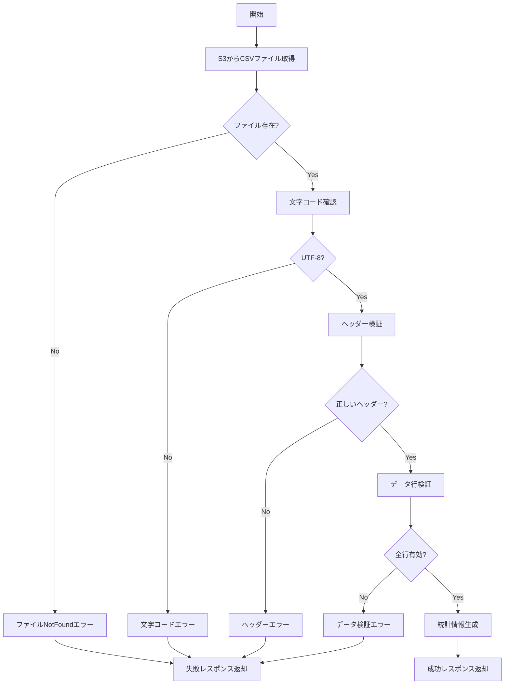
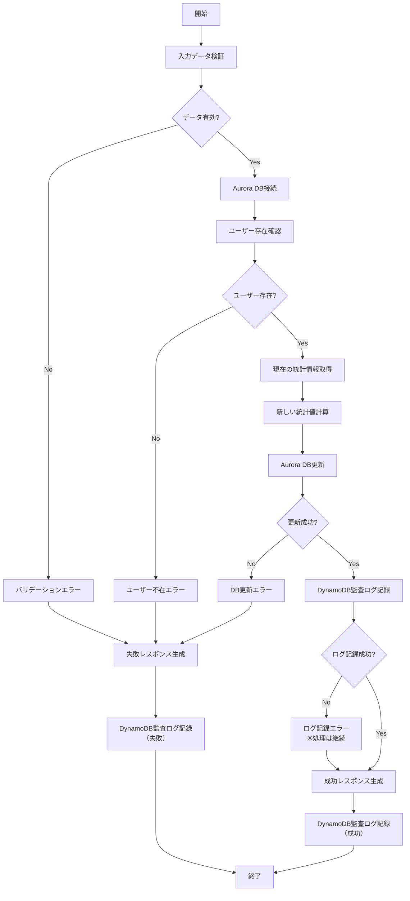

# Lambda関数基本設計書

## 1. Lambda関数構成

### 1.1 統合Lambda関数構成

| 関数名 | 役割 | トリガー | 実行環境 |
|--------|------|----------|----------|
| **csv-processor** | CSV処理統合関数 | Step Functions | Node.js 22.x |

### 1.2 csv-processor統合関数の責務

#### 統合Lambda関数内の機能構成
csv-processor関数は、イベントタイプに応じて以下の機能を実行します：

#### CSV検証機能（CSV_VALIDATION）
- S3からCSVファイル取得
- ヘッダー形式検証
- データ形式検証
- 文字コード確認
- 基本統計情報生成

#### チャンク処理機能（CSV_CHUNK_PROCESSING）
- ユーザーID存在確認
- ログイン回数・投稿回数更新
- Aurora DB更新処理
- 処理結果記録

#### 監査ログ機能（AUDIT_LOGGING）
- DynamoDB監査ログ記録
- 処理履歴管理
- エラーログ記録

#### 結果集約機能（RESULT_AGGREGATION）
- 処理結果の集約
- S3への結果出力
- 統計情報生成

#### エラーハンドリング機能（ERROR_HANDLING）
- 例外処理
- エラーログ出力
- 再試行制御

## 2. csv-processor統合関数設計

### 2.1 関数仕様

```typescript
// Lambda関数設定
export const CSV_PROCESSOR_CONFIG = {
  functionName: 'csv-processor',
  runtime: 'nodejs22.x',
  architecture: 'arm64',
  timeout: 900, // 15分（複数機能のため長時間設定）
  memorySize: 1024, // MB（複数機能のため大容量設定）
  reservedConcurrentExecutions: 5, // 並列実行制限
  environment: {
    INPUT_BUCKET_NAME: process.env.INPUT_BUCKET_NAME,
    OUTPUT_BUCKET_NAME: process.env.OUTPUT_BUCKET_NAME,
    AURORA_SECRET_ARN: process.env.AURORA_SECRET_ARN,
    DYNAMODB_TABLE_NAME: process.env.DYNAMODB_TABLE_NAME,
    LOG_LEVEL: 'INFO',
    NODE_PATH: '/opt/nodejs/lib:/opt/nodejs/node_modules',
  },
  layers: [
    'arn:aws:lambda:ap-northeast-1:ACCOUNT:layer:csv-common-layer:1',
    'arn:aws:lambda:ap-northeast-1:ACCOUNT:layer:csv-business-layer:1',
    'arn:aws:lambda:ap-northeast-1:ACCOUNT:layer:csv-infrastructure-layer:1'
  ]
};
```

### 2.2 入出力定義

#### 2.2.1 入力パラメータ
```typescript
// Step Functionsからの入力
interface CsvValidatorInput {
  bucket: string;        // S3バケット名
  key: string;          // S3オブジェクトキー
  executionName: string; // Step Functions実行名
}
```

#### 2.2.2 出力レスポンス
```typescript
// 検証成功時
interface ValidationSuccessResponse {
  isValid: true;
  statistics: {
    totalRows: number;      // 総行数（ヘッダー除く）
    fileSize: number;       // ファイルサイズ（バイト）
    encoding: string;       // 文字エンコーディング
    processedAt: string;    // 処理日時
  };
  metadata: {
    bucket: string;
    key: string;
    executionName: string;
  };
}

// 検証失敗時
interface ValidationFailureResponse {
  isValid: false;
  errors: Array<{
    line?: number;          // エラー行番号
    type: string;           // エラータイプ
    message: string;        // エラーメッセージ
  }>;
  metadata: {
    bucket: string;
    key: string;
    executionName: string;
  };
}
```

### 2.3 処理フロー



### 2.4 エラーハンドリング

| エラータイプ | エラーコード | 説明 | レスポンス |
|------------|-------------|------|-----------|
| **FileNotFound** | CSV_FILE_NOT_FOUND | S3ファイルが存在しない | 400 Bad Request |
| **InvalidEncoding** | CSV_INVALID_ENCODING | UTF-8以外の文字コード | 400 Bad Request |
| **InvalidHeader** | CSV_INVALID_HEADER | ヘッダー形式不正 | 400 Bad Request |
| **InvalidData** | CSV_INVALID_DATA | データ形式不正 | 400 Bad Request |
| **FileTooLarge** | CSV_FILE_TOO_LARGE | 100MB超過 | 413 Payload Too Large |
| **S3AccessError** | S3_ACCESS_ERROR | S3アクセス権限エラー | 403 Forbidden |

### 2.5 実装設計

#### 2.5.1 ディレクトリ構成
```
src/handlers/csv-validator/
├── index.ts              # エントリーポイント
├── services/
│   └── CsvValidationService.ts
├── validators/
│   ├── HeaderValidator.ts
│   ├── DataValidator.ts
│   └── EncodingValidator.ts
├── repositories/
│   └── S3FileRepository.ts
├── models/
│   ├── CsvFile.ts
│   └── ValidationResult.ts
└── utils/
    ├── csvParser.ts
    └── constants.ts
```

#### 2.5.2 主要クラス設計
```typescript
// services/CsvValidationService.ts
export class CsvValidationService {
  constructor(
    private s3Repository: IS3Repository,
    private headerValidator: IHeaderValidator,
    private dataValidator: IDataValidator,
    private encodingValidator: IEncodingValidator
  ) {}

  async validate(input: CsvValidatorInput): Promise<ValidationResult> {
    // 1. S3からファイル取得
    const csvFile = await this.s3Repository.getFile(input.bucket, input.key);
    
    // 2. 文字コード検証
    const encodingResult = await this.encodingValidator.validate(csvFile);
    if (!encodingResult.isValid) {
      return ValidationResult.failure(encodingResult.errors);
    }

    // 3. ヘッダー検証
    const headerResult = this.headerValidator.validate(csvFile.header);
    if (!headerResult.isValid) {
      return ValidationResult.failure(headerResult.errors);
    }

    // 4. データ行検証
    const dataResult = this.dataValidator.validate(csvFile.dataRows);
    if (!dataResult.isValid) {
      return ValidationResult.failure(dataResult.errors);
    }

    // 5. 統計情報生成
    const statistics = this.generateStatistics(csvFile);
    
    return ValidationResult.success(statistics);
  }
}
```

## 3. user-log-processor 関数設計

### 3.1 関数仕様

```typescript
// Lambda関数設定
export const USER_LOG_PROCESSOR_CONFIG = {
  functionName: 'user-log-processor',
  runtime: 'nodejs22.x',
  architecture: 'arm64',
  timeout: 30, // 30秒（1行あたり）
  memorySize: 256, // MB
  reservedConcurrentExecutions: 50, // 最大5並列 × 10予備
  vpcConfig: {
    securityGroupIds: ['sg-xxxxxxxx'],
    subnetIds: ['subnet-xxxxxxxx', 'subnet-yyyyyyyy'],
  },
  environment: {
    AURORA_SECRET_ARN: process.env.AURORA_SECRET_ARN,
    AURORA_CLUSTER_ARN: process.env.AURORA_CLUSTER_ARN,
    DYNAMODB_TABLE_NAME: process.env.DYNAMODB_TABLE_NAME,
    LOG_LEVEL: 'INFO',
  },
};
```

### 3.2 入出力定義

#### 3.2.1 入力パラメータ
```typescript
// Step Functions分散マップからの入力
interface UserLogProcessorInput {
  userId: string;           // ユーザーID (例: "U00001")
  loginCount: string;       // ログイン回数 (例: "5")
  postCount: string;        // 投稿回数 (例: "10")
  executionName: string;    // Step Functions実行名
  itemIndex: number;        // 分散マップでのアイテムインデックス
}
```

#### 3.2.2 出力レスポンス
```typescript
// 処理成功時
interface ProcessingSuccessResponse {
  userId: string;
  status: 'success';
  updates: {
    loginCount: {
      old: number;
      new: number;
      updated: boolean;
    };
    postCount: {
      old: number;
      new: number;
      updated: boolean;
    };
  };
  processingTime: number; // ミリ秒
  timestamp: string;
}

// 処理失敗時
interface ProcessingFailureResponse {
  userId: string;
  status: 'failed';
  error: {
    code: string;
    message: string;
    details?: any;
  };
  timestamp: string;
}
```

### 3.3 処理フロー



### 3.4 エラーハンドリング

| エラータイプ | エラーコード | 説明 | 処理 |
|------------|-------------|------|------|
| **ValidationError** | INVALID_INPUT | 入力データ形式不正 | 即座に失敗 |
| **UserNotFound** | USER_NOT_FOUND | ユーザーが存在しない | 即座に失敗 |
| **DatabaseError** | DB_CONNECTION_ERROR | DB接続エラー | 3回リトライ |
| **UpdateError** | DB_UPDATE_ERROR | DB更新エラー | 3回リトライ |
| **AuditLogError** | AUDIT_LOG_ERROR | 監査ログ記録失敗 | 処理継続（ログ出力） |

### 3.5 実装設計

#### 3.5.1 ディレクトリ構成
```
src/handlers/user-log-processor/
├── index.ts              # エントリーポイント
├── services/
│   ├── UserLogProcessingService.ts
│   └── AuditLogService.ts
├── repositories/
│   ├── UserRepository.ts
│   ├── UserStatisticsRepository.ts
│   └── AuditLogRepository.ts
├── models/
│   ├── User.ts
│   ├── UserStatistics.ts
│   └── AuditLog.ts
├── validators/
│   └── UserLogValidator.ts
└── utils/
    ├── dbConnection.ts
    └── retry.ts
```

#### 3.5.2 主要クラス設計
```typescript
// services/UserLogProcessingService.ts
export class UserLogProcessingService {
  constructor(
    private userRepo: IUserRepository,
    private statsRepo: IUserStatisticsRepository,
    private auditService: IAuditLogService,
    private validator: IUserLogValidator
  ) {}

  async processUserLog(input: UserLogProcessorInput): Promise<ProcessingResult> {
    // 1. 入力検証
    const validationResult = this.validator.validate(input);
    if (!validationResult.isValid) {
      throw new ValidationError(validationResult.errors);
    }

    // 2. 数値変換
    const loginCount = parseInt(input.loginCount, 10);
    const postCount = parseInt(input.postCount, 10);

    // 3. ユーザー存在確認
    const user = await this.userRepo.findById(input.userId);
    if (!user) {
      throw new UserNotFoundError(input.userId);
    }

    // 4. 現在の統計情報取得
    const currentStats = await this.statsRepo.findByUserId(input.userId);
    
    // 5. Aurora DB更新（トランザクション）
    const updateResult = await this.updateUserStatistics(
      input.userId,
      currentStats,
      { loginCount, postCount }
    );

    // 6. 監査ログ記録（非同期、エラーでも処理継続）
    this.recordAuditLog(input, currentStats, updateResult).catch(error => {
      console.error('Audit log recording failed:', error);
    });

    return this.createSuccessResponse(input.userId, currentStats, updateResult);
  }

  private async updateUserStatistics(
    userId: string,
    currentStats: UserStatistics,
    newValues: { loginCount: number; postCount: number }
  ): Promise<UpdateResult> {
    return await this.statsRepo.update(userId, {
      loginCount: newValues.loginCount,
      postCount: newValues.postCount,
      lastUpdated: new Date()
    });
  }
}
```

## 4. 共通設計要素

### 4.1 IAMロール設計

#### 4.1.1 csv-validator用IAMロール
```json
{
  "Version": "2012-10-17",
  "Statement": [
    {
      "Effect": "Allow",
      "Action": [
        "s3:GetObject",
        "s3:GetObjectVersion"
      ],
      "Resource": "arn:aws:s3:::${INPUT_BUCKET}/*"
    },
    {
      "Effect": "Allow",
      "Action": [
        "logs:CreateLogGroup",
        "logs:CreateLogStream",
        "logs:PutLogEvents"
      ],
      "Resource": "*"
    }
  ]
}
```

#### 4.1.2 user-log-processor用IAMロール
```json
{
  "Version": "2012-10-17",
  "Statement": [
    {
      "Effect": "Allow",
      "Action": [
        "rds-data:ExecuteStatement",
        "rds-data:BatchExecuteStatement",
        "rds-data:BeginTransaction",
        "rds-data:CommitTransaction",
        "rds-data:RollbackTransaction"
      ],
      "Resource": "${AURORA_CLUSTER_ARN}"
    },
    {
      "Effect": "Allow",
      "Action": [
        "secretsmanager:GetSecretValue"
      ],
      "Resource": "${AURORA_SECRET_ARN}"
    },
    {
      "Effect": "Allow",
      "Action": [
        "dynamodb:PutItem",
        "dynamodb:Query"
      ],
      "Resource": "arn:aws:dynamodb:*:*:table/${DYNAMODB_TABLE_NAME}"
    },
    {
      "Effect": "Allow",
      "Action": [
        "ec2:CreateNetworkInterface",
        "ec2:DescribeNetworkInterfaces",
        "ec2:DeleteNetworkInterface",
        "ec2:AssignPrivateIpAddresses",
        "ec2:UnassignPrivateIpAddresses"
      ],
      "Resource": "*"
    }
  ]
}
```

### 4.2 環境変数設計

```typescript
// 環境変数の型定義
interface LambdaEnvironmentVariables {
  // 共通
  AWS_REGION: string;
  LOG_LEVEL: 'DEBUG' | 'INFO' | 'WARN' | 'ERROR';
  
  // csv-validator
  INPUT_BUCKET_NAME?: string;
  
  // user-log-processor
  AURORA_SECRET_ARN?: string;
  AURORA_CLUSTER_ARN?: string;
  AURORA_DATABASE_NAME?: string;
  DYNAMODB_TABLE_NAME?: string;
}
```

### 4.3 ログ設計

#### 4.3.1 構造化ログフォーマット
```typescript
interface StructuredLog {
  timestamp: string;
  level: 'DEBUG' | 'INFO' | 'WARN' | 'ERROR';
  functionName: string;
  functionVersion: string;
  awsRequestId: string;
  message: string;
  metadata?: Record<string, any>;
  error?: {
    name: string;
    message: string;
    stack?: string;
  };
}
```

#### 4.3.2 ログ出力例
```json
{
  "timestamp": "2025-08-02T09:30:15.123Z",
  "level": "INFO",
  "functionName": "user-log-processor",
  "functionVersion": "3",
  "awsRequestId": "a1b2c3d4-e5f6-7890-abcd-ef1234567890",
  "message": "User statistics updated successfully",
  "metadata": {
    "userId": "U00001",
    "executionName": "user-log-20250802-093000",
    "processingTime": 125,
    "updates": {
      "loginCount": { "old": 10, "new": 12 },
      "postCount": { "old": 20, "new": 25 }
    }
  }
}
```

### 4.4 メトリクス設計

| メトリクス名 | 単位 | 説明 |
|-------------|------|------|
| **CsvValidationDuration** | ミリ秒 | CSV検証処理時間 |
| **CsvValidationErrors** | カウント | CSV検証エラー数 |
| **UserProcessingDuration** | ミリ秒 | ユーザー処理時間 |
| **UserProcessingErrors** | カウント | ユーザー処理エラー数 |
| **DatabaseUpdateDuration** | ミリ秒 | DB更新処理時間 |
| **AuditLogWriteDuration** | ミリ秒 | 監査ログ書き込み時間 |

## 5. デプロイメント設計

### 5.1 Lambda関数パッケージング

```bash
# ビルドスクリプト
#!/bin/bash
# build.sh

# TypeScriptコンパイル
npm run build

# 依存関係の最適化
npm prune --production

# Lambda Layer用の依存関係
mkdir -p layer/nodejs
cp -r node_modules layer/nodejs/

# 関数コードのパッケージング
zip -r csv-validator.zip dist/handlers/csv-validator
zip -r user-log-processor.zip dist/handlers/user-log-processor

# Lambda Layerのパッケージング
cd layer && zip -r ../dependencies-layer.zip . && cd ..
```

### 5.2 デプロイメント構成

```yaml
# serverless.yml または SAM template
Resources:
  DependenciesLayer:
    Type: AWS::Lambda::LayerVersion
    Properties:
      LayerName: csv-processing-dependencies
      Content:
        S3Bucket: !Ref DeploymentBucket
        S3Key: dependencies-layer.zip
      CompatibleRuntimes:
        - nodejs22.x
      CompatibleArchitectures:
        - arm64

  CsvValidatorFunction:
    Type: AWS::Lambda::Function
    Properties:
      FunctionName: csv-validator
      Runtime: nodejs22.x
      Handler: index.handler
      Timeout: 300
      MemorySize: 512
      Architectures:
        - arm64
      Layers:
        - !Ref DependenciesLayer
      Environment:
        Variables:
          INPUT_BUCKET_NAME: !Ref InputBucket
          LOG_LEVEL: INFO

  UserLogProcessorFunction:
    Type: AWS::Lambda::Function
    Properties:
      FunctionName: user-log-processor
      Runtime: nodejs22.x
      Handler: index.handler
      Timeout: 30
      MemorySize: 256
      Architectures:
        - arm64
      Layers:
        - !Ref DependenciesLayer
      VpcConfig:
        SecurityGroupIds:
          - !Ref LambdaSecurityGroup
        SubnetIds:
          - !Ref PrivateSubnet1a
          - !Ref PrivateSubnet1c
      Environment:
        Variables:
          AURORA_SECRET_ARN: !Ref AuroraSecret
          AURORA_CLUSTER_ARN: !GetAtt AuroraCluster.DBClusterArn
          DYNAMODB_TABLE_NAME: !Ref ProcessingLogsTable
          LOG_LEVEL: INFO
```

この基本設計により、Step Functions分散マップと連携するLambda関数の実装準備が整います。