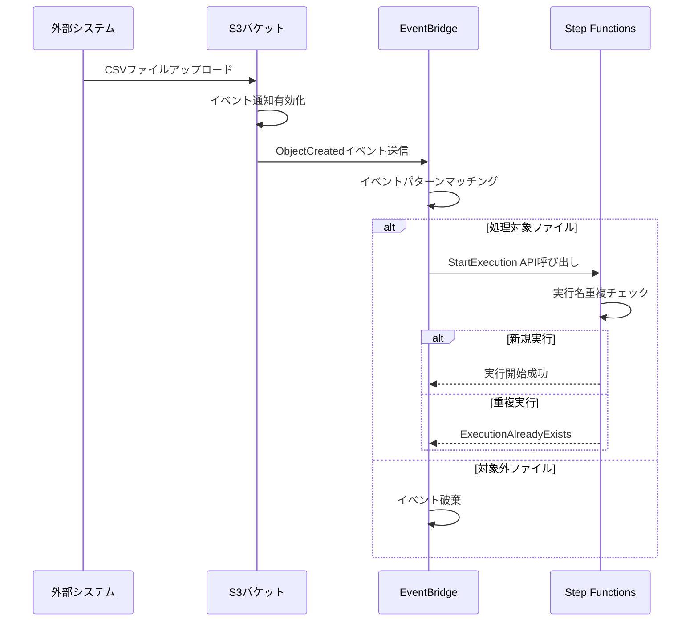

# EventBridgeルール基本設計書

## 1. システム概要

### 1.1 EventBridgeの役割

CSVユーザーログ並列処理システムにおいて、EventBridgeは以下の役割を担います：

1. **S3イベント受信**: S3バケットへのCSVファイルアップロードイベントを受信
2. **イベントフィルタリング**: 処理対象のCSVファイルのみを識別
3. **Step Functions起動**: 適格なイベントに対して統合Lambda関数を含むStep Functions実行を開始
4. **実行名生成**: S3ファイル名から一意な実行名を生成して重複実行を防止

### 1.2 イベントフロー



## 2. EventBridgeルール設計

### 2.1 ルール基本仕様

| 項目 | 値 |
|------|-----|
| **ルール名** | csv-upload-processor-rule |
| **説明** | S3へのCSVファイルアップロードを検知してStep Functionsを起動 |
| **状態** | ENABLED |
| **イベントバス** | default |
| **ルールタイプ** | イベントパターン |

### 2.2 イベントパターン定義

```json
{
  "source": ["aws.s3"],
  "detail-type": ["Object Created"],
  "detail": {
    "bucket": {
      "name": ["${INPUT_BUCKET_NAME}"]
    },
    "object": {
      "key": [
        {
          "suffix": ".csv"
        }
      ],
      "size": [
        {
          "numeric": ["<=", 104857600]
        }
      ]
    },
    "reason": ["PutObject", "PostObject", "CompleteMultipartUpload"]
  }
}
```

### 2.3 イベントパターン詳細説明

| フィルター条件 | 説明 | 理由 |
|---------------|------|------|
| **source** | aws.s3 | S3サービスからのイベントのみ対象 |
| **detail-type** | Object Created | オブジェクト作成イベントのみ対象 |
| **bucket.name** | 特定バケット名 | 処理対象バケットに限定 |
| **object.key suffix** | .csv | CSVファイルのみ処理 |
| **object.size** | <= 100MB | 巨大ファイルの除外 |
| **reason** | Put/Post/Multipart | 全アップロード方式に対応 |

### 2.4 除外パターン（将来拡張）

```json
{
  "object": {
    "key": [
      {
        "prefix": {
          "anything-but": ["temp/", "_", "."]
        }
      }
    ]
  }
}
```

## 3. ターゲット設定

### 3.1 Step Functionsターゲット

| 項目 | 値 |
|------|-----|
| **ターゲットタイプ** | Step Functions ステートマシン |
| **ステートマシンARN** | arn:aws:states:${AWS::Region}:${AWS::AccountId}:stateMachine:csv-user-log-processor |
| **実行ロールARN** | arn:aws:iam::${AWS::AccountId}:role/EventBridgeStepFunctionsRole |
| **最大再試行回数** | 0 (重複実行防止のため) |
| **デッドレターキュー** | 不要 (Step Functions側で制御) |

### 3.2 入力トランスフォーマー設定

#### 3.2.1 入力パスマップ
```json
{
  "bucket": "$.detail.bucket.name",
  "key": "$.detail.object.key",
  "size": "$.detail.object.size",
  "eventTime": "$.time",
  "eventId": "$.id"
}
```

#### 3.2.2 入力テンプレート
```json
{
  "detail": {
    "bucket": {
      "name": "<bucket>"
    },
    "object": {
      "key": "<key>",
      "size": <size>
    }
  },
  "metadata": {
    "eventTime": "<eventTime>",
    "eventId": "<eventId>",
    "source": "EventBridge"
  }
}
```

### 3.3 実行名生成ロジック

Step Functionsの実行名は、EventBridgeターゲット設定で以下のように生成されます：

```javascript
// 実行名生成ルール
// 例: data/logs/user-log-20250802.csv → user-log-20250802
function generateExecutionName(s3Key) {
  // パスとファイル名を分離
  const fileName = s3Key.split('/').pop();
  
  // 拡張子を除去
  const baseName = fileName.replace('.csv', '');
  
  // 80文字制限対応
  if (baseName.length > 80) {
    // ハッシュ値を付与して一意性確保
    const hash = crypto.createHash('md5').update(baseName).digest('hex').substring(0, 8);
    return baseName.substring(0, 71) + '-' + hash;
  }
  
  return baseName;
}
```

## 4. IAMロール設計

### 4.1 EventBridge実行ロール

```json
{
  "Version": "2012-10-17",
  "Statement": [
    {
      "Effect": "Allow",
      "Principal": {
        "Service": "events.amazonaws.com"
      },
      "Action": "sts:AssumeRole"
    }
  ]
}
```

### 4.2 EventBridge実行ポリシー

```json
{
  "Version": "2012-10-17",
  "Statement": [
    {
      "Effect": "Allow",
      "Action": [
        "states:StartExecution"
      ],
      "Resource": [
        "arn:aws:states:${AWS::Region}:${AWS::AccountId}:stateMachine:csv-user-log-processor"
      ]
    }
  ]
}
```

## 5. S3バケット設定

### 5.1 イベント通知設定

```json
{
  "EventBridgeConfiguration": {
    "EventBridgeEnabled": true
  }
}
```

### 5.2 S3バケットポリシー（最小権限）

```json
{
  "Version": "2012-10-17",
  "Statement": [
    {
      "Sid": "AllowEventBridgeAccess",
      "Effect": "Allow",
      "Principal": {
        "Service": "events.amazonaws.com"
      },
      "Action": [
        "s3:GetBucketNotification",
        "s3:PutBucketNotification"
      ],
      "Resource": "arn:aws:s3:::${INPUT_BUCKET_NAME}"
    }
  ]
}
```

## 6. エラーハンドリング設計

### 6.1 EventBridgeレベルのエラー

| エラータイプ | 発生条件 | 対処 |
|-------------|---------|------|
| **ルール無効化** | ルールがDISABLED | CloudWatchアラームで検知 |
| **権限エラー** | IAMロール権限不足 | CloudTrailログで監視 |
| **ターゲット到達不能** | Step Functions削除 | DLQ不要（再作成で対応） |

### 6.2 Step Functions実行エラー

| エラータイプ | 発生条件 | EventBridge側の対処 |
|-------------|---------|-------------------|
| **ExecutionAlreadyExists** | 同一実行名での重複実行 | 正常動作（エラーとしない） |
| **InvalidExecutionInput** | 入力データ形式エラー | ログ記録のみ |
| **ExecutionLimitExceeded** | 同時実行数上限 | 自動リトライなし |

## 7. 監視・ログ設計

### 7.1 CloudWatchメトリクス

| メトリクス名 | 説明 | アラーム閾値 |
|-------------|------|-------------|
| **SuccessfulRuleMatches** | ルールマッチ成功数 | - |
| **FailedInvocations** | ターゲット呼び出し失敗数 | > 5/5分 |
| **InvocationAttempts** | ターゲット呼び出し試行数 | - |
| **TriggeredRules** | トリガーされたルール数 | < 1/時間（停止検知） |

### 7.2 CloudWatchログ

EventBridgeのログはCloudTrailを通じて記録されます：

```json
{
  "eventVersion": "1.08",
  "userIdentity": {
    "type": "AWSService",
    "invokedBy": "events.amazonaws.com"
  },
  "eventTime": "2025-08-02T09:30:00Z",
  "eventSource": "states.amazonaws.com",
  "eventName": "StartExecution",
  "requestParameters": {
    "stateMachineArn": "arn:aws:states:...:stateMachine:csv-user-log-processor",
    "name": "user-log-20250802-093000",
    "input": "{...}"
  },
  "responseElements": {
    "executionArn": "arn:aws:states:...:execution:csv-user-log-processor:user-log-20250802-093000",
    "startDate": "Aug 2, 2025 9:30:00 AM"
  }
}
```

## 8. テスト設計

### 8.1 単体テスト

#### 8.1.1 イベントパターンテスト
```javascript
// EventBridgeルールテスト
describe('EventBridge Rule Pattern', () => {
  it('should match valid CSV upload event', () => {
    const validEvent = {
      source: 'aws.s3',
      'detail-type': 'Object Created',
      detail: {
        bucket: { name: 'my-input-bucket' },
        object: { 
          key: 'data/user-log-20250802.csv',
          size: 1024000 // 1MB
        },
        reason: 'PutObject'
      }
    };
    
    expect(eventPattern.matches(validEvent)).toBe(true);
  });

  it('should not match non-CSV files', () => {
    const invalidEvent = {
      source: 'aws.s3',
      'detail-type': 'Object Created',
      detail: {
        bucket: { name: 'my-input-bucket' },
        object: { 
          key: 'data/user-log-20250802.txt',
          size: 1024000
        }
      }
    };
    
    expect(eventPattern.matches(invalidEvent)).toBe(false);
  });
});
```

### 8.2 統合テスト

```bash
# EventBridge統合テスト手順
# 1. テストファイルアップロード
aws s3 cp test-data/sample.csv s3://my-input-bucket/test/

# 2. Step Functions実行確認
aws stepfunctions list-executions \
  --state-machine-arn arn:aws:states:region:account:stateMachine:csv-user-log-processor \
  --status-filter RUNNING

# 3. 実行名確認
aws stepfunctions describe-execution \
  --execution-arn arn:aws:states:region:account:execution:csv-user-log-processor:sample
```

## 9. デプロイメント設定

### 9.1 CloudFormationテンプレート

```yaml
Resources:
  # S3バケットEventBridge設定
  InputBucket:
    Type: AWS::S3::Bucket
    Properties:
      BucketName: !Sub '${AWS::StackName}-input-bucket'
      NotificationConfiguration:
        EventBridgeConfiguration:
          EventBridgeEnabled: true

  # EventBridge実行ロール
  EventBridgeExecutionRole:
    Type: AWS::IAM::Role
    Properties:
      AssumeRolePolicyDocument:
        Version: '2012-10-17'
        Statement:
          - Effect: Allow
            Principal:
              Service: events.amazonaws.com
            Action: sts:AssumeRole
      Policies:
        - PolicyName: StepFunctionsExecutionPolicy
          PolicyDocument:
            Version: '2012-10-17'
            Statement:
              - Effect: Allow
                Action:
                  - states:StartExecution
                Resource: !Ref CsvProcessorStateMachine

  # EventBridgeルール
  CsvUploadRule:
    Type: AWS::Events::Rule
    Properties:
      Name: csv-upload-processor-rule
      Description: Trigger Step Functions on CSV upload to S3
      State: ENABLED
      EventPattern:
        source:
          - aws.s3
        detail-type:
          - Object Created
        detail:
          bucket:
            name:
              - !Ref InputBucket
          object:
            key:
              - suffix: .csv
            size:
              - numeric: ["<=", 104857600]
      Targets:
        - Arn: !Ref CsvProcessorStateMachine
          Id: "1"
          RoleArn: !GetAtt EventBridgeExecutionRole.Arn
          RetryPolicy:
            MaximumRetryAttempts: 0
          InputTransformer:
            InputPathsMap:
              bucket: $.detail.bucket.name
              key: $.detail.object.key
              size: $.detail.object.size
              eventTime: $.time
            InputTemplate: |
              {
                "detail": {
                  "bucket": {
                    "name": "<bucket>"
                  },
                  "object": {
                    "key": "<key>",
                    "size": <size>
                  }
                },
                "metadata": {
                  "eventTime": "<eventTime>",
                  "source": "EventBridge"
                }
              }
```

### 9.2 デプロイ時の確認事項

1. **S3バケット設定**
   - EventBridge通知が有効化されているか
   - バケットポリシーが適切か

2. **EventBridgeルール**
   - ルールがENABLED状態か
   - イベントパターンが正しいか
   - ターゲット設定が正しいか

3. **IAM権限**
   - EventBridge実行ロールが適切か
   - Step Functions実行権限があるか

4. **監視設定**
   - CloudWatchアラームが設定されているか
   - CloudTrailログが有効か

この設計により、S3へのCSVファイルアップロードを確実に検知し、Step Functionsによる並列処理を自動的に開始できます。