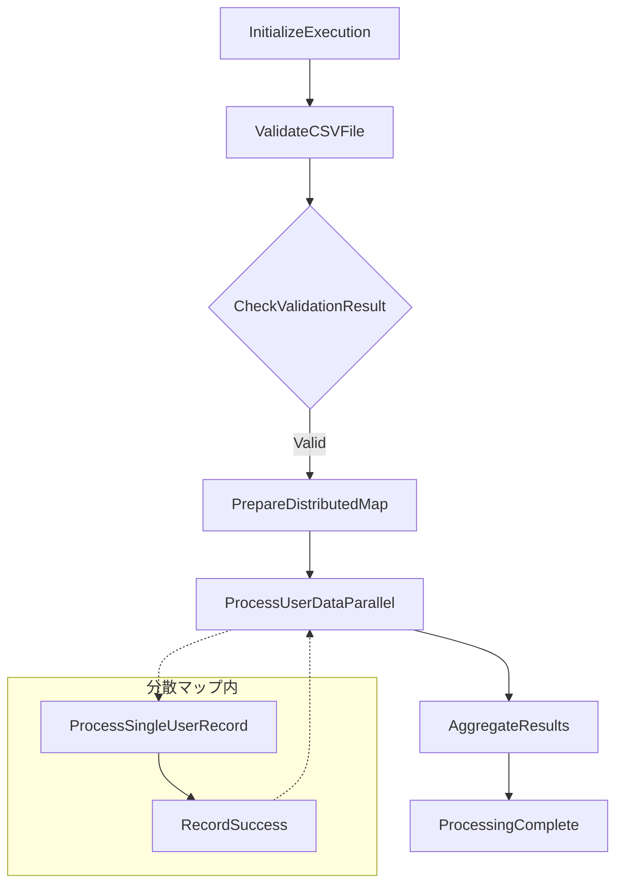
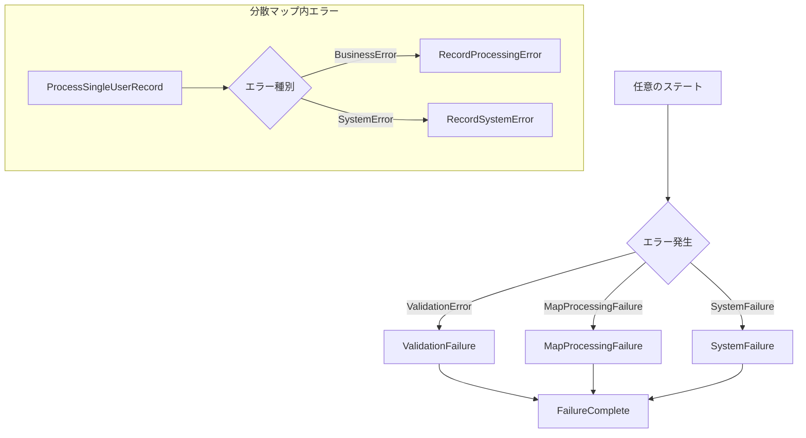

# Step Functions状態機械設計書

## 1. 概要

### 1.1 目的
CSVファイル並列処理システムにおけるStep Functions状態機械の詳細設計を定義する。S3ファイルアップロードをトリガーとして、CSV検証から分散マップによる並列処理、結果集約までの全ワークフローを制御する。

### 1.2 設計方針
- **冪等性の確保**: 実行名による重複実行防止
- **障害耐性**: 階層的エラーハンドリングと自動復旧
- **並列性能**: 分散マップによる効率的並列処理
- **監視可能性**: 包括的ログ記録と状態追跡

## 2. ステートマシン全体設計

### 2.1 ステートマシン基本情報
```json
{
  "StateMachineName": "csv-parallel-processing-workflow",
  "StateMachineType": "STANDARD",
  "Definition": "※詳細は2.3参照",
  "RoleArn": "arn:aws:iam::ACCOUNT:role/StepFunctions-CSV-Processing-Role",
  "Tags": [
    {
      "Key": "Project",
      "Value": "CSV-Parallel-Processing"
    },
    {
      "Key": "Environment", 
      "Value": "Production"
    }
  ],
  "LoggingConfiguration": {
    "Level": "ALL",
    "IncludeExecutionData": true,
    "Destinations": [
      {
        "CloudWatchLogsLogGroup": {
          "LogGroupArn": "arn:aws:logs:ap-northeast-1:ACCOUNT:log-group:/aws/stepfunctions/csv-processing"
        }
      }
    ]
  }
}
```

### 2.2 実行名生成仕様
重複実行防止のため、S3オブジェクトキーから一意な実行名を生成する。

#### 実行名生成ロジック
```python
def generate_execution_name(s3_key):
    """
    S3キーから80文字以内の一意実行名を生成
    
    Examples:
    - "data/user-log-20240802-001.csv" → "user-log-20240802-001"
    - "input/report_2024_08_02.csv" → "report-2024-08-02"
    """
    import re
    from datetime import datetime
    
    # ファイル名部分のみ抽出
    filename = s3_key.split('/')[-1]
    # 拡張子を除去
    base_name = filename.rsplit('.', 1)[0]
    # 英数字・ハイフン・アンダースコア以外を置換
    sanitized = re.sub(r'[^a-zA-Z0-9_-]', '-', base_name)
    # 連続ハイフンを単一化
    sanitized = re.sub(r'-+', '-', sanitized)
    # 先頭末尾のハイフンを除去
    sanitized = sanitized.strip('-')
    
    # 80文字制限対応
    if len(sanitized) > 70:
        sanitized = sanitized[:70]
    
    # タイムスタンプ追加（重複回避）
    timestamp = datetime.now().strftime("%H%M%S")
    execution_name = f"{sanitized}-{timestamp}"
    
    return execution_name[:80]
```

### 2.3 ステートマシン定義（ASL）

```json
{
  "Comment": "CSV並列処理ワークフロー - ユーザーログデータのAurora DB更新",
  "StartAt": "InitializeExecution",
  "States": {
    
    "InitializeExecution": {
      "Type": "Pass",
      "Comment": "実行開始時の初期化処理",
      "Parameters": {
        "execution": {
          "id.$": "$$.Execution.Name",
          "startTime.$": "$$.Execution.StartTime",
          "input.$": "$"
        },
        "s3": {
          "bucket.$": "$.detail.bucket.name",
          "key.$": "$.detail.object.key",
          "size.$": "$.detail.object.size",
          "etag.$": "$.detail.object.etag"
        },
        "processing": {
          "maxConcurrency": 5,
          "toleratedFailurePercentage": 5
        }
      },
      "Next": "ValidateCSVFile"
    },

    "ValidateCSVFile": {
      "Type": "Task",
      "Comment": "CSVファイル形式検証と基本統計取得",
      "Resource": "arn:aws:lambda:ap-northeast-1:ACCOUNT:function:csv-processor",
      "Parameters": {
        "eventType": "CSV_VALIDATION",
        "bucket.$": "$.s3.bucket",
        "key.$": "$.s3.key",
        "executionId.$": "$.execution.id"
      },
      "ResultPath": "$.validation",
      "TimeoutSeconds": 300,
      "Retry": [
        {
          "ErrorEquals": ["Lambda.ServiceException", "Lambda.AWSLambdaException"],
          "IntervalSeconds": 2,
          "MaxAttempts": 3,
          "BackoffRate": 2.0
        },
        {
          "ErrorEquals": ["States.TaskFailed"],
          "IntervalSeconds": 1,
          "MaxAttempts": 2,
          "BackoffRate": 1.5
        }
      ],
      "Catch": [
        {
          "ErrorEquals": ["ValidationError"],
          "Next": "ValidationFailure",
          "ResultPath": "$.error"
        },
        {
          "ErrorEquals": ["States.ALL"],
          "Next": "SystemFailure",
          "ResultPath": "$.error"
        }
      ],
      "Next": "CheckValidationResult"
    },

    "CheckValidationResult": {
      "Type": "Choice",
      "Comment": "CSV検証結果による分岐処理",
      "Choices": [
        {
          "Variable": "$.validation.isValid",
          "BooleanEquals": true,
          "Next": "PrepareDistributedMap"
        }
      ],
      "Default": "ValidationFailure"
    },

    "PrepareDistributedMap": {
      "Type": "Pass",
      "Comment": "分散マップ処理用のデータ準備",
      "Parameters": {
        "execution.$": "$.execution",
        "s3.$": "$.s3", 
        "validation.$": "$.validation",
        "processing.$": "$.processing",
        "mapInput": {
          "bucket.$": "$.s3.bucket",
          "key.$": "$.s3.key",
          "totalRows.$": "$.validation.rowCount",
          "executionId.$": "$.execution.id"
        }
      },
      "Next": "ProcessUserDataParallel"
    },

    "ProcessUserDataParallel": {
      "Type": "Map",
      "Comment": "ユーザーログデータの分散並列処理",
      "ItemProcessor": {
        "ProcessorConfig": {
          "Mode": "DISTRIBUTED",
          "ExecutionType": "STANDARD"
        },
        "StartAt": "ProcessSingleUserRecord",
        "States": {
          "ProcessSingleUserRecord": {
            "Type": "Task",
            "Comment": "ユーザー1件のログイン回数・投稿回数をAurora DBに反映",
            "Resource": "arn:aws:lambda:ap-northeast-1:ACCOUNT:function:csv-processor",
            "Parameters": {
              "eventType": "CSV_CHUNK_PROCESSING",
              "userRecord.$": "$",
              "executionId.$": "$$.Map.Item.Context.ExecutionName",
              "itemIndex.$": "$$.Map.Item.Index"
            },
            "ResultPath": "$.processResult",
            "TimeoutSeconds": 30,
            "Retry": [
              {
                "ErrorEquals": ["DatabaseConnectionError", "TemporaryError"],
                "IntervalSeconds": 2,
                "MaxAttempts": 3,
                "BackoffRate": 2.0
              },
              {
                "ErrorEquals": ["States.TaskFailed"],
                "IntervalSeconds": 1,
                "MaxAttempts": 2,
                "BackoffRate": 1.5
              }
            ],
            "Catch": [
              {
                "ErrorEquals": ["BusinessError", "DataValidationError"],
                "Next": "RecordProcessingError",
                "ResultPath": "$.error"
              },
              {
                "ErrorEquals": ["States.ALL"],
                "Next": "RecordSystemError", 
                "ResultPath": "$.error"
              }
            ],
            "Next": "RecordSuccess"
          },

          "RecordSuccess": {
            "Type": "Task",
            "Comment": "正常処理結果のDynamoDB記録",
            "Resource": "arn:aws:lambda:ap-northeast-1:ACCOUNT:function:csv-processor",
            "Parameters": {
              "eventType": "AUDIT_LOGGING",
              "logType": "SUCCESS",
              "executionId.$": "$$.Map.Item.Context.ExecutionName",
              "itemIndex.$": "$$.Map.Item.Index",
              "userRecord.$": "$",
              "processResult.$": "$.processResult",
              "timestamp.$": "$$.State.EnteredTime"
            },
            "ResultPath": null,
            "TimeoutSeconds": 10,
            "Retry": [
              {
                "ErrorEquals": ["States.TaskFailed"],
                "IntervalSeconds": 1,
                "MaxAttempts": 2,
                "BackoffRate": 1.5
              }
            ],
            "End": true
          },

          "RecordProcessingError": {
            "Type": "Task",
            "Comment": "業務エラー（データ不正等）のDynamoDB記録",
            "Resource": "arn:aws:lambda:ap-northeast-1:ACCOUNT:function:csv-processor", 
            "Parameters": {
              "eventType": "AUDIT_LOGGING",
              "logType": "BUSINESS_ERROR",
              "executionId.$": "$$.Map.Item.Context.ExecutionName",
              "itemIndex.$": "$$.Map.Item.Index",
              "userRecord.$": "$",
              "error.$": "$.error",
              "timestamp.$": "$$.State.EnteredTime"
            },
            "ResultPath": null,
            "TimeoutSeconds": 10,
            "End": true
          },

          "RecordSystemError": {
            "Type": "Task",
            "Comment": "システムエラーのDynamoDB記録",
            "Resource": "arn:aws:lambda:ap-northeast-1:ACCOUNT:function:csv-processor",
            "Parameters": {
              "eventType": "AUDIT_LOGGING",
              "logType": "SYSTEM_ERROR",
              "executionId.$": "$$.Map.Item.Context.ExecutionName", 
              "itemIndex.$": "$$.Map.Item.Index",
              "userRecord.$": "$",
              "error.$": "$.error",
              "timestamp.$": "$$.State.EnteredTime"
            },
            "ResultPath": null,
            "TimeoutSeconds": 10,
            "End": true
          }
        }
      },
      "ItemsPath": "$.validation.csvRows",
      "MaxConcurrency": 5,
      "ToleratedFailurePercentage": 5,
      "ResultPath": "$.mapResults",
      "Next": "AggregateResults",
      "Catch": [
        {
          "ErrorEquals": ["States.ALL"],
          "Next": "MapProcessingFailure",
          "ResultPath": "$.error"
        }
      ]
    },

    "AggregateResults": {
      "Type": "Task",
      "Comment": "分散処理結果の集約とサマリー生成",
      "Resource": "arn:aws:lambda:ap-northeast-1:ACCOUNT:function:csv-processor",
      "Parameters": {
        "eventType": "RESULT_AGGREGATION",
        "executionId.$": "$.execution.id",
        "mapResults.$": "$.mapResults",
        "validation.$": "$.validation",
        "s3Output": {
          "bucket": "csv-processing-output-bucket",
          "keyPrefix": "results/"
        }
      },
      "ResultPath": "$.aggregation",
      "TimeoutSeconds": 120,
      "Retry": [
        {
          "ErrorEquals": ["States.TaskFailed"],
          "IntervalSeconds": 2,
          "MaxAttempts": 3,
          "BackoffRate": 2.0
        }
      ],
      "Next": "ProcessingComplete"
    },

    "ProcessingComplete": {
      "Type": "Pass",
      "Comment": "処理完了時の最終データ整理",
      "Parameters": {
        "status": "SUCCESS",
        "executionId.$": "$.execution.id",
        "startTime.$": "$.execution.startTime",
        "endTime.$": "$$.State.EnteredTime",
        "input.$": "$.s3",
        "validation.$": "$.validation",
        "processing": {
          "totalRecords.$": "$.validation.rowCount",
          "successCount.$": "$.aggregation.successCount",
          "errorCount.$": "$.aggregation.errorCount",
          "processingTimeSeconds.$": "$.aggregation.processingTimeSeconds"
        },
        "output": {
          "s3Bucket.$": "$.aggregation.outputBucket",
          "s3Key.$": "$.aggregation.outputKey",
          "summary.$": "$.aggregation.summary"
        }
      },
      "End": true
    },

    "ValidationFailure": {
      "Type": "Task",
      "Comment": "CSV検証失敗時のエラー処理",
      "Resource": "arn:aws:lambda:ap-northeast-1:ACCOUNT:function:csv-processor",
      "Parameters": {
        "eventType": "ERROR_HANDLING",
        "errorType": "VALIDATION_FAILURE",
        "executionId.$": "$.execution.id",
        "s3.$": "$.s3",
        "error.$": "$.error",
        "timestamp.$": "$$.State.EnteredTime"
      },
      "Next": "FailureComplete"
    },

    "MapProcessingFailure": {
      "Type": "Task", 
      "Comment": "分散マップ処理失敗時のエラー処理",
      "Resource": "arn:aws:lambda:ap-northeast-1:ACCOUNT:function:csv-processor",
      "Parameters": {
        "eventType": "ERROR_HANDLING",
        "errorType": "MAP_PROCESSING_FAILURE",
        "executionId.$": "$.execution.id",
        "s3.$": "$.s3",
        "validation.$": "$.validation",
        "error.$": "$.error",
        "timestamp.$": "$$.State.EnteredTime"
      },
      "Next": "FailureComplete"
    },

    "SystemFailure": {
      "Type": "Task",
      "Comment": "システム障害時のエラー処理",
      "Resource": "arn:aws:lambda:ap-northeast-1:ACCOUNT:function:csv-processor", 
      "Parameters": {
        "eventType": "ERROR_HANDLING",
        "errorType": "SYSTEM_FAILURE",
        "executionId.$": "$.execution.id",
        "s3.$": "$.s3",
        "error.$": "$.error",
        "timestamp.$": "$$.State.EnteredTime"
      },
      "Next": "FailureComplete"
    },

    "FailureComplete": {
      "Type": "Pass",
      "Comment": "エラー処理完了時の最終データ整理",
      "Parameters": {
        "status": "FAILED",
        "executionId.$": "$.execution.id",
        "startTime.$": "$.execution.startTime",
        "endTime.$": "$$.State.EnteredTime",
        "input.$": "$.s3",
        "error.$": "$.error"
      },
      "End": true
    }
  }
}
```

## 3. 入力データ仕様

### 3.1 EventBridge入力データ
S3 ObjectCreatedイベントからの入力データ形式。

```json
{
  "version": "0",
  "id": "example-id-1234",
  "detail-type": "Object Created",
  "source": "aws.s3",
  "account": "123456789012",
  "time": "2024-08-02T12:34:56Z",
  "region": "ap-northeast-1",
  "detail": {
    "version": "0",
    "bucket": {
      "name": "csv-processing-bucket"
    },
    "object": {
      "key": "data/user-log-20240802-001.csv",
      "size": 2048576,
      "etag": "d85b1234567890abcdef",
      "versionId": "version123"
    },
    "request-id": "C3D13FE58DE4C810",
    "requester": "123456789012"
  }
}
```

### 3.2 CSV検証結果データ
ValidateCSVFileステートからの出力データ形式。

```json
{
  "validation": {
    "isValid": true,
    "rowCount": 1000,
    "columnCount": 3,
    "headerValid": true,
    "encoding": "UTF-8",
    "delimiter": ",",
    "csvRows": [
      {
        "ユーザーID": "U00001",
        "ログイン回数": "5",
        "投稿回数": "12"
      },
      {
        "ユーザーID": "U00002", 
        "ログイン回数": "3",
        "投稿回数": "8"
      }
    ],
    "statistics": {
      "fileSizeBytes": 2048576,
      "processingTimeSeconds": 15.2,
      "validationErrors": []
    }
  }
}
```

## 4. エラーハンドリング設計

### 4.1 エラー分類と対応

| エラー種別 | 対象ステート | Retry設定 | Catch設定 | 最終処理 |
|------------|--------------|-----------|-----------|----------|
| **ValidationError** | ValidateCSVFile | なし | ValidationFailure | エラー終了 |
| **BusinessError** | ProcessSingleUserRecord | なし | RecordProcessingError | 継続処理 |
| **DatabaseConnectionError** | ProcessSingleUserRecord | 3回/指数バックオフ | なし | Retry後Success |
| **TemporaryError** | ProcessSingleUserRecord | 3回/指数バックオフ | なし | Retry後Success |
| **Lambda.ServiceException** | 全Lambda | 3回/指数バックオフ | なし | Retry後Success |
| **States.TaskFailed** | 全ステート | 2回/線形バックオフ | SystemFailure | エラー終了 |
| **States.ALL** | 全ステート | なし | SystemFailure | エラー終了 |

### 4.2 分散マップ障害許容設定
```json
{
  "ToleratedFailurePercentage": 5,
  "ToleratedFailureCount": 50,
  "MaxConcurrency": 5
}
```

- **障害許容率**: 全体の5%まで許容
- **障害許容数**: 最大50件まで許容
- **並列度**: 5並列実行

## 5. 状態遷移図

### 5.1 正常フロー


### 5.2 エラーフロー


## 6. 監視・ログ設計

### 6.1 CloudWatch Logs設定
```json
{
  "LoggingConfiguration": {
    "Level": "ALL",
    "IncludeExecutionData": true,
    "Destinations": [
      {
        "CloudWatchLogsLogGroup": {
          "LogGroupArn": "arn:aws:logs:ap-northeast-1:ACCOUNT:log-group:/aws/stepfunctions/csv-processing"
        }
      }
    ]
  }
}
```

### 6.2 カスタムメトリクス
各ステートでカスタムメトリクスを CloudWatch に送信。

```json
{
  "MetricData": [
    {
      "MetricName": "CSVValidationDuration",
      "Value": 15.2,
      "Unit": "Seconds",
      "Dimensions": [
        {"Name": "ExecutionId", "Value": "user-log-20240802-001-123456"}
      ]
    },
    {
      "MetricName": "UserRecordsProcessed", 
      "Value": 1000,
      "Unit": "Count"
    },
    {
      "MetricName": "ProcessingErrors",
      "Value": 12,
      "Unit": "Count"
    }
  ]
}
```

## 7. 性能設計

### 7.1 タイムアウト設定

| ステート名 | タイムアウト | 根拠 |
|------------|--------------|------|
| ValidateCSVFile | 300秒 | 1000行CSV読み込み・検証時間 |
| ProcessSingleUserRecord | 30秒 | 1ユーザー処理の想定時間 |
| AggregateResults | 120秒 | 1000件結果集約時間 |
| 全体実行 | 600秒 | 1000行処理完了の目標時間 |

### 7.2 並列処理性能
- **最大並列度**: 5（Lambda同時実行制限考慮）
- **スループット**: 1000行/5分 = 200行/分
- **1並列あたり**: 40行/分 = 1.5秒/行

## 8. セキュリティ設計

### 8.1 IAMロール権限
Step Functions実行ロールに最小権限を付与。

```json
{
  "Version": "2012-10-17",
  "Statement": [
    {
      "Effect": "Allow",
      "Action": [
        "lambda:InvokeFunction"
      ],
      "Resource": [
        "arn:aws:lambda:ap-northeast-1:ACCOUNT:function:csv-processor"
      ]
    },
    {
      "Effect": "Allow",
      "Action": [
        "logs:CreateLogGroup",
        "logs:CreateLogStream", 
        "logs:PutLogEvents",
        "logs:DescribeLogGroups",
        "logs:DescribeLogStreams"
      ],
      "Resource": "arn:aws:logs:ap-northeast-1:ACCOUNT:log-group:/aws/stepfunctions/*"
    }
  ]
}
```

### 8.2 実行名による重複防止
実行名の一意性制約を活用した重複実行防止。

## 9. テスト設計

### 9.1 単体テスト
各ステートを個別に実行しテスト。

```json
{
  "testCases": [
    {
      "name": "正常CSV検証テスト",
      "input": {
        "s3": {
          "bucket": "test-bucket",
          "key": "test/valid-1000-rows.csv"
        }
      },
      "expected": {
        "validation.isValid": true,
        "validation.rowCount": 1000
      }
    },
    {
      "name": "不正CSV検証テスト", 
      "input": {
        "s3": {
          "bucket": "test-bucket",
          "key": "test/invalid-format.csv"
        }
      },
      "expected": {
        "validation.isValid": false
      }
    }
  ]
}
```

### 9.2 統合テスト
EventBridgeからの端到端実行テスト。

```bash
# テスト実行コマンド例
aws stepfunctions start-execution \
  --state-machine-arn "arn:aws:states:ap-northeast-1:ACCOUNT:stateMachine:csv-parallel-processing-workflow" \
  --name "test-execution-$(date +%s)" \
  --input file://test-input.json
```

## 10. 運用設計

### 10.1 デプロイメント
CloudFormation/CDKによるInfrastructure as Code。

### 10.2 監視項目
- 実行成功率
- 平均実行時間  
- エラー発生率
- 処理スループット

### 10.3 アラート設定
- 実行失敗時の即座通知
- 処理時間超過時の警告
- エラー率閾値超過時の注意

この設計書により、安全で効率的なCSV並列処理ワークフローを実現する。