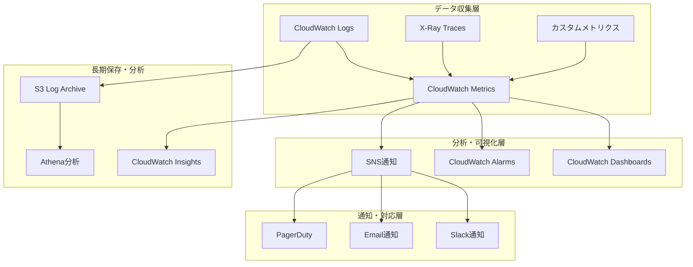
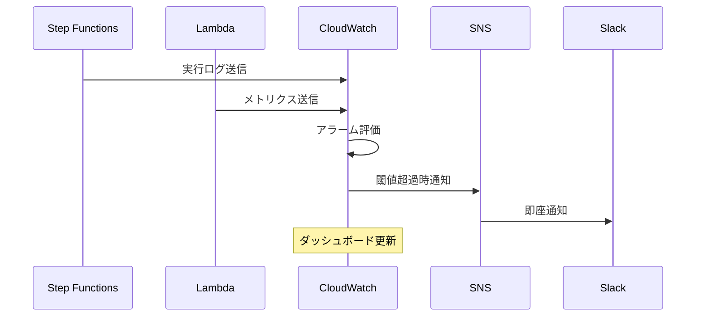

# 監視・ログ設計書

## 1. 概要

### 1.1 目的
CSVファイル並列処理システムにおける包括的な監視・ログ基盤の設計を定義する。システムの健全性監視、障害の早期検知、運用効率の向上、コンプライアンス要件への対応を実現する。

### 1.2 設計方針
- **包括的監視**: 全レイヤーでの統合監視
- **障害予防**: 予兆検知とプロアクティブ対応
- **運用効率**: 自動化による運用負荷軽減
- **コンプライアンス**: 監査要件対応とデータガバナンス

### 1.3 監視対象範囲
- AWS Step Functions実行状況
- Lambda関数の性能・エラー
- S3バケットの操作・容量
- Aurora DBの性能・接続
- DynamoDB処理状況
- EventBridge配信状況

## 2. 監視アーキテクチャ

### 2.1 監視システム構成図


### 2.2 監視データフロー


## 3. ログ設計

### 3.1 ログ階層設計

#### 3.1.1 アプリケーションログ
**Step Functions実行ログ**
```json
{
  "timestamp": "2024-08-02T12:34:56.789Z",
  "level": "INFO",
  "service": "step-functions",
  "execution_id": "user-log-20240802-001-123456",
  "state_name": "ProcessUserDataParallel",
  "event_type": "StateEntered",
  "details": {
    "input_records": 1000,
    "parallel_executions": 5,
    "execution_arn": "arn:aws:states:ap-northeast-1:123456789012:execution:csv-parallel-processing-workflow:user-log-20240802-001-123456"
  }
}
```

**Lambda関数ログ**
```json
{
  "timestamp": "2024-08-02T12:34:56.789Z",
  "level": "INFO",
  "service": "lambda",
  "function_name": "csv-processor",
  "request_id": "12345678-1234-1234-1234-123456789012",
  "event_type": "ProcessingComplete",
  "details": {
    "user_id": "U00001",
    "processing_time_ms": 150,
    "db_operation": "UPSERT",
    "old_login_count": 5,
    "new_login_count": 7,
    "old_post_count": 12,
    "new_post_count": 14
  }
}
```

#### 3.1.2 システムログ
**Aurora DB接続ログ**
```json
{
  "timestamp": "2024-08-02T12:34:56.789Z",
  "level": "DEBUG",
  "service": "aurora",
  "connection_id": "conn-12345",
  "event_type": "QueryExecution",
  "details": {
    "query_type": "SELECT",
    "execution_time_ms": 25,
    "rows_affected": 1,
    "connection_pool_size": 10
  }
}
```

**DynamoDB操作ログ**
```json
{
  "timestamp": "2024-08-02T12:34:56.789Z",
  "level": "INFO",
  "service": "dynamodb",
  "table_name": "csv-processing-audit",
  "event_type": "PutItem",
  "details": {
    "consumed_capacity": 1.0,
    "item_size_bytes": 512,
    "response_time_ms": 8
  }
}
```

### 3.2 ログレベル定義

| レベル | 用途 | 保存期間 | 例 |
|-------|------|----------|-----|
| ERROR | システムエラー、業務エラー | 90日 | Lambda実行失敗、DB接続エラー |
| WARN | 警告、性能劣化 | 30日 | 処理時間超過、リトライ発生 |
| INFO | 業務処理結果、状態変更 | 30日 | ユーザー処理完了、状態遷移 |
| DEBUG | 詳細情報、デバッグ用 | 7日 | SQL実行詳細、内部変数値 |

### 3.3 CloudWatch Logs設定

#### 3.3.1 ロググループ設計
```yaml
LogGroups:
  - Name: /aws/stepfunctions/csv-processing
    RetentionInDays: 30
    KmsKeyId: alias/cloudwatch-logs
    
  - Name: /aws/lambda/csv-processor
    RetentionInDays: 90

  - Name: /csv-processing/application
    RetentionInDays: 30
    
  - Name: /csv-processing/audit
    RetentionInDays: 90
```

#### 3.3.2 ログストリーム命名規則
```
パターン: {service}/{date}/{execution-id}
例: 
- stepfunctions/2024/08/02/user-log-20240802-001-123456
- lambda/csv-processor/2024/08/02/12345678-1234-1234-1234-123456789012
```

### 3.4 構造化ログ実装

#### 3.4.1 Lambda関数ログ実装例
```python
import json
import logging
from datetime import datetime
from typing import Dict, Any

class StructuredLogger:
    def __init__(self, service_name: str):
        self.service_name = service_name
        self.logger = logging.getLogger()
        self.logger.setLevel(logging.INFO)
        
    def log(self, level: str, event_type: str, details: Dict[str, Any], 
            request_id: str = None):
        log_entry = {
            "timestamp": datetime.utcnow().isoformat() + "Z",
            "level": level,
            "service": self.service_name,
            "event_type": event_type,
            "details": details
        }
        
        if request_id:
            log_entry["request_id"] = request_id
            
        self.logger.info(json.dumps(log_entry))
    
    def info(self, event_type: str, details: Dict[str, Any], request_id: str = None):
        self.log("INFO", event_type, details, request_id)
    
    def error(self, event_type: str, details: Dict[str, Any], request_id: str = None):
        self.log("ERROR", event_type, details, request_id)

# 使用例
logger = StructuredLogger("csv-processor")

def lambda_handler(event, context):
    logger.info("ProcessingStarted", {
        "user_id": event.get("userRecord", {}).get("ユーザーID"),
        "execution_id": event.get("executionId"),
        "item_index": event.get("itemIndex")
    }, context.aws_request_id)
    
    try:
        # 処理実行
        result = process_user_record(event["userRecord"])
        
        logger.info("ProcessingCompleted", {
            "user_id": event["userRecord"]["ユーザーID"],
            "processing_time_ms": result["processing_time_ms"],
            "db_operations": result["db_operations"]
        }, context.aws_request_id)
        
        return result
        
    except Exception as e:
        logger.error("ProcessingFailed", {
            "user_id": event.get("userRecord", {}).get("ユーザーID"),
            "error_type": type(e).__name__,
            "error_message": str(e)
        }, context.aws_request_id)
        raise
```

## 4. メトリクス設計

**個人開発のため不要**

CustomMetricsの送信は実装しません。標準のAWSサービスメトリクス（Lambda、Step Functions、Aurora、DynamoDB）のみを使用します。

### 4.2 システムメトリクス

#### 4.2.1 Step Functions メトリクス
```yaml
StepFunctionsMetrics:
  - ExecutionsStarted
  - ExecutionsSucceeded
  - ExecutionsFailed
  - ExecutionsAborted
  - ExecutionThrottled
  - ExecutionTime
  - ActivityRunTime
  - ActivityScheduleTime
```

#### 4.2.2 Lambda メトリクス
```yaml
LambdaMetrics:
  - Invocations
  - Duration
  - Errors
  - Throttles
  - DeadLetterErrors
  - IteratorAge
  - ConcurrentExecutions
  - ProvisionedConcurrencyUtilization
```

#### 4.2.3 Aurora メトリクス
```yaml
AuroraMetrics:
  - DatabaseConnections
  - CPUUtilization
  - DatabaseConnectionsBorrowCount
  - DatabaseConnectionsSetupFailures
  - Deadlocks
  - FreeStorageSpace
  - ReadLatency
  - WriteLatency
```

### 4.3 カスタムメトリクス実装

**個人開発のため不要**

カスタムメトリクス送信機能は実装しません。CloudWatchの標準メトリクスで十分な監視を行います。

## 5. ダッシュボード設計

**個人開発のため不要**

CloudWatchダッシュボードは作成しません。必要に応じてCloudWatchコンソールから標準メトリクスを確認します。

## 6. アラート設計

**個人開発のため不要**

CloudWatchアラーム、SNS通知、PagerDuty連携などは設定しません。必要に応じてCloudWatchコンソールでログとメトリクスを手動確認します。

## 7. X-Ray分散トレーシング

**個人開発のため不要**

X-Rayトレーシングは設定しません。デバッグが必要な場合はCloudWatch Logsの構造化ログで対応します。

## 8. ログ分析・検索

### 8.1 CloudWatch Insights クエリ

#### 8.1.1 エラー分析クエリ
```sql
-- Lambda関数のエラー率分析
fields @timestamp, @message, level, service, error_type
| filter level = "ERROR"
| stats count() by error_type
| sort count desc

-- 処理時間分析
fields @timestamp, details.processing_time_ms, details.user_id
| filter event_type = "ProcessingCompleted"
| stats avg(details.processing_time_ms), max(details.processing_time_ms), count() by bin(5m)

-- 特定実行の詳細追跡
fields @timestamp, @message, state_name, event_type
| filter execution_id = "user-log-20240802-001-123456"
| sort @timestamp asc
```

#### 8.1.2 性能分析クエリ
```sql
-- スループット分析
fields @timestamp, event_type
| filter event_type = "ProcessingCompleted"
| stats count() as records_per_minute by bin(1m)
| sort @timestamp desc

-- データベース性能分析
fields @timestamp, details.execution_time_ms, details.query_type
| filter service = "aurora" and event_type = "QueryExecution"
| stats avg(details.execution_time_ms) as avg_time, 
        max(details.execution_time_ms) as max_time 
        by details.query_type
```

### 8.2 Athena 長期分析

**個人開発のため不要**

Athenaによる長期ログ分析は実装しません。必要に応じてCloudWatch Insightsで短期分析を行います。

## 9. 運用監視手順

### 9.1 日次監視チェックリスト

#### 9.1.1 システム健全性確認
```yaml
DailyChecks:
  - Task: "過去24時間の処理ファイル数確認"
    Expected: "> 0"
    Alert: "処理が実行されていない"
    
  - Task: "エラー率確認"
    Expected: "< 5%"
    Alert: "エラー率が閾値を超過"
    
  - Task: "平均処理時間確認"
    Expected: "< 300秒"
    Alert: "処理時間が長期化"
    
  - Task: "DynamoDB容量使用量確認"
    Expected: "< 80%"
    Alert: "容量逼迫"
```

#### 9.1.2 自動化された日次レポート
```python
import boto3
from datetime import datetime, timedelta

def generate_daily_report():
    cloudwatch = boto3.client('cloudwatch')
    
    # 過去24時間のメトリクス取得
    end_time = datetime.utcnow()
    start_time = end_time - timedelta(days=1)
    
    # 処理ファイル数
    files_processed = cloudwatch.get_metric_statistics(
        Namespace='CSVProcessing/Business',
        MetricName='FilesProcessed',
        StartTime=start_time,
        EndTime=end_time,
        Period=86400,
        Statistics=['Sum']
    )
    
    # エラー率
    error_rate = cloudwatch.get_metric_statistics(
        Namespace='CSVProcessing/Quality',
        MetricName='ErrorRate',
        StartTime=start_time,
        EndTime=end_time,
        Period=86400,
        Statistics=['Average']
    )
    
    report = {
        'date': end_time.strftime('%Y-%m-%d'),
        'files_processed': files_processed['Datapoints'][0]['Sum'] if files_processed['Datapoints'] else 0,
        'error_rate': error_rate['Datapoints'][0]['Average'] if error_rate['Datapoints'] else 0,
        'status': 'HEALTHY' if error_rate['Datapoints'][0]['Average'] < 5 else 'WARNING'
    }
    
    # Slackに送信
    send_to_slack(report)
    
    return report
```

### 9.2 週次監視レビュー

#### 9.2.1 傾向分析
- 処理量の週間推移
- エラーパターンの分析
- 性能劣化の兆候確認
- コスト推移の確認

#### 9.2.2 改善提案
- 閾値の見直し
- 新規監視項目の追加
- アラート設定の最適化

## 10. トラブルシューティング

### 10.1 障害対応手順

#### 10.1.1 緊急事態対応
```yaml
IncidentResponse:
  Level1_Immediate:
    - "アラート受信"
    - "ダッシュボード確認"
    - "影響範囲特定"
    - "初期対応実施"
    
  Level2_Investigation:
    - "ログ詳細確認"
    - "X-Rayトレース分析"
    - "根本原因特定"
    
  Level3_Recovery:
    - "修正対応実施"
    - "動作確認"
    - "事後報告書作成"
```

### 10.2 よくある問題と対処法

| 問題 | 症状 | 確認箇所 | 対処法 |
|------|------|----------|--------|
| 処理が開始されない | ファイルアップロード後に実行されない | EventBridge配信状況 | ルール設定確認 |
| 処理時間が長い | 通常より処理時間が長い | Lambda実行時間、DB性能 | 並列度調整、DB接続数確認 |
| エラー率上昇 | 処理失敗が多発 | Lambda エラーログ | データ品質、DB接続確認 |
| DynamoDB制限 | スロットリング発生 | DynamoDB メトリクス | キャパシティ調整 |

この監視・ログ設計により、システムの健全性を維持し、迅速な障害対応を実現する。