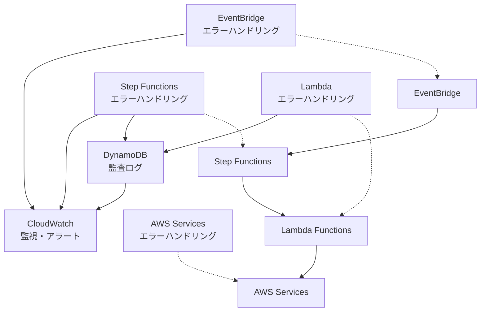
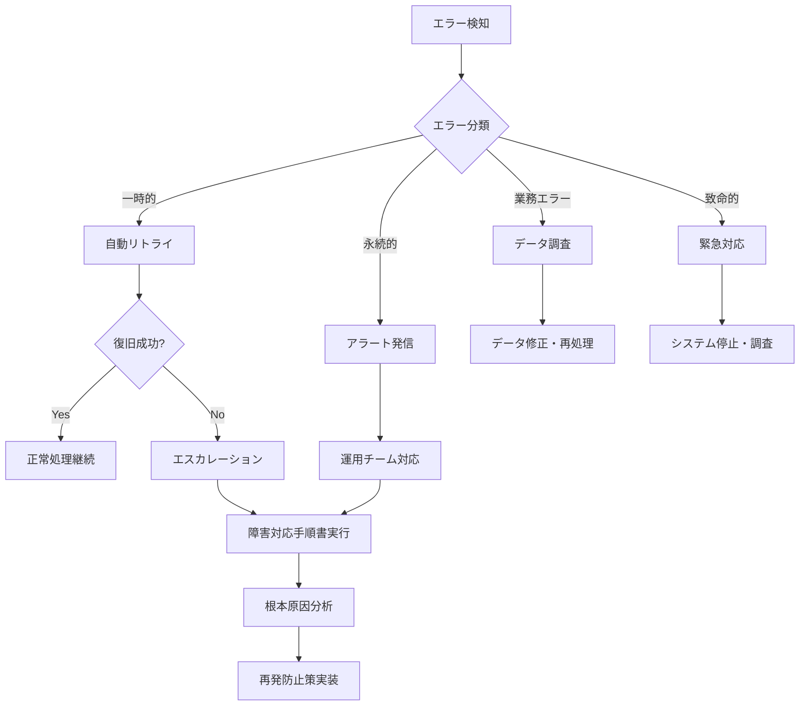

# エラーハンドリング基本設計書

## 1. エラーハンドリング概要

### 1.1 設計方針

CSVユーザーログ並列処理システムでは、以下の方針でエラーハンドリングを設計します：

1. **階層的エラー処理**: 各コンポーネント層での適切なエラー処理
2. **エラー分類**: 復旧可能性に基づく分類とそれぞれの対処法
3. **失敗許容設計**: 一部の失敗を許容しつつ全体処理を継続
4. **包括的ログ**: 全てのエラーをDynamoDBに記録し追跡可能性を確保
5. **自動復旧**: 可能な限り自動復旧を試行し、人的介入を最小化

### 1.2 エラーハンドリング層構造



## 2. エラー分類と対処方針

### 2.1 エラー分類体系

| 分類 | 特徴 | 対処方針 | 例 |
|------|------|----------|-----|
| **一時的エラー** | 再実行で解決可能 | 自動リトライ | ネットワーク瞬断、DB一時的過負荷 |
| **永続的エラー** | 再実行でも解決不可 | ログ記録・アラート | 設定ミス、権限不足 |
| **業務エラー** | データ起因のエラー | カスタム処理 | ユーザー不存在、データ形式不正 |
| **致命的エラー** | システム全体に影響 | 緊急停止・調査 | Lambda関数削除、VPC設定不正 |

### 2.2 エラーコード体系

```typescript
// エラーコード命名規則: [COMPONENT]_[CATEGORY]_[SPECIFIC]
enum ErrorCode {
  // EventBridge関連
  EB_CONFIG_RULE_DISABLED = 'EB_CONFIG_RULE_DISABLED',
  EB_ACCESS_INSUFFICIENT_PERMISSION = 'EB_ACCESS_INSUFFICIENT_PERMISSION',
  
  // Step Functions関連
  SF_EXEC_ALREADY_EXISTS = 'SF_EXEC_ALREADY_EXISTS',
  SF_EXEC_LIMIT_EXCEEDED = 'SF_EXEC_LIMIT_EXCEEDED',
  SF_STATE_TIMEOUT = 'SF_STATE_TIMEOUT',
  SF_MAP_FAILURE_THRESHOLD_EXCEEDED = 'SF_MAP_FAILURE_THRESHOLD_EXCEEDED',
  
  // Lambda関連
  LM_RUNTIME_TIMEOUT = 'LM_RUNTIME_TIMEOUT',
  LM_RUNTIME_OUT_OF_MEMORY = 'LM_RUNTIME_OUT_OF_MEMORY',
  LM_VPC_CONNECTION_FAILED = 'LM_VPC_CONNECTION_FAILED',
  
  // CSV検証関連
  CSV_VALIDATION_FILE_NOT_FOUND = 'CSV_VALIDATION_FILE_NOT_FOUND',
  CSV_VALIDATION_INVALID_FORMAT = 'CSV_VALIDATION_INVALID_FORMAT',
  CSV_VALIDATION_ENCODING_ERROR = 'CSV_VALIDATION_ENCODING_ERROR',
  
  // データベース関連
  DB_CONNECTION_FAILED = 'DB_CONNECTION_FAILED',
  DB_TRANSACTION_FAILED = 'DB_TRANSACTION_FAILED',
  DB_USER_NOT_FOUND = 'DB_USER_NOT_FOUND',
  
  // DynamoDB関連
  DYNAMO_WRITE_FAILED = 'DYNAMO_WRITE_FAILED',
  DYNAMO_THROTTLED = 'DYNAMO_THROTTLED',
  
  // S3関連
  S3_ACCESS_DENIED = 'S3_ACCESS_DENIED',
  S3_OBJECT_NOT_FOUND = 'S3_OBJECT_NOT_FOUND',
}
```

## 3. 各層のエラーハンドリング設計

### 3.1 EventBridgeレベル

#### 3.1.1 エラー検知と対処

**個人開発のため不要**

CloudWatch Custom Metric、SNS Notification、CloudWatch Alarmは設定しません。必要に応じてCloudWatchコンソールで手動確認します。

```json
{
  "errorHandling": {
    "ruleDisabled": {
      "detection": "CloudWatch Logsによる手動確認",
      "action": "手動調査",
      "escalation": "個人開発のため不要"
    },
    "targetInvocationFailed": {
      "detection": "CloudWatch Logsによる手動確認",
      "action": "手動調査",
      "escalation": "個人開発のため不要"
    },
    "insufficientPermissions": {
      "detection": "CloudTrail Error Logs",
      "action": "手動調査",
      "escalation": "個人開発のため不要"
    }
  }
}
```

#### 3.1.2 監視メトリクス

| メトリクス | 閾値 | アラート |
|-----------|------|---------|
| **FailedInvocations** | > 3 in 5分 | WARNING |
| **TriggeredRules** | < 1 in 1時間 | CRITICAL |
| **SuccessfulRuleMatches** | - | 情報のみ |

### 3.2 Step Functionsレベル

#### 3.2.1 状態別エラーハンドリング

```json
{
  "CSVFileValidation": {
    "Retry": [
      {
        "ErrorEquals": ["Lambda.ServiceException", "Lambda.AWSLambdaException"],
        "IntervalSeconds": 2,
        "MaxAttempts": 3,
        "BackoffRate": 2.0,
        "JitterStrategy": "FULL"
      },
      {
        "ErrorEquals": ["States.TimeoutError"],
        "IntervalSeconds": 5,
        "MaxAttempts": 2,
        "BackoffRate": 1.5
      }
    ],
    "Catch": [
      {
        "ErrorEquals": ["CSV_VALIDATION_INVALID_FORMAT"],
        "Next": "ValidationFailed",
        "ResultPath": "$.error"
      },
      {
        "ErrorEquals": ["States.ALL"],
        "Next": "ProcessingFailed",
        "ResultPath": "$.error"
      }
    ]
  }
}
```

#### 3.2.2 分散マップエラー許容設定

```json
{
  "UserLogDistributedMap": {
    "Type": "Map",
    "Mode": "DISTRIBUTED",
    "ToleratedFailurePercentage": 5,
    "ToleratedFailureCount": 50,
    "MaxConcurrency": 5,
    "ErrorHandling": {
      "strategy": "CONTINUE_ON_PARTIAL_FAILURE",
      "failureReporting": "COMPREHENSIVE"
    }
  }
}
```

### 3.3 Lambdaレベル

#### 3.3.1 統一エラーハンドラー

```typescript
// src/shared/errors/ErrorHandler.ts
export class LambdaErrorHandler {
  static handle(error: Error, context: LambdaContext): LambdaResponse {
    const requestId = context.awsRequestId;
    const functionName = context.functionName;
    
    // エラー分類
    const errorType = this.classifyError(error);
    const errorCode = this.generateErrorCode(error, errorType);
    
    // 構造化ログ出力
    const structuredError = {
      timestamp: new Date().toISOString(),
      requestId,
      functionName,
      errorCode,
      errorType,
      message: error.message,
      stack: error.stack,
      context: this.sanitizeContext(context)
    };
    
    console.error(JSON.stringify(structuredError));
    
    // DynamoDB監査ログ記録（非同期）
    this.recordAuditLog(structuredError).catch(logError => {
      console.error('Audit log recording failed:', logError);
    });
    
    // 個人開発のため不要
    // CloudWatch カスタムメトリクス送信は実装しません
    
    // エラーレスポンス生成
    return this.createErrorResponse(errorType, errorCode, error.message);
  }

  private static classifyError(error: Error): ErrorType {
    if (error instanceof ValidationError) return 'BUSINESS_ERROR';
    if (error instanceof DatabaseConnectionError) return 'TEMPORARY_ERROR';
    if (error instanceof UserNotFoundError) return 'BUSINESS_ERROR';
    if (error.message.includes('timeout')) return 'TEMPORARY_ERROR';
    if (error.message.includes('permission')) return 'PERMANENT_ERROR';
    
    return 'SYSTEM_ERROR';
  }
}
```

#### 3.3.2 リトライ機構

```typescript
// src/shared/utils/RetryUtil.ts
export class RetryUtil {
  static async withExponentialBackoff<T>(
    operation: () => Promise<T>,
    options: RetryOptions = {}
  ): Promise<T> {
    const {
      maxAttempts = 3,
      baseDelay = 1000,
      maxDelay = 30000,
      backoffMultiplier = 2,
      jitter = true
    } = options;

    let lastError: Error;
    
    for (let attempt = 1; attempt <= maxAttempts; attempt++) {
      try {
        return await operation();
      } catch (error) {
        lastError = error as Error;
        
        // 永続的エラーは即座に失敗
        if (this.isPermanentError(error)) {
          throw error;
        }
        
        // 最後の試行の場合
        if (attempt === maxAttempts) {
          throw lastError;
        }
        
        // 遅延計算
        const delay = Math.min(
          baseDelay * Math.pow(backoffMultiplier, attempt - 1),
          maxDelay
        );
        
        const jitteredDelay = jitter 
          ? delay + Math.random() * delay * 0.1 
          : delay;
        
        await this.sleep(jitteredDelay);
      }
    }
    
    throw lastError!;
  }

  private static isPermanentError(error: any): boolean {
    const permanentErrorCodes = [
      'ValidationError',
      'UserNotFoundError',
      'AccessDenied',
      'InvalidParameterValue'
    ];
    
    return permanentErrorCodes.some(code => 
      error.name === code || error.code === code
    );
  }
}
```

## 4. DynamoDBエラーログ設計

### 4.1 エラーログスキーマ

```typescript
interface ErrorLog {
  executionName: string;        // パーティションキー
  timestamp: string;            // ソートキー
  errorId: string;             // 一意識別子
  errorCode: string;           // エラーコード
  errorType: 'TEMPORARY' | 'PERMANENT' | 'BUSINESS' | 'SYSTEM';
  component: 'EVENTBRIDGE' | 'STEPFUNCTIONS' | 'LAMBDA' | 'AURORA' | 'DYNAMODB' | 'S3';
  functionName?: string;       // Lambda関数名
  userId?: string;             // 関連ユーザーID
  message: string;             // エラーメッセージ
  details?: any;               // 詳細情報
  context?: {                  // 実行コンテキスト
    requestId?: string;
    functionVersion?: string;
    remainingTime?: number;
  };
  retryCount?: number;         // リトライ回数
  resolved?: boolean;          // 解決済みフラグ
  ttl: number;                 // 6ヶ月後の自動削除
}
```

### 4.2 エラーログ記録処理

```typescript
export class ErrorLogService {
  async recordError(error: ProcessingError): Promise<void> {
    const errorLog: ErrorLog = {
      executionName: error.executionName,
      timestamp: new Date().toISOString(),
      errorId: this.generateErrorId(),
      errorCode: error.code,
      errorType: this.classifyErrorType(error),
      component: error.component,
      functionName: error.functionName,
      userId: error.userId,
      message: error.message,
      details: this.sanitizeDetails(error.details),
      context: error.context,
      retryCount: error.retryCount || 0,
      resolved: false,
      ttl: DateUtil.getDynamoTTL(180) // 6ヶ月
    };

    try {
      await this.dynamoClient.putItem({
        TableName: 'ProcessingLogs',
        Item: errorLog
      });
    } catch (dbError) {
      // DynamoDBへの書き込み失敗時は CloudWatch Logs に記録
      console.error('Failed to record error log to DynamoDB:', {
        originalError: errorLog,
        dbError: dbError.message
      });
    }
  }

  async getErrorsByExecution(executionName: string): Promise<ErrorLog[]> {
    const result = await this.dynamoClient.query({
      TableName: 'ProcessingLogs',
      KeyConditionExpression: 'executionName = :exec',
      FilterExpression: 'errorCode <> :null',
      ExpressionAttributeValues: {
        ':exec': executionName,
        ':null': 'SUCCESS'
      }
    });

    return result.Items as ErrorLog[];
  }
}
```

## 5. 監視・アラート設計

**個人開発のため不要**

CloudWatchアラーム、SNS通知、PagerDuty連携などは設定しません。必要に応じてCloudWatchコンソールでログとメトリクスを手動確認します。

### 5.1 CloudWatchアラーム設計

**個人開発のため不要**

CloudWatchアラームは作成しません。

```yaml
# 個人開発のため、CloudWatchアラームは作成しません
# 必要に応じてCloudWatchコンソールから手動でメトリクスを確認します
```

### 5.2 カスタムメトリクス

**個人開発のため不要**

CloudWatchカスタムメトリクス送信機能は実装しません。標準のAWSサービスメトリクス（Lambda、Step Functions、Aurora、DynamoDB）のみを使用します。

```typescript
// 個人開発のため、カスタムメトリクス送信は実装しません
// 標準のAWSサービスメトリクスで十分な監視を行います
/*
export class MetricsPublisher {
  // カスタムメトリクス機能は個人開発のため実装しません
}
*/
```

## 6. 復旧・障害対応手順

### 6.1 自動復旧シナリオ

| 障害タイプ | 自動復旧アクション | 復旧時間目標 |
|-----------|------------------|-------------|
| **Lambda一時的エラー** | 指数バックオフリトライ | 30秒以内 |
| **Aurora接続エラー** | 接続プール再初期化 | 60秒以内 |
| **DynamoDB書き込み失敗** | CloudWatch Logs記録継続 | 即座 |
| **S3一時的アクセスエラー** | リトライ（最大3回） | 10秒以内 |

### 6.2 手動対応が必要なエラー

#### 6.2.1 エスカレーション基準

**個人開発のため不要**

複雑なエスカレーション機能は実装しません。必要に応じて手動でCloudWatch Logsを確認し、個人で対応します。

```typescript
// 個人開発のため、エスカレーション機能は実装しません
/*
interface EscalationRule {
  errorCode: string;
  threshold: {
    count: number;
    timeWindow: number; // 分
  };
  severity: 'LOW' | 'MEDIUM' | 'HIGH' | 'CRITICAL';
  action: string;
}

// 簡素化版: ログ記録のみ
const SIMPLE_ERROR_TRACKING = {
  DB_CONNECTION_FAILED: 'CloudWatch Logs記録のみ',
  LM_VPC_CONNECTION_FAILED: 'CloudWatch Logs記録のみ',
  CSV_VALIDATION_INVALID_FORMAT: 'CloudWatch Logs記録のみ'
};
*/
```

### 6.3 障害復旧ワークフロー



## 7. テスト設計

### 7.1 エラーシナリオテスト

```typescript
// エラーハンドリングのテストケース
describe('Error Handling', () => {
  describe('Lambda Error Handling', () => {
    it('should retry on temporary database errors', async () => {
      const mockDbError = new Error('Connection timeout');
      mockDbError.name = 'DatabaseConnectionError';
      
      const operation = jest.fn()
        .mockRejectedValueOnce(mockDbError)
        .mockRejectedValueOnce(mockDbError)
        .mockResolvedValueOnce('success');
      
      const result = await RetryUtil.withExponentialBackoff(operation, {
        maxAttempts: 3
      });
      
      expect(operation).toHaveBeenCalledTimes(3);
      expect(result).toBe('success');
    });

    it('should not retry on permanent errors', async () => {
      const mockValidationError = new ValidationError('Invalid data format');
      
      const operation = jest.fn().mockRejectedValue(mockValidationError);
      
      await expect(
        RetryUtil.withExponentialBackoff(operation, { maxAttempts: 3 })
      ).rejects.toThrow(ValidationError);
      
      expect(operation).toHaveBeenCalledTimes(1);
    });
  });

  describe('Step Functions Error Handling', () => {
    it('should handle distributed map partial failures', async () => {
      // 分散マップの部分失敗テスト
      const mockExecution = await startStepFunctionsExecution({
        input: mockCsvWithPartialErrors
      });
      
      const result = await waitForExecution(mockExecution.executionArn);
      
      expect(result.status).toBe('SUCCEEDED');
      expect(result.output.failureCount).toBeLessThanOrEqual(50); // 許容失敗数
      expect(result.output.failurePercentage).toBeLessThanOrEqual(5); // 許容失敗率
    });
  });
});
```

### 7.2 カオスエンジニアリング

```bash
# AWS Fault Injection Simulator を使った障害テスト
aws fis start-experiment \
  --experiment-template-id exp-template-lambda-timeout \
  --tags Key=Environment,Value=test

# Lambda関数の一時的な無効化テスト
aws fis start-experiment \
  --experiment-template-id exp-template-aurora-connection-loss \
  --tags Key=Component,Value=database
```

この包括的なエラーハンドリング設計により、システムの信頼性と復旧性を大幅に向上させ、障害時の影響を最小限に抑えることができます。