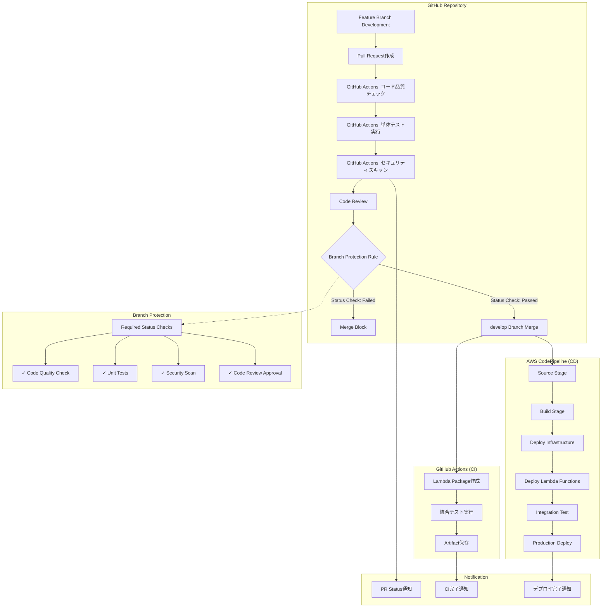

# CI/CD設計書

## 1. 概要

### 1.1 目的
CSVファイル並列処理システムにおけるCI/CDパイプラインの設計を定義する。GitHub ActionsとAWS CodePipeline/CodeBuildを組み合わせた、安全で効率的なデプロイメント戦略を実現する。

### 1.2 設計方針
- **早期フィードバック**: GitHub Actionsによる迅速な品質チェック
- **段階的デプロイ**: Terraform（インフラ）→ SAM（Lambda）→ 統合テストの順序
- **環境分離**: develop→staging→productionの段階的デプロイ
- **自動化**: 手動作業の最小化と人的エラーの排除
- **可視性**: デプロイ状況の透明性と監査証跡

### 1.3 CI/CDアーキテクチャ
- **CI**: GitHub Actions（単体テスト、コード品質チェック、SAM Build）
- **CD**: GitHub Actions + AWS（段階的デプロイ）
  - **Phase 1**: Terraform Apply（インフラ構築）
  - **Phase 2**: SAM Deploy（Lambda関数デプロイ）
  - **Phase 3**: Terraform Apply（Lambda ARN更新）
- **トリガー**: developブランチマージ時の自動実行

## 2. CI/CDアーキテクチャ設計

### 2.1 全体フロー図


### 2.2 環境戦略

#### 2.2.1 環境構成
| 環境 | 用途 | デプロイトリガー | 承認プロセス | CI実行タイミング |
|------|------|------------------|-------------|------------------|
| Development | 開発・単体テスト | Feature Branchプッシュ | なし | プッシュ毎 |
| Staging | 統合テスト・品質確認 | developブランチマージ | 自動 | マージ後 |
| Production | 本番運用 | mainブランチマージ | 手動承認 | マージ後 |

#### 2.2.2 ブランチ戦略
```
main (本番環境)
├── develop (ステージング環境)
│   ├── feature/csv-validator-improvement
│   ├── feature/error-handling-enhancement
│   └── bugfix/memory-leak-fix
└── hotfix/critical-security-patch (緊急修正)
```

## 3. GitHub Actions設計 (CI)

### 3.1 ワークフロー設計

#### 3.1.1 PR作成時コード品質チェックワークフロー
```yaml
# .github/workflows/pr-quality-checks.yml
name: PR Quality Checks
on:
  pull_request:
    branches: [develop, main]
    types: [opened, synchronize]
    paths:
      - 'src/**'
      - 'tests/**'
      - 'requirements.txt'
      - 'package.json'

jobs:
  code-quality:
    name: Code Quality Check
    runs-on: ubuntu-latest
    steps:
      - name: Checkout code
        uses: actions/checkout@v4
        
      - name: Setup Python 3.9
        uses: actions/setup-python@v4
        with:
          python-version: '3.9'
          
      - name: Cache dependencies
        uses: actions/cache@v3
        with:
          path: ~/.cache/pip
          key: ${{ runner.os }}-pip-${{ hashFiles('**/requirements.txt') }}
          
      - name: Install dependencies
        run: |
          pip install -r requirements.txt
          pip install -r requirements-dev.txt
          
      - name: Lint with flake8
        run: |
          flake8 src/ tests/ --count --select=E9,F63,F7,F82 --show-source --statistics
          flake8 src/ tests/ --count --exit-zero --max-complexity=10 --max-line-length=88 --statistics
          
      - name: Format check with black
        run: black --check src/ tests/
        
      - name: Type check with mypy
        run: mypy src/

  unit-tests:
    name: Unit Tests
    runs-on: ubuntu-latest
    needs: code-quality
    strategy:
      matrix:
        python-version: [3.9, 3.10]
    steps:
      - name: Checkout code
        uses: actions/checkout@v4
        
      - name: Setup Python
        uses: actions/setup-python@v4
        with:
          python-version: ${{ matrix.python-version }}
          
      - name: Cache dependencies
        uses: actions/cache@v3
        with:
          path: ~/.cache/pip
          key: ${{ runner.os }}-pip-${{ hashFiles('**/requirements.txt') }}
          
      - name: Install dependencies
        run: |
          pip install -r requirements.txt
          pip install -r requirements-dev.txt
          
      - name: Run unit tests
        run: |
          pytest tests/unit/ -v --cov=src/ --cov-report=xml --cov-report=html
          
      - name: Upload coverage to Codecov
        uses: codecov/codecov-action@v3
        with:
          file: ./coverage.xml
          flags: unittests
          name: codecov-umbrella

  security-scan:
    name: Security Scan
    runs-on: ubuntu-latest
    needs: unit-tests
    steps:
      - name: Checkout code
        uses: actions/checkout@v4
        
      - name: Setup Python 3.9
        uses: actions/setup-python@v4
        with:
          python-version: '3.9'
          
      - name: Install bandit
        run: pip install bandit
        
      - name: Security scan with bandit
        run: |
          bandit -r src/ -f json -o security-report.json
          bandit -r src/ -f txt
        
      - name: Upload security report
        uses: actions/upload-artifact@v3
        if: always()
        with:
          name: security-report
          path: security-report.json
```

#### 3.1.2 GitHub Branch Protection Rule設定

##### ブランチ保護ルール設定例
```yaml
# GitHub Repository Settings
repository_rules:
  branches:
    develop:
      protection:
        required_status_checks:
          strict: true
          contexts:
            - "Code Quality Check"
            - "Unit Tests (3.9)"
            - "Unit Tests (3.10)" 
            - "Security Scan"
        required_pull_request_reviews:
          required_approving_review_count: 1
          dismiss_stale_reviews: true
          require_code_owner_reviews: false
        enforce_admins: false
        restrictions: null
    main:
      protection:
        required_status_checks:
          strict: true
          contexts:
            - "Code Quality Check"
            - "Unit Tests (3.9)"
            - "Unit Tests (3.10)"
            - "Security Scan"
        required_pull_request_reviews:
          required_approving_review_count: 2
          dismiss_stale_reviews: true
          require_code_owner_reviews: true
        enforce_admins: true
        restrictions: null
```

##### 設定手順
```bash
# GitHub CLIでブランチ保護ルール設定
gh api repos/:owner/:repo/branches/develop/protection \
  --method PUT \
  --field required_status_checks='{"strict":true,"contexts":["Code Quality Check","Unit Tests (3.9)","Unit Tests (3.10)","Security Scan"]}' \
  --field required_pull_request_reviews='{"required_approving_review_count":1,"dismiss_stale_reviews":true}' \
  --field enforce_admins=false
```

#### 3.1.3 develop マージ後Lambda パッケージ作成ワークフロー
```yaml
# .github/workflows/build-lambda.yml
name: Build Lambda Packages
on:
  push:
    branches: [develop]
    paths:
      - 'src/lambda/**'
      
jobs:
  build-lambda-packages:
    runs-on: ubuntu-latest
    outputs:
      artifact-id: ${{ steps.upload.outputs.artifact-id }}
      
    steps:
      - name: Checkout code
        uses: actions/checkout@v4
        
      - name: Setup Python 3.9
        uses: actions/setup-python@v4
        with:
          python-version: '3.9'
          
      - name: Build Lambda packages
        run: |
          mkdir -p dist/lambda-packages
          
          # 各Lambda関数のパッケージ作成
          for func in csv-validator user-log-processor audit-logger result-aggregator error-handler; do
            echo "Building $func..."
            mkdir -p temp/$func
            cp -r src/lambda/$func/* temp/$func/
            cp src/common/* temp/$func/ 2>/dev/null || true
            
            # 依存関係インストール
            if [ -f "src/lambda/$func/requirements.txt" ]; then
              pip install -r src/lambda/$func/requirements.txt -t temp/$func/
            fi
            
            # パッケージ作成
            cd temp/$func
            zip -r ../../dist/lambda-packages/$func.zip .
            cd ../..
            
            # サイズチェック
            size=$(wc -c < dist/lambda-packages/$func.zip)
            if [ $size -gt 52428800 ]; then  # 50MB制限
              echo "Error: $func.zip exceeds 50MB limit"
              exit 1
            fi
            
            echo "$func package size: $((size / 1024 / 1024))MB"
          done
          
      - name: Upload Lambda packages
        id: upload
        uses: actions/upload-artifact@v3
        with:
          name: lambda-packages-${{ github.sha }}
          path: dist/lambda-packages/
          retention-days: 30
          
      - name: Notify Slack
        if: failure()
        uses: 8398a7/action-slack@v3
        with:
          status: failure
          channel: '#ci-cd-alerts'
          text: 'Lambda package build failed'
        env:
          SLACK_WEBHOOK_URL: ${{ secrets.SLACK_WEBHOOK_URL }}
```

### 3.2 品質ゲート設定

#### 3.2.1 必須チェック項目
```yaml
# .github/workflows/quality-gates.yml
name: Quality Gates
on:
  pull_request:
    branches: [develop, main]

jobs:
  quality-gates:
    runs-on: ubuntu-latest
    steps:
      - name: Checkout code
        uses: actions/checkout@v4
        fetch-depth: 0  # 全履歴取得
        
      - name: Check commit message format
        run: |
          # Conventional Commits形式チェック
          git log --oneline HEAD^..HEAD | grep -E '^[a-f0-9]+ (feat|fix|docs|style|refactor|test|chore)(\(.+\))?: .+$' || {
            echo "Commit message does not follow Conventional Commits format"
            exit 1
          }
          
      - name: Check file size limits
        run: |
          # 大きなファイルの検出
          find . -name "*.py" -size +1M -exec echo "File {} exceeds 1MB limit" \; -exec exit 1 \;
          
      - name: Check secret leaks
        uses: trufflesecurity/trufflehog@main
        with:
          path: ./
          base: main
          head: HEAD
          
      - name: Dependency vulnerability scan
        run: |
          pip install safety
          safety check --json --output safety-report.json || true
          
      - name: License compliance check
        uses: fossa-contrib/fossa-action@v2
        with:
          api-key: ${{ secrets.FOSSA_API_KEY }}
```

## 4. AWS CodePipeline設計 (CD)

### 4.1 パイプライン構成

#### 4.1.1 メインパイプライン
```yaml
# cloudformation/codepipeline.yml
AWSTemplateFormatVersion: '2010-09-09'
Description: 'CSV Processing System CI/CD Pipeline'

Parameters:
  GitHubOwner:
    Type: String
    Default: 'company-name'
  GitHubRepo:
    Type: String
    Default: 'csv-processing-system'
  GitHubBranch:
    Type: String
    Default: 'develop'

Resources:
  # S3 Bucket for artifacts
  ArtifactsBucket:
    Type: AWS::S3::Bucket
    Properties:
      BucketName: !Sub 'csv-processing-artifacts-${AWS::AccountId}'
      VersioningConfiguration:
        Status: Enabled
      PublicAccessBlockConfiguration:
        BlockPublicAcls: true
        BlockPublicPolicy: true
        IgnorePublicAcls: true
        RestrictPublicBuckets: true
      BucketEncryption:
        ServerSideEncryptionConfiguration:
          - ServerSideEncryptionByDefault:
              SSEAlgorithm: AES256

  # CodePipeline
  CSVProcessingPipeline:
    Type: AWS::CodePipeline::Pipeline
    Properties:
      Name: CSV-Processing-Pipeline
      RoleArn: !GetAtt CodePipelineRole.Arn
      ArtifactStore:
        Type: S3
        Location: !Ref ArtifactsBucket
      Stages:
        - Name: Source
          Actions:
            - Name: SourceAction
              ActionTypeId:
                Category: Source
                Owner: ThirdParty
                Provider: GitHub
                Version: '1'
              Configuration:
                Owner: !Ref GitHubOwner
                Repo: !Ref GitHubRepo
                Branch: !Ref GitHubBranch
                OAuthToken: !Ref GitHubToken
                PollForSourceChanges: false
              OutputArtifacts:
                - Name: SourceOutput

        - Name: Build
          Actions:
            - Name: BuildInfrastructure
              ActionTypeId:
                Category: Build
                Owner: AWS
                Provider: CodeBuild
                Version: '1'
              Configuration:
                ProjectName: !Ref InfrastructureBuildProject
              InputArtifacts:
                - Name: SourceOutput
              OutputArtifacts:
                - Name: InfraOutput
                
            - Name: BuildLambda
              ActionTypeId:
                Category: Build
                Owner: AWS
                Provider: CodeBuild
                Version: '1'
              Configuration:
                ProjectName: !Ref LambdaBuildProject
              InputArtifacts:
                - Name: SourceOutput
              OutputArtifacts:
                - Name: LambdaOutput

        - Name: DeployStaging
          Actions:
            - Name: DeployInfrastructure
              ActionTypeId:
                Category: Deploy
                Owner: AWS
                Provider: CloudFormation
                Version: '1'
              Configuration:
                ActionMode: CREATE_UPDATE
                StackName: csv-processing-infrastructure-staging
                TemplatePath: InfraOutput::infrastructure.yml
                Capabilities: CAPABILITY_IAM,CAPABILITY_NAMED_IAM
                RoleArn: !GetAtt CloudFormationRole.Arn
                ParameterOverrides: |
                  {
                    "Environment": "staging",
                    "EnableDetailedMonitoring": "true"
                  }
              InputArtifacts:
                - Name: InfraOutput
              OutputArtifacts:
                - Name: InfraDeployOutput
                
            - Name: DeployLambdaFunctions
              ActionTypeId:
                Category: Deploy
                Owner: AWS
                Provider: CloudFormation
                Version: '1'
              Configuration:
                ActionMode: CREATE_UPDATE
                StackName: csv-processing-lambda-staging
                TemplatePath: LambdaOutput::lambda-deployment.yml
                Capabilities: CAPABILITY_IAM
                RoleArn: !GetAtt CloudFormationRole.Arn
                ParameterOverrides: |
                  {
                    "Environment": "staging",
                    "ArtifactsBucket": "{{codepipeline.inputArtifacts}}"
                  }
              InputArtifacts:
                - Name: LambdaOutput
                - Name: InfraDeployOutput

        - Name: IntegrationTest
          Actions:
            - Name: RunIntegrationTests
              ActionTypeId:
                Category: Test
                Owner: AWS
                Provider: CodeBuild
                Version: '1'
              Configuration:
                ProjectName: !Ref IntegrationTestProject
              InputArtifacts:
                - Name: SourceOutput

        - Name: ProductionApproval
          Actions:
            - Name: ManualApproval
              ActionTypeId:
                Category: Approval
                Owner: AWS
                Provider: Manual
                Version: '1'
              Configuration:
                NotificationArn: !Ref ApprovalTopic
                CustomData: 'Please review the staging deployment and approve for production.'

        - Name: DeployProduction
          Actions:
            - Name: DeployInfrastructure
              ActionTypeId:
                Category: Deploy
                Owner: AWS
                Provider: CloudFormation
                Version: '1'
              Configuration:
                ActionMode: CREATE_UPDATE
                StackName: csv-processing-infrastructure-production
                TemplatePath: InfraOutput::infrastructure.yml
                Capabilities: CAPABILITY_IAM,CAPABILITY_NAMED_IAM
                RoleArn: !GetAtt CloudFormationRole.Arn
                ParameterOverrides: |
                  {
                    "Environment": "production",
                    "EnableDetailedMonitoring": "true"
                  }
              InputArtifacts:
                - Name: InfraOutput
                
            - Name: DeployLambdaFunctions
              ActionTypeId:
                Category: Deploy
                Owner: AWS
                Provider: CloudFormation
                Version: '1'
              Configuration:
                ActionMode: CREATE_UPDATE
                StackName: csv-processing-lambda-production
                TemplatePath: LambdaOutput::lambda-deployment.yml
                Capabilities: CAPABILITY_IAM
                RoleArn: !GetAtt CloudFormationRole.Arn
                ParameterOverrides: |
                  {
                    "Environment": "production"
                  }
              InputArtifacts:
                - Name: LambdaOutput
```

### 4.2 CodeBuild プロジェクト設計

#### 4.2.1 インフラ構築プロジェクト
```yaml
# Infrastructure Build Project
InfrastructureBuildProject:
  Type: AWS::CodeBuild::Project
  Properties:
    Name: CSV-Processing-Infrastructure-Build
    ServiceRole: !GetAtt CodeBuildRole.Arn
    Artifacts:
      Type: CODEPIPELINE
    Environment:
      Type: LINUX_CONTAINER
      ComputeType: BUILD_GENERAL1_SMALL
      Image: aws/codebuild/amazonlinux2-x86_64-standard:3.0
      EnvironmentVariables:
        - Name: AWS_DEFAULT_REGION
          Value: !Ref AWS::Region
        - Name: AWS_ACCOUNT_ID
          Value: !Ref AWS::AccountId
    Source:
      Type: CODEPIPELINE
      BuildSpec: |
        version: 0.2
        phases:
          install:
            runtime-versions:
              python: 3.9
            commands:
              - pip install cfn-lint cfn-nag
              
          pre_build:
            commands:
              - echo "Validating CloudFormation templates"
              - cfn-lint cloudformation/*.yml
              - cfn_nag_scan --input-path cloudformation/
              
          build:
            commands:
              - echo "Packaging CloudFormation templates"
              - aws cloudformation package 
                --template-file cloudformation/infrastructure.yml 
                --s3-bucket $ARTIFACTS_BUCKET 
                --output-template-file infrastructure.yml
                
          post_build:
            commands:
              - echo "Infrastructure build completed"
              
        artifacts:
          files:
            - infrastructure.yml
            - cloudformation/parameters/*.json
```

#### 4.2.2 Lambda関数構築プロジェクト
```yaml
# Lambda Build Project
LambdaBuildProject:
  Type: AWS::CodeBuild::Project
  Properties:
    Name: CSV-Processing-Lambda-Build
    ServiceRole: !GetAtt CodeBuildRole.Arn
    Artifacts:
      Type: CODEPIPELINE
    Environment:
      Type: LINUX_CONTAINER
      ComputeType: BUILD_GENERAL1_MEDIUM
      Image: aws/codebuild/amazonlinux2-x86_64-standard:3.0
    Source:
      Type: CODEPIPELINE
      BuildSpec: |
        version: 0.2
        phases:
          install:
            runtime-versions:
              python: 3.9
            commands:
              - pip install --upgrade pip
              
          pre_build:
            commands:
              - echo "Running Lambda function tests"
              - pytest tests/integration/ -v
              
          build:
            commands:
              - echo "Building Lambda deployment packages"
              - ./scripts/build-lambda-packages.sh
              
              - echo "Creating Lambda deployment template"
              - aws cloudformation package 
                --template-file cloudformation/lambda-functions.yml 
                --s3-bucket $ARTIFACTS_BUCKET 
                --output-template-file lambda-deployment.yml
                
          post_build:
            commands:
              - echo "Lambda build completed"
              - ls -la dist/
              
        artifacts:
          files:
            - lambda-deployment.yml
            - dist/**/*
```

#### 4.2.3 統合テストプロジェクト
```yaml
# Integration Test Project  
IntegrationTestProject:
  Type: AWS::CodeBuild::Project
  Properties:
    Name: CSV-Processing-Integration-Test
    ServiceRole: !GetAtt CodeBuildRole.Arn
    Artifacts:
      Type: CODEPIPELINE
    Environment:
      Type: LINUX_CONTAINER
      ComputeType: BUILD_GENERAL1_SMALL
      Image: aws/codebuild/amazonlinux2-x86_64-standard:3.0
      EnvironmentVariables:
        - Name: ENVIRONMENT
          Value: staging
        - Name: AWS_DEFAULT_REGION
          Value: !Ref AWS::Region
    Source:
      Type: CODEPIPELINE
      BuildSpec: |
        version: 0.2
        phases:
          install:
            runtime-versions:
              python: 3.9
            commands:
              - pip install -r requirements-test.txt
              
          pre_build:
            commands:
              - echo "Setting up test environment"
              - export STACK_NAME="csv-processing-infrastructure-staging"
              - aws cloudformation describe-stacks --stack-name $STACK_NAME
              
          build:
            commands:
              - echo "Running integration tests"
              - pytest tests/integration/ -v --tb=short
              - echo "Running end-to-end tests"
              - python tests/e2e/test_csv_processing_workflow.py
              
          post_build:
            commands:
              - echo "Integration tests completed"
              - |
                if [ $CODEBUILD_BUILD_SUCCEEDING -eq 0 ]; then
                  echo "Tests failed - sending notification"
                  aws sns publish --topic-arn $NOTIFICATION_TOPIC --message "Integration tests failed"
                fi
                
        reports:
          integration-test-reports:
            files:
              - 'test-results.xml'
            file-format: 'JUNITXML'
```

## 5. デプロイメント戦略

### 5.1 Blue-Green デプロイメント

#### 5.1.1 Lambda関数のBlue-Greenデプロイ
```yaml
# Lambda Blue-Green Deployment
LambdaDeploymentConfig:
  Type: AWS::CodeDeploy::DeploymentConfig
  Properties:
    DeploymentConfigName: Lambda-Blue-Green-5Percent
    ComputePlatform: Lambda
    TrafficRoutingConfig:
      Type: TimeBasedCanary
      TimeBasedCanary:
        CanaryPercentage: 5
        CanaryInterval: 5  # 5分間隔

LambdaApplication:
  Type: AWS::CodeDeploy::Application
  Properties:
    ApplicationName: CSV-Processing-Lambda-App
    ComputePlatform: Lambda

LambdaDeploymentGroup:
  Type: AWS::CodeDeploy::DeploymentGroup
  Properties:
    ApplicationName: !Ref LambdaApplication
    DeploymentGroupName: CSV-Processing-Lambda-DG
    ServiceRoleArn: !GetAtt CodeDeployRole.Arn
    DeploymentConfigName: !Ref LambdaDeploymentConfig
    AutoRollbackConfiguration:
      Enabled: true
      Events:
        - DEPLOYMENT_FAILURE
        - DEPLOYMENT_STOP_ON_ALARM
    AlarmConfiguration:
      Enabled: true
      Alarms:
        - Name: !Ref LambdaErrorRateAlarm
        - Name: !Ref LambdaDurationAlarm
```

### 5.2 ロールバック戦略

#### 5.2.1 自動ロールバック条件
```yaml
AutoRollbackConfiguration:
  Enabled: true
  Events:
    - DEPLOYMENT_FAILURE
    - DEPLOYMENT_STOP_ON_ALARM
    - DEPLOYMENT_STOP_ON_REQUEST
    
# CloudWatch Alarms for rollback triggers
LambdaErrorRateAlarm:
  Type: AWS::CloudWatch::Alarm
  Properties:
    AlarmName: Lambda-HighErrorRate-Staging
    AlarmDescription: High error rate detected
    MetricName: Errors
    Namespace: AWS/Lambda
    Statistic: Sum
    Period: 300
    EvaluationPeriods: 2
    Threshold: 10
    ComparisonOperator: GreaterThanThreshold
    Dimensions:
      - Name: FunctionName
        Value: !Ref UserLogProcessorFunction
```

## 6. 環境設定管理

### 6.1 パラメータ管理

#### 6.1.1 AWS Systems Manager Parameter Store
```yaml
# Environment-specific parameters
Parameters:
  /csv-processing/staging/database/connection-string:
    Type: SecureString
    Value: "postgresql://staging-db.cluster-xyz.amazonaws.com:5432/csvdb"
    
  /csv-processing/staging/s3/input-bucket:
    Type: String
    Value: "csv-input-staging-123456789012"
    
  /csv-processing/production/database/connection-string:
    Type: SecureString
    Value: "postgresql://prod-db.cluster-abc.amazonaws.com:5432/csvdb"
    
  /csv-processing/production/s3/input-bucket:
    Type: String
    Value: "csv-input-production-123456789012"
```

#### 6.1.2 環境変数テンプレート
```yaml
# Lambda environment variables per environment
EnvironmentVariables:
  staging:
    LOG_LEVEL: "DEBUG"
    MAX_PARALLEL_EXECUTIONS: "3"
    ENABLE_XRAY_TRACING: "true"
    DATABASE_CONNECTION_POOL_SIZE: "5"
    
  production:
    LOG_LEVEL: "INFO"
    MAX_PARALLEL_EXECUTIONS: "5"
    ENABLE_XRAY_TRACING: "true"
    DATABASE_CONNECTION_POOL_SIZE: "10"
```

## 7. セキュリティ設計

### 7.1 IAM ロール設計

#### 7.1.2 CodePipeline実行ロール
```yaml
CodePipelineRole:
  Type: AWS::IAM::Role
  Properties:
    RoleName: CSV-Processing-CodePipeline-Role
    AssumeRolePolicyDocument:
      Version: '2012-10-17'
      Statement:
        - Effect: Allow
          Principal:
            Service: codepipeline.amazonaws.com
          Action: sts:AssumeRole
    Policies:
      - PolicyName: PipelineExecutionPolicy
        PolicyDocument:
          Version: '2012-10-17'
          Statement:
            - Effect: Allow
              Action:
                - s3:GetObject
                - s3:GetObjectVersion
                - s3:PutObject
                - s3:GetBucketVersioning
              Resource:
                - !Sub "${ArtifactsBucket}/*"
                - !Ref ArtifactsBucket
            - Effect: Allow
              Action:
                - codebuild:BatchGetBuilds
                - codebuild:StartBuild
              Resource:
                - !GetAtt InfrastructureBuildProject.Arn
                - !GetAtt LambdaBuildProject.Arn
                - !GetAtt IntegrationTestProject.Arn
            - Effect: Allow
              Action:
                - cloudformation:CreateStack
                - cloudformation:UpdateStack
                - cloudformation:DescribeStacks
                - cloudformation:DescribeStackEvents
                - cloudformation:DescribeStackResources
                - cloudformation:GetTemplate
              Resource: "*"
            - Effect: Allow
              Action:
                - iam:PassRole
              Resource: !GetAtt CloudFormationRole.Arn
```

### 7.2 シークレット管理

#### 7.2.1 GitHub Token管理
```yaml
GitHubToken:
  Type: AWS::SecretsManager::Secret
  Properties:
    Name: csv-processing/github-token
    Description: GitHub Personal Access Token for CodePipeline
    SecretString: !Sub |
      {
        "token": "${GitHubPersonalAccessToken}"
      }
```

## 8. 監視・通知設計

### 8.1 パイプライン監視

#### 8.1.1 CloudWatch メトリクス
```yaml
PipelineStateChangeRule:
  Type: AWS::Events::Rule
  Properties:
    Name: CSV-Processing-Pipeline-State-Change
    Description: "Trigger on pipeline state changes"
    EventPattern:
      source:
        - aws.codepipeline
      detail-type:
        - CodePipeline Pipeline Execution State Change
        - CodePipeline Stage Execution State Change
      detail:
        pipeline:
          - !Ref CSVProcessingPipeline
    State: ENABLED
    Targets:
      - Arn: !Ref NotificationTopic
        Id: PipelineNotificationTarget
```

#### 8.1.2 Slack通知設定
```yaml
# Lambda function for Slack notifications
SlackNotificationFunction:
  Type: AWS::Lambda::Function
  Properties:
    FunctionName: csv-processing-slack-notifier
    Runtime: python3.9
    Handler: index.lambda_handler
    Code:
      ZipFile: |
        import json
        import urllib3
        import os
        
        def lambda_handler(event, context):
            webhook_url = os.environ['SLACK_WEBHOOK_URL']
            
            # Parse CodePipeline event
            detail = event['detail']
            pipeline_name = detail['pipeline']
            state = detail['state']
            
            color = 'good' if state == 'SUCCEEDED' else 'danger'
            
            message = {
                "attachments": [{
                    "color": color,
                    "title": f"Pipeline {state}",
                    "text": f"Pipeline {pipeline_name} {state.lower()}",
                    "fields": [
                        {
                            "title": "Pipeline",
                            "value": pipeline_name,
                            "short": True
                        },
                        {
                            "title": "State", 
                            "value": state,
                            "short": True
                        }
                    ]
                }]
            }
            
            http = urllib3.PoolManager()
            response = http.request(
                'POST',
                webhook_url,
                body=json.dumps(message),
                headers={'Content-Type': 'application/json'}
            )
            
            return {'statusCode': 200}
    Environment:
      Variables:
        SLACK_WEBHOOK_URL: !Ref SlackWebhookUrl
```

## 9. テスト戦略

### 9.1 テストレベル定義

#### 9.1.1 テストピラミッド
```
           /\
          /  \     E2E Tests (5%)
         /____\    - End-to-end workflow tests
        /      \   Integration Tests (15%)
       /        \  - API integration tests
      /          \ - Service integration tests
     /____________\ Unit Tests (80%)
                   - Function-level tests
                   - Mock-based tests
```

#### 9.1.2 各レベルのテスト内容
```yaml
TestLevels:
  UnitTests:
    Coverage: "80%"
    Tools: ["pytest", "mock", "coverage"]
    RunTime: "< 2 minutes"
    Examples:
      - Lambda function logic tests
      - Validation function tests
      - Error handling tests
      
  IntegrationTests:
    Coverage: "15%"
    Tools: ["pytest", "boto3", "moto"]
    RunTime: "< 10 minutes"
    Examples:
      - S3 → EventBridge integration
      - Step Functions execution
      - DynamoDB operations
      
  E2ETests:
    Coverage: "5%"
    Tools: ["pytest", "real AWS services"]
    RunTime: "< 30 minutes"
    Examples:
      - Complete CSV processing workflow
      - Error recovery scenarios
      - Performance tests
```

### 9.2 テスト実装例

#### 9.2.1 統合テストサンプル
```python
# tests/integration/test_csv_processing_workflow.py
import boto3
import pytest
import time
from datetime import datetime

class TestCSVProcessingWorkflow:
    
    @pytest.fixture
    def aws_resources(self):
        """Test environment AWS resources"""
        return {
            'step_functions': boto3.client('stepfunctions'),
            's3': boto3.client('s3'),
            'dynamodb': boto3.client('dynamodb'),
            'stack_name': 'csv-processing-infrastructure-staging'
        }
    
    def test_complete_csv_processing_workflow(self, aws_resources):
        """Test complete CSV processing from S3 upload to result generation"""
        
        # Setup test data
        test_csv_content = """ユーザーID,ログイン回数,投稿回数
U00001,5,12
U00002,3,8
U00003,7,15"""
        
        s3_bucket = self.get_stack_output(aws_resources['stack_name'], 'InputBucketName')
        s3_key = f"test-data/test-{datetime.now().strftime('%Y%m%d%H%M%S')}.csv"
        
        # Upload test CSV to S3
        aws_resources['s3'].put_object(
            Bucket=s3_bucket,
            Key=s3_key,
            Body=test_csv_content.encode('utf-8'),
            ContentType='text/csv'
        )
        
        # Wait for Step Functions execution to start
        time.sleep(10)
        
        # Get recent executions
        state_machine_arn = self.get_stack_output(aws_resources['stack_name'], 'StateMachineArn')
        executions = aws_resources['step_functions'].list_executions(
            stateMachineArn=state_machine_arn,
            statusFilter='RUNNING'
        )
        
        # Find our execution
        test_execution = None
        for execution in executions['executions']:
            if s3_key in execution['name']:
                test_execution = execution
                break
                
        assert test_execution is not None, "Test execution not found"
        
        # Wait for completion
        execution_arn = test_execution['executionArn']
        max_wait_time = 300  # 5 minutes
        start_time = time.time()
        
        while time.time() - start_time < max_wait_time:
            execution_status = aws_resources['step_functions'].describe_execution(
                executionArn=execution_arn
            )
            
            if execution_status['status'] in ['SUCCEEDED', 'FAILED', 'ABORTED']:
                break
                
            time.sleep(10)
        
        # Assert successful completion
        assert execution_status['status'] == 'SUCCEEDED', f"Execution failed: {execution_status}"
        
        # Verify results in DynamoDB
        table_name = self.get_stack_output(aws_resources['stack_name'], 'AuditTableName')
        
        # Check audit logs
        response = aws_resources['dynamodb'].scan(
            TableName=table_name,
            FilterExpression='execution_id = :exec_id',
            ExpressionAttributeValues={
                ':exec_id': {'S': execution_arn.split(':')[-1]}
            }
        )
        
        # Verify 3 successful records
        success_records = [item for item in response['Items'] 
                          if item.get('log_type', {}).get('S') == 'SUCCESS']
        assert len(success_records) == 3, f"Expected 3 success records, got {len(success_records)}"
        
        # Cleanup
        aws_resources['s3'].delete_object(Bucket=s3_bucket, Key=s3_key)
    
    def get_stack_output(self, stack_name, output_key):
        """Get CloudFormation stack output value"""
        cf = boto3.client('cloudformation')
        response = cf.describe_stacks(StackName=stack_name)
        
        for output in response['Stacks'][0]['Outputs']:
            if output['OutputKey'] == output_key:
                return output['OutputValue']
                
        raise ValueError(f"Output {output_key} not found in stack {stack_name}")
```

## 10. 運用・保守

### 10.1 デプロイメント手順

#### 10.1.1 通常デプロイ手順
```bash
# 1. Feature branch作成・開発
git checkout -b feature/new-csv-validation
# ... コード実装 ...

# 2. Pull Request作成
git add .
git commit -m "feat: improve CSV validation logic"
git push -u origin feature/new-csv-validation
gh pr create --title "Improve CSV validation logic" --body "..."

# 3. 自動CI実行（PR作成後）
# → GitHub Actions: コード品質チェック
# → GitHub Actions: 単体テスト実行
# → GitHub Actions: セキュリティスキャン

# 4. Branch Protection Rule確認
# ✅ すべてのRequired Status Checksが完了するまでマージブロック
# - Code Quality Check: ✅
# - Unit Tests (3.9): ✅  
# - Unit Tests (3.10): ✅
# - Security Scan: ✅

# 5. コードレビュー・承認
# Required Reviewsの承認取得

# 6. develop ブランチマージ
# Branch Protection Ruleのすべての条件を満たしてマージ実行

# 7. develop マージ後の自動CI/CD
# → GitHub Actions: Lambda パッケージ作成
# → CodePipeline: Staging環境への自動デプロイ
# → 統合テスト自動実行
# → 手動承認待ち

# 8. 本番デプロイ承認
# 手動承認後、本番環境へデプロイ
```

#### 10.1.2 ブランチ保護状況確認手順
```bash
# PRの Status Checks 状況確認
gh pr checks <pr-number>

# 特定のワークフロー実行結果確認
gh run view <run-id>

# Branch Protection Rule状況確認
gh api repos/:owner/:repo/branches/develop/protection

# マージ可能状況確認（すべてのRequired Checksが✅か確認）
gh pr view <pr-number> --json mergeable,mergeStateStatus
```

#### 10.1.3 緊急デプロイ手順
```bash
# 1. Hotfix branch作成
git checkout main
git checkout -b hotfix/critical-security-fix

# 2. 修正実装
# ... 緊急修正実装 ...

# 3. 直接本番デプロイ
# 特別な承認プロセスでの緊急デプロイ
aws codepipeline start-pipeline-execution \
  --name CSV-Processing-Hotfix-Pipeline
```

### 10.2 モニタリング・アラート

#### 10.2.1 パイプライン監視ダッシュボード
```yaml
PipelineDashboard:
  Type: AWS::CloudWatch::Dashboard
  Properties:
    DashboardName: CSV-Processing-CICD-Dashboard
    DashboardBody: !Sub |
      {
        "widgets": [
          {
            "type": "metric",
            "properties": {
              "metrics": [
                ["AWS/CodePipeline", "PipelineExecutionSuccess", "PipelineName", "${CSVProcessingPipeline}"],
                ["AWS/CodePipeline", "PipelineExecutionFailure", "PipelineName", "${CSVProcessingPipeline}"]
              ],
              "period": 300,
              "stat": "Sum",
              "region": "${AWS::Region}",
              "title": "Pipeline Execution Results"
            }
          },
          {
            "type": "metric", 
            "properties": {
              "metrics": [
                ["AWS/CodeBuild", "Duration", "ProjectName", "${InfrastructureBuildProject}"],
                ["AWS/CodeBuild", "Duration", "ProjectName", "${LambdaBuildProject}"]
              ],
              "period": 300,
              "stat": "Average",
              "region": "${AWS::Region}",
              "title": "Build Duration"
            }
          }
        ]
      }
```

この CI/CD設計により、安全で効率的な継続的インテグレーション・デプロイメントを実現する。