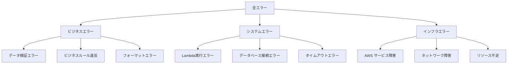
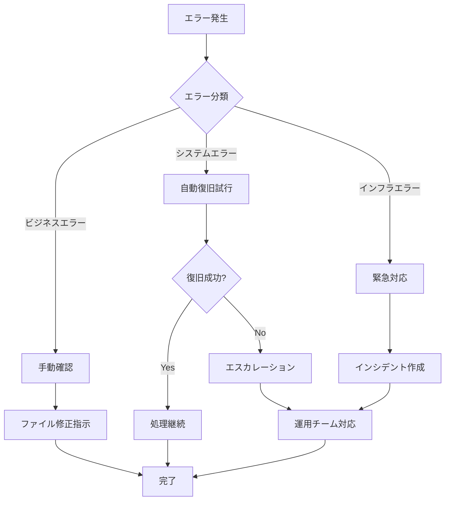

# Step Functionsエラー処理フロー詳細設計書

## 1. 概要

### 1.1 目的
本ドキュメントでは、CSVファイル並列処理システムにおけるStep Functionsのエラー処理フローの詳細実装仕様を定義する。包括的なエラー分類、適切な復旧戦略、および運用効率を向上させる自動化機能を記載する。

### 1.2 エラー処理の基本方針
- **階層的エラー処理**: ビジネスエラー、システムエラー、インフラエラーの分離
- **自動復旧**: 一時的エラーの自動再試行と復旧
- **早期失敗**: 致命的エラーの迅速な検出と停止
- **包括的監査**: 全エラーの記録と分析

## 2. エラー分類体系

### 2.1 エラーカテゴリ定義



### 2.2 エラーコード定義

```python
ERROR_CODES = {
    # ビジネスエラー (1000-1999)
    "CSV_VALIDATION_FAILED": {
        "code": 1001,
        "description": "CSVファイル形式検証失敗",
        "severity": "ERROR",
        "retry": False,
        "notification": True
    },
    "INVALID_USER_DATA": {
        "code": 1002,
        "description": "ユーザーデータ形式不正",
        "severity": "WARNING",
        "retry": False,
        "notification": False
    },
    "BUSINESS_RULE_VIOLATION": {
        "code": 1003,
        "description": "ビジネスルール違反",
        "severity": "ERROR",
        "retry": False,
        "notification": True
    },
    
    # システムエラー (2000-2999)
    "DATABASE_CONNECTION_ERROR": {
        "code": 2001,
        "description": "データベース接続エラー",
        "severity": "ERROR",
        "retry": True,
        "notification": True
    },
    "LAMBDA_TIMEOUT": {
        "code": 2002,
        "description": "Lambda関数タイムアウト",
        "severity": "ERROR",
        "retry": True,
        "notification": True
    },
    "CONCURRENT_MODIFICATION": {
        "code": 2003,
        "description": "同時更新競合",
        "severity": "WARNING",
        "retry": True,
        "notification": False
    },
    
    # インフラエラー (3000-3999)
    "AWS_SERVICE_UNAVAILABLE": {
        "code": 3001,
        "description": "AWSサービス利用不可",
        "severity": "CRITICAL",
        "retry": True,
        "notification": True
    },
    "THROTTLING_EXCEPTION": {
        "code": 3002,
        "description": "スロットリング発生",
        "severity": "WARNING",
        "retry": True,
        "notification": False
    },
    "RESOURCE_EXHAUSTED": {
        "code": 3003,
        "description": "リソース不足",
        "severity": "ERROR",
        "retry": False,
        "notification": True
    }
}
```

### 2.3 エラー分類Lambda実装

```python
import json
import re
from datetime import datetime
from enum import Enum

class ErrorCategory(Enum):
    BUSINESS = "BUSINESS"
    SYSTEM = "SYSTEM"
    INFRASTRUCTURE = "INFRASTRUCTURE"

class ErrorSeverity(Enum):
    INFO = "INFO"
    WARNING = "WARNING"
    ERROR = "ERROR"
    CRITICAL = "CRITICAL"

def classify_error(error_info):
    """
    エラー情報を分析してカテゴリと対応方針を決定
    """
    error_type = error_info.get('Error', '')
    error_cause = error_info.get('Cause', '')
    
    # エラーパターンマッチング
    classification = {
        'category': None,
        'code': None,
        'severity': None,
        'retry_recommended': False,
        'escalation_required': False,
        'notification_level': 'INFO'
    }
    
    # ビジネスエラーの判定
    business_patterns = [
        r'ValidationError',
        r'InvalidCSVFormatError',
        r'BusinessLogicError',
        r'DataValidationError'
    ]
    
    for pattern in business_patterns:
        if re.search(pattern, error_type):
            classification.update({
                'category': ErrorCategory.BUSINESS.value,
                'severity': ErrorSeverity.ERROR.value,
                'retry_recommended': False,
                'notification_level': 'WARNING'
            })
            break
    
    # システムエラーの判定
    system_patterns = [
        r'DatabaseConnectionError',
        r'Lambda\..*Exception',
        r'TimeoutError',
        r'ConcurrentModificationException'
    ]
    
    for pattern in system_patterns:
        if re.search(pattern, error_type):
            classification.update({
                'category': ErrorCategory.SYSTEM.value,
                'severity': ErrorSeverity.ERROR.value,
                'retry_recommended': True,
                'notification_level': 'ERROR'
            })
            break
    
    # インフラエラーの判定
    infrastructure_patterns = [
        r'ServiceException',
        r'ThrottledException',
        r'InternalServerError'
    ]
    
    for pattern in infrastructure_patterns:
        if re.search(pattern, error_type):
            classification.update({
                'category': ErrorCategory.INFRASTRUCTURE.value,
                'severity': ErrorSeverity.CRITICAL.value,
                'retry_recommended': True,
                'escalation_required': True,
                'notification_level': 'CRITICAL'
            })
            break
    
    # デフォルト分類
    if not classification['category']:
        classification.update({
            'category': ErrorCategory.SYSTEM.value,
            'severity': ErrorSeverity.ERROR.value,
            'notification_level': 'ERROR'
        })
    
    return classification
```

## 3. ステート別エラーハンドリング

### 3.1 ValidateCSVFileステートエラー処理

```json
{
  "ValidateCSVFile": {
    "Type": "Task",
    "Resource": "arn:aws:lambda:ap-northeast-1:${AWS::AccountId}:function:csv-processor",
    "TimeoutSeconds": 300,
    "HeartbeatSeconds": 30,
    "Retry": [
      {
        "ErrorEquals": ["Lambda.ServiceException", "Lambda.AWSLambdaException"],
        "IntervalSeconds": 2,
        "MaxAttempts": 3,
        "BackoffRate": 2.0,
        "MaxDelaySeconds": 60,
        "JitterStrategy": "FULL"
      },
      {
        "ErrorEquals": ["Lambda.TooManyRequestsException"],
        "IntervalSeconds": 5,
        "MaxAttempts": 5,
        "BackoffRate": 2.5,
        "MaxDelaySeconds": 120
      },
      {
        "ErrorEquals": ["States.TaskFailed"],
        "IntervalSeconds": 1,
        "MaxAttempts": 2,
        "BackoffRate": 1.5
      }
    ],
    "Catch": [
      {
        "ErrorEquals": ["ValidationError", "InvalidCSVFormatError", "FileTooLargeError"],
        "Next": "HandleValidationFailure",
        "ResultPath": "$.error",
        "Comment": "CSVファイル検証エラー"
      },
      {
        "ErrorEquals": ["S3AccessDeniedError", "S3ObjectNotFoundError"],
        "Next": "HandleS3AccessError",
        "ResultPath": "$.error",
        "Comment": "S3アクセスエラー"
      },
      {
        "ErrorEquals": ["States.ALL"],
        "Next": "HandleSystemFailure",
        "ResultPath": "$.error",
        "Comment": "システム障害"
      }
    ],
    "Next": "CheckValidationResult"
  }
}
```

### 3.2 分散マップエラー処理

```json
{
  "ProcessUserDataParallel": {
    "Type": "Map",
    "ItemProcessor": {
      "ProcessorConfig": {
        "Mode": "DISTRIBUTED",
        "ExecutionType": "STANDARD"
      },
      "StartAt": "ProcessSingleUserRecord",
      "States": {
        "ProcessSingleUserRecord": {
          "Type": "Task",
          "Resource": "arn:aws:lambda:ap-northeast-1:${AWS::AccountId}:function:csv-processor",
          "Retry": [
            {
              "ErrorEquals": ["DatabaseConnectionError", "AuroraTemporaryError"],
              "IntervalSeconds": 2,
              "MaxAttempts": 3,
              "BackoffRate": 2.0,
              "MaxDelaySeconds": 30,
              "JitterStrategy": "FULL"
            },
            {
              "ErrorEquals": ["ConcurrentModificationException"],
              "IntervalSeconds": 1,
              "MaxAttempts": 5,
              "BackoffRate": 1.5,
              "MaxDelaySeconds": 15,
              "JitterStrategy": "FULL"
            }
          ],
          "Catch": [
            {
              "ErrorEquals": ["BusinessLogicError", "DataValidationError"],
              "Next": "RecordBusinessError",
              "ResultPath": "$.error",
              "Comment": "ビジネスエラーの記録"
            },
            {
              "ErrorEquals": ["States.ALL"],
              "Next": "RecordSystemError",
              "ResultPath": "$.error",
              "Comment": "システムエラーの記録"
            }
          ],
          "Next": "RecordSuccess"
        }
      }
    },
    "MaxConcurrency": 5,
    "ToleratedFailurePercentage": 5,
    "ToleratedFailureCount": 50,
    "Catch": [
      {
        "ErrorEquals": ["States.MapRunFailed"],
        "Next": "HandleMapFailure",
        "ResultPath": "$.error",
        "Comment": "分散マップ実行失敗"
      }
    ],
    "Next": "AggregateResults"
  }
}
```

## 4. エラーハンドラーステート実装

### 4.1 ValidationFailureハンドラー

```json
{
  "HandleValidationFailure": {
    "Type": "Task",
    "Comment": "CSV検証失敗時の包括的エラー処理",
    "Resource": "arn:aws:lambda:ap-northeast-1:${AWS::AccountId}:function:validation-csv-processor",
    "Parameters": {
      "errorContext": {
        "errorType": "VALIDATION_FAILURE",
        "originalError.$": "$.error",
        "executionId.$": "$.execution.id",
        "stateEnteredTime.$": "$$.State.EnteredTime",
        "inputFile": {
          "bucket.$": "$.s3.bucket",
          "key.$": "$.s3.key",
          "size.$": "$.s3.size"
        }
      },
      "processingConfig": {
        "createErrorReport": true,
        "generateRetryFile": false,
        "sendNotification": true,
        "escalateToOperations": false
      }
    },
    "ResultPath": "$.errorHandling",
    "TimeoutSeconds": 60,
    "Retry": [
      {
        "ErrorEquals": ["Lambda.ServiceException"],
        "IntervalSeconds": 2,
        "MaxAttempts": 2,
        "BackoffRate": 2.0
      }
    ],
    "Next": "NotifyValidationFailure"
  }
}
```

### 4.2 SystemFailureハンドラー

```json
{
  "HandleSystemFailure": {
    "Type": "Task",
    "Comment": "システム障害時の緊急対応処理",
    "Resource": "arn:aws:lambda:ap-northeast-1:${AWS::AccountId}:function:system-csv-processor",
    "Parameters": {
      "errorContext": {
        "errorType": "SYSTEM_FAILURE",
        "originalError.$": "$.error",
        "executionId.$": "$.execution.id",
        "executionArn.$": "$$.Execution.Id",
        "stateMachine.$": "$$.StateMachine.Id",
        "lastState.$": "$$.State.Name",
        "stateEnteredTime.$": "$$.State.EnteredTime"
      },
      "escalationConfig": {
        "createIncident": true,
        "severity": "HIGH",
        "assignToOnCall": true,
        "runbookUrl": "https://wiki.internal/csv-processing-runbook",
        "slackChannel": "#ops-alerts"
      },
      "diagnosticsConfig": {
        "captureExecutionHistory": true,
        "captureLambdaLogs": true,
        "captureCloudWatchMetrics": true,
        "timeRangeMinutes": 15
      }
    },
    "ResultPath": "$.errorHandling",
    "TimeoutSeconds": 180,
    "Next": "CreateIncident"
  }
}
```

### 4.3 MapFailureハンドラー

```json
{
  "HandleMapFailure": {
    "Type": "Task",
    "Comment": "分散マップ失敗時の集約処理",
    "Resource": "arn:aws:lambda:ap-northeast-1:${AWS::AccountId}:function:map-failure-handler",
    "Parameters": {
      "errorContext": {
        "errorType": "MAP_PROCESSING_FAILURE",
        "originalError.$": "$.error",
        "executionId.$": "$.execution.id",
        "mapStatistics": {
          "totalItems.$": "$.mapResults.statistics.totalItems",
          "processedItems.$": "$.mapResults.statistics.processedItems",
          "failedItems.$": "$.mapResults.statistics.failedItems",
          "successRate.$": "States.MathDiv($.mapResults.statistics.processedItems, $.mapResults.statistics.totalItems)"
        }
      },
      "recoveryConfig": {
        "analyzeFailurePattern": true,
        "createRetryFile": true,
        "retryOnlyFailed": true,
        "adjustConcurrency": true,
        "notifyOperations": true
      }
    },
    "ResultPath": "$.errorHandling",
    "TimeoutSeconds": 120,
    "Next": "AnalyzeFailurePattern"
  }
}
```

## 5. エラーハンドラーLambda実装

### 5.1 検証エラーハンドラー

```python
import json
import boto3
from datetime import datetime
from error_utils import classify_error, send_notification

s3 = boto3.client('s3')
dynamodb = boto3.resource('dynamodb')
sns = boto3.client('sns')

def lambda_handler(event, context):
    """
    CSV検証失敗時のエラー処理
    """
    error_context = event['errorContext']
    processing_config = event['processingConfig']
    
    # エラー分類
    error_classification = classify_error(error_context['originalError'])
    
    # エラーレポート生成
    error_report = generate_error_report(error_context, error_classification)
    
    # DynamoDBにエラー記録
    audit_table = dynamodb.Table('csv_processing_audit')
    audit_table.put_item(
        Item={
            'execution_id': error_context['executionId'],
            'timestamp': datetime.utcnow().isoformat(),
            'error_type': 'VALIDATION_FAILURE',
            'error_code': error_classification['code'],
            'severity': error_classification['severity'],
            'input_file': error_context['inputFile'],
            'error_details': error_context['originalError'],
            'error_report': error_report,
            'ttl': int((datetime.utcnow().timestamp() + 86400 * 30))  # 30日保持
        }
    )
    
    # S3にエラーレポート保存
    if processing_config.get('createErrorReport', False):
        save_error_report_to_s3(error_context['executionId'], error_report)
    
    # 通知送信
    if processing_config.get('sendNotification', False):
        send_validation_failure_notification(error_context, error_classification)
    
    # メトリクス送信
    send_error_metrics(error_context, error_classification)
    
    return {
        'errorHandled': True,
        'classification': error_classification,
        'report': error_report,
        'actions': {
            'reportSaved': processing_config.get('createErrorReport', False),
            'notificationSent': processing_config.get('sendNotification', False)
        }
    }

def generate_error_report(error_context, classification):
    """
    詳細なエラーレポート生成
    """
    return {
        'summary': {
            'executionId': error_context['executionId'],
            'errorType': classification['category'],
            'severity': classification['severity'],
            'timestamp': error_context['stateEnteredTime']
        },
        'inputFile': {
            'location': f"s3://{error_context['inputFile']['bucket']}/{error_context['inputFile']['key']}",
            'size': error_context['inputFile']['size'],
            'sizeFormatted': format_file_size(error_context['inputFile']['size'])
        },
        'errorDetails': error_context['originalError'],
        'recommendations': generate_recommendations(classification),
        'nextSteps': [
            "ファイル形式を確認してください",
            "必要に応じてファイルを修正して再アップロードしてください",
            "問題が継続する場合は運用チームに連絡してください"
        ]
    }

def generate_recommendations(classification):
    """
    エラー分類に基づく推奨対応策生成
    """
    recommendations = {
        'BUSINESS': [
            "入力データの形式を確認してください",
            "必須フィールドが含まれているか確認してください",
            "文字エンコーディングがUTF-8であることを確認してください"
        ],
        'SYSTEM': [
            "一時的な問題の可能性があるため、しばらく待ってから再試行してください",
            "システム負荷が高い可能性があります",
            "運用チームに状況を確認してください"
        ],
        'INFRASTRUCTURE': [
            "AWSサービスの状態を確認してください",
            "ネットワーク接続を確認してください",
            "緊急度が高い場合は運用チームに連絡してください"
        ]
    }
    
    return recommendations.get(classification['category'], [])
```

### 5.2 システム障害ハンドラー

```python
import json
import boto3
from datetime import datetime, timedelta
import requests

cloudformation = boto3.client('cloudformation')
logs = boto3.client('logs')
stepfunctions = boto3.client('stepfunctions')
servicenow = ServiceNowClient()  # カスタムクライアント

def lambda_handler(event, context):
    """
    システム障害時の包括的対応処理
    """
    error_context = event['errorContext']
    escalation_config = event['escalationConfig']
    diagnostics_config = event['diagnosticsConfig']
    
    # 診断情報収集
    diagnostics = collect_diagnostics(error_context, diagnostics_config)
    
    # インシデント作成
    incident = None
    if escalation_config.get('createIncident', False):
        incident = create_incident(error_context, escalation_config, diagnostics)
    
    # Slack通知
    if escalation_config.get('slackChannel'):
        send_slack_notification(error_context, escalation_config, incident)
    
    # ページャー通知（重要度HIGH以上）
    if escalation_config.get('severity') in ['HIGH', 'CRITICAL']:
        send_pager_notification(error_context, incident)
    
    # 自動復旧試行
    recovery_actions = attempt_auto_recovery(error_context)
    
    return {
        'incidentCreated': incident is not None,
        'incidentId': incident['id'] if incident else None,
        'diagnostics': diagnostics,
        'recoveryActions': recovery_actions,
        'escalationLevel': escalation_config.get('severity', 'MEDIUM')
    }

def collect_diagnostics(error_context, config):
    """
    システム診断情報の収集
    """
    diagnostics = {
        'timestamp': datetime.utcnow().isoformat(),
        'executionId': error_context['executionId']
    }
    
    # 実行履歴取得
    if config.get('captureExecutionHistory', False):
        try:
            history = stepfunctions.describe_execution(
                executionArn=error_context['executionArn']
            )
            diagnostics['executionHistory'] = history
        except Exception as e:
            diagnostics['executionHistoryError'] = str(e)
    
    # Lambda関数ログ取得
    if config.get('captureLambdaLogs', False):
        diagnostics['lambdaLogs'] = get_lambda_logs(
            error_context['executionId'],
            config.get('timeRangeMinutes', 15)
        )
    
    # CloudWatchメトリクス取得
    if config.get('captureCloudWatchMetrics', False):
        diagnostics['metrics'] = get_cloudwatch_metrics(
            error_context['stateMachine'],
            config.get('timeRangeMinutes', 15)
        )
    
    # AWSサービス健全性チェック
    diagnostics['serviceHealth'] = check_aws_service_health()
    
    return diagnostics

def create_incident(error_context, escalation_config, diagnostics):
    """
    ServiceNowインシデント作成
    """
    incident_data = {
        'short_description': f"CSV Processing System Failure - {error_context['executionId']}",
        'description': format_incident_description(error_context, diagnostics),
        'urgency': map_severity_to_urgency(escalation_config['severity']),
        'impact': 'Medium',
        'category': 'Software',
        'subcategory': 'AWS Step Functions',
        'assignment_group': 'Cloud Operations',
        'caller_id': 'automated_system'
    }
    
    try:
        response = servicenow.create_incident(incident_data)
        return {
            'id': response['sys_id'],
            'number': response['number'],
            'status': 'created'
        }
    except Exception as e:
        # フォールバック: メール通知
        send_fallback_notification(error_context, str(e))
        return None
```

### 5.3 分散マップ障害ハンドラー

```python
import json
import boto3
from datetime import datetime
import math

s3 = boto3.client('s3')
stepfunctions = boto3.client('stepfunctions')

def lambda_handler(event, context):
    """
    分散マップ処理失敗時の分析と復旧処理
    """
    error_context = event['errorContext']
    recovery_config = event['recoveryConfig']
    
    # 失敗パターン分析
    failure_analysis = analyze_failure_pattern(error_context)
    
    # 失敗したアイテムの特定
    failed_items = identify_failed_items(error_context)
    
    # 再処理用ファイル生成
    retry_file_location = None
    if recovery_config.get('createRetryFile', False):
        retry_file_location = create_retry_file(failed_items, error_context['executionId'])
    
    # 並列度調整推奨値算出
    concurrency_recommendation = calculate_optimal_concurrency(failure_analysis)
    
    # 復旧戦略生成
    recovery_strategy = generate_recovery_strategy(failure_analysis, concurrency_recommendation)
    
    # 運用通知
    if recovery_config.get('notifyOperations', False):
        send_operations_notification(error_context, failure_analysis, recovery_strategy)
    
    return {
        'failureAnalysis': failure_analysis,
        'failedItemCount': len(failed_items),
        'retryFileLocation': retry_file_location,
        'concurrencyRecommendation': concurrency_recommendation,
        'recoveryStrategy': recovery_strategy
    }

def analyze_failure_pattern(error_context):
    """
    失敗パターンの詳細分析
    """
    map_stats = error_context['mapStatistics']
    
    # 失敗率計算
    total_items = map_stats['totalItems']
    failed_items = map_stats['failedItems']
    failure_rate = (failed_items / total_items) * 100 if total_items > 0 else 0
    
    # エラーパターン分類
    error_patterns = {
        'timeout_failures': 0,
        'database_failures': 0,
        'business_logic_failures': 0,
        'infrastructure_failures': 0
    }
    
    # 詳細なエラー分析（実装依存）
    # ここでは簡略化
    
    analysis = {
        'failureRate': failure_rate,
        'totalItems': total_items,
        'failedItems': failed_items,
        'successItems': total_items - failed_items,
        'errorPatterns': error_patterns,
        'assessment': classify_failure_severity(failure_rate),
        'rootCause': identify_root_cause(error_patterns)
    }
    
    return analysis

def classify_failure_severity(failure_rate):
    """
    失敗率に基づく深刻度分類
    """
    if failure_rate <= 1:
        return "MINOR"
    elif failure_rate <= 5:
        return "MODERATE"
    elif failure_rate <= 15:
        return "MAJOR"
    else:
        return "CRITICAL"

def create_retry_file(failed_items, execution_id):
    """
    失敗したアイテムのみの再処理用ファイル生成
    """
    retry_data = {
        'metadata': {
            'originalExecutionId': execution_id,
            'retryCreatedAt': datetime.utcnow().isoformat(),
            'failedItemCount': len(failed_items)
        },
        'items': failed_items
    }
    
    # S3に再処理用ファイル保存
    retry_key = f"retry-files/{execution_id}/failed-items.json"
    s3.put_object(
        Bucket='csv-processing-retry-bucket',
        Key=retry_key,
        Body=json.dumps(retry_data, ensure_ascii=False),
        ContentType='application/json'
    )
    
    return f"s3://csv-processing-retry-bucket/{retry_key}"
```

## 6. 通知システム実装

### 6.1 階層化通知システム

```python
import boto3
import json
from enum import Enum

class NotificationLevel(Enum):
    INFO = "info"
    WARNING = "warning"
    ERROR = "error"
    CRITICAL = "critical"

class NotificationChannel(Enum):
    EMAIL = "email"
    SLACK = "slack"
    PAGER = "pager"
    DASHBOARD = "dashboard"

def send_notification(error_context, classification, channels=None):
    """
    エラー分類に基づく適切な通知送信
    """
    severity = classification['severity']
    notification_config = get_notification_config(severity)
    
    if channels is None:
        channels = notification_config['channels']
    
    notifications_sent = []
    
    for channel in channels:
        try:
            if channel == NotificationChannel.EMAIL.value:
                result = send_email_notification(error_context, classification)
            elif channel == NotificationChannel.SLACK.value:
                result = send_slack_notification(error_context, classification)
            elif channel == NotificationChannel.PAGER.value:
                result = send_pager_notification(error_context, classification)
            elif channel == NotificationChannel.DASHBOARD.value:
                result = update_dashboard(error_context, classification)
            
            notifications_sent.append({
                'channel': channel,
                'status': 'success',
                'messageId': result.get('messageId')
            })
            
        except Exception as e:
            notifications_sent.append({
                'channel': channel,
                'status': 'failed',
                'error': str(e)
            })
    
    return notifications_sent

def get_notification_config(severity):
    """
    深刻度に基づく通知設定取得
    """
    configs = {
        'INFO': {
            'channels': ['dashboard'],
            'delay_minutes': 0,
            'escalation_minutes': None
        },
        'WARNING': {
            'channels': ['email', 'dashboard'],
            'delay_minutes': 5,
            'escalation_minutes': 30
        },
        'ERROR': {
            'channels': ['email', 'slack', 'dashboard'],
            'delay_minutes': 1,
            'escalation_minutes': 15
        },
        'CRITICAL': {
            'channels': ['email', 'slack', 'pager', 'dashboard'],
            'delay_minutes': 0,
            'escalation_minutes': 5
        }
    }
    
    return configs.get(severity, configs['ERROR'])
```

### 6.2 Slack通知実装

```python
import requests
import json

def send_slack_notification(error_context, classification):
    """
    Slack通知の送信
    """
    webhook_url = get_slack_webhook_url(classification['severity'])
    
    # 色分け
    color_map = {
        'INFO': '#36a64f',      # 緑
        'WARNING': '#ffaa00',   # オレンジ
        'ERROR': '#ff0000',     # 赤
        'CRITICAL': '#8B0000'   # 暗赤
    }
    
    # Slack メッセージ構築
    message = {
        "channel": "#csv-processing-alerts",
        "username": "CSV Processing Bot",
        "icon_emoji": ":warning:",
        "attachments": [
            {
                "color": color_map.get(classification['severity'], '#ff0000'),
                "title": f"CSV Processing {classification['category']} - {classification['severity']}",
                "fields": [
                    {
                        "title": "Execution ID",
                        "value": error_context['executionId'],
                        "short": True
                    },
                    {
                        "title": "Error Type",
                        "value": error_context['errorType'],
                        "short": True
                    },
                    {
                        "title": "Timestamp",
                        "value": error_context.get('stateEnteredTime', 'Unknown'),
                        "short": True
                    },
                    {
                        "title": "Input File",
                        "value": f"s3://{error_context.get('inputFile', {}).get('bucket', 'unknown')}/{error_context.get('inputFile', {}).get('key', 'unknown')}",
                        "short": False
                    }
                ],
                "actions": [
                    {
                        "type": "button",
                        "text": "View Execution",
                        "url": f"https://console.aws.amazon.com/states/home?region=ap-northeast-1#/executions/details/{error_context['executionId']}"
                    }
                ]
            }
        ]
    }
    
    response = requests.post(webhook_url, json=message)
    response.raise_for_status()
    
    return {'messageId': response.headers.get('X-Message-Id')}
```

## 7. 自動復旧機能

### 7.1 復旧戦略判定

```python
def determine_recovery_strategy(error_context, classification):
    """
    エラー分類に基づく自動復旧戦略の決定
    """
    category = classification['category']
    severity = classification['severity']
    
    strategies = {
        'BUSINESS': {
            'AUTO_RETRY': False,
            'MANUAL_INTERVENTION': True,
            'NOTIFICATION_REQUIRED': True,
            'ESCALATION_LEVEL': 'LOW'
        },
        'SYSTEM': {
            'AUTO_RETRY': True,
            'MAX_RETRY_ATTEMPTS': 3,
            'RETRY_DELAY_MINUTES': [5, 15, 30],
            'MANUAL_INTERVENTION': True,
            'NOTIFICATION_REQUIRED': True,
            'ESCALATION_LEVEL': 'MEDIUM'
        },
        'INFRASTRUCTURE': {
            'AUTO_RETRY': True,
            'MAX_RETRY_ATTEMPTS': 5,
            'RETRY_DELAY_MINUTES': [2, 5, 10, 20, 30],
            'MANUAL_INTERVENTION': False,
            'NOTIFICATION_REQUIRED': True,
            'ESCALATION_LEVEL': 'HIGH'
        }
    }
    
    return strategies.get(category, strategies['SYSTEM'])

def execute_auto_recovery(error_context, strategy):
    """
    自動復旧処理の実行
    """
    if not strategy.get('AUTO_RETRY', False):
        return {'attempted': False, 'reason': 'Auto retry not enabled for this error type'}
    
    execution_id = error_context['executionId']
    retry_attempts = get_retry_attempts(execution_id)
    max_attempts = strategy.get('MAX_RETRY_ATTEMPTS', 3)
    
    if retry_attempts >= max_attempts:
        return {
            'attempted': False,
            'reason': f'Maximum retry attempts ({max_attempts}) exceeded',
            'currentAttempts': retry_attempts
        }
    
    # 復旧遅延
    delay_minutes = strategy.get('RETRY_DELAY_MINUTES', [5, 15, 30])
    delay = delay_minutes[min(retry_attempts, len(delay_minutes) - 1)]
    
    # CloudWatch Eventsでスケジューリング
    schedule_retry_execution(error_context, delay)
    
    # 試行回数記録
    record_retry_attempt(execution_id, retry_attempts + 1)
    
    return {
        'attempted': True,
        'delayMinutes': delay,
        'attemptNumber': retry_attempts + 1,
        'maxAttempts': max_attempts
    }
```

### 7.2 自動復旧Lambda

```python
import boto3
from datetime import datetime, timedelta

events = boto3.client('events')
stepfunctions = boto3.client('stepfunctions')
dynamodb = boto3.resource('dynamodb')

def schedule_retry_execution(error_context, delay_minutes):
    """
    指定時間後の自動再実行をスケジューリング
    """
    # 実行時刻計算
    execution_time = datetime.utcnow() + timedelta(minutes=delay_minutes)
    
    # CloudWatch Events ルール作成
    rule_name = f"csv-retry-{error_context['executionId']}-{int(datetime.utcnow().timestamp())}"
    
    events.put_rule(
        Name=rule_name,
        ScheduleExpression=f"at({execution_time.strftime('%Y-%m-%dT%H:%M:%S')})",
        Description=f"Auto retry for failed CSV processing execution {error_context['executionId']}",
        State='ENABLED'
    )
    
    # Step Functions実行をターゲットに設定
    events.put_targets(
        Rule=rule_name,
        Targets=[
            {
                'Id': '1',
                'Arn': error_context['stateMachine'],
                'RoleArn': 'arn:aws:iam::ACCOUNT:role/CloudWatchEventsStepFunctionsRole',
                'StepFunctionsParameters': {
                    'StateMachineArn': error_context['stateMachine'],
                    'Input': json.dumps({
                        'isRetry': True,
                        'originalExecutionId': error_context['executionId'],
                        'retryAttempt': get_retry_attempts(error_context['executionId']) + 1,
                        'originalInput': error_context.get('originalInput', {})
                    })
                }
            }
        ]
    )
    
    return {
        'ruleName': rule_name,
        'scheduledTime': execution_time.isoformat()
    }

def cleanup_completed_retry_rules():
    """
    完了した再試行ルールのクリーンアップ
    """
    # 古い再試行ルールを削除
    response = events.list_rules(NamePrefix='csv-retry-')
    
    for rule in response['Rules']:
        # ルールの状態確認と削除
        if is_rule_completed(rule['Name']):
            events.remove_targets(Rule=rule['Name'], Ids=['1'])
            events.delete_rule(Name=rule['Name'])
```

## 8. 監査ログとトレーサビリティ

### 8.1 包括的監査ログ

```python
def record_comprehensive_audit_log(error_context, classification, actions_taken):
    """
    包括的な監査ログの記録
    """
    audit_table = dynamodb.Table('csv_processing_error_audit')
    
    audit_record = {
        'pk': f"EXECUTION#{error_context['executionId']}",
        'sk': f"ERROR#{datetime.utcnow().isoformat()}",
        'gsi1pk': f"ERROR_TYPE#{classification['category']}",
        'gsi1sk': error_context.get('stateEnteredTime'),
        'execution_id': error_context['executionId'],
        'error_category': classification['category'],
        'error_severity': classification['severity'],
        'error_code': classification.get('code'),
        'state_name': error_context.get('lastState'),
        'input_file': error_context.get('inputFile'),
        'error_details': error_context['originalError'],
        'actions_taken': actions_taken,
        'notification_sent': actions_taken.get('notificationSent', False),
        'auto_recovery_attempted': actions_taken.get('autoRecoveryAttempted', False),
        'incident_created': actions_taken.get('incidentCreated', False),
        'created_at': datetime.utcnow().isoformat(),
        'ttl': int((datetime.utcnow() + timedelta(days=90)).timestamp())
    }
    
    audit_table.put_item(Item=audit_record)
    
    return audit_record
```

### 8.2 エラートレンド分析

```python
def analyze_error_trends(days=7):
    """
    過去のエラートレンド分析
    """
    audit_table = dynamodb.Table('csv_processing_error_audit')
    
    # 過去7日間のエラーを取得
    end_date = datetime.utcnow()
    start_date = end_date - timedelta(days=days)
    
    response = audit_table.query(
        IndexName='ErrorTypeIndex',
        KeyConditionExpression='gsi1pk = :pk AND gsi1sk BETWEEN :start AND :end',
        ExpressionAttributeValues={
            ':pk': 'ERROR_TYPE',
            ':start': start_date.isoformat(),
            ':end': end_date.isoformat()
        }
    )
    
    # トレンド分析
    trends = analyze_error_patterns(response['Items'])
    
    return trends
```

## 9. テスト仕様

### 9.1 エラーシナリオテスト

```python
import pytest
from moto import mock_stepfunctions, mock_lambda

class TestErrorHandling:
    """
    エラー処理機能のテスト
    """
    
    def test_validation_error_handling(self):
        """検証エラー処理テスト"""
        error_input = {
            'errorContext': {
                'errorType': 'VALIDATION_FAILURE',
                'originalError': {
                    'Error': 'ValidationError',
                    'Cause': 'Invalid CSV format'
                },
                'executionId': 'test-execution-001'
            }
        }
        
        result = validation_error_handler(error_input, None)
        
        assert result['errorHandled'] == True
        assert result['classification']['category'] == 'BUSINESS'
    
    def test_system_error_recovery(self):
        """システムエラー自動復旧テスト"""
        error_input = {
            'errorContext': {
                'errorType': 'SYSTEM_FAILURE',
                'executionId': 'test-execution-002'
            }
        }
        
        strategy = determine_recovery_strategy(error_input['errorContext'], {'category': 'SYSTEM'})
        recovery_result = execute_auto_recovery(error_input['errorContext'], strategy)
        
        assert recovery_result['attempted'] == True
    
    def test_notification_routing(self):
        """通知ルーティングテスト"""
        classification = {
            'category': 'SYSTEM',
            'severity': 'ERROR'
        }
        
        config = get_notification_config(classification['severity'])
        
        assert 'email' in config['channels']
        assert 'slack' in config['channels']
```

## 10. 運用手順

### 10.1 エラー対応フローチャート



### 10.2 エスカレーション手順

1. **Level 1**: 自動復旧試行（5分以内）
2. **Level 2**: 運用チーム通知（15分以内）
3. **Level 3**: マネージャー通知（30分以内）
4. **Level 4**: 緊急対応チーム招集（1時間以内）

このエラー処理フロー詳細設計により、CSVファイル並列処理システムの堅牢性と運用効率が大幅に向上します。