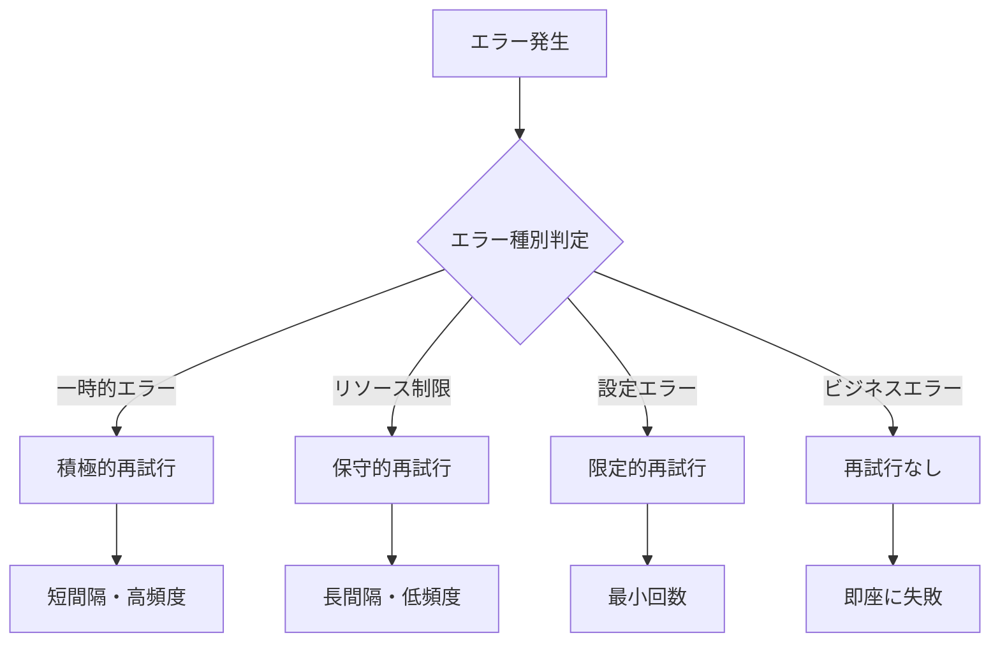

# Step Functions再試行設定詳細設計書

## 1. 概要

### 1.1 目的
本ドキュメントでは、CSVファイル並列処理システムにおけるStep Functionsの再試行（Retry）メカニズムの詳細実装仕様を定義する。一時的なエラーからの自動復旧、システム resilience の向上、および運用コストの削減を実現する。

### 1.2 再試行戦略の基本方針
- **適応的再試行**: エラー種別に応じた最適な再試行パターン
- **指数バックオフ**: 負荷分散を考慮した遅延戦略
- **ジッター制御**: 同期的な再試行による負荷集中の回避
- **回路遮断**: 継続的な失敗の早期検出と停止

## 2. 再試行分類体系

### 2.1 エラー種別別再試行戦略



### 2.2 再試行パターン定義

```python
RETRY_PATTERNS = {
    "aggressive": {
        "description": "一時的エラー用の積極的再試行",
        "max_attempts": 5,
        "initial_interval": 1,
        "backoff_rate": 2.0,
        "max_delay": 60,
        "jitter_strategy": "FULL"
    },
    "conservative": {
        "description": "リソース制限用の保守的再試行",
        "max_attempts": 3,
        "initial_interval": 5,
        "backoff_rate": 2.5,
        "max_delay": 300,
        "jitter_strategy": "PARTIAL"
    },
    "minimal": {
        "description": "設定エラー用の最小再試行",
        "max_attempts": 2,
        "initial_interval": 2,
        "backoff_rate": 1.5,
        "max_delay": 10,
        "jitter_strategy": "NONE"
    },
    "database_optimized": {
        "description": "データベース接続用最適化",
        "max_attempts": 4,
        "initial_interval": 2,
        "backoff_rate": 1.8,
        "max_delay": 30,
        "jitter_strategy": "FULL"
    }
}

ERROR_RETRY_MAPPING = {
    # AWS Lambda エラー
    "Lambda.ServiceException": "aggressive",
    "Lambda.AWSLambdaException": "aggressive",
    "Lambda.SdkClientException": "aggressive",
    "Lambda.TooManyRequestsException": "conservative",
    "Lambda.ThrottledException": "conservative",
    
    # データベースエラー
    "DatabaseConnectionError": "database_optimized",
    "AuroraTemporaryError": "database_optimized",
    "DeadlockException": "database_optimized",
    "ConcurrentModificationException": "aggressive",
    
    # ネットワークエラー
    "TimeoutError": "conservative",
    "ConnectionTimeoutError": "conservative",
    "SocketTimeoutError": "conservative",
    
    # States サービスエラー
    "States.TaskFailed": "minimal",
    "States.Timeout": "minimal",
    "States.ExecutionLimitExceeded": "minimal",
    
    # S3エラー
    "S3.SlowDown": "conservative",
    "S3.ServiceUnavailable": "aggressive",
    "S3.InternalError": "aggressive"
}
```

## 3. ステート別再試行設定

### 3.1 ValidateCSVFileステート再試行設定

```json
{
  "ValidateCSVFile": {
    "Type": "Task",
    "Resource": "arn:aws:lambda:ap-northeast-1:${AWS::AccountId}:function:csv-processor",
    "TimeoutSeconds": 300,
    "HeartbeatSeconds": 30,
    "Retry": [
      {
        "Comment": "AWS Lambda サービス例外の積極的再試行",
        "ErrorEquals": [
          "Lambda.ServiceException",
          "Lambda.AWSLambdaException",
          "Lambda.SdkClientException"
        ],
        "IntervalSeconds": 1,
        "MaxAttempts": 5,
        "BackoffRate": 2.0,
        "MaxDelaySeconds": 60,
        "JitterStrategy": "FULL"
      },
      {
        "Comment": "Lambda スロットリング用の保守的再試行",
        "ErrorEquals": [
          "Lambda.TooManyRequestsException",
          "Lambda.ThrottledException"
        ],
        "IntervalSeconds": 5,
        "MaxAttempts": 3,
        "BackoffRate": 2.5,
        "MaxDelaySeconds": 300,
        "JitterStrategy": "PARTIAL"
      },
      {
        "Comment": "S3関連エラーの適応的再試行",
        "ErrorEquals": [
          "S3.ServiceUnavailable",
          "S3.InternalError"
        ],
        "IntervalSeconds": 2,
        "MaxAttempts": 4,
        "BackoffRate": 2.0,
        "MaxDelaySeconds": 120,
        "JitterStrategy": "FULL"
      },
      {
        "Comment": "一般的タスク失敗の最小再試行",
        "ErrorEquals": [
          "States.TaskFailed"
        ],
        "IntervalSeconds": 2,
        "MaxAttempts": 2,
        "BackoffRate": 1.5,
        "MaxDelaySeconds": 10,
        "JitterStrategy": "NONE"
      }
    ]
  }
}
```

### 3.2 分散マップ内再試行設定

```json
{
  "ProcessSingleUserRecord": {
    "Type": "Task",
    "Resource": "arn:aws:lambda:ap-northeast-1:${AWS::AccountId}:function:csv-processor",
    "TimeoutSeconds": 30,
    "HeartbeatSeconds": 10,
    "Retry": [
      {
        "Comment": "データベース接続エラー最適化再試行",
        "ErrorEquals": [
          "DatabaseConnectionError",
          "AuroraTemporaryError",
          "DeadlockException"
        ],
        "IntervalSeconds": 2,
        "MaxAttempts": 4,
        "BackoffRate": 1.8,
        "MaxDelaySeconds": 30,
        "JitterStrategy": "FULL"
      },
      {
        "Comment": "同時更新競合の積極的再試行",
        "ErrorEquals": [
          "ConcurrentModificationException",
          "OptimisticLockException"
        ],
        "IntervalSeconds": 1,
        "MaxAttempts": 5,
        "BackoffRate": 2.0,
        "MaxDelaySeconds": 15,
        "JitterStrategy": "FULL"
      },
      {
        "Comment": "Lambda スロットリング制御",
        "ErrorEquals": [
          "Lambda.ThrottledException",
          "Lambda.TooManyRequestsException"
        ],
        "IntervalSeconds": 3,
        "MaxAttempts": 4,
        "BackoffRate": 2.5,
        "MaxDelaySeconds": 60,
        "JitterStrategy": "PARTIAL"
      },
      {
        "Comment": "ネットワーク関連エラー",
        "ErrorEquals": [
          "TimeoutError",
          "ConnectionTimeoutError",
          "SocketTimeoutError"
        ],
        "IntervalSeconds": 5,
        "MaxAttempts": 3,
        "BackoffRate": 2.5,
        "MaxDelaySeconds": 300,
        "JitterStrategy": "PARTIAL"
      }
    ]
  }
}
```

### 3.3 AggregateResultsステート再試行設定

```json
{
  "AggregateResults": {
    "Type": "Task",
    "Resource": "arn:aws:lambda:ap-northeast-1:${AWS::AccountId}:function:result-aggregator",
    "TimeoutSeconds": 120,
    "HeartbeatSeconds": 20,
    "Retry": [
      {
        "Comment": "集約処理の一時的エラー再試行",
        "ErrorEquals": [
          "Lambda.ServiceException",
          "Lambda.AWSLambdaException"
        ],
        "IntervalSeconds": 3,
        "MaxAttempts": 3,
        "BackoffRate": 2.0,
        "MaxDelaySeconds": 180,
        "JitterStrategy": "FULL"
      },
      {
        "Comment": "S3書き込みエラーの再試行",
        "ErrorEquals": [
          "S3.SlowDown",
          "S3.ServiceUnavailable"
        ],
        "IntervalSeconds": 5,
        "MaxAttempts": 3,
        "BackoffRate": 2.5,
        "MaxDelaySeconds": 300,
        "JitterStrategy": "PARTIAL"
      }
    ]
  }
}
```

## 4. 高度な再試行機能

### 4.1 適応的バックオフ実装

```python
import random
import math
from datetime import datetime, timedelta

class AdaptiveRetryManager:
    """
    適応的再試行管理クラス
    """
    
    def __init__(self):
        self.failure_history = {}
        self.success_history = {}
        
    def calculate_adaptive_delay(self, error_type, attempt_number, base_delay, backoff_rate):
        """
        失敗履歴を考慮した適応的遅延計算
        """
        # 基本指数バックオフ
        exponential_delay = base_delay * (backoff_rate ** (attempt_number - 1))
        
        # 最近の失敗率を考慮
        recent_failure_rate = self._get_recent_failure_rate(error_type)
        
        # 失敗率が高い場合は遅延を増加
        if recent_failure_rate > 0.5:
            exponential_delay *= (1 + recent_failure_rate)
        
        # システム負荷を考慮した調整
        load_factor = self._get_system_load_factor()
        adjusted_delay = exponential_delay * load_factor
        
        return min(adjusted_delay, 600)  # 最大10分
    
    def _get_recent_failure_rate(self, error_type, window_minutes=15):
        """
        過去15分間の失敗率取得
        """
        now = datetime.utcnow()
        window_start = now - timedelta(minutes=window_minutes)
        
        failures = self.failure_history.get(error_type, [])
        recent_failures = [f for f in failures if f > window_start]
        
        successes = self.success_history.get(error_type, [])
        recent_successes = [s for s in successes if s > window_start]
        
        total_attempts = len(recent_failures) + len(recent_successes)
        if total_attempts == 0:
            return 0.0
        
        return len(recent_failures) / total_attempts
    
    def _get_system_load_factor(self):
        """
        システム負荷係数の取得
        """
        # CloudWatchメトリクスからシステム負荷を取得
        # ここでは簡略化
        current_hour = datetime.utcnow().hour
        
        # ピーク時間帯の負荷調整
        if 9 <= current_hour <= 17:  # 営業時間
            return 1.5
        elif 0 <= current_hour <= 6:  # 深夜
            return 0.8
        else:
            return 1.0
```

### 4.2 ジッター戦略実装

```python
class JitterStrategy:
    """
    ジッター戦略の実装
    """
    
    @staticmethod
    def full_jitter(delay_seconds):
        """
        フルジッター: 0からdelay_secondsまでのランダム値
        """
        return random.uniform(0, delay_seconds)
    
    @staticmethod
    def equal_jitter(delay_seconds):
        """
        等分ジッター: delay_seconds/2 + ランダム(0, delay_seconds/2)
        """
        base = delay_seconds / 2
        return base + random.uniform(0, base)
    
    @staticmethod
    def decorrelated_jitter(delay_seconds, previous_delay=None):
        """
        非相関ジッター: 前回の遅延時間を考慮
        """
        if previous_delay is None:
            return delay_seconds
        
        # 前回の遅延時間の3倍以内でランダム選択
        max_delay = min(delay_seconds, previous_delay * 3)
        return random.uniform(delay_seconds, max_delay)
    
    @staticmethod
    def apply_jitter(delay_seconds, strategy="FULL", previous_delay=None):
        """
        指定された戦略でジッターを適用
        """
        if strategy == "FULL":
            return JitterStrategy.full_jitter(delay_seconds)
        elif strategy == "PARTIAL":
            return JitterStrategy.equal_jitter(delay_seconds)
        elif strategy == "DECORRELATED":
            return JitterStrategy.decorrelated_jitter(delay_seconds, previous_delay)
        else:
            return delay_seconds
```

### 4.3 回路遮断器パターン

```python
from enum import Enum
import time

class CircuitState(Enum):
    CLOSED = "closed"      # 正常状態
    OPEN = "open"          # 遮断状態
    HALF_OPEN = "half_open"  # 半開状態

class CircuitBreaker:
    """
    回路遮断器パターンの実装
    """
    
    def __init__(self, failure_threshold=5, recovery_timeout=60, success_threshold=3):
        self.failure_threshold = failure_threshold
        self.recovery_timeout = recovery_timeout
        self.success_threshold = success_threshold
        
        self.failure_count = 0
        self.success_count = 0
        self.last_failure_time = None
        self.state = CircuitState.CLOSED
    
    def call(self, func, *args, **kwargs):
        """
        回路遮断器を通した関数呼び出し
        """
        if self.state == CircuitState.OPEN:
            if self._should_attempt_reset():
                self.state = CircuitState.HALF_OPEN
            else:
                raise CircuitBreakerOpenException("Circuit breaker is OPEN")
        
        try:
            result = func(*args, **kwargs)
            self._on_success()
            return result
        except Exception as e:
            self._on_failure()
            raise e
    
    def _should_attempt_reset(self):
        """
        リセット試行の判定
        """
        return (self.last_failure_time and 
                time.time() - self.last_failure_time >= self.recovery_timeout)
    
    def _on_success(self):
        """
        成功時の処理
        """
        self.failure_count = 0
        
        if self.state == CircuitState.HALF_OPEN:
            self.success_count += 1
            if self.success_count >= self.success_threshold:
                self.state = CircuitState.CLOSED
                self.success_count = 0
    
    def _on_failure(self):
        """
        失敗時の処理
        """
        self.failure_count += 1
        self.last_failure_time = time.time()
        
        if self.failure_count >= self.failure_threshold:
            self.state = CircuitState.OPEN
            self.success_count = 0

class CircuitBreakerOpenException(Exception):
    """回路遮断器開放例外"""
    pass
```

## 5. 動的再試行設定

### 5.1 CloudWatch メトリクスベース調整

```python
import boto3
from datetime import datetime, timedelta

cloudwatch = boto3.client('cloudwatch')

def get_dynamic_retry_config(function_name, error_type):
    """
    CloudWatchメトリクスに基づく動的再試行設定
    """
    # 過去1時間のメトリクス取得
    end_time = datetime.utcnow()
    start_time = end_time - timedelta(hours=1)
    
    # エラー率取得
    error_rate = get_error_rate(function_name, start_time, end_time)
    
    # レスポンス時間取得
    avg_duration = get_average_duration(function_name, start_time, end_time)
    
    # 同時実行数取得
    concurrent_executions = get_concurrent_executions(function_name, start_time, end_time)
    
    # 基本設定
    base_config = RETRY_PATTERNS.get(ERROR_RETRY_MAPPING.get(error_type, "conservative"))
    
    # 動的調整
    adjusted_config = adjust_retry_config(base_config, error_rate, avg_duration, concurrent_executions)
    
    return adjusted_config

def adjust_retry_config(base_config, error_rate, avg_duration, concurrent_executions):
    """
    メトリクスに基づく再試行設定の調整
    """
    config = base_config.copy()
    
    # エラー率が高い場合は再試行回数を減らす
    if error_rate > 0.2:  # 20%以上
        config["max_attempts"] = max(1, config["max_attempts"] - 2)
        config["initial_interval"] *= 2
    elif error_rate > 0.1:  # 10%以上
        config["max_attempts"] = max(1, config["max_attempts"] - 1)
    
    # レスポンス時間が長い場合は間隔を調整
    if avg_duration > 10000:  # 10秒以上
        config["initial_interval"] *= 1.5
        config["max_delay"] *= 1.5
    
    # 同時実行数が高い場合は再試行を控えめに
    if concurrent_executions > 50:
        config["backoff_rate"] += 0.5
        config["jitter_strategy"] = "FULL"
    
    return config

def get_error_rate(function_name, start_time, end_time):
    """
    Lambda関数のエラー率取得
    """
    try:
        response = cloudwatch.get_metric_statistics(
            Namespace='AWS/Lambda',
            MetricName='Errors',
            Dimensions=[
                {'Name': 'FunctionName', 'Value': function_name}
            ],
            StartTime=start_time,
            EndTime=end_time,
            Period=3600,
            Statistics=['Sum']
        )
        
        errors = sum(point['Sum'] for point in response['Datapoints'])
        
        # 総実行数取得
        invocation_response = cloudwatch.get_metric_statistics(
            Namespace='AWS/Lambda',
            MetricName='Invocations',
            Dimensions=[
                {'Name': 'FunctionName', 'Value': function_name}
            ],
            StartTime=start_time,
            EndTime=end_time,
            Period=3600,
            Statistics=['Sum']
        )
        
        invocations = sum(point['Sum'] for point in invocation_response['Datapoints'])
        
        return errors / invocations if invocations > 0 else 0
        
    except Exception:
        return 0
```

### 5.2 リアルタイム設定更新

```python
def update_retry_config_realtime(execution_arn, new_config):
    """
    実行中のStep Functionsの再試行設定をリアルタイム更新
    （CloudWatch Events経由での間接的な実現）
    """
    # 実行コンテキスト取得
    execution_info = stepfunctions.describe_execution(executionArn=execution_arn)
    
    # 設定更新イベント送信
    events.put_events(
        Entries=[
            {
                'Source': 'csv.processing.retry.manager',
                'DetailType': 'Retry Configuration Update',
                'Detail': json.dumps({
                    'executionArn': execution_arn,
                    'newConfig': new_config,
                    'timestamp': datetime.utcnow().isoformat()
                })
            }
        ]
    )
    
    # DynamoDBに新設定保存
    config_table = dynamodb.Table('retry_configurations')
    config_table.put_item(
        Item={
            'execution_id': execution_arn.split(':')[-1],
            'config': new_config,
            'updated_at': datetime.utcnow().isoformat(),
            'ttl': int((datetime.utcnow() + timedelta(days=1)).timestamp())
        }
    )
```

## 6. 再試行監視とメトリクス

### 6.1 カスタムメトリクス定義

```python
RETRY_METRICS = {
    "retry_attempts": {
        "MetricName": "RetryAttempts",
        "Unit": "Count",
        "Dimensions": [
            {"Name": "StateMachine", "Value": "csv-processing"},
            {"Name": "State", "Value": None},  # 動的設定
            {"Name": "ErrorType", "Value": None}  # 動的設定
        ]
    },
    "retry_success_rate": {
        "MetricName": "RetrySuccessRate",
        "Unit": "Percent",
        "Dimensions": [
            {"Name": "StateMachine", "Value": "csv-processing"},
            {"Name": "ErrorType", "Value": None}
        ]
    },
    "retry_delay": {
        "MetricName": "RetryDelay",
        "Unit": "Seconds",
        "Dimensions": [
            {"Name": "StateMachine", "Value": "csv-processing"},
            {"Name": "JitterStrategy", "Value": None}
        ]
    },
    "circuit_breaker_state": {
        "MetricName": "CircuitBreakerState",
        "Unit": "None",
        "Dimensions": [
            {"Name": "StateMachine", "Value": "csv-processing"},
            {"Name": "TargetService", "Value": None}
        ]
    }
}

def send_retry_metrics(state_name, error_type, attempt_number, delay_seconds, success):
    """
    再試行メトリクスをCloudWatchに送信
    """
    metrics = [
        {
            'MetricName': 'RetryAttempts',
            'Value': attempt_number,
            'Unit': 'Count',
            'Dimensions': [
                {'Name': 'StateMachine', 'Value': 'csv-processing'},
                {'Name': 'State', 'Value': state_name},
                {'Name': 'ErrorType', 'Value': error_type}
            ],
            'Timestamp': datetime.utcnow()
        },
        {
            'MetricName': 'RetryDelay',
            'Value': delay_seconds,
            'Unit': 'Seconds',
            'Dimensions': [
                {'Name': 'StateMachine', 'Value': 'csv-processing'},
                {'Name': 'State', 'Value': state_name}
            ],
            'Timestamp': datetime.utcnow()
        }
    ]
    
    if success:
        metrics.append({
            'MetricName': 'RetrySuccess',
            'Value': 1,
            'Unit': 'Count',
            'Dimensions': [
                {'Name': 'StateMachine', 'Value': 'csv-processing'},
                {'Name': 'ErrorType', 'Value': error_type}
            ],
            'Timestamp': datetime.utcnow()
        })
    
    cloudwatch.put_metric_data(
        Namespace='CSVProcessing/Retry',
        MetricData=metrics
    )
```

### 6.2 再試行パフォーマンス分析

```python
def analyze_retry_performance(days=7):
    """
    再試行パフォーマンスの分析
    """
    end_time = datetime.utcnow()
    start_time = end_time - timedelta(days=days)
    
    # 再試行回数の統計
    retry_stats = cloudwatch.get_metric_statistics(
        Namespace='CSVProcessing/Retry',
        MetricName='RetryAttempts',
        StartTime=start_time,
        EndTime=end_time,
        Period=3600,
        Statistics=['Sum', 'Average', 'Maximum']
    )
    
    # 成功率の統計
    success_stats = cloudwatch.get_metric_statistics(
        Namespace='CSVProcessing/Retry',
        MetricName='RetrySuccessRate',
        StartTime=start_time,
        EndTime=end_time,
        Period=3600,
        Statistics=['Average']
    )
    
    # 分析結果
    analysis = {
        'period': f"{days} days",
        'totalRetries': sum(point['Sum'] for point in retry_stats['Datapoints']),
        'averageRetries': sum(point['Average'] for point in retry_stats['Datapoints']) / len(retry_stats['Datapoints']) if retry_stats['Datapoints'] else 0,
        'maxRetries': max(point['Maximum'] for point in retry_stats['Datapoints']) if retry_stats['Datapoints'] else 0,
        'averageSuccessRate': sum(point['Average'] for point in success_stats['Datapoints']) / len(success_stats['Datapoints']) if success_stats['Datapoints'] else 0,
        'recommendations': generate_retry_recommendations(retry_stats, success_stats)
    }
    
    return analysis

def generate_retry_recommendations(retry_stats, success_stats):
    """
    再試行設定の改善推奨事項生成
    """
    recommendations = []
    
    # 高い再試行率の検出
    avg_retries = sum(point['Average'] for point in retry_stats['Datapoints']) / len(retry_stats['Datapoints']) if retry_stats['Datapoints'] else 0
    if avg_retries > 2:
        recommendations.append("再試行回数が高いため、根本原因の調査を推奨します")
    
    # 低い成功率の検出
    avg_success_rate = sum(point['Average'] for point in success_stats['Datapoints']) / len(success_stats['Datapoints']) if success_stats['Datapoints'] else 0
    if avg_success_rate < 80:
        recommendations.append("再試行成功率が低いため、エラーハンドリングの見直しを推奨します")
    
    return recommendations
```

## 7. 再試行最適化機能

### 7.1 機械学習ベース予測

```python
import numpy as np
from sklearn.ensemble import RandomForestRegressor
from sklearn.preprocessing import StandardScaler

class RetryPredictor:
    """
    機械学習を使用した再試行成功予測
    """
    
    def __init__(self):
        self.model = RandomForestRegressor(n_estimators=100, random_state=42)
        self.scaler = StandardScaler()
        self.is_trained = False
    
    def extract_features(self, execution_context):
        """
        実行コンテキストから特徴量を抽出
        """
        features = [
            execution_context.get('file_size', 0),
            execution_context.get('row_count', 0),
            execution_context.get('current_hour', datetime.utcnow().hour),
            execution_context.get('error_rate_last_hour', 0),
            execution_context.get('concurrent_executions', 0),
            execution_context.get('previous_retry_count', 0),
            execution_context.get('avg_processing_time', 0)
        ]
        return np.array(features).reshape(1, -1)
    
    def predict_retry_success_probability(self, execution_context):
        """
        再試行成功確率の予測
        """
        if not self.is_trained:
            return 0.5  # デフォルト確率
        
        features = self.extract_features(execution_context)
        features_scaled = self.scaler.transform(features)
        
        probability = self.model.predict_proba(features_scaled)[0][1]  # 成功確率
        return probability
    
    def should_retry(self, execution_context, threshold=0.3):
        """
        再試行実行の推奨判定
        """
        probability = self.predict_retry_success_probability(execution_context)
        return probability > threshold
    
    def train_model(self, training_data):
        """
        履歴データでモデル訓練
        """
        features = []
        labels = []
        
        for record in training_data:
            feature_vector = self.extract_features(record['context'])
            features.append(feature_vector.flatten())
            labels.append(record['success'])
        
        X = np.array(features)
        y = np.array(labels)
        
        X_scaled = self.scaler.fit_transform(X)
        self.model.fit(X_scaled, y)
        self.is_trained = True
```

### 7.2 コスト最適化再試行

```python
def calculate_retry_cost(error_type, attempt_number, execution_context):
    """
    再試行のコスト計算
    """
    # Lambda実行コスト
    lambda_cost_per_ms = 0.0000166667  # $0.0000166667 per 100ms
    avg_duration_ms = execution_context.get('avg_duration', 1000)
    lambda_cost = (avg_duration_ms / 100) * lambda_cost_per_ms
    
    # Step Functions状態遷移コスト
    stepfunctions_cost = 0.000025  # $0.000025 per state transition
    
    # 機会コスト（処理遅延によるビジネス影響）
    delay_cost_per_minute = execution_context.get('delay_cost_per_minute', 0.01)
    expected_delay = calculate_expected_delay(error_type, attempt_number)
    delay_cost = (expected_delay / 60) * delay_cost_per_minute
    
    total_cost = lambda_cost + stepfunctions_cost + delay_cost
    
    return {
        'lambda_cost': lambda_cost,
        'stepfunctions_cost': stepfunctions_cost,
        'delay_cost': delay_cost,
        'total_cost': total_cost,
        'cost_benefit_ratio': calculate_cost_benefit_ratio(total_cost, execution_context)
    }

def should_retry_based_on_cost(error_type, attempt_number, execution_context):
    """
    コスト分析に基づく再試行判定
    """
    cost_analysis = calculate_retry_cost(error_type, attempt_number, execution_context)
    success_probability = predictor.predict_retry_success_probability(execution_context)
    
    expected_value = success_probability * execution_context.get('success_value', 1.0)
    
    return expected_value > cost_analysis['total_cost']
```

## 8. テスト仕様

### 8.1 再試行機能単体テスト

```python
import pytest
from unittest.mock import Mock, patch
import time

class TestRetryMechanism:
    """
    再試行メカニズムのテスト
    """
    
    def test_exponential_backoff_calculation(self):
        """指数バックオフ計算テスト"""
        manager = AdaptiveRetryManager()
        
        # 基本的な指数バックオフ
        delay1 = manager.calculate_adaptive_delay("TestError", 1, 2, 2.0)
        delay2 = manager.calculate_adaptive_delay("TestError", 2, 2, 2.0)
        delay3 = manager.calculate_adaptive_delay("TestError", 3, 2, 2.0)
        
        assert delay1 == 2
        assert delay2 == 4
        assert delay3 == 8
    
    def test_jitter_strategies(self):
        """ジッター戦略テスト"""
        delay = 10
        
        # フルジッター
        jittered = JitterStrategy.full_jitter(delay)
        assert 0 <= jittered <= delay
        
        # 等分ジッター
        jittered = JitterStrategy.equal_jitter(delay)
        assert delay/2 <= jittered <= delay
    
    def test_circuit_breaker(self):
        """回路遮断器テスト"""
        breaker = CircuitBreaker(failure_threshold=3, recovery_timeout=1)
        
        # 正常状態
        assert breaker.state == CircuitState.CLOSED
        
        # 失敗を蓄積
        for _ in range(3):
            try:
                breaker.call(lambda: 1/0)  # ZeroDivisionError
            except:
                pass
        
        # 遮断状態になることを確認
        assert breaker.state == CircuitState.OPEN
        
        # 遮断中の呼び出し
        with pytest.raises(CircuitBreakerOpenException):
            breaker.call(lambda: "success")
        
        # 復旧タイムアウト後
        time.sleep(1.1)
        result = breaker.call(lambda: "success")
        assert result == "success"
        assert breaker.state == CircuitState.CLOSED
    
    def test_dynamic_config_adjustment(self):
        """動的設定調整テスト"""
        base_config = {
            "max_attempts": 3,
            "initial_interval": 2,
            "backoff_rate": 2.0
        }
        
        # 高エラー率での調整
        adjusted = adjust_retry_config(base_config, 0.3, 5000, 30)
        assert adjusted["max_attempts"] < base_config["max_attempts"]
        
        # 低エラー率での調整
        adjusted = adjust_retry_config(base_config, 0.05, 1000, 10)
        assert adjusted["max_attempts"] == base_config["max_attempts"]
```

### 8.2 統合テスト

```bash
#!/bin/bash
# 再試行機能統合テストスクリプト

echo "=== Retry Mechanism Integration Test ==="

# テスト環境設定
export AWS_REGION=ap-northeast-1
export TEST_STATE_MACHINE_ARN="arn:aws:states:ap-northeast-1:ACCOUNT:stateMachine:csv-processing-test"

# テストケース1: Lambda一時エラーでの再試行
echo "Test Case 1: Lambda Temporary Error Retry"
python simulate_lambda_error.py --error-type "Lambda.ServiceException" --duration 30
check_retry_behavior "aggressive"

# テストケース2: データベース接続エラーでの再試行
echo "Test Case 2: Database Connection Error Retry"
python simulate_db_error.py --error-type "DatabaseConnectionError" --duration 60
check_retry_behavior "database_optimized"

# テストケース3: スロットリングエラーでの再試行
echo "Test Case 3: Throttling Error Retry"
python simulate_throttling.py --error-type "Lambda.TooManyRequestsException" --duration 120
check_retry_behavior "conservative"

# テストケース4: 回路遮断器動作テスト
echo "Test Case 4: Circuit Breaker Test"
python test_circuit_breaker.py --failure-threshold 5 --recovery-timeout 60

# テストケース5: 動的設定調整テスト
echo "Test Case 5: Dynamic Configuration Test"
python test_dynamic_config.py --simulate-load --duration 300

echo "Integration test completed. Check results in test_results.json"
```

## 9. 監視ダッシュボード

### 9.1 CloudWatch Dashboard設定

```json
{
  "DashboardName": "CSV-Processing-Retry-Monitor",
  "DashboardBody": {
    "widgets": [
      {
        "type": "metric",
        "properties": {
          "metrics": [
            ["CSVProcessing/Retry", "RetryAttempts", {"stat": "Sum"}],
            [".", "RetrySuccess", {"stat": "Sum"}],
            [".", "RetryFailure", {"stat": "Sum"}]
          ],
          "period": 300,
          "stat": "Sum",
          "region": "ap-northeast-1",
          "title": "Retry Statistics",
          "yAxis": {
            "left": {
              "min": 0
            }
          }
        }
      },
      {
        "type": "metric",
        "properties": {
          "metrics": [
            ["CSVProcessing/Retry", "RetrySuccessRate", {"stat": "Average"}]
          ],
          "period": 300,
          "stat": "Average",
          "region": "ap-northeast-1",
          "title": "Retry Success Rate",
          "yAxis": {
            "left": {
              "min": 0,
              "max": 100
            }
          }
        }
      },
      {
        "type": "metric",
        "properties": {
          "metrics": [
            ["CSVProcessing/Retry", "RetryDelay", {"stat": "Average"}],
            ["...", {"stat": "Maximum"}]
          ],
          "period": 300,
          "region": "ap-northeast-1",
          "title": "Retry Delays"
        }
      }
    ]
  }
}
```

### 9.2 アラート設定

```yaml
RetryFailureRateAlarm:
  Type: AWS::CloudWatch::Alarm
  Properties:
    AlarmName: !Sub ${AWS::StackName}-high-retry-failure-rate
    AlarmDescription: High retry failure rate detected
    MetricName: RetrySuccessRate
    Namespace: CSVProcessing/Retry
    Statistic: Average
    Period: 300
    EvaluationPeriods: 2
    Threshold: 50
    ComparisonOperator: LessThanThreshold
    AlarmActions:
      - !Ref RetryNotificationTopic

ExcessiveRetryAlarm:
  Type: AWS::CloudWatch::Alarm
  Properties:
    AlarmName: !Sub ${AWS::StackName}-excessive-retries
    AlarmDescription: Excessive retry attempts detected
    MetricName: RetryAttempts
    Namespace: CSVProcessing/Retry
    Statistic: Sum
    Period: 300
    EvaluationPeriods: 1
    Threshold: 100
    ComparisonOperator: GreaterThanThreshold
    AlarmActions:
      - !Ref RetryNotificationTopic
```

## 10. 運用指針

### 10.1 再試行設定のベストプラクティス

1. **エラー種別の適切な分類**
   - 一時的エラーと永続的エラーの明確な区別
   - 各エラーに適した再試行パターンの適用

2. **バックオフ戦略の選択**
   - システム負荷を考慮した指数バックオフ
   - ジッターによる負荷分散

3. **回路遮断器の活用**
   - 継続的な失敗の早期検出
   - システム保護と復旧時間の短縮

4. **監視とアラート**
   - 再試行成功率の継続的な監視
   - 異常パターンの早期発見

### 10.2 トラブルシューティング手順

1. **高い再試行率の調査**
   - 根本原因の特定
   - 再試行設定の調整

2. **再試行成功率の低下**
   - エラーパターンの分析
   - システム健全性の確認

3. **パフォーマンス劣化**
   - 再試行遅延の最適化
   - 並列度の調整

このStep Functions再試行設定詳細設計により、CSVファイル並列処理システムの可用性と信頼性が大幅に向上し、一時的なエラーからの自動復旧が実現されます。