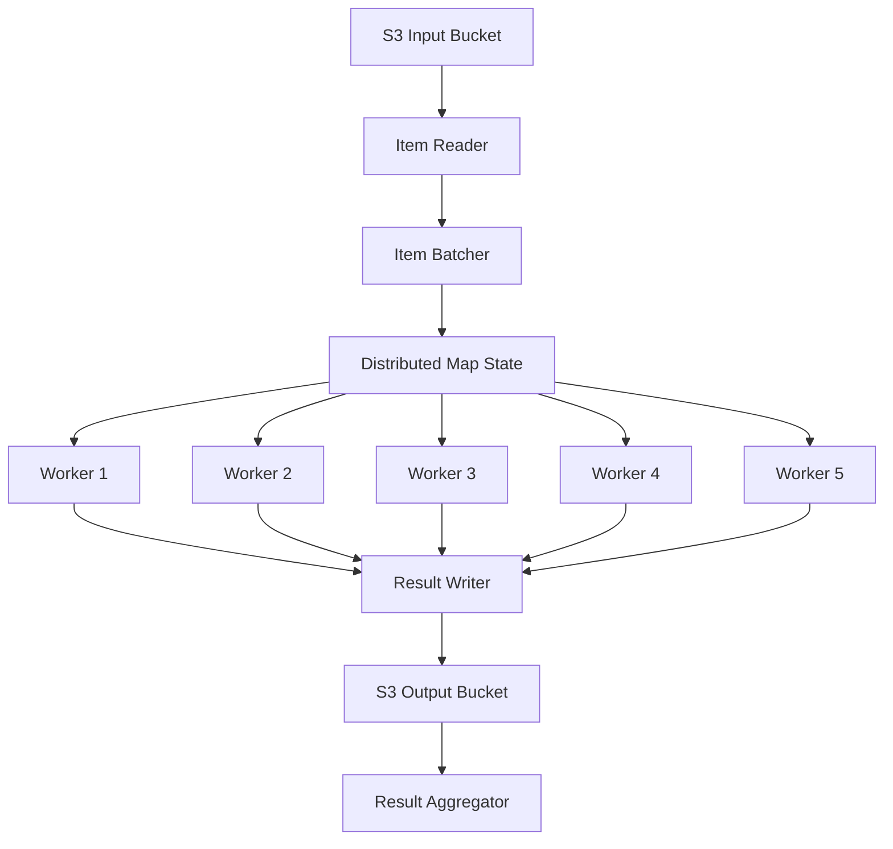
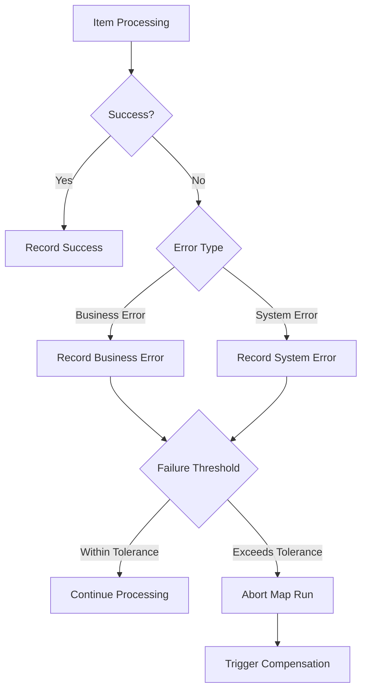

# Step Functions分散マップ詳細設計書

## 1. 概要

### 1.1 目的
本ドキュメントでは、CSVファイル並列処理システムにおけるStep Functions分散マップ（Distributed Map）の詳細実装仕様を定義する。大規模データの効率的な並列処理を実現するための具体的な設定とパフォーマンス最適化手法を記載する。

### 1.2 分散マップの特徴
- 最大10,000並列実行のサポート
- S3からの直接データ読み取り
- 自動バッチ処理とエラーハンドリング
- 結果の自動集約とS3への書き込み

## 2. 分散マップアーキテクチャ

### 2.1 処理フロー概要



### 2.2 コンポーネント構成

| コンポーネント | 役割 | 実装詳細 |
|---------------|------|----------|
| Item Reader | S3からのデータ読み取り | CSVファイルを行単位で読み取り |
| Item Batcher | アイテムのバッチ化 | 25件単位でバッチ処理 |
| Distributed Map | 並列実行制御 | 最大5並列で実行 |
| Worker | 個別アイテム処理 | Lambda関数によるDB更新 |
| Result Writer | 結果のS3書き込み | JSON形式で結果を保存 |

## 3. ItemReader設定詳細

### 3.1 S3 CSVファイル読み取り設定

```json
{
  "ItemReader": {
    "Resource": "arn:aws:states:::s3:getObject",
    "ReaderConfig": {
      "InputType": "CSV",
      "CSVHeaderLocation": "FIRST_ROW"
    },
    "Parameters": {
      "Bucket.$": "$.s3.bucket",
      "Key.$": "$.s3.key"
    }
  }
}
```

### 3.2 大規模ファイル対応設定

```json
{
  "ItemReader": {
    "Resource": "arn:aws:states:::s3:getObject",
    "ReaderConfig": {
      "InputType": "CSV",
      "CSVHeaderLocation": "FIRST_ROW",
      "MaxItems": 10000
    },
    "Parameters": {
      "Bucket.$": "$.s3.bucket",
      "Key.$": "$.s3.key",
      "Range": "bytes=0-104857600"
    }
  }
}
```

### 3.3 カスタムItemReader Lambda実装

```python
import boto3
import csv
import json
from io import StringIO

def lambda_handler(event, context):
    """
    S3からCSVを読み取り、分散マップ用にアイテムを生成
    """
    s3 = boto3.client('s3')
    
    bucket = event['bucket']
    key = event['key']
    start_byte = event.get('startByte', 0)
    end_byte = event.get('endByte', None)
    
    # Range指定でS3オブジェクトを取得
    params = {
        'Bucket': bucket,
        'Key': key
    }
    if start_byte or end_byte:
        range_header = f"bytes={start_byte}-"
        if end_byte:
            range_header += str(end_byte)
        params['Range'] = range_header
    
    response = s3.get_object(**params)
    content = response['Body'].read().decode('utf-8')
    
    # CSV解析
    csv_reader = csv.DictReader(StringIO(content))
    items = []
    
    for index, row in enumerate(csv_reader):
        # 各行にメタデータを追加
        item = {
            'index': start_byte + index,
            'data': row,
            'metadata': {
                'sourceFile': key,
                'processingTime': context.aws_request_id
            }
        }
        items.append(item)
    
    return {
        'items': items,
        'totalCount': len(items),
        'hasMore': len(content) == (end_byte - start_byte + 1) if end_byte else False
    }
```

## 4. ItemBatcher設定詳細

### 4.1 バッチ処理設定

```json
{
  "ItemBatcher": {
    "MaxBatchSize": 25,
    "MaxInputBytesPerBatch": 262144,
    "BatchInput": {
      "batchId.$": "$$.Map.Item.BatchId",
      "batchSize.$": "$$.Map.Item.BatchSize",
      "executionContext": {
        "executionId.$": "$.execution.id",
        "timestamp.$": "$$.State.EnteredTime",
        "batchNumber.$": "$$.Map.Item.BatchNumber"
      },
      "processingConfig": {
        "retryOnConflict": true,
        "batchTimeout": 30
      }
    }
  }
}
```

### 4.2 動的バッチサイズ調整

```python
def calculate_optimal_batch_size(total_items, max_concurrency):
    """
    アイテム数と並列度から最適なバッチサイズを計算
    """
    # 基本バッチサイズ
    base_batch_size = 25
    
    # 並列度に基づく調整
    if total_items < 100:
        return min(10, total_items)
    elif total_items < 500:
        return 20
    elif total_items < 1000:
        return base_batch_size
    else:
        # 大規模データの場合は並列度を考慮
        optimal_size = total_items // (max_concurrency * 10)
        return max(base_batch_size, min(100, optimal_size))
```

### 4.3 バッチ処理Lambda実装

```python
import json
import boto3
from concurrent.futures import ThreadPoolExecutor, as_completed
import logging

logger = logging.getLogger()
logger.setLevel(logging.INFO)

dynamodb = boto3.resource('dynamodb')
aurora_client = boto3.client('rds-data')

def lambda_handler(event, context):
    """
    バッチ単位でユーザーデータを処理
    """
    batch_id = event['batchId']
    items = event['items']
    execution_id = event['executionContext']['executionId']
    
    logger.info(f"Processing batch {batch_id} with {len(items)} items")
    
    results = []
    errors = []
    
    # スレッドプールで並列処理
    with ThreadPoolExecutor(max_workers=5) as executor:
        future_to_item = {
            executor.submit(process_single_item, item, execution_id): item 
            for item in items
        }
        
        for future in as_completed(future_to_item):
            item = future_to_item[future]
            try:
                result = future.result()
                results.append(result)
            except Exception as e:
                logger.error(f"Error processing item {item['index']}: {str(e)}")
                errors.append({
                    'item': item,
                    'error': str(e),
                    'errorType': type(e).__name__
                })
    
    # 結果サマリー
    return {
        'batchId': batch_id,
        'processedCount': len(results),
        'errorCount': len(errors),
        'results': results,
        'errors': errors,
        'processingTimeMs': context.get_remaining_time_in_millis()
    }

def process_single_item(item, execution_id):
    """
    個別アイテムの処理
    """
    user_data = item['data']
    
    # Aurora更新
    update_aurora_user_stats(
        user_id=user_data['ユーザーID'],
        login_count=int(user_data['ログイン回数']),
        post_count=int(user_data['投稿回数'])
    )
    
    # DynamoDB監査ログ
    write_audit_log(
        execution_id=execution_id,
        item_index=item['index'],
        user_id=user_data['ユーザーID'],
        status='SUCCESS'
    )
    
    return {
        'itemIndex': item['index'],
        'userId': user_data['ユーザーID'],
        'status': 'SUCCESS'
    }
```

## 5. 分散マップ実行設定

### 5.1 MaxConcurrency設定

```json
{
  "ProcessUserDataParallel": {
    "Type": "Map",
    "ItemProcessor": {
      "ProcessorConfig": {
        "Mode": "DISTRIBUTED",
        "ExecutionType": "STANDARD"
      }
    },
    "MaxConcurrency": 5,
    "ToleratedFailurePercentage": 5,
    "ToleratedFailureCount": 50
  }
}
```

### 5.2 並列度最適化ロジック

```python
def calculate_optimal_concurrency(total_items, avg_processing_time_ms):
    """
    処理時間と総アイテム数から最適な並列度を計算
    """
    # 基本設定
    min_concurrency = 1
    max_concurrency = 5  # システム制限
    target_completion_time_ms = 300000  # 5分
    
    # 必要な並列度を計算
    total_processing_time = total_items * avg_processing_time_ms
    required_concurrency = math.ceil(total_processing_time / target_completion_time_ms)
    
    # 制限内に収める
    optimal_concurrency = max(min_concurrency, min(required_concurrency, max_concurrency))
    
    return optimal_concurrency
```

### 5.3 動的並列度調整

```json
{
  "DetermineOptimalConcurrency": {
    "Type": "Task",
    "Resource": "arn:aws:lambda:ap-northeast-1:${AWS::AccountId}:function:calculate-concurrency",
    "Parameters": {
      "totalItems.$": "$.validation.rowCount",
      "fileSize.$": "$.s3.size",
      "historicalMetrics": {
        "avgProcessingTimeMs": 1500,
        "successRate": 0.98
      }
    },
    "ResultPath": "$.optimizationConfig",
    "Next": "ProcessUserDataParallel"
  }
}
```

## 6. ResultWriter設定詳細

### 6.1 S3結果書き込み設定

```json
{
  "ResultWriter": {
    "Resource": "arn:aws:states:::s3:putObject",
    "Parameters": {
      "Bucket": "${ResultBucket}",
      "Prefix.$": "States.Format('results/{}/distributed-map/', $.execution.id)"
    },
    "ResultPath": "$.resultWriterOutput"
  }
}
```

### 6.2 カスタムResultWriter実装

```python
import json
import boto3
from datetime import datetime
import gzip

s3 = boto3.client('s3')

def lambda_handler(event, context):
    """
    分散マップの結果をS3に効率的に書き込み
    """
    execution_id = event['executionId']
    map_run_id = event['mapRunId']
    results = event['results']
    
    # 結果の集約
    summary = {
        'executionId': execution_id,
        'mapRunId': map_run_id,
        'timestamp': datetime.utcnow().isoformat(),
        'totalProcessed': len(results),
        'successCount': sum(1 for r in results if r['status'] == 'SUCCESS'),
        'failureCount': sum(1 for r in results if r['status'] == 'FAILED'),
        'results': results
    }
    
    # JSON圧縮
    json_data = json.dumps(summary, ensure_ascii=False)
    compressed_data = gzip.compress(json_data.encode('utf-8'))
    
    # S3アップロード
    key = f"results/{execution_id}/map-output/{map_run_id}.json.gz"
    s3.put_object(
        Bucket=event['outputBucket'],
        Key=key,
        Body=compressed_data,
        ContentType='application/json',
        ContentEncoding='gzip',
        Metadata={
            'execution-id': execution_id,
            'map-run-id': map_run_id,
            'item-count': str(len(results))
        }
    )
    
    return {
        'outputLocation': f"s3://{event['outputBucket']}/{key}",
        'summary': {
            'totalProcessed': summary['totalProcessed'],
            'successCount': summary['successCount'],
            'failureCount': summary['failureCount']
        }
    }
```

### 6.3 結果集約設定

```json
{
  "ResultSelector": {
    "executionId.$": "$.execution.id",
    "statistics": {
      "totalItems.$": "$$.Map.Item.Count",
      "processedItems.$": "$$.Map.Item.Stats.Succeeded",
      "failedItems.$": "$$.Map.Item.Stats.Failed",
      "timedOutItems.$": "$$.Map.Item.Stats.TimedOut",
      "abortedItems.$": "$$.Map.Item.Stats.Aborted",
      "processingDurationSeconds.$": "$$.Map.Item.Stats.Duration"
    },
    "outputLocation": {
      "bucket": "${ResultBucket}",
      "prefix.$": "States.Format('results/{}/map-output/', $.execution.id)"
    }
  }
}
```

## 7. エラーハンドリング

### 7.1 ToleratedFailure設定

```json
{
  "ToleratedFailurePercentage": 5,
  "ToleratedFailureCount": 50
}
```

### 7.2 エラー処理フロー



### 7.3 エラー集約Lambda

```python
def aggregate_map_errors(event, context):
    """
    分散マップのエラーを集約して分析
    """
    execution_id = event['executionId']
    map_statistics = event['mapStatistics']
    
    # エラー率計算
    total_items = map_statistics['totalItems']
    failed_items = map_statistics['failedItems']
    error_rate = (failed_items / total_items) * 100 if total_items > 0 else 0
    
    # エラー分類
    error_summary = classify_errors(event.get('errors', []))
    
    # アラート判定
    alert_required = False
    alert_severity = 'LOW'
    
    if error_rate > 10:
        alert_required = True
        alert_severity = 'HIGH'
    elif error_rate > 5:
        alert_required = True
        alert_severity = 'MEDIUM'
    
    # CloudWatchメトリクス送信
    send_error_metrics(execution_id, error_rate, error_summary)
    
    # アラート送信
    if alert_required:
        send_alert(execution_id, error_rate, alert_severity, error_summary)
    
    return {
        'errorRate': error_rate,
        'errorSummary': error_summary,
        'alertSent': alert_required,
        'recommendations': generate_recommendations(error_summary)
    }

def classify_errors(errors):
    """
    エラーを分類して集計
    """
    error_types = {}
    for error in errors:
        error_type = error.get('errorType', 'Unknown')
        error_types[error_type] = error_types.get(error_type, 0) + 1
    
    return {
        'byType': error_types,
        'topErrors': sorted(error_types.items(), key=lambda x: x[1], reverse=True)[:5]
    }
```

## 8. パフォーマンス最適化

### 8.1 Lambda予約同時実行数

```yaml
MapWorkerConcurrency:
  Type: AWS::Lambda::ProvisionedConcurrencyConfig
  Properties:
    FunctionName: !Ref UserLogProcessor
    ProvisionedConcurrentExecutions: 25  # MaxConcurrency * 5
    Qualifier: !GetAtt UserLogProcessorVersion.Version
```

### 8.2 S3読み取り最適化

```python
class OptimizedS3Reader:
    """
    S3からの効率的な読み取りクラス
    """
    def __init__(self, bucket, key):
        self.s3 = boto3.client('s3', 
            config=Config(
                max_pool_connections=50,
                s3={'addressing_style': 'virtual'},
                retries={'max_attempts': 3}
            )
        )
        self.bucket = bucket
        self.key = key
        self.chunk_size = 1024 * 1024  # 1MB
    
    def read_in_chunks(self):
        """
        チャンク単位での読み取り
        """
        response = self.s3.head_object(Bucket=self.bucket, Key=self.key)
        file_size = response['ContentLength']
        
        for start in range(0, file_size, self.chunk_size):
            end = min(start + self.chunk_size - 1, file_size - 1)
            
            response = self.s3.get_object(
                Bucket=self.bucket,
                Key=self.key,
                Range=f'bytes={start}-{end}'
            )
            
            yield response['Body'].read()
```

### 8.3 バッチ処理最適化

```python
def optimized_batch_processor(items, db_connection_pool):
    """
    接続プールを使用した効率的なバッチ処理
    """
    # バルクインサート用データ準備
    bulk_data = []
    
    for item in items:
        bulk_data.append({
            'user_id': item['data']['ユーザーID'],
            'login_count': int(item['data']['ログイン回数']),
            'post_count': int(item['data']['投稿回数']),
            'updated_at': datetime.utcnow()
        })
    
    # バルク更新実行
    with db_connection_pool.get_connection() as conn:
        execute_bulk_upsert(conn, 'user_stats', bulk_data)
    
    return len(bulk_data)
```

## 9. 監視とメトリクス

### 9.1 カスタムメトリクス定義

```python
DISTRIBUTED_MAP_METRICS = {
    "ItemProcessingRate": {
        "MetricName": "ItemsProcessedPerSecond",
        "Unit": "Count/Second",
        "Dimensions": [
            {"Name": "StateMachine", "Value": "csv-processing"},
            {"Name": "MapState", "Value": "ProcessUserDataParallel"}
        ]
    },
    "BatchProcessingDuration": {
        "MetricName": "BatchProcessingTime",
        "Unit": "Milliseconds",
        "Dimensions": [
            {"Name": "BatchSize", "Value": "25"},
            {"Name": "FunctionName", "Value": "csv-processor"}
        ]
    },
    "ConcurrencyUtilization": {
        "MetricName": "ConcurrentExecutions",
        "Unit": "Count",
        "Dimensions": [
            {"Name": "StateMachine", "Value": "csv-processing"}
        ]
    }
}
```

### 9.2 リアルタイム監視Lambda

```python
import boto3
from datetime import datetime

cloudwatch = boto3.client('cloudwatch')

def monitor_distributed_map(event, context):
    """
    分散マップの実行状況をリアルタイム監視
    """
    execution_id = event['executionId']
    map_state = event['mapState']
    
    # 現在の進捗状況
    progress = {
        'totalItems': map_state['totalItems'],
        'processedItems': map_state['processedItems'],
        'remainingItems': map_state['totalItems'] - map_state['processedItems'],
        'progressPercentage': (map_state['processedItems'] / map_state['totalItems']) * 100
    }
    
    # 処理速度計算
    elapsed_time = (datetime.utcnow() - datetime.fromisoformat(map_state['startTime'])).total_seconds()
    processing_rate = map_state['processedItems'] / elapsed_time if elapsed_time > 0 else 0
    
    # 完了予測時間
    if processing_rate > 0:
        eta_seconds = progress['remainingItems'] / processing_rate
        eta = datetime.utcnow() + timedelta(seconds=eta_seconds)
    else:
        eta = None
    
    # メトリクス送信
    metrics = [
        {
            'MetricName': 'MapProgress',
            'Value': progress['progressPercentage'],
            'Unit': 'Percent',
            'Dimensions': [
                {'Name': 'ExecutionId', 'Value': execution_id}
            ]
        },
        {
            'MetricName': 'ProcessingRate',
            'Value': processing_rate,
            'Unit': 'Count/Second',
            'Dimensions': [
                {'Name': 'ExecutionId', 'Value': execution_id}
            ]
        }
    ]
    
    cloudwatch.put_metric_data(
        Namespace='CSVProcessing/DistributedMap',
        MetricData=metrics
    )
    
    return {
        'progress': progress,
        'processingRate': processing_rate,
        'estimatedCompletionTime': eta.isoformat() if eta else None,
        'metrics': metrics
    }
```

## 10. テスト仕様

### 10.1 分散マップ単体テスト

```python
import pytest
from moto import mock_stepfunctions, mock_s3
import boto3

@mock_s3
@mock_stepfunctions
class TestDistributedMap:
    """
    分散マップ機能のテスト
    """
    
    def setup_method(self):
        """テスト環境のセットアップ"""
        self.s3 = boto3.client('s3', region_name='ap-northeast-1')
        self.sfn = boto3.client('stepfunctions', region_name='ap-northeast-1')
        
        # テスト用バケット作成
        self.s3.create_bucket(
            Bucket='test-input-bucket',
            CreateBucketConfiguration={'LocationConstraint': 'ap-northeast-1'}
        )
        
    def test_item_reader_csv_parsing(self):
        """CSVファイル読み取りテスト"""
        # テストCSVデータ
        csv_content = """ユーザーID,ログイン回数,投稿回数
U00001,5,12
U00002,3,8
U00003,7,15"""
        
        # S3にアップロード
        self.s3.put_object(
            Bucket='test-input-bucket',
            Key='test.csv',
            Body=csv_content.encode('utf-8')
        )
        
        # ItemReader実行
        result = item_reader_lambda({
            'bucket': 'test-input-bucket',
            'key': 'test.csv'
        })
        
        assert len(result['items']) == 3
        assert result['items'][0]['data']['ユーザーID'] == 'U00001'
    
    def test_batch_processing(self):
        """バッチ処理テスト"""
        items = [
            {'index': i, 'data': {'ユーザーID': f'U{i:05d}', 'ログイン回数': '5', '投稿回数': '10'}}
            for i in range(100)
        ]
        
        # バッチャー実行
        batches = create_batches(items, batch_size=25)
        
        assert len(batches) == 4
        assert len(batches[0]) == 25
        
    def test_concurrency_limit(self):
        """並列度制限テスト"""
        # 1000アイテムで並列度5のテスト
        total_items = 1000
        max_concurrency = 5
        
        optimal = calculate_optimal_concurrency(total_items, 1500)
        assert optimal <= max_concurrency
    
    def test_error_tolerance(self):
        """エラー許容率テスト"""
        # 5%エラー許容のテスト
        total = 100
        failed = 4
        
        result = check_tolerance(total, failed, tolerance_percentage=5)
        assert result['within_tolerance'] == True
        
        failed = 6
        result = check_tolerance(total, failed, tolerance_percentage=5)
        assert result['within_tolerance'] == False
```

### 10.2 負荷テスト

```bash
#!/bin/bash
# 分散マップ負荷テストスクリプト

echo "=== Distributed Map Load Test ==="

# テストパラメータ
TEST_SIZES=(100 500 1000 5000 10000)
CONCURRENCY_LEVELS=(1 3 5)

for size in "${TEST_SIZES[@]}"; do
    for concurrency in "${CONCURRENCY_LEVELS[@]}"; do
        echo "Testing with ${size} items, ${concurrency} concurrency"
        
        # テストデータ生成
        python generate_test_csv.py --rows ${size} --output test-${size}.csv
        
        # S3アップロード
        aws s3 cp test-${size}.csv s3://test-input-bucket/load-test/
        
        # 実行開始時刻記録
        start_time=$(date +%s)
        
        # Step Functions実行
        execution_arn=$(aws stepfunctions start-execution \
            --state-machine-arn ${STATE_MACHINE_ARN} \
            --input "{\"concurrency\": ${concurrency}, \"testSize\": ${size}}" \
            --query 'executionArn' --output text)
        
        # 実行完了待機
        aws stepfunctions wait execution-succeeded --execution-arn ${execution_arn}
        
        # 実行時間計算
        end_time=$(date +%s)
        duration=$((end_time - start_time))
        
        # 結果記録
        echo "Size: ${size}, Concurrency: ${concurrency}, Duration: ${duration}s" >> load_test_results.txt
        
        # メトリクス取得
        aws cloudwatch get-metric-statistics \
            --namespace CSVProcessing/DistributedMap \
            --metric-name ItemsProcessedPerSecond \
            --start-time ${start_time} \
            --end-time ${end_time} \
            --period 60 \
            --statistics Average >> metrics_${size}_${concurrency}.json
    done
done

echo "Load test completed. Results in load_test_results.txt"
```

## 11. トラブルシューティング

### 11.1 一般的な問題と対処法

| 問題 | 症状 | 原因 | 対処法 |
|------|------|------|--------|
| ItemReader失敗 | S3 Access Denied | IAMロール権限不足 | S3読み取り権限を追加 |
| バッチ処理タイムアウト | Task timed out | バッチサイズが大きすぎる | バッチサイズを削減 |
| 並列度不足 | 処理時間が長い | MaxConcurrencyが低い | 並列度を増加 |
| メモリ不足 | Lambda OOM | 大量データ処理 | Lambdaメモリを増加 |
| ResultWriter失敗 | S3 throttling | 書き込み頻度が高い | 書き込みをバッファリング |

### 11.2 デバッグ手法

```python
def debug_distributed_map(execution_arn):
    """
    分散マップ実行のデバッグ情報取得
    """
    sfn = boto3.client('stepfunctions')
    
    # 実行履歴取得
    response = sfn.describe_execution(executionArn=execution_arn)
    
    # Map Run ARNs取得
    history = sfn.get_execution_history(
        executionArn=execution_arn,
        reverseOrder=True
    )
    
    map_run_arns = []
    for event in history['events']:
        if event['type'] == 'MapRunStarted':
            details = event['mapRunStartedEventDetails']
            map_run_arns.append(details['mapRunArn'])
    
    # 各Map Runの詳細取得
    map_run_details = []
    for map_run_arn in map_run_arns:
        details = sfn.describe_map_run(mapRunArn=map_run_arn)
        map_run_details.append({
            'mapRunArn': map_run_arn,
            'status': details['status'],
            'itemCounts': details['itemCounts'],
            'executionCounts': details['executionCounts'],
            'toleratedFailurePercentage': details['toleratedFailurePercentage'],
            'toleratedFailureCount': details['toleratedFailureCount']
        })
    
    return {
        'execution': response,
        'mapRuns': map_run_details,
        'recommendations': analyze_map_performance(map_run_details)
    }
```

## 12. ベストプラクティス

### 12.1 設計指針

1. **バッチサイズの最適化**
   - データサイズと処理時間を考慮
   - ネットワーク転送とメモリ使用のバランス

2. **並列度の動的調整**
   - 処理負荷に応じた自動スケーリング
   - コスト効率を考慮した設定

3. **エラーハンドリング**
   - 適切な許容率の設定
   - エラー分類と自動復旧

4. **監視とアラート**
   - リアルタイム進捗追跡
   - 異常検知と通知

### 12.2 実装チェックリスト

- [ ] ItemReaderの効率的な実装
- [ ] 適切なバッチサイズ設定
- [ ] MaxConcurrencyの最適化
- [ ] ToleratedFailure設定
- [ ] ResultWriterの圧縮設定
- [ ] エラーハンドリングフロー
- [ ] 監視メトリクスの実装
- [ ] アラート設定
- [ ] 負荷テストの実施
- [ ] ドキュメント整備

この詳細設計書により、Step Functions分散マップを使用した大規模CSVファイルの効率的な並列処理が実現できます。