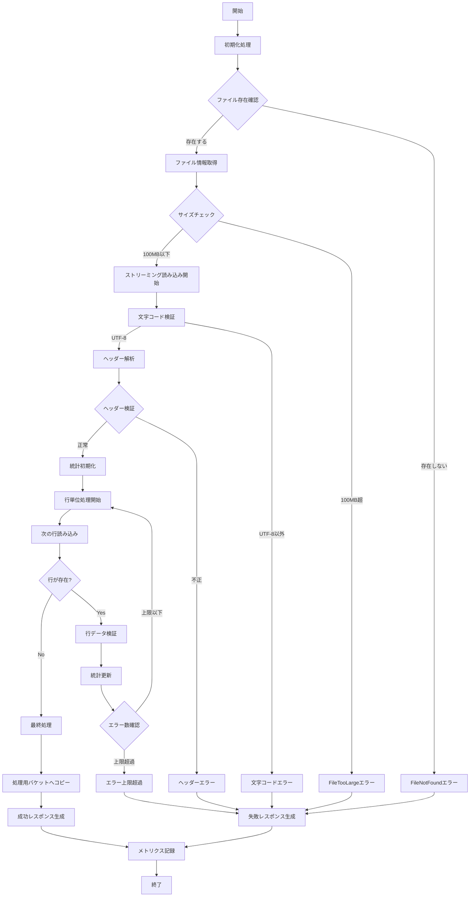
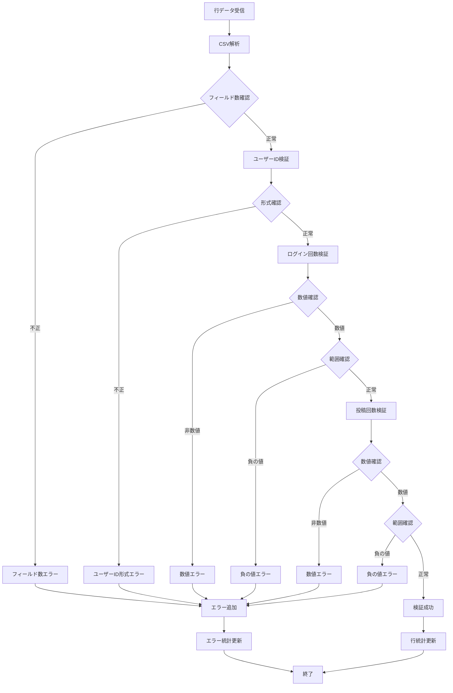

# CSV検証関数詳細設計書

## 1. 概要

### 1.1 目的
本書は、StepFunctions CSV並列処理システムにおけるCSV検証関数（csv-validator）の詳細設計を定義する。

### 1.2 機能概要
- S3にアップロードされたCSVファイルの形式検証
- ヘッダー形式、データ形式、文字コードの検証
- 検証結果と統計情報の生成

### 1.3 前提条件
- Node.js 22.x / TypeScript 5.x
- AWS Lambda実行環境（ARM64アーキテクチャ）
- 入力CSVファイルサイズ：最大100MB
- 文字コード：UTF-8のみサポート

## 2. 関数仕様詳細

### 2.1 Lambda関数設定

```typescript
// lambda-config.ts
export const CSV_VALIDATOR_CONFIG = {
  functionName: 'csv-validator',
  runtime: 'nodejs22.x',
  architecture: 'arm64',
  handler: 'index.handler',
  timeout: 300, // 5分
  memorySize: 512, // MB
  ephemeralStorage: {
    size: 512 // MB
  },
  reservedConcurrentExecutions: 10,
  environment: {
    INPUT_BUCKET_NAME: process.env.INPUT_BUCKET_NAME || '',
    PROCESSING_BUCKET_NAME: process.env.PROCESSING_BUCKET_NAME || '',
    LOG_LEVEL: process.env.LOG_LEVEL || 'INFO',
    MAX_FILE_SIZE_MB: process.env.MAX_FILE_SIZE_MB || '100',
    EXPECTED_HEADERS: process.env.EXPECTED_HEADERS || 'userId,loginCount,postCount'
  },
  deadLetterQueue: {
    targetArn: 'arn:aws:sqs:ap-northeast-1:123456789012:csv-validator-dlq',
    maxReceiveCount: 3
  }
};
```

### 2.2 入出力インターフェース

#### 2.2.1 入力パラメータ詳細

```typescript
// types/input.ts
export interface CsvValidatorInput {
  // S3イベント情報
  bucket: string;              // 例: "csv-input-{account-id}"
  key: string;                 // 例: "uploads/2025/08/02/user-log-20250802.csv"
  
  // Step Functions実行情報
  executionName: string;       // 例: "user-log-20250802-093000"
  executionId: string;         // 例: "arn:aws:states:ap-northeast-1:123456789012:execution:csv-processing:user-log-20250802-093000"
  
  // オプション設定
  options?: {
    skipHeaderValidation?: boolean;  // ヘッダー検証スキップ（デフォルト: false）
    strictMode?: boolean;            // 厳格モード（デフォルト: true）
    maxErrors?: number;              // 最大エラー数（デフォルト: 100）
  };
}
```

#### 2.2.2 出力レスポンス詳細

```typescript
// types/output.ts
export interface ValidationSuccessResponse {
  isValid: true;
  
  // ファイル統計情報
  statistics: {
    totalRows: number;          // 総行数（ヘッダー除く）
    validRows: number;          // 有効行数
    fileSize: number;           // ファイルサイズ（バイト）
    fileSizeMB: string;         // ファイルサイズ（MB、小数点2桁）
    encoding: 'UTF-8';          // 文字エンコーディング
    processedAt: string;        // ISO8601形式
    processingTimeMs: number;   // 処理時間（ミリ秒）
    
    // 列統計
    columnStats: {
      userId: {
        uniqueCount: number;    // ユニークユーザー数
        nullCount: number;      // null値の数
      };
      loginCount: {
        min: number;            // 最小値
        max: number;            // 最大値
        avg: number;            // 平均値
        nullCount: number;
      };
      postCount: {
        min: number;
        max: number;
        avg: number;
        nullCount: number;
      };
    };
  };
  
  // メタデータ
  metadata: {
    bucket: string;
    key: string;
    executionName: string;
    processedFile: {
      bucket: string;           // 処理用バケット
      key: string;              // 処理用ファイルキー
    };
  };
}

export interface ValidationFailureResponse {
  isValid: false;
  
  // エラー情報
  errors: ValidationError[];
  errorSummary: {
    totalErrors: number;
    byType: Record<string, number>;  // エラータイプ別カウント
    criticalErrors: number;          // 致命的エラー数
  };
  
  // 部分的な統計情報（可能な範囲）
  partialStatistics?: {
    rowsProcessed: number;
    fileSize: number;
    encoding?: string;
  };
  
  // メタデータ
  metadata: {
    bucket: string;
    key: string;
    executionName: string;
    failedAt: string;           // ISO8601形式
    processingTimeMs: number;
  };
}

export interface ValidationError {
  line?: number;                // エラー行番号（1-based）
  column?: string;              // エラー列名
  type: ErrorType;              // エラータイプ
  severity: 'error' | 'warning';// 重要度
  code: string;                 // エラーコード
  message: string;              // エラーメッセージ
  details?: any;                // 追加詳細情報
}

export enum ErrorType {
  FILE_NOT_FOUND = 'FILE_NOT_FOUND',
  FILE_TOO_LARGE = 'FILE_TOO_LARGE',
  INVALID_ENCODING = 'INVALID_ENCODING',
  INVALID_HEADER = 'INVALID_HEADER',
  MISSING_HEADER = 'MISSING_HEADER',
  INVALID_DATA_TYPE = 'INVALID_DATA_TYPE',
  INVALID_USER_ID_FORMAT = 'INVALID_USER_ID_FORMAT',
  NEGATIVE_VALUE = 'NEGATIVE_VALUE',
  EMPTY_FIELD = 'EMPTY_FIELD',
  MALFORMED_CSV = 'MALFORMED_CSV'
}
```

## 3. 処理フロー詳細

### 3.1 メイン処理フロー



### 3.2 行データ検証処理



## 4. 実装詳細

### 4.1 ディレクトリ構成

```
src/handlers/csv-validator/
├── index.ts                    # Lambda関数エントリーポイント
├── handler.ts                  # メインハンドラー
├── services/
│   ├── CsvValidationService.ts # CSV検証サービス
│   ├── S3Service.ts           # S3操作サービス
│   └── MetricsService.ts      # メトリクス記録サービス
├── validators/
│   ├── FileValidator.ts       # ファイル検証
│   ├── HeaderValidator.ts     # ヘッダー検証
│   ├── DataValidator.ts       # データ検証
│   └── EncodingValidator.ts   # エンコーディング検証
├── parsers/
│   ├── CsvParser.ts          # CSVパーサー
│   └── StreamParser.ts       # ストリーミングパーサー
├── models/
│   ├── CsvFile.ts            # CSVファイルモデル
│   ├── ValidationResult.ts    # 検証結果モデル
│   └── Statistics.ts         # 統計情報モデル
├── utils/
│   ├── logger.ts             # ロガー
│   ├── metrics.ts            # メトリクスユーティリティ
│   ├── constants.ts          # 定数定義
│   └── errors.ts             # エラー定義
└── types/
    ├── input.ts              # 入力型定義
    ├── output.ts             # 出力型定義
    └── validation.ts         # 検証用型定義
```

### 4.2 主要クラス実装

#### 4.2.1 メインハンドラー

```typescript
// handler.ts
import { Context } from 'aws-lambda';
import { CsvValidatorInput, ValidationResponse } from './types';
import { CsvValidationService } from './services/CsvValidationService';
import { S3Service } from './services/S3Service';
import { MetricsService } from './services/MetricsService';
import { logger } from './utils/logger';
import { recordMetric } from './utils/metrics';

export class CsvValidatorHandler {
  private validationService: CsvValidationService;
  private s3Service: S3Service;
  private metricsService: MetricsService;

  constructor() {
    this.s3Service = new S3Service();
    this.metricsService = new MetricsService();
    this.validationService = new CsvValidationService(
      this.s3Service,
      this.metricsService
    );
  }

  async handle(
    event: CsvValidatorInput,
    context: Context
  ): Promise<ValidationResponse> {
    const startTime = Date.now();
    let result: ValidationResponse;

    try {
      logger.info('CSV validation started', {
        bucket: event.bucket,
        key: event.key,
        executionName: event.executionName,
        requestId: context.awsRequestId
      });

      // 検証実行
      result = await this.validationService.validate(event);

      // 成功メトリクス記録
      if (result.isValid) {
        await this.metricsService.recordSuccess(
          result.statistics.processingTimeMs
        );
      } else {
        await this.metricsService.recordFailure(
          result.errorSummary.totalErrors
        );
      }

      logger.info('CSV validation completed', {
        isValid: result.isValid,
        processingTime: Date.now() - startTime,
        statistics: result.isValid ? result.statistics : result.partialStatistics
      });

      return result;

    } catch (error) {
      logger.error('CSV validation failed with exception', {
        error: error instanceof Error ? {
          name: error.name,
          message: error.message,
          stack: error.stack
        } : error,
        bucket: event.bucket,
        key: event.key
      });

      // エラーメトリクス記録
      await this.metricsService.recordError(error);

      // エラーレスポンス生成
      result = this.createErrorResponse(event, error);
      
      return result;
    }
  }

  private createErrorResponse(
    input: CsvValidatorInput,
    error: unknown
  ): ValidationResponse {
    const errorMessage = error instanceof Error ? error.message : 'Unknown error';
    const errorType = error instanceof Error ? error.name : 'UnknownError';

    return {
      isValid: false,
      errors: [{
        type: ErrorType.UNKNOWN_ERROR,
        severity: 'error',
        code: 'CSV_VALIDATION_EXCEPTION',
        message: errorMessage
      }],
      errorSummary: {
        totalErrors: 1,
        byType: { [errorType]: 1 },
        criticalErrors: 1
      },
      metadata: {
        bucket: input.bucket,
        key: input.key,
        executionName: input.executionName,
        failedAt: new Date().toISOString(),
        processingTimeMs: 0
      }
    };
  }
}
```

#### 4.2.2 CSV検証サービス

```typescript
// services/CsvValidationService.ts
import { Readable } from 'stream';
import { pipeline } from 'stream/promises';
import { CsvValidatorInput, ValidationResponse } from '../types';
import { S3Service } from './S3Service';
import { StreamParser } from '../parsers/StreamParser';
import { HeaderValidator } from '../validators/HeaderValidator';
import { DataValidator } from '../validators/DataValidator';
import { EncodingValidator } from '../validators/EncodingValidator';
import { Statistics } from '../models/Statistics';
import { ValidationError, ErrorType } from '../utils/errors';

export class CsvValidationService {
  private headerValidator: HeaderValidator;
  private dataValidator: DataValidator;
  private encodingValidator: EncodingValidator;

  constructor(
    private s3Service: S3Service,
    private metricsService: MetricsService
  ) {
    this.headerValidator = new HeaderValidator();
    this.dataValidator = new DataValidator();
    this.encodingValidator = new EncodingValidator();
  }

  async validate(input: CsvValidatorInput): Promise<ValidationResponse> {
    const startTime = Date.now();
    const errors: ValidationError[] = [];
    const statistics = new Statistics();

    try {
      // 1. ファイル情報取得
      const fileInfo = await this.s3Service.getObjectMetadata(
        input.bucket,
        input.key
      );

      if (!fileInfo) {
        throw new ValidationError(
          ErrorType.FILE_NOT_FOUND,
          `File not found: s3://${input.bucket}/${input.key}`
        );
      }

      statistics.setFileSize(fileInfo.ContentLength || 0);

      // 2. ファイルサイズ確認
      const maxSizeMB = parseInt(process.env.MAX_FILE_SIZE_MB || '100');
      if (fileInfo.ContentLength && fileInfo.ContentLength > maxSizeMB * 1024 * 1024) {
        throw new ValidationError(
          ErrorType.FILE_TOO_LARGE,
          `File size ${fileInfo.ContentLength} bytes exceeds limit of ${maxSizeMB}MB`
        );
      }

      // 3. ストリーミング読み込みと検証
      const stream = await this.s3Service.getObjectStream(
        input.bucket,
        input.key
      );

      const parser = new StreamParser({
        onHeader: async (header: string[]) => {
          // ヘッダー検証
          const headerResult = this.headerValidator.validate(header);
          if (!headerResult.isValid) {
            errors.push(...headerResult.errors);
            if (input.options?.strictMode !== false) {
              throw new ValidationError(
                ErrorType.INVALID_HEADER,
                'Header validation failed'
              );
            }
          }
        },
        onRow: async (row: Record<string, string>, lineNumber: number) => {
          // データ行検証
          const rowResult = this.dataValidator.validateRow(row, lineNumber);
          if (!rowResult.isValid) {
            errors.push(...rowResult.errors);
            
            // エラー上限チェック
            const maxErrors = input.options?.maxErrors || 100;
            if (errors.length >= maxErrors) {
              throw new ValidationError(
                ErrorType.TOO_MANY_ERRORS,
                `Error limit reached: ${maxErrors}`
              );
            }
          }

          // 統計更新
          statistics.updateWithRow(row);
        },
        onError: (error: Error) => {
          throw error;
        }
      });

      // エンコーディング検証
      const encodingStream = this.encodingValidator.createValidationStream();
      
      // パイプライン実行
      await pipeline(
        stream,
        encodingStream,
        parser
      );

      // 4. 処理用バケットへコピー
      const processedFile = await this.copyToProcessingBucket(input);

      // 5. 成功レスポンス生成
      if (errors.length === 0) {
        return this.createSuccessResponse(
          input,
          statistics,
          processedFile,
          Date.now() - startTime
        );
      } else {
        return this.createPartialSuccessResponse(
          input,
          statistics,
          errors,
          Date.now() - startTime
        );
      }

    } catch (error) {
      // エラーレスポンス生成
      return this.createFailureResponse(
        input,
        errors,
        statistics,
        error,
        Date.now() - startTime
      );
    }
  }

  private async copyToProcessingBucket(
    input: CsvValidatorInput
  ): Promise<{ bucket: string; key: string }> {
    const processingBucket = process.env.PROCESSING_BUCKET_NAME || '';
    const processingKey = `processing/${input.executionName}/${input.key.split('/').pop()}`;

    await this.s3Service.copyObject(
      input.bucket,
      input.key,
      processingBucket,
      processingKey
    );

    return {
      bucket: processingBucket,
      key: processingKey
    };
  }

  // レスポンス生成メソッド（省略）
}
```

#### 4.2.3 ストリーミングCSVパーサー

```typescript
// parsers/StreamParser.ts
import { Transform } from 'stream';
import { parse } from 'csv-parse';

export interface StreamParserOptions {
  onHeader: (header: string[]) => Promise<void>;
  onRow: (row: Record<string, string>, lineNumber: number) => Promise<void>;
  onError: (error: Error) => void;
}

export class StreamParser extends Transform {
  private parser: any;
  private lineNumber = 0;
  private header: string[] = [];

  constructor(private options: StreamParserOptions) {
    super({ objectMode: true });

    this.parser = parse({
      columns: false,
      skip_empty_lines: true,
      relaxed_column_count: false,
      trim: true
    });

    this.setupParser();
  }

  private setupParser() {
    this.parser.on('readable', async () => {
      let record;
      while ((record = this.parser.read()) !== null) {
        this.lineNumber++;

        try {
          if (this.lineNumber === 1) {
            // ヘッダー処理
            this.header = record;
            await this.options.onHeader(record);
          } else {
            // データ行処理
            const rowObject = this.createRowObject(record);
            await this.options.onRow(rowObject, this.lineNumber);
          }
        } catch (error) {
          this.options.onError(error as Error);
          this.destroy(error as Error);
          return;
        }
      }
    });

    this.parser.on('error', (error: Error) => {
      this.options.onError(error);
      this.destroy(error);
    });

    this.parser.on('end', () => {
      this.push(null);
    });
  }

  private createRowObject(record: string[]): Record<string, string> {
    const obj: Record<string, string> = {};
    this.header.forEach((col, index) => {
      obj[col] = record[index] || '';
    });
    return obj;
  }

  _transform(chunk: any, encoding: string, callback: Function) {
    this.parser.write(chunk);
    callback();
  }

  _flush(callback: Function) {
    this.parser.end();
    callback();
  }
}
```

### 4.3 データ検証ロジック

#### 4.3.1 ユーザーID検証

```typescript
// validators/UserIdValidator.ts
export class UserIdValidator {
  private static readonly USER_ID_PATTERN = /^U\d{5}$/;

  static validate(userId: string): ValidationResult {
    if (!userId || userId.trim() === '') {
      return {
        isValid: false,
        error: {
          type: ErrorType.EMPTY_FIELD,
          message: 'User ID is empty'
        }
      };
    }

    if (!this.USER_ID_PATTERN.test(userId)) {
      return {
        isValid: false,
        error: {
          type: ErrorType.INVALID_USER_ID_FORMAT,
          message: `Invalid user ID format: ${userId}. Expected format: U00001`
        }
      };
    }

    return { isValid: true };
  }
}
```

#### 4.3.2 数値フィールド検証

```typescript
// validators/NumericValidator.ts
export class NumericValidator {
  static validate(
    value: string,
    fieldName: string,
    options: { allowNegative?: boolean } = {}
  ): ValidationResult {
    if (!value || value.trim() === '') {
      return {
        isValid: false,
        error: {
          type: ErrorType.EMPTY_FIELD,
          message: `${fieldName} is empty`
        }
      };
    }

    const numValue = Number(value);
    
    if (isNaN(numValue)) {
      return {
        isValid: false,
        error: {
          type: ErrorType.INVALID_DATA_TYPE,
          message: `${fieldName} is not a valid number: ${value}`
        }
      };
    }

    if (!options.allowNegative && numValue < 0) {
      return {
        isValid: false,
        error: {
          type: ErrorType.NEGATIVE_VALUE,
          message: `${fieldName} cannot be negative: ${value}`
        }
      };
    }

    return { isValid: true, value: numValue };
  }
}
```

## 5. エラーハンドリング詳細

### 5.1 エラー分類と処理

| エラータイプ | HTTPステータス | 処理 | リトライ可否 |
|------------|---------------|------|-------------|
| FILE_NOT_FOUND | 404 | 即座に失敗 | 不可 |
| FILE_TOO_LARGE | 413 | 即座に失敗 | 不可 |
| INVALID_ENCODING | 400 | 即座に失敗 | 不可 |
| INVALID_HEADER | 400 | 設定により継続/失敗 | 不可 |
| INVALID_DATA | 400 | エラー蓄積 | 不可 |
| S3_ACCESS_ERROR | 403 | 3回リトライ後失敗 | 可 |
| TIMEOUT | 504 | Lambda自動リトライ | 可 |
| OUT_OF_MEMORY | 507 | Lambda自動リトライ | 可（メモリ増設推奨） |

### 5.2 エラーレスポンス例

```json
{
  "isValid": false,
  "errors": [
    {
      "line": 5,
      "column": "userId",
      "type": "INVALID_USER_ID_FORMAT",
      "severity": "error",
      "code": "CSV_INVALID_USER_ID",
      "message": "Invalid user ID format: USER001. Expected format: U00001"
    },
    {
      "line": 10,
      "column": "loginCount",
      "type": "NEGATIVE_VALUE",
      "severity": "error",
      "code": "CSV_NEGATIVE_VALUE",
      "message": "loginCount cannot be negative: -5"
    }
  ],
  "errorSummary": {
    "totalErrors": 2,
    "byType": {
      "INVALID_USER_ID_FORMAT": 1,
      "NEGATIVE_VALUE": 1
    },
    "criticalErrors": 2
  },
  "partialStatistics": {
    "rowsProcessed": 100,
    "fileSize": 2048576,
    "encoding": "UTF-8"
  },
  "metadata": {
    "bucket": "csv-input-{account-id}",
    "key": "uploads/2025/08/02/user-log-20250802.csv",
    "executionName": "user-log-20250802-093000",
    "failedAt": "2025-08-02T09:30:15.123Z",
    "processingTimeMs": 1523
  }
}
```

## 6. パフォーマンス最適化

### 6.1 ストリーミング処理

```typescript
// 大容量ファイル対応のストリーミング実装
export class OptimizedCsvProcessor {
  private readonly CHUNK_SIZE = 64 * 1024; // 64KB chunks
  private readonly HIGH_WATER_MARK = 16 * 1024; // 16KB

  async processLargeFile(
    bucket: string,
    key: string
  ): Promise<ProcessingResult> {
    const params = {
      Bucket: bucket,
      Key: key
    };

    // S3 Select使用による高速化
    const selectParams = {
      ...params,
      ExpressionType: 'SQL',
      Expression: `SELECT * FROM S3Object[*] s WHERE s.userId LIKE 'U%'`,
      InputSerialization: {
        CSV: {
          FileHeaderInfo: 'USE',
          RecordDelimiter: '\n',
          FieldDelimiter: ','
        }
      },
      OutputSerialization: {
        CSV: {}
      }
    };

    // ストリーミング処理
    const stream = s3.selectObjectContent(selectParams).createReadStream();
    
    return this.processStream(stream);
  }
}
```

### 6.2 メモリ管理

```typescript
// メモリ効率的な統計計算
export class MemoryEfficientStats {
  private userIdSet = new Set<string>();
  private loginStats = { min: Infinity, max: -Infinity, sum: 0, count: 0 };
  private postStats = { min: Infinity, max: -Infinity, sum: 0, count: 0 };

  updateStats(row: Record<string, string>) {
    // ユーザーIDの重複排除（メモリ効率化のため上限設定）
    if (this.userIdSet.size < 10000) {
      this.userIdSet.add(row.userId);
    }

    // 統計値の逐次更新
    const loginCount = parseInt(row.loginCount, 10);
    const postCount = parseInt(row.postCount, 10);

    this.updateNumericStats(this.loginStats, loginCount);
    this.updateNumericStats(this.postStats, postCount);
  }

  private updateNumericStats(stats: any, value: number) {
    stats.min = Math.min(stats.min, value);
    stats.max = Math.max(stats.max, value);
    stats.sum += value;
    stats.count++;
  }

  getStats() {
    return {
      uniqueUsers: this.userIdSet.size,
      loginCount: {
        min: this.loginStats.min,
        max: this.loginStats.max,
        avg: this.loginStats.sum / this.loginStats.count
      },
      postCount: {
        min: this.postStats.min,
        max: this.postStats.max,
        avg: this.postStats.sum / this.postStats.count
      }
    };
  }
}
```

## 7. 監視とログ

### 7.1 CloudWatchメトリクス

```typescript
// メトリクス定義
export const CSV_VALIDATOR_METRICS = {
  // カスタムメトリクス
  ValidationDuration: {
    namespace: 'CsvProcessing/Validator',
    metricName: 'ValidationDuration',
    unit: 'Milliseconds'
  },
  ValidationErrors: {
    namespace: 'CsvProcessing/Validator',
    metricName: 'ValidationErrors',
    unit: 'Count'
  },
  FileSize: {
    namespace: 'CsvProcessing/Validator',
    metricName: 'ProcessedFileSize',
    unit: 'Bytes'
  },
  RowCount: {
    namespace: 'CsvProcessing/Validator',
    metricName: 'ProcessedRowCount',
    unit: 'Count'
  }
};

// メトリクス記録
export async function recordValidationMetrics(
  result: ValidationResponse,
  processingTime: number
) {
  const metrics = [
    {
      MetricName: 'ValidationDuration',
      Value: processingTime,
      Unit: 'Milliseconds'
    },
    {
      MetricName: result.isValid ? 'ValidationSuccess' : 'ValidationFailure',
      Value: 1,
      Unit: 'Count'
    }
  ];

  if (result.isValid) {
    metrics.push({
      MetricName: 'ProcessedFileSize',
      Value: result.statistics.fileSize,
      Unit: 'Bytes'
    });
    metrics.push({
      MetricName: 'ProcessedRowCount',
      Value: result.statistics.totalRows,
      Unit: 'Count'
    });
  }

  await cloudwatch.putMetricData({
    Namespace: 'CsvProcessing/Validator',
    MetricData: metrics
  }).promise();
}
```

### 7.2 構造化ログ

```typescript
// ログフォーマット
export interface StructuredLog {
  timestamp: string;
  level: 'DEBUG' | 'INFO' | 'WARN' | 'ERROR';
  message: string;
  service: 'csv-validator';
  awsRequestId: string;
  executionName: string;
  traceId?: string;
  metadata?: {
    bucket?: string;
    key?: string;
    fileSize?: number;
    rowCount?: number;
    errorCount?: number;
    processingTime?: number;
    memoryUsed?: number;
  };
  error?: {
    type: string;
    message: string;
    stack?: string;
  };
}

// ログ出力例
logger.info('CSV validation completed', {
  executionName: input.executionName,
  metadata: {
    bucket: input.bucket,
    key: input.key,
    fileSize: statistics.fileSize,
    rowCount: statistics.totalRows,
    processingTime: Date.now() - startTime,
    memoryUsed: process.memoryUsage().heapUsed
  }
});
```

## 8. テスト設計

### 8.1 単体テスト

```typescript
// __tests__/validators/DataValidator.test.ts
describe('DataValidator', () => {
  let validator: DataValidator;

  beforeEach(() => {
    validator = new DataValidator();
  });

  describe('validateRow', () => {
    it('should accept valid row data', () => {
      const row = {
        userId: 'U00001',
        loginCount: '10',
        postCount: '5'
      };
      
      const result = validator.validateRow(row, 2);
      
      expect(result.isValid).toBe(true);
      expect(result.errors).toHaveLength(0);
    });

    it('should reject invalid user ID format', () => {
      const row = {
        userId: 'USER001',
        loginCount: '10',
        postCount: '5'
      };
      
      const result = validator.validateRow(row, 2);
      
      expect(result.isValid).toBe(false);
      expect(result.errors[0].type).toBe(ErrorType.INVALID_USER_ID_FORMAT);
      expect(result.errors[0].line).toBe(2);
    });

    it('should reject negative values', () => {
      const row = {
        userId: 'U00001',
        loginCount: '-5',
        postCount: '10'
      };
      
      const result = validator.validateRow(row, 3);
      
      expect(result.isValid).toBe(false);
      expect(result.errors[0].type).toBe(ErrorType.NEGATIVE_VALUE);
      expect(result.errors[0].column).toBe('loginCount');
    });
  });
});
```

### 8.2 統合テスト

```typescript
// __tests__/integration/CsvValidationService.test.ts
describe('CsvValidationService Integration', () => {
  let service: CsvValidationService;
  let s3Mock: AWS.S3;

  beforeEach(() => {
    s3Mock = mockS3();
    service = new CsvValidationService(
      new S3Service(s3Mock),
      new MetricsService()
    );
  });

  it('should process valid CSV file successfully', async () => {
    // S3モックデータ設定
    s3Mock.getObject.mockReturnValue({
      promise: () => Promise.resolve({
        Body: Buffer.from(
          'userId,loginCount,postCount\n' +
          'U00001,10,5\n' +
          'U00002,20,15\n'
        )
      })
    });

    const input: CsvValidatorInput = {
      bucket: 'test-bucket',
      key: 'test.csv',
      executionName: 'test-execution',
      executionId: 'test-execution-id'
    };

    const result = await service.validate(input);

    expect(result.isValid).toBe(true);
    expect(result.statistics.totalRows).toBe(2);
    expect(result.statistics.columnStats.userId.uniqueCount).toBe(2);
  });
});
```

## 9. デプロイメント設定

### 9.1 CloudFormationテンプレート

```yaml
Resources:
  CsvValidatorFunction:
    Type: AWS::Lambda::Function
    Properties:
      FunctionName: !Sub '${AWS::StackName}-csv-validator'
      Runtime: nodejs22.x
      Handler: index.handler
      Code:
        S3Bucket: !Ref DeploymentBucket
        S3Key: !Sub '${DeploymentPrefix}/csv-validator.zip'
      Timeout: 300
      MemorySize: 512
      EphemeralStorage:
        Size: 512
      Architectures:
        - arm64
      ReservedConcurrentExecutions: 10
      Environment:
        Variables:
          INPUT_BUCKET_NAME: !Ref InputBucket
          PROCESSING_BUCKET_NAME: !Ref ProcessingBucket
          LOG_LEVEL: !Ref LogLevel
          MAX_FILE_SIZE_MB: '100'
          EXPECTED_HEADERS: 'userId,loginCount,postCount'
      Role: !GetAtt CsvValidatorRole.Arn
      DeadLetterConfig:
        TargetArn: !GetAtt CsvValidatorDLQ.Arn
      TracingConfig:
        Mode: Active

  CsvValidatorRole:
    Type: AWS::IAM::Role
    Properties:
      AssumeRolePolicyDocument:
        Version: '2012-10-17'
        Statement:
          - Effect: Allow
            Principal:
              Service: lambda.amazonaws.com
            Action: sts:AssumeRole
      ManagedPolicyArns:
        - arn:aws:iam::aws:policy/service-role/AWSLambdaBasicExecutionRole
        - arn:aws:iam::aws:policy/AWSXRayDaemonWriteAccess
      Policies:
        - PolicyName: S3Access
          PolicyDocument:
            Version: '2012-10-17'
            Statement:
              - Effect: Allow
                Action:
                  - s3:GetObject
                  - s3:GetObjectMetadata
                Resource:
                  - !Sub '${InputBucket.Arn}/*'
              - Effect: Allow
                Action:
                  - s3:PutObject
                  - s3:PutObjectAcl
                Resource:
                  - !Sub '${ProcessingBucket.Arn}/*'
        - PolicyName: CloudWatchMetrics
          PolicyDocument:
            Version: '2012-10-17'
            Statement:
              - Effect: Allow
                Action:
                  - cloudwatch:PutMetricData
                Resource: '*'
                Condition:
                  StringEquals:
                    cloudwatch:namespace: 'CsvProcessing/Validator'

  CsvValidatorDLQ:
    Type: AWS::SQS::Queue
    Properties:
      QueueName: !Sub '${AWS::StackName}-csv-validator-dlq'
      MessageRetentionPeriod: 1209600  # 14 days
      VisibilityTimeout: 300

  CsvValidatorLogGroup:
    Type: AWS::Logs::LogGroup
    Properties:
      LogGroupName: !Sub '/aws/lambda/${CsvValidatorFunction}'
      RetentionInDays: 30
```

### 9.2 デプロイスクリプト

```bash
#!/bin/bash
# deploy-csv-validator.sh

set -e

FUNCTION_NAME="csv-validator"
REGION="ap-northeast-1"
S3_BUCKET="deployment-bucket"

echo "Building CSV Validator function..."

# TypeScriptコンパイル
npm run build

# 依存関係最適化
npm prune --production

# パッケージ作成
mkdir -p dist-package
cp -r dist/handlers/csv-validator/* dist-package/
cp package.json dist-package/
cd dist-package && npm install --production && cd ..

# ZIP作成
cd dist-package && zip -r ../csv-validator.zip . && cd ..

# S3アップロード
aws s3 cp csv-validator.zip s3://${S3_BUCKET}/lambda-functions/

# Lambda更新
aws lambda update-function-code \
  --function-name ${FUNCTION_NAME} \
  --s3-bucket ${S3_BUCKET} \
  --s3-key lambda-functions/csv-validator.zip \
  --region ${REGION}

# エイリアス更新
aws lambda update-alias \
  --function-name ${FUNCTION_NAME} \
  --name LIVE \
  --function-version '$LATEST' \
  --region ${REGION}

echo "Deployment completed successfully!"

# クリーンアップ
rm -rf dist-package csv-validator.zip
```

## 10. 運用考慮事項

### 10.1 アラート設定

| アラート名 | 条件 | 閾値 | アクション |
|-----------|------|------|----------|
| HighErrorRate | エラー率 | > 10% (5分間) | Email/Slack通知 |
| LongProcessingTime | 処理時間 | > 180秒 (平均) | Email通知 |
| MemoryUsageHigh | メモリ使用率 | > 90% | Lambda設定見直し |
| DLQMessages | DLQメッセージ数 | > 0 | 即時調査 |

### 10.2 キャパシティプランニング

```typescript
// キャパシティ計算
const CAPACITY_PLANNING = {
  // 1ファイルあたりの処理能力
  maxFileSize: 100, // MB
  maxRowCount: 1_000_000, // 100万行
  
  // 並行実行数
  reservedConcurrency: 10,
  
  // 処理時間見積もり
  estimatedProcessingTime: (fileSizeMB: number) => {
    // 1MBあたり3秒と仮定
    return fileSizeMB * 3;
  },
  
  // 月間処理可能ファイル数
  monthlyCapacity: () => {
    const secondsPerDay = 86400;
    const daysPerMonth = 30;
    const avgProcessingTime = 30; // 秒
    const concurrency = 10;
    
    return (secondsPerDay * daysPerMonth / avgProcessingTime) * concurrency;
  }
};
```

### 10.3 トラブルシューティング

| 問題 | 原因 | 対処法 |
|-----|------|--------|
| タイムアウト | ファイルサイズ大 | Lambda Timeout延長、メモリ増設 |
| メモリ不足 | 統計情報の蓄積 | ストリーミング処理最適化 |
| S3アクセスエラー | IAM権限不足 | IAMロール確認・修正 |
| 文字化け | エンコーディング違い | UTF-8変換処理追加 |

この詳細設計書に基づいて、CSV検証関数の実装を進めることができます。