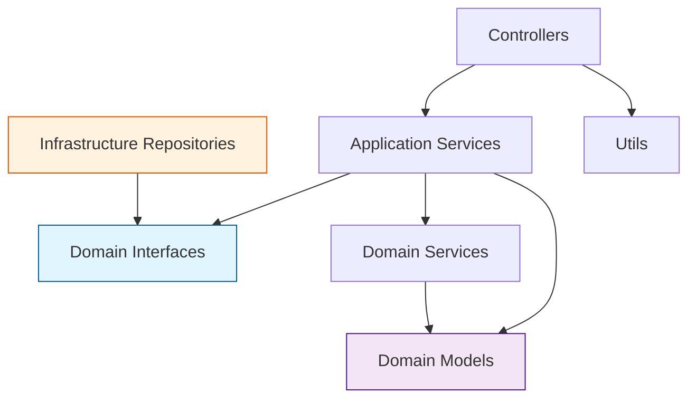

# CSV統合処理関数詳細設計書

## 1. 概要

### 1.1 目的
CSV並列処理システムにおける統合Lambda関数（csv-processor）の詳細設計を定義する。DIP適用レイヤードアーキテクチャに基づき、複数機能を1つのLambda関数内で効率的に管理する。

### 1.2 設計方針
- **依存性逆転の原則（DIP）**: ドメイン層でインターフェース定義、インフラ層で実装
- **統合Lambda関数**: イベントタイプによる機能振り分け
- **レイヤー分離**: Presentation、Application、Domain、Infrastructureの明確な分離
- **テスタビリティ**: モック化による単体テスト容易性

### 1.3 機能構成
csv-processor関数は以下の機能を統合的に提供：
- CSV検証機能（CSV_VALIDATION）
- チャンク処理機能（CSV_CHUNK_PROCESSING）
- 監査ログ機能（AUDIT_LOGGING）
- 結果集約機能（RESULT_AGGREGATION）
- エラーハンドリング機能（ERROR_HANDLING）

## 2. アーキテクチャ設計

### 2.1 DIP適用レイヤード構成

```
functions/csv-processor/
├── index.ts                    # エントリーポイント
├── handler.ts                  # イベント振り分け
├── di/                        # 依存性注入
│   └── DIContainer.ts
├── controllers/               # Presentation Layer
│   ├── validation-controller.ts
│   ├── processing-controller.ts
│   ├── audit-controller.ts
│   ├── aggregation-controller.ts
│   └── error-controller.ts
├── services/                  # Application Service Layer
│   ├── csv-validation-service.ts
│   ├── user-processing-service.ts
│   ├── audit-service.ts
│   └── result-aggregation-service.ts
├── domain/                    # Domain Layer（重要！）
│   ├── models/               # ドメインモデル
│   │   ├── User.ts
│   │   ├── ValidationResult.ts
│   │   ├── ProcessingLog.ts
│   │   └── ProcessingResult.ts
│   ├── interfaces/           # ドメインインターフェース
│   │   ├── IUserRepository.ts
│   │   ├── IAuditLogRepository.ts
│   │   ├── IS3Repository.ts
│   │   └── IProcessingResultRepository.ts
│   └── services/             # ドメインサービス
│       ├── UserDomainService.ts
│       └── ValidationDomainService.ts
├── infrastructure/           # Infrastructure Layer
│   ├── repositories/        # インターフェース実装
│   │   ├── UserRepository.ts
│   │   ├── AuditLogRepository.ts
│   │   ├── S3Repository.ts
│   │   └── ProcessingResultRepository.ts
│   └── aws/                # AWS固有実装
│       ├── AuroraClient.ts
│       ├── DynamoDBClient.ts
│       └── S3Client.ts
└── utils/                   # 関数内ユーティリティ
    ├── event-parser.ts
    ├── response-formatter.ts
    └── error-mapper.ts
```

### 2.2 依存関係図



## 3. 機能詳細設計

### 3.1 CSV検証機能（CSV_VALIDATION）

#### 3.1.1 ValidationController
```typescript
// controllers/validation-controller.ts
export class ValidationController {
  constructor(private csvValidationService: CsvValidationService) {}

  async validate(event: any): Promise<ValidationResult> {
    const s3Event = EventParser.parseS3Event(event);
    const result = await this.csvValidationService.validate(s3Event);
    
    return ResponseFormatter.formatValidationResult(result);
  }
}
```

#### 3.1.2 CsvValidationService
```typescript
// services/csv-validation-service.ts
export class CsvValidationService {
  constructor(
    private s3Repository: IS3Repository,
    private validationDomainService: ValidationDomainService
  ) {}

  async validate(s3Event: S3EventData): Promise<ValidationResult> {
    // S3からCSVファイル取得
    const csvContent = await this.s3Repository.getObject(
      s3Event.bucketName, 
      s3Event.objectKey
    );

    // ドメインサービスで検証実行
    const validationResult = this.validationDomainService.validateCsv(csvContent);

    return validationResult;
  }
}
```

#### 3.1.3 ValidationDomainService
```typescript
// domain/services/ValidationDomainService.ts
export class ValidationDomainService {
  validateCsv(csvContent: string): ValidationResult {
    const errors: ValidationError[] = [];
    
    // ヘッダー検証
    const headerValidation = this.validateHeaders(csvContent);
    if (!headerValidation.isValid) {
      errors.push(...headerValidation.errors);
    }

    // データ形式検証
    const dataValidation = this.validateDataFormat(csvContent);
    if (!dataValidation.isValid) {
      errors.push(...dataValidation.errors);
    }

    return ValidationResult.create(
      errors.length === 0,
      errors,
      this.generateStatistics(csvContent)
    );
  }

  private validateHeaders(csvContent: string): HeaderValidationResult {
    // ヘッダー検証ロジック
    const lines = csvContent.split('\n');
    const headers = lines[0].split(',');
    
    const expectedHeaders = ['ユーザーID', 'ログイン回数', '投稿回数'];
    const isValid = expectedHeaders.every(header => headers.includes(header));
    
    return new HeaderValidationResult(isValid, isValid ? [] : [
      new ValidationError('INVALID_HEADER', '必要なヘッダーが不足しています')
    ]);
  }
}
```

### 3.2 チャンク処理機能（CSV_CHUNK_PROCESSING）

#### 3.2.1 ProcessingController
```typescript
// controllers/processing-controller.ts
export class ProcessingController {
  constructor(private userProcessingService: UserProcessingService) {}

  async processChunk(event: any): Promise<ProcessingResult> {
    const chunkData = EventParser.parseChunkEvent(event);
    const result = await this.userProcessingService.processUserLog(chunkData);
    
    return ResponseFormatter.formatProcessingResult(result);
  }
}
```

#### 3.2.2 UserProcessingService
```typescript
// services/user-processing-service.ts
export class UserProcessingService {
  constructor(
    private userRepository: IUserRepository,
    private auditRepository: IAuditLogRepository,
    private userDomainService: UserDomainService
  ) {}

  async processUserLog(userLogData: UserLogData): Promise<ProcessingResult> {
    // ドメインオブジェクトの取得
    const user = await this.userRepository.findById(userLogData.userId);
    if (!user) {
      throw new UserNotFoundError(userLogData.userId);
    }

    // ドメインサービスでビジネスルール適用
    const updatedUser = this.userDomainService.updateStatistics(
      user,
      userLogData.loginCount,
      userLogData.postCount
    );

    // データ永続化
    await this.userRepository.update(updatedUser);

    // 監査ログ記録
    const auditLog = ProcessingLog.createSuccessLog(
      userLogData.executionName,
      updatedUser.id,
      user.statistics,
      updatedUser.statistics
    );
    await this.auditRepository.record(auditLog);

    return ProcessingResult.fromUser(updatedUser);
  }
}
```

### 3.3 ドメインモデル設計

#### 3.3.1 User（ドメインモデル）
```typescript
// domain/models/User.ts
export class User {
  constructor(
    public readonly id: string,
    public readonly username: string,
    public readonly email: string,
    private _statistics: UserStatistics,
    public readonly createdAt: Date,
    public readonly updatedAt: Date
  ) {
    this.validateId(id);
    this.validateEmail(email);
  }

  get statistics(): UserStatistics {
    return this._statistics;
  }

  // ドメインロジック: 統計更新
  updateStatistics(loginCount: number, postCount: number): void {
    if (loginCount < 0 || postCount < 0) {
      throw new InvalidStatisticsError('統計値は0以上である必要があります');
    }
    
    if (loginCount < this._statistics.loginCount) {
      throw new InvalidStatisticsError('ログイン回数は減少できません');
    }
    
    this._statistics = new UserStatistics(loginCount, postCount);
  }

  private validateId(id: string): void {
    if (!/^U\d{5}$/.test(id)) {
      throw new InvalidUserIdError(`無効なユーザーID形式: ${id}`);
    }
  }

  private validateEmail(email: string): void {
    const emailRegex = /^[^\s@]+@[^\s@]+\.[^\s@]+$/;
    if (!emailRegex.test(email)) {
      throw new InvalidEmailError(`無効なメールアドレス: ${email}`);
    }
  }
}

export class UserStatistics {
  constructor(
    public readonly loginCount: number,
    public readonly postCount: number
  ) {
    if (loginCount < 0 || postCount < 0) {
      throw new InvalidStatisticsError('統計値は0以上である必要があります');
    }
  }
}
```

### 3.4 インフラストラクチャ実装

#### 3.4.1 UserRepository（インフラ実装）
```typescript
// infrastructure/repositories/UserRepository.ts
import { IUserRepository } from '../../domain/interfaces/IUserRepository';
import { User } from '../../domain/models/User';

export class UserRepository implements IUserRepository {
  constructor(private auroraClient: IAuroraClient) {}

  async findById(userId: string): Promise<User | null> {
    const result = await this.auroraClient.query(
      `SELECT u.user_id, u.username, u.email, u.created_at, u.updated_at,
              us.login_count, us.post_count, us.last_updated
       FROM users u 
       JOIN user_statistics us ON u.user_id = us.user_id 
       WHERE u.user_id = $1`,
      [userId]
    );
    
    return result.records.length > 0 
      ? this.toDomainModel(result.records[0])
      : null;
  }

  async update(user: User): Promise<void> {
    await this.auroraClient.transaction([
      {
        sql: `UPDATE user_statistics 
              SET login_count = $1, post_count = $2, last_updated = NOW() 
              WHERE user_id = $3`,
        params: [
          user.statistics.loginCount, 
          user.statistics.postCount, 
          user.id
        ]
      }
    ]);
  }

  private toDomainModel(record: any): User {
    return new User(
      record.user_id,
      record.username,
      record.email,
      new UserStatistics(record.login_count, record.post_count),
      new Date(record.created_at),
      new Date(record.updated_at)
    );
  }
}
```

## 4. エラーハンドリング設計

### 4.1 ドメインエラー定義
```typescript
// domain/errors/DomainErrors.ts
export abstract class DomainError extends Error {
  abstract readonly code: string;
  abstract readonly statusCode: number;
  readonly timestamp: string;

  constructor(message: string) {
    super(message);
    this.name = this.constructor.name;
    this.timestamp = new Date().toISOString();
  }
}

export class UserNotFoundError extends DomainError {
  readonly code = 'USER_NOT_FOUND';
  readonly statusCode = 404;

  constructor(userId: string) {
    super(`ユーザーが見つかりません: ${userId}`);
  }
}

export class InvalidStatisticsError extends DomainError {
  readonly code = 'INVALID_STATISTICS';
  readonly statusCode = 400;

  constructor(message: string) {
    super(message);
  }
}
```

### 4.2 ErrorController
```typescript
// controllers/error-controller.ts
export class ErrorController {
  constructor(private auditRepository: IAuditLogRepository) {}

  async handleError(error: Error, event: any): Promise<ErrorResponse> {
    const errorLog = ProcessingLog.createErrorLog(
      event.executionName || 'unknown',
      error.message,
      event
    );
    
    await this.auditRepository.record(errorLog);

    if (error instanceof DomainError) {
      return ResponseFormatter.formatDomainError(error);
    }

    return ResponseFormatter.formatSystemError(error);
  }
}
```

## 5. テスト設計

### 5.1 単体テスト構成
```
tests/unit/
├── controllers/
│   ├── validation-controller.test.ts
│   ├── processing-controller.test.ts
│   └── error-controller.test.ts
├── services/
│   ├── csv-validation-service.test.ts
│   └── user-processing-service.test.ts
├── domain/
│   ├── models/
│   │   ├── User.test.ts
│   │   └── ValidationResult.test.ts
│   └── services/
│       ├── UserDomainService.test.ts
│       └── ValidationDomainService.test.ts
└── infrastructure/
    └── repositories/
        ├── UserRepository.test.ts
        └── AuditLogRepository.test.ts
```

### 5.2 テスト実装例
```typescript
// tests/unit/services/user-processing-service.test.ts
describe('UserProcessingService', () => {
  let service: UserProcessingService;
  let mockUserRepository: jest.Mocked<IUserRepository>;
  let mockAuditRepository: jest.Mocked<IAuditLogRepository>;
  let userDomainService: UserDomainService;

  beforeEach(() => {
    mockUserRepository = {
      findById: jest.fn(),
      update: jest.fn(),
    };
    mockAuditRepository = {
      record: jest.fn(),
    };
    userDomainService = new UserDomainService();
    
    service = new UserProcessingService(
      mockUserRepository, 
      mockAuditRepository, 
      userDomainService
    );
  });

  describe('processUserLog', () => {
    it('should successfully process user log', async () => {
      // Arrange
      const existingUser = new User(
        'U00001',
        'testuser',
        'test@example.com',
        new UserStatistics(10, 20),
        new Date(),
        new Date()
      );
      mockUserRepository.findById.mockResolvedValue(existingUser);

      const userLogData = {
        userId: 'U00001',
        loginCount: 12,
        postCount: 25,
        executionName: 'test-execution'
      };

      // Act
      const result = await service.processUserLog(userLogData);

      // Assert
      expect(result.userId).toBe('U00001');
      expect(result.statistics.loginCount).toBe(12);
      expect(result.statistics.postCount).toBe(25);
      expect(mockUserRepository.update).toHaveBeenCalled();
      expect(mockAuditRepository.record).toHaveBeenCalled();
    });

    it('should throw UserNotFoundError when user does not exist', async () => {
      // Arrange
      mockUserRepository.findById.mockResolvedValue(null);

      const userLogData = {
        userId: 'U99999',
        loginCount: 5,
        postCount: 10,
        executionName: 'test-execution'
      };

      // Act & Assert
      await expect(service.processUserLog(userLogData))
        .rejects
        .toThrow(UserNotFoundError);
    });
  });
});
```

## 6. パフォーマンス最適化

### 6.1 Lambda Cold Start対策
- DIコンテナの関数レベル初期化
- 接続プールの再利用
- レイヤーによる依存関係の最適化

### 6.2 メモリ・タイムアウト設定
- メモリサイズ: 1024MB（複数機能統合のため）
- タイムアウト: 900秒（15分）
- 同時実行数: 5（並列処理制限）

この設計により、DIP適用レイヤードアーキテクチャに基づく保守性・テスタビリティ・拡張性の高い統合Lambda関数を実現します。