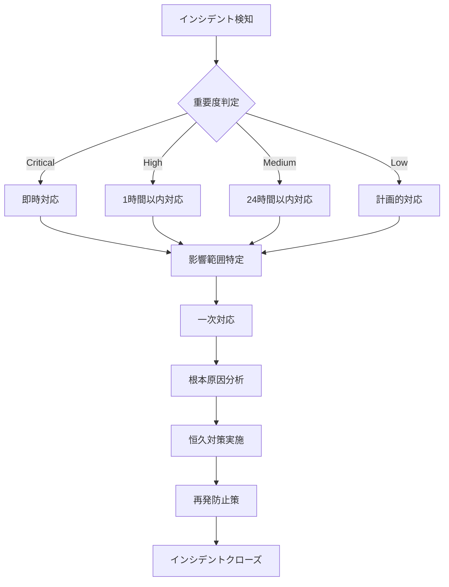

# 詳細設計書：セキュリティ詳細設計

## 1. ドキュメント情報

| 項目 | 内容 |
|------|------|
| ドキュメント名 | セキュリティ詳細設計書 |
| バージョン | 1.0 |
| 作成日 | 2025-08-03 |
| 作成者 | システム設計チーム |
| 最終更新日 | 2025-08-03 |
| ステータス | ドラフト |

## 2. 目次

1. [ドキュメント情報](#1-ドキュメント情報)
2. [目次](#2-目次)
3. [概要](#3-概要)
4. [セキュリティアーキテクチャ](#4-セキュリティアーキテクチャ)
5. [認証・認可設計](#5-認証認可設計)
6. [暗号化設計](#6-暗号化設計)
7. [ネットワークセキュリティ設計](#7-ネットワークセキュリティ設計)
8. [データ保護設計](#8-データ保護設計)
9. [監査・ログ設計](#9-監査ログ設計)
10. [脆弱性対策](#10-脆弱性対策)
11. [インシデント対応](#11-インシデント対応)
12. [コンプライアンス](#12-コンプライアンス)

## 3. 概要

### 3.1 目的

本書は、CSVファイル並列処理システムにおけるセキュリティ要件を実現するための詳細設計を定義する。AWSのセキュリティベストプラクティスに準拠し、データの機密性、完全性、可用性を確保する。

### 3.2 適用範囲

- CSVファイル並列処理システムの全コンポーネント
- 外部システムとの連携インターフェース
- 運用管理機能
- 監査・ログ機能

### 3.3 セキュリティ設計原則

1. **ゼロトラストセキュリティ**：すべてのアクセスを検証
2. **最小権限の原則**：必要最小限の権限のみ付与
3. **多層防御**：複数のセキュリティレイヤーで保護
4. **セキュリティバイデザイン**：設計段階からセキュリティを組み込み
5. **継続的な監視と改善**：セキュリティ状態の常時監視

## 4. セキュリティアーキテクチャ

### 4.1 全体構成

```
┌─────────────────────────────────────────────────────────────┐
│                    外部システム (IP制限)                       │
└───────────────────┬─────────────────────────────────────────┘
                    │ HTTPS + External ID認証
┌───────────────────▼─────────────────────────────────────────┐
│                  AWS Account Boundary                        │
│  ┌────────────────────────────────────────────────────────┐ │
│  │                    VPC (10.0.1.0/24)                    │ │
│  │  ┌──────────────┐  ┌──────────────┐  ┌─────────────┐ │ │
│  │  │Private Subnet│  │Private Subnet│  │Private Subnet│ │ │
│  │  │   (AZ-1a)    │  │   (AZ-1c)    │  │   (AZ-1d)   │ │ │
│  │  └──────────────┘  └──────────────┘  └─────────────┘ │ │
│  │         │                 │                 │         │ │
│  │  ┌──────▼─────────────────▼─────────────────▼──────┐ │ │
│  │  │           VPC Endpoints (Interface)              │ │ │
│  │  │  - Lambda  - Step Functions  - Secrets Manager  │ │ │
│  │  └─────────────────────────────────────────────────┘ │ │
│  └────────────────────────────────────────────────────────┘ │
│                                                              │
│  ┌────────────────────────────────────────────────────────┐ │
│  │                    IAM Roles & Policies                 │ │
│  │  - Step Functions Execution Role                        │ │
│  │  - Lambda Function Roles (最小権限)                     │ │
│  │  - Cross Account Access Role                           │ │
│  └────────────────────────────────────────────────────────┘ │
│                                                              │
│  ┌────────────────────────────────────────────────────────┐ │
│  │                    KMS Encryption Keys                  │ │
│  │  - S3 Encryption Key                                   │ │
│  │  - DynamoDB Encryption Key                             │ │
│  │  - CloudWatch Logs Encryption Key                      │ │
│  │  - Secrets Manager Encryption Key                      │ │
│  └────────────────────────────────────────────────────────┘ │
└──────────────────────────────────────────────────────────────┘
```

### 4.2 セキュリティレイヤー

| レイヤー | コンポーネント | セキュリティ機能 |
|---------|--------------|----------------|
| アプリケーション層 | Lambda関数 | 入力検証、エラーハンドリング |
| データ層 | S3, DynamoDB, Aurora | 暗号化、アクセス制御 |
| ネットワーク層 | VPC, Security Groups | ネットワーク分離、通信制御 |
| 認証・認可層 | IAM, Secrets Manager | 認証、権限管理 |
| 監査層 | CloudWatch, CloudTrail | ログ記録、監視 |

## 5. 認証・認可設計

### 5.1 IAMロール設計

#### 5.1.1 Step Functions実行ロール

```json
{
  "RoleName": "csv-stepfunctions-execution-role",
  "AssumeRolePolicyDocument": {
    "Version": "2012-10-17",
    "Statement": [{
      "Effect": "Allow",
      "Principal": {
        "Service": "states.amazonaws.com"
      },
      "Action": "sts:AssumeRole"
    }]
  },
  "Policies": [
    {
      "PolicyName": "LambdaInvokePolicy",
      "PolicyDocument": {
        "Version": "2012-10-17",
        "Statement": [
          {
            "Effect": "Allow",
            "Action": [
              "lambda:InvokeFunction"
            ],
            "Resource": [
              "arn:aws:lambda:*:*:function:csv-*"
            ]
          },
          {
            "Effect": "Allow",
            "Action": [
              "logs:CreateLogGroup",
              "logs:CreateLogStream",
              "logs:PutLogEvents"
            ],
            "Resource": "*"
          }
        ]
      }
    }
  ]
}
```

#### 5.1.2 Lambda関数ロール（CSV検証関数の例）

```json
{
  "RoleName": "csv-lambda-validator-role",
  "AssumeRolePolicyDocument": {
    "Version": "2012-10-17",
    "Statement": [{
      "Effect": "Allow",
      "Principal": {
        "Service": "lambda.amazonaws.com"
      },
      "Action": "sts:AssumeRole",
      "Condition": {
        "StringEquals": {
          "aws:SourceAccount": "${AWS_ACCOUNT_ID}"
        }
      }
    }]
  },
  "ManagedPolicyArns": [
    "arn:aws:iam::aws:policy/service-role/AWSLambdaVPCAccessExecutionRole"
  ],
  "Policies": [
    {
      "PolicyName": "S3AccessPolicy",
      "PolicyDocument": {
        "Version": "2012-10-17",
        "Statement": [
          {
            "Effect": "Allow",
            "Action": [
              "s3:GetObject",
              "s3:GetObjectVersion"
            ],
            "Resource": [
              "arn:aws:s3:::csv-input-bucket/*"
            ],
            "Condition": {
              "StringEquals": {
                "s3:x-amz-server-side-encryption": "aws:kms"
              }
            }
          },
          {
            "Effect": "Allow",
            "Action": [
              "kms:Decrypt"
            ],
            "Resource": [
              "arn:aws:kms:*:*:key/*"
            ],
            "Condition": {
              "StringEquals": {
                "kms:ViaService": "s3.ap-northeast-1.amazonaws.com"
              }
            }
          }
        ]
      }
    }
  ]
}
```

#### 5.1.3 クロスアカウントアクセスロール

```json
{
  "RoleName": "S3-CrossAccount-Upload-Role",
  "AssumeRolePolicyDocument": {
    "Version": "2012-10-17",
    "Statement": [{
      "Effect": "Allow",
      "Principal": {
        "AWS": "arn:aws:iam::EXTERNAL_ACCOUNT_ID:root"
      },
      "Action": "sts:AssumeRole",
      "Condition": {
        "StringEquals": {
          "sts:ExternalId": "${EXTERNAL_ID}"
        },
        "IpAddress": {
          "aws:SourceIp": [
            "203.0.113.0/24",
            "198.51.100.0/24"
          ]
        }
      }
    }]
  },
  "Policies": [
    {
      "PolicyName": "S3UploadPolicy",
      "PolicyDocument": {
        "Version": "2012-10-17",
        "Statement": [
          {
            "Effect": "Allow",
            "Action": [
              "s3:PutObject",
              "s3:PutObjectAcl"
            ],
            "Resource": [
              "arn:aws:s3:::csv-input-bucket/incoming/*"
            ],
            "Condition": {
              "StringEquals": {
                "s3:x-amz-server-side-encryption": "aws:kms",
                "s3:x-amz-acl": "bucket-owner-full-control"
              }
            }
          }
        ]
      }
    }
  ]
}
```

### 5.2 Secrets Manager設計

#### 5.2.1 Aurora認証情報

```json
{
  "SecretName": "csv-processing/aurora/credentials",
  "SecretType": "AWS::RDS::DBClusterSecret",
  "GenerateSecretString": {
    "SecretStringTemplate": "{\"username\": \"csv_processor\"}",
    "GenerateStringKey": "password",
    "PasswordLength": 32,
    "ExcludeCharacters": " %+~`#$&*()|[]{}:;<>?!'/\\\""
  },
  "RotationRules": {
    "AutomaticallyAfterDays": 30
  },
  "ResourcePolicy": {
    "Version": "2012-10-17",
    "Statement": [
      {
        "Effect": "Allow",
        "Principal": {
          "AWS": [
            "arn:aws:iam::*:role/csv-lambda-*"
          ]
        },
        "Action": "secretsmanager:GetSecretValue",
        "Resource": "*"
      }
    ]
  }
}
```

#### 5.2.2 外部APIキー

```json
{
  "SecretName": "csv-processing/external-api/keys",
  "SecretString": {
    "api_key": "${API_KEY}",
    "api_secret": "${API_SECRET}",
    "endpoint": "https://api.external-system.com"
  },
  "KmsKeyId": "alias/secrets-csv-processing",
  "Tags": [
    {
      "Key": "DataClassification",
      "Value": "Confidential"
    }
  ]
}
```

## 6. 暗号化設計

### 6.1 KMS暗号化キー設計

#### 6.1.1 S3暗号化キー

```json
{
  "Alias": "alias/s3-csv-processing",
  "Description": "CSV処理システムS3バケット暗号化用",
  "KeyPolicy": {
    "Version": "2012-10-17",
    "Statement": [
      {
        "Sid": "Enable IAM User Permissions",
        "Effect": "Allow",
        "Principal": {
          "AWS": "arn:aws:iam::*:root"
        },
        "Action": "kms:*",
        "Resource": "*"
      },
      {
        "Sid": "Allow S3 to use the key",
        "Effect": "Allow",
        "Principal": {
          "Service": "s3.amazonaws.com"
        },
        "Action": [
          "kms:Decrypt",
          "kms:GenerateDataKey"
        ],
        "Resource": "*"
      },
      {
        "Sid": "Allow Lambda functions to decrypt",
        "Effect": "Allow",
        "Principal": {
          "AWS": [
            "arn:aws:iam::*:role/csv-lambda-*"
          ]
        },
        "Action": [
          "kms:Decrypt",
          "kms:DescribeKey"
        ],
        "Resource": "*",
        "Condition": {
          "StringEquals": {
            "kms:ViaService": "s3.ap-northeast-1.amazonaws.com"
          }
        }
      }
    ]
  }
}
```

#### 6.1.2 DynamoDB暗号化キー

```json
{
  "Alias": "alias/dynamodb-csv-processing",
  "Description": "CSV処理システムDynamoDBテーブル暗号化用",
  "KeyPolicy": {
    "Version": "2012-10-17",
    "Statement": [
      {
        "Sid": "Enable IAM User Permissions",
        "Effect": "Allow",
        "Principal": {
          "AWS": "arn:aws:iam::*:root"
        },
        "Action": "kms:*",
        "Resource": "*"
      },
      {
        "Sid": "Allow DynamoDB to use the key",
        "Effect": "Allow",
        "Principal": {
          "Service": "dynamodb.amazonaws.com"
        },
        "Action": [
          "kms:Decrypt",
          "kms:GenerateDataKey",
          "kms:CreateGrant",
          "kms:DescribeKey"
        ],
        "Resource": "*",
        "Condition": {
          "StringEquals": {
            "kms:CallerAccount": "${AWS_ACCOUNT_ID}"
          }
        }
      }
    ]
  }
}
```

### 6.2 暗号化実装

#### 6.2.1 S3バケット暗号化設定

```json
{
  "Rules": [
    {
      "ApplyServerSideEncryptionByDefault": {
        "SSEAlgorithm": "aws:kms",
        "KMSMasterKeyID": "alias/s3-csv-processing"
      },
      "BucketKeyEnabled": true
    }
  ]
}
```

#### 6.2.2 転送時の暗号化

- すべてのAPI通信はHTTPS（TLS 1.2以上）を使用
- VPCエンドポイント経由の内部通信もTLS暗号化
- S3バケットポリシーでHTTP通信を明示的に拒否

## 7. ネットワークセキュリティ設計

### 7.1 VPC設計

#### 7.1.1 VPC構成

```yaml
VPC:
  CidrBlock: 10.0.1.0/24
  EnableDnsHostnames: true
  EnableDnsSupport: true
  Tags:
    - Key: Name
      Value: csv-processing-vpc

PrivateSubnets:
  - SubnetId: subnet-1a
    CidrBlock: 10.0.1.0/26
    AvailabilityZone: ap-northeast-1a
  - SubnetId: subnet-1c
    CidrBlock: 10.0.1.64/26
    AvailabilityZone: ap-northeast-1c
  - SubnetId: subnet-1d
    CidrBlock: 10.0.1.128/26
    AvailabilityZone: ap-northeast-1d
```

#### 7.1.2 セキュリティグループ設計

##### Lambda関数用セキュリティグループ

```json
{
  "GroupName": "csv-lambda-sg",
  "GroupDescription": "Security group for Lambda functions",
  "VpcId": "${VPC_ID}",
  "SecurityGroupIngress": [],
  "SecurityGroupEgress": [
    {
      "IpProtocol": "tcp",
      "FromPort": 443,
      "ToPort": 443,
      "CidrIp": "0.0.0.0/0",
      "Description": "HTTPS for AWS services"
    },
    {
      "IpProtocol": "tcp",
      "FromPort": 5432,
      "ToPort": 5432,
      "DestinationSecurityGroupId": "${AURORA_SG_ID}",
      "Description": "Aurora PostgreSQL"
    }
  ]
}
```

##### Aurora用セキュリティグループ

```json
{
  "GroupName": "csv-aurora-sg",
  "GroupDescription": "Security group for Aurora cluster",
  "VpcId": "${VPC_ID}",
  "SecurityGroupIngress": [
    {
      "IpProtocol": "tcp",
      "FromPort": 5432,
      "ToPort": 5432,
      "SourceSecurityGroupId": "${LAMBDA_SG_ID}",
      "Description": "PostgreSQL from Lambda"
    }
  ],
  "SecurityGroupEgress": []
}
```

### 7.2 VPCエンドポイント設計

#### 7.2.1 Gateway型エンドポイント

```yaml
S3Endpoint:
  ServiceName: com.amazonaws.ap-northeast-1.s3
  RouteTableIds:
    - ${PRIVATE_ROUTE_TABLE_ID}
  PolicyDocument:
    Statement:
      - Effect: Allow
        Principal: "*"
        Action:
          - s3:GetObject
          - s3:PutObject
        Resource:
          - arn:aws:s3:::csv-*/*

DynamoDBEndpoint:
  ServiceName: com.amazonaws.ap-northeast-1.dynamodb
  RouteTableIds:
    - ${PRIVATE_ROUTE_TABLE_ID}
```

#### 7.2.2 Interface型エンドポイント

```yaml
LambdaEndpoint:
  ServiceName: com.amazonaws.ap-northeast-1.lambda
  VpcEndpointType: Interface
  SubnetIds:
    - ${PRIVATE_SUBNET_1A}
    - ${PRIVATE_SUBNET_1C}
    - ${PRIVATE_SUBNET_1D}
  SecurityGroupIds:
    - ${VPC_ENDPOINT_SG_ID}
  PrivateDnsEnabled: true

StepFunctionsEndpoint:
  ServiceName: com.amazonaws.ap-northeast-1.states
  VpcEndpointType: Interface
  SubnetIds:
    - ${PRIVATE_SUBNET_1A}
    - ${PRIVATE_SUBNET_1C}
    - ${PRIVATE_SUBNET_1D}
  SecurityGroupIds:
    - ${VPC_ENDPOINT_SG_ID}
  PrivateDnsEnabled: true
```

## 8. データ保護設計

### 8.1 データ分類

| 分類レベル | 説明 | 対象データ | 保護要件 |
|-----------|------|----------|---------|
| Confidential | 機密情報 | 個人情報、認証情報 | 暗号化必須、アクセス制限 |
| Internal | 内部情報 | 処理データ、ログ | 暗号化推奨、内部アクセスのみ |
| Public | 公開情報 | なし | 基本的な保護 |

### 8.2 S3バケットポリシー

#### 8.2.1 csv-input-bucketポリシー

```json
{
  "Version": "2012-10-17",
  "Statement": [
    {
      "Sid": "DenyInsecureConnections",
      "Effect": "Deny",
      "Principal": "*",
      "Action": "s3:*",
      "Resource": [
        "arn:aws:s3:::csv-input-bucket/*"
      ],
      "Condition": {
        "Bool": {
          "aws:SecureTransport": "false"
        }
      }
    },
    {
      "Sid": "DenyUnencryptedObjectUploads",
      "Effect": "Deny",
      "Principal": "*",
      "Action": "s3:PutObject",
      "Resource": "arn:aws:s3:::csv-input-bucket/*",
      "Condition": {
        "StringNotEquals": {
          "s3:x-amz-server-side-encryption": "aws:kms"
        }
      }
    },
    {
      "Sid": "AllowCrossAccountUpload",
      "Effect": "Allow",
      "Principal": {
        "AWS": "arn:aws:iam::EXTERNAL_ACCOUNT:role/S3-CrossAccount-Upload-Role"
      },
      "Action": [
        "s3:PutObject",
        "s3:PutObjectAcl"
      ],
      "Resource": "arn:aws:s3:::csv-input-bucket/incoming/*",
      "Condition": {
        "StringEquals": {
          "s3:x-amz-acl": "bucket-owner-full-control"
        },
        "IpAddress": {
          "aws:SourceIp": [
            "203.0.113.0/24",
            "198.51.100.0/24"
          ]
        }
      }
    }
  ]
}
```

### 8.3 データライフサイクル管理

#### 8.3.1 S3ライフサイクルポリシー

```json
{
  "Rules": [
    {
      "Id": "ArchiveProcessedFiles",
      "Status": "Enabled",
      "Transitions": [
        {
          "Days": 30,
          "StorageClass": "STANDARD_IA"
        },
        {
          "Days": 90,
          "StorageClass": "GLACIER"
        }
      ],
      "NoncurrentVersionExpiration": {
        "NoncurrentDays": 7
      }
    },
    {
      "Id": "DeleteTempFiles",
      "Status": "Enabled",
      "Prefix": "temp/",
      "Expiration": {
        "Days": 1
      }
    }
  ]
}
```

#### 8.3.2 DynamoDB TTL設定

```yaml
ProcessingLogs:
  TimeToLiveSpecification:
    AttributeName: TTL
    Enabled: true
  # TTL値は作成時から6ヶ月後（15552000秒）に設定
```

## 9. 監査・ログ設計

### 9.1 CloudTrail設定

```json
{
  "TrailName": "csv-processing-trail",
  "S3BucketName": "csv-audit-logs-bucket",
  "IncludeGlobalServiceEvents": true,
  "IsMultiRegionTrail": false,
  "EnableLogFileValidation": true,
  "EventSelectors": [
    {
      "ReadWriteType": "All",
      "IncludeManagementEvents": true,
      "DataResources": [
        {
          "Type": "AWS::S3::Object",
          "Values": [
            "arn:aws:s3:::csv-*/",
            "arn:aws:s3:::csv-*/*"
          ]
        },
        {
          "Type": "AWS::DynamoDB::Table",
          "Values": [
            "arn:aws:dynamodb:*:*:table/CSV*"
          ]
        }
      ]
    }
  ],
  "InsightSelectors": [
    {
      "InsightType": "ApiCallRateInsight"
    }
  ]
}
```

### 9.2 CloudWatch Logs設定

#### 9.2.1 ロググループ設計

| ロググループ名 | 保持期間 | 暗号化 | 用途 |
|--------------|---------|--------|------|
| /aws/lambda/csv-processor | 30日 | KMS | CSV検証ログ |
| /aws/lambda/csv-splitter | 30日 | KMS | CSV分割ログ |
| /aws/lambda/csv-chunk-processor | 30日 | KMS | チャンク処理ログ |
| /aws/lambda/csv-processor | 30日 | KMS | エラー処理ログ |
| /aws/lambda/csv-processor | 30日 | KMS | 結果集約ログ |
| /aws/lambda/csv-processor | 90日 | KMS | 監査ログ |
| /aws/stepfunctions/csv-processing | 30日 | KMS | ワークフローログ |
| /aws/vpc/flowlogs | 7日 | KMS | VPCフローログ |

#### 9.2.2 ログサブスクリプションフィルター

```json
{
  "filterName": "SecurityEventFilter",
  "filterPattern": "[timestamp, request_id, event_type=SECURITY_*, ...]",
  "logGroupName": "/aws/lambda/csv-processor",
  "destinationArn": "arn:aws:lambda:*:*:function:security-event-processor"
}
```

### 9.3 監査ログフォーマット

```json
{
  "timestamp": "2025-08-03T10:30:45.123Z",
  "eventType": "FILE_PROCESSED",
  "userId": "external-system-001",
  "sourceIP": "203.0.113.10",
  "fileName": "data_20250803.csv",
  "fileSize": 1048576,
  "recordCount": 10000,
  "processingTime": 45.6,
  "status": "SUCCESS",
  "auditMetadata": {
    "lambdaRequestId": "abc123-def456",
    "stepFunctionExecutionId": "xyz789",
    "kmsKeyId": "alias/s3-csv-processing"
  }
}
```

## 10. 脆弱性対策

### 10.1 入力検証

#### 10.1.1 CSVファイル検証

```python
class CSVValidator:
    MAX_FILE_SIZE = 1024 * 1024 * 1024  # 1GB
    MAX_RECORD_COUNT = 1000000
    ALLOWED_ENCODINGS = ['utf-8', 'shift-jis']
    
    def validate_file(self, file_path):
        # ファイルサイズチェック
        if os.path.getsize(file_path) > self.MAX_FILE_SIZE:
            raise ValidationError("File size exceeds limit")
        
        # エンコーディング検証
        encoding = self.detect_encoding(file_path)
        if encoding not in self.ALLOWED_ENCODINGS:
            raise ValidationError(f"Unsupported encoding: {encoding}")
        
        # ヘッダー検証
        headers = self.validate_headers(file_path, encoding)
        
        # データ型検証
        self.validate_data_types(file_path, headers, encoding)
        
        # SQLインジェクション対策
        self.check_malicious_content(file_path, encoding)
```

#### 10.1.2 APIパラメータ検証

```python
def validate_api_parameters(event):
    schema = {
        "type": "object",
        "properties": {
            "fileName": {
                "type": "string",
                "pattern": "^[a-zA-Z0-9_\\-]+\\.csv$",
                "maxLength": 255
            },
            "processingMode": {
                "type": "string",
                "enum": ["sequential", "parallel"]
            },
            "chunkSize": {
                "type": "integer",
                "minimum": 1000,
                "maximum": 100000
            }
        },
        "required": ["fileName", "processingMode"],
        "additionalProperties": False
    }
    
    validate(instance=event, schema=schema)
```

### 10.2 依存関係管理

#### 10.2.1 Lambdaレイヤー管理

```yaml
DependencyLayer:
  Type: AWS::Lambda::LayerVersion
  Properties:
    LayerName: csv-processing-dependencies
    Content:
      S3Bucket: csv-lambda-layers
      S3Key: dependencies/v1.0.0/layer.zip
    CompatibleRuntimes:
      - python3.9
    Description: |
      Dependencies for CSV processing:
      - pandas==1.5.3
      - numpy==1.24.3
      - boto3==1.26.137
      - jsonschema==4.17.3
```

#### 10.2.2 脆弱性スキャン

```bash
# buildspec.yml
version: 0.2
phases:
  pre_build:
    commands:
      - pip install safety
      - safety check --json > safety-report.json
      - |
        if [ $(jq '.vulnerabilities | length' safety-report.json) -gt 0 ]; then
          echo "Vulnerabilities found!"
          cat safety-report.json
          exit 1
        fi
```

### 10.3 セキュアコーディング

#### 10.3.1 SQLインジェクション対策

```python
# パラメータ化クエリの使用
def insert_processing_record(connection, record):
    query = """
        INSERT INTO processing_logs 
        (file_name, processed_at, record_count, status)
        VALUES (%s, %s, %s, %s)
    """
    
    with connection.cursor() as cursor:
        cursor.execute(query, (
            record['fileName'],
            record['processedAt'],
            record['recordCount'],
            record['status']
        ))
```

#### 10.3.2 シークレット管理

```python
import boto3
from botocore.exceptions import ClientError

class SecretManager:
    def __init__(self):
        self.client = boto3.client('secretsmanager')
        self._cache = {}
    
    def get_secret(self, secret_name):
        if secret_name in self._cache:
            return self._cache[secret_name]
        
        try:
            response = self.client.get_secret_value(
                SecretId=secret_name
            )
            secret = json.loads(response['SecretString'])
            self._cache[secret_name] = secret
            return secret
        except ClientError as e:
            logger.error(f"Failed to retrieve secret: {e}")
            raise
```

## 11. インシデント対応

### 11.1 インシデント検知

#### 11.1.1 CloudWatch Alarms

```json
{
  "AlarmName": "csv-processing-security-breach",
  "MetricName": "SecurityEventCount",
  "Namespace": "CSV/Processing",
  "Statistic": "Sum",
  "Period": 300,
  "EvaluationPeriods": 1,
  "Threshold": 5,
  "ComparisonOperator": "GreaterThanThreshold",
  "AlarmActions": [
    "arn:aws:sns:*:*:security-alerts"
  ],
  "AlarmDescription": "Potential security breach detected"
}
```

#### 11.1.2 EventBridge Rules

```json
{
  "Name": "csv-processing-failed-auth",
  "EventPattern": {
    "source": ["aws.signin"],
    "detail-type": ["AWS Console Sign In via CloudTrail"],
    "detail": {
      "eventName": ["ConsoleLogin"],
      "responseElements": {
        "ConsoleLogin": ["Failure"]
      }
    }
  },
  "Targets": [
    {
      "Arn": "arn:aws:lambda:*:*:function:security-incident-handler",
      "Id": "1"
    }
  ]
}
```

### 11.2 インシデント対応手順

#### 11.2.1 対応フロー



#### 11.2.2 自動隔離機能

```python
def isolate_compromised_resource(resource_type, resource_id):
    if resource_type == "lambda":
        # Lambda関数の無効化
        lambda_client.update_function_configuration(
            FunctionName=resource_id,
            Environment={
                'Variables': {
                    'DISABLED': 'true'
                }
            }
        )
    elif resource_type == "iam_role":
        # IAMロールに拒否ポリシーをアタッチ
        iam_client.attach_role_policy(
            RoleName=resource_id,
            PolicyArn='arn:aws:iam::*:policy/DenyAllPolicy'
        )
    elif resource_type == "s3_bucket":
        # S3バケットへのアクセスをブロック
        s3_client.put_bucket_policy(
            Bucket=resource_id,
            Policy=json.dumps({
                "Version": "2012-10-17",
                "Statement": [{
                    "Effect": "Deny",
                    "Principal": "*",
                    "Action": "s3:*",
                    "Resource": f"arn:aws:s3:::{resource_id}/*"
                }]
            })
        )
```

## 12. コンプライアンス

### 12.1 規制要件対応

| 規制・標準 | 要件 | 実装内容 |
|-----------|------|---------|
| 個人情報保護法 | 個人情報の適切な管理 | 暗号化、アクセス制御、監査ログ |
| GDPR | データ主体の権利保護 | データ削除機能、同意管理 |
| PCI-DSS | カード情報の保護 | 該当なし（カード情報非取扱） |
| ISO 27001 | 情報セキュリティ管理 | ISMS準拠の設計・運用 |

### 12.2 セキュリティチェックリスト

#### 12.2.1 設計フェーズ

- [ ] 脅威モデリングの実施
- [ ] セキュリティ要件の定義
- [ ] データ分類の実施
- [ ] 暗号化要件の確認
- [ ] アクセス制御マトリクスの作成

#### 12.2.2 実装フェーズ

- [ ] セキュアコーディングガイドラインの遵守
- [ ] 入力検証の実装
- [ ] 認証・認可の実装
- [ ] 暗号化の実装
- [ ] ログ出力の実装

#### 12.2.3 テストフェーズ

- [ ] セキュリティテストの実施
- [ ] ペネトレーションテストの実施
- [ ] 脆弱性スキャンの実施
- [ ] コンプライアンステストの実施

#### 12.2.4 運用フェーズ

- [ ] セキュリティ監視の設定
- [ ] インシデント対応体制の確立
- [ ] 定期的なセキュリティレビュー
- [ ] パッチ適用プロセスの確立

### 12.3 監査証跡

#### 12.3.1 保持期間

| ログ種別 | 保持期間 | 保管場所 |
|---------|---------|---------|
| CloudTrail | 1年 | S3 (Glacier) |
| アクセスログ | 1年 | S3 (Glacier) |
| 監査ログ | 3年 | S3 (Glacier Deep Archive) |
| セキュリティイベント | 3年 | S3 (Glacier Deep Archive) |

#### 12.3.2 定期レビュー

```yaml
SecurityReviews:
  - Type: AccessReview
    Frequency: Quarterly
    Scope:
      - IAM Roles
      - S3 Bucket Policies
      - Security Groups
  
  - Type: VulnerabilityAssessment
    Frequency: Monthly
    Scope:
      - Lambda Functions
      - Dependencies
      - Infrastructure
  
  - Type: ComplianceAudit
    Frequency: Annually
    Scope:
      - All security controls
      - Data handling procedures
      - Incident response procedures
```

## 13. 付録

### 13.1 セキュリティ連絡先

| 役割 | 担当 | 連絡先 |
|------|------|--------|
| セキュリティ管理者 | セキュリティチーム | security@example.com |
| インシデント対応 | SOCチーム | soc@example.com |
| 監査対応 | コンプライアンスチーム | compliance@example.com |

### 13.2 参考資料

- [AWS セキュリティベストプラクティス](https://aws.amazon.com/jp/security/security-best-practices/)
- [OWASP Top 10](https://owasp.org/www-project-top-ten/)
- [CIS AWS Foundations Benchmark](https://www.cisecurity.org/benchmark/amazon_web_services)
- [NIST Cybersecurity Framework](https://www.nist.gov/cyberframework)

### 13.3 改訂履歴

| バージョン | 日付 | 変更内容 | 承認者 |
|-----------|------|---------|--------|
| 1.0 | 2025-08-03 | 初版作成 | - |

---

本書は定期的にレビューし、必要に応じて更新すること。