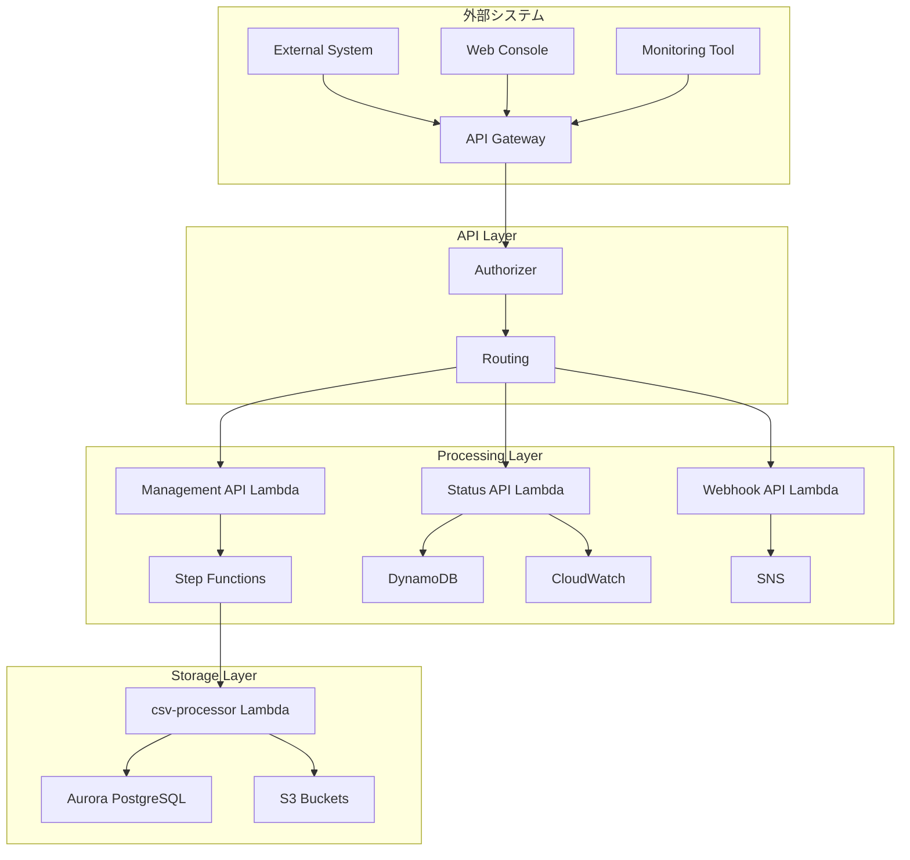

# API詳細設計書

## 1. ドキュメント情報

| 項目 | 内容 |
|------|------|
| ドキュメント名 | API詳細設計書 |
| バージョン | 1.0 |
| 作成日 | 2025-08-04 |
| 作成者 | システム設計チーム |
| 更新日 | 2025-08-04 |
| 承認者 | - |

## 2. 概要

### 2.1 目的
CSVファイル並列処理システムにおける外部連携インターフェース、管理API、監視APIの詳細仕様を定義する。S3イベント駆動型システムの管理機能、ステータス照会機能、および外部システム連携機能を明確化する。

### 2.2 設計方針
- **RESTful API**: HTTP標準メソッドによる統一的なインターフェース
- **OpenAPI準拠**: OpenAPI 3.0仕様による標準化
- **セキュリティ**: IAM認証、API Key、CORS設定
- **可観測性**: 包括的なログ記録とメトリクス収集

### 2.3 API分類
- **管理API**: Step Functions実行管理、ステータス照会
- **監視API**: システム状態、メトリクス取得
- **外部連携API**: 結果通知、エラー通知
- **S3連携**: ファイルアップロード、ダウンロード

## 3. API アーキテクチャ設計

### 3.1 API Gateway構成



### 3.2 API エンドポイント構成

```yaml
APIEndpoints:
  BaseURL: "https://api.csv-processing.company.com/v1"
  
  Management:
    - "/executions"              # Step Functions実行管理
    - "/executions/{id}"         # 個別実行管理
    - "/executions/{id}/status"  # 実行状態照会
    - "/executions/{id}/stop"    # 実行停止
    
  Monitoring:
    - "/health"                  # ヘルスチェック
    - "/metrics"                 # システムメトリクス
    - "/metrics/business"        # ビジネスメトリクス
    - "/logs"                    # ログ検索
    - "/dashboard"               # ダッシュボードデータ
    
  Files:
    - "/files/upload-url"        # S3アップロードURL生成
    - "/files/{id}/status"       # ファイル処理状態
    - "/files/{id}/result"       # 処理結果取得
    - "/files/{id}/download"     # 結果ファイルダウンロード
    
  Webhooks:
    - "/webhooks/completion"     # 処理完了通知受信
    - "/webhooks/error"          # エラー通知受信
    - "/webhooks/test"           # Webhook テスト
```

## 4. Management API詳細設計

### 4.1 Step Functions実行管理

#### 4.1.1 実行一覧取得 API
```yaml
GetExecutions:
  Method: GET
  Path: /executions
  Description: Step Functions実行一覧を取得
  
  Parameters:
    Query:
      - name: status
        type: string
        enum: [RUNNING, SUCCEEDED, FAILED, TIMED_OUT, ABORTED]
        description: 実行状態フィルタ
      - name: limit
        type: integer
        minimum: 1
        maximum: 100
        default: 20
        description: 取得件数制限
      - name: nextToken
        type: string
        description: ページネーショントークン
      - name: startTime
        type: string
        format: date-time
        description: 開始時刻フィルタ（以降）
      - name: endTime
        type: string
        format: date-time
        description: 終了時刻フィルタ（以前）
        
  Responses:
    200:
      description: 成功
      content:
        application/json:
          schema:
            type: object
            properties:
              executions:
                type: array
                items:
                  $ref: '#/components/schemas/ExecutionSummary'
              nextToken:
                type: string
                description: 次のページトークン
              totalCount:
                type: integer
                description: 総件数（概算）
    400:
      $ref: '#/components/responses/BadRequest'
    401:
      $ref: '#/components/responses/Unauthorized'
    500:
      $ref: '#/components/responses/InternalServerError'
```

#### 4.1.2 実行開始 API
```yaml
StartExecution:
  Method: POST
  Path: /executions
  Description: Step Functions実行を開始
  
  RequestBody:
    required: true
    content:
      application/json:
        schema:
          type: object
          required:
            - s3Bucket
            - s3Key
          properties:
            s3Bucket:
              type: string
              description: S3バケット名
              example: "csv-input-123456789012"
            s3Key:
              type: string
              description: S3オブジェクトキー
              example: "incoming/2025/08/04/user-log-20250804-001.csv"
            executionName:
              type: string
              description: 実行名（省略時は自動生成）
              maxLength: 80
              pattern: '^[a-zA-Z0-9_-]+$'
            priority:
              type: string
              enum: [HIGH, NORMAL, LOW]
              default: NORMAL
              description: 実行優先度
            metadata:
              type: object
              description: 実行メタデータ
              properties:
                source:
                  type: string
                  description: 実行元システム
                requestId:
                  type: string
                  description: 要求ID
                userId:
                  type: string
                  description: 実行ユーザー
                  
  Responses:
    201:
      description: 実行開始成功
      content:
        application/json:
          schema:
            type: object
            properties:
              executionArn:
                type: string
                description: 実行ARN
              executionName:
                type: string
                description: 実行名
              startDate:
                type: string
                format: date-time
                description: 開始日時
              status:
                type: string
                enum: [RUNNING]
                description: 実行状態
    409:
      description: 実行名重複
      content:
        application/json:
          schema:
            $ref: '#/components/schemas/Error'
```

#### 4.1.3 実行状態取得 API
```yaml
GetExecutionStatus:
  Method: GET
  Path: /executions/{executionId}/status
  Description: Step Functions実行状態を取得
  
  Parameters:
    Path:
      - name: executionId
        type: string
        required: true
        description: 実行ID（実行名またはARN末尾）
        
  Responses:
    200:
      description: 成功
      content:
        application/json:
          schema:
            $ref: '#/components/schemas/ExecutionDetail'
    404:
      description: 実行が見つからない
      content:
        application/json:
          schema:
            $ref: '#/components/schemas/Error'
```

#### 4.1.4 実行停止 API
```yaml
StopExecution:
  Method: POST
  Path: /executions/{executionId}/stop
  Description: Step Functions実行を停止
  
  Parameters:
    Path:
      - name: executionId
        type: string
        required: true
        description: 実行ID
        
  RequestBody:
    content:
      application/json:
        schema:
          type: object
          properties:
            cause:
              type: string
              description: 停止理由
              maxLength: 32768
            error:
              type: string
              description: エラーコード
              maxLength: 256
              
  Responses:
    200:
      description: 停止成功
      content:
        application/json:
          schema:
            type: object
            properties:
              stopDate:
                type: string
                format: date-time
                description: 停止日時
              status:
                type: string
                enum: [ABORTED]
                description: 実行状態
    404:
      description: 実行が見つからない
    409:
      description: 停止不可能な状態
```

## 5. Monitoring API詳細設計

### 5.1 ヘルスチェック API

#### 5.1.1 システム ヘルスチェック
```yaml
HealthCheck:
  Method: GET
  Path: /health
  Description: システム全体のヘルスチェック
  
  Responses:
    200:
      description: システム正常
      content:
        application/json:
          schema:
            type: object
            properties:
              status:
                type: string
                enum: [healthy, degraded, unhealthy]
              timestamp:
                type: string
                format: date-time
              version:
                type: string
                description: システムバージョン
              checks:
                type: object
                properties:
                  stepFunctions:
                    $ref: '#/components/schemas/HealthCheckResult'
                  lambda:
                    $ref: '#/components/schemas/HealthCheckResult'
                  database:
                    $ref: '#/components/schemas/HealthCheckResult'
                  storage:
                    $ref: '#/components/schemas/HealthCheckResult'
    503:
      description: システム異常
      content:
        application/json:
          schema:
            type: object
            properties:
              status:
                type: string
                enum: [unhealthy]
              timestamp:
                type: string
                format: date-time
              errors:
                type: array
                items:
                  type: string
```

### 5.2 メトリクス取得 API

#### 5.2.1 システムメトリクス取得
```yaml
GetSystemMetrics:
  Method: GET
  Path: /metrics
  Description: システムメトリクスを取得
  
  Parameters:
    Query:
      - name: startTime
        type: string
        format: date-time
        required: true
        description: 開始時刻
      - name: endTime
        type: string
        format: date-time
        required: true
        description: 終了時刻
      - name: period
        type: integer
        enum: [60, 300, 3600]
        default: 300
        description: データポイント間隔（秒）
      - name: metrics
        type: array
        items:
          type: string
          enum: [duration, errors, invocations, concurrency, throughput]
        description: 取得メトリクス指定
        
  Responses:
    200:
      description: 成功
      content:
        application/json:
          schema:
            type: object
            properties:
              timeRange:
                type: object
                properties:
                  startTime:
                    type: string
                    format: date-time
                  endTime:
                    type: string
                    format: date-time
              metrics:
                type: object
                properties:
                  lambda:
                    $ref: '#/components/schemas/LambdaMetrics'
                  stepFunctions:
                    $ref: '#/components/schemas/StepFunctionsMetrics'
                  system:
                    $ref: '#/components/schemas/SystemMetrics'
```

#### 5.2.2 ビジネスメトリクス取得  
```yaml
GetBusinessMetrics:
  Method: GET
  Path: /metrics/business
  Description: ビジネスメトリクスを取得
  
  Parameters:
    Query:
      - name: startTime
        type: string
        format: date-time
        required: true
      - name: endTime
        type: string
        format: date-time
        required: true
      - name: aggregation
        type: string
        enum: [hourly, daily, weekly]
        default: hourly
        description: 集計単位
        
  Responses:
    200:
      description: 成功
      content:
        application/json:
          schema:
            type: object
            properties:
              summary:
                type: object
                properties:
                  totalFiles:
                    type: integer
                    description: 処理ファイル総数
                  totalRecords:
                    type: integer
                    description: 処理レコード総数
                  successRate:
                    type: number
                    format: float
                    description: 成功率（%）
                  averageProcessingTime:
                    type: number
                    format: float
                    description: 平均処理時間（秒）
              timeSeries:
                type: array
                items:
                  $ref: '#/components/schemas/BusinessMetricPoint'
```

## 6. File Management API詳細設計

### 6.1 ファイル操作 API

#### 6.1.1 アップロードURL生成 API
```yaml
GenerateUploadUrl:
  Method: POST
  Path: /files/upload-url
  Description: S3アップロード用の署名付きURL生成
  
  RequestBody:
    required: true
    content:
      application/json:
        schema:
          type: object
          required:
            - fileName
          properties:
            fileName:
              type: string
              description: ファイル名
              pattern: '^[a-zA-Z0-9._-]+\\.csv$'
              maxLength: 255
            contentType:
              type: string
              default: "text/csv"
              description: コンテンツタイプ
            expiresIn:
              type: integer
              minimum: 60
              maximum: 3600
              default: 3600
              description: URL有効期限（秒）
            metadata:
              type: object
              description: ファイルメタデータ
              properties:
                source:
                  type: string
                  description: アップロード元
                expectedRecords:
                  type: integer
                  description: 予想レコード数
                  
  Responses:
    201:
      description: URL生成成功
      content:
        application/json:
          schema:
            type: object
            properties:
              uploadUrl:
                type: string
                format: uri
                description: アップロード用署名付きURL
              fileId:
                type: string
                description: ファイルID
              s3Bucket:
                type: string
                description: S3バケット名
              s3Key:
                type: string
                description: S3オブジェクトキー
              expiresAt:
                type: string
                format: date-time
                description: URL有効期限
              uploadInstructions:
                type: object
                properties:
                  method:
                    type: string
                    enum: [PUT]
                  headers:
                    type: object
                    description: 必須ヘッダー
```

#### 6.1.2 ファイル処理状態取得 API
```yaml
GetFileStatus:
  Method: GET
  Path: /files/{fileId}/status
  Description: ファイル処理状態を取得
  
  Parameters:
    Path:
      - name: fileId
        type: string
        required: true
        description: ファイルID
        
  Responses:
    200:
      description: 成功
      content:
        application/json:
          schema:
            type: object
            properties:
              fileId:
                type: string
              fileName:
                type: string
              status:
                type: string
                enum: [uploaded, processing, completed, failed]
              uploadTime:
                type: string
                format: date-time
              processingStartTime:
                type: string
                format: date-time
              processingEndTime:
                type: string
                format: date-time
              executionArn:
                type: string
                description: Step Functions実行ARN
              progress:
                type: object
                properties:
                  totalRecords:
                    type: integer
                  processedRecords:
                    type: integer
                  errorRecords:
                    type: integer
                  progressPercentage:
                    type: number
                    format: float
              result:
                type: object
                properties:
                  outputFiles:
                    type: array
                    items:
                      type: object
                      properties:
                        type:
                          type: string
                          enum: [result, summary, error_report]
                        s3Key:
                          type: string
                        downloadUrl:
                          type: string
                          format: uri
              error:
                type: object
                properties:
                  code:
                    type: string
                  message:
                    type: string
                  details:
                    type: object
```

#### 6.1.3 処理結果取得 API
```yaml
GetFileResult:
  Method: GET
  Path: /files/{fileId}/result
  Description: ファイル処理結果を取得
  
  Parameters:
    Path:
      - name: fileId
        type: string
        required: true
    Query:
      - name: format
        type: string
        enum: [json, csv]
        default: json
        description: 結果フォーマット
        
  Responses:
    200:
      description: 成功
      content:
        application/json:
          schema:
            type: object
            properties:
              fileId:
                type: string
              processingResult:
                type: object
                properties:
                  summary:
                    $ref: '#/components/schemas/ProcessingSummary'
                  details:
                    type: array
                    items:
                      $ref: '#/components/schemas/RecordProcessingResult'
                  statistics:
                    $ref: '#/components/schemas/ProcessingStatistics'
    404:
      description: ファイルまたは結果が見つからない
```

## 7. Webhook API詳細設計

### 7.1 通知受信 API

#### 7.1.1 処理完了通知受信 API
```yaml
ReceiveCompletionWebhook:
  Method: POST
  Path: /webhooks/completion
  Description: 外部システムからの処理完了通知を受信
  
  RequestBody:
    required: true
    content:
      application/json:
        schema:
          type: object
          required:
            - fileId
            - status
          properties:
            fileId:
              type: string
              description: ファイルID
            status:
              type: string
              enum: [completed, failed]
            timestamp:
              type: string
              format: date-time
            result:
              type: object
              description: 処理結果（status=completed時）
            error:
              type: object
              description: エラー情報（status=failed時）
              properties:
                code:
                  type: string
                message:
                  type: string
                  
  Responses:
    200:
      description: 通知受信成功
      content:
        application/json:
          schema:
            type: object
            properties:
              received:
                type: boolean
                enum: [true]
              timestamp:
                type: string
                format: date-time
    400:
      description: 不正なリクエスト
```

#### 7.1.2 Webhook テスト API
```yaml
TestWebhook:
  Method: POST
  Path: /webhooks/test
  Description: Webhook設定をテスト
  
  RequestBody:
    required: true
    content:
      application/json:
        schema:
          type: object
          required:
            - webhookUrl
          properties:
            webhookUrl:
              type: string
              format: uri
              description: テスト対象WebhookURL
            testType:
              type: string
              enum: [completion, error]
              default: completion
              description: テストタイプ
              
  Responses:
    200:
      description: テスト成功
      content:
        application/json:
          schema:
            type: object
            properties:
              testResult:
                type: string
                enum: [success, failed]
              responseTime:
                type: number
                format: float
                description: レスポンス時間（ms）
              httpStatus:
                type: integer
                description: HTTPステータスコード
              response:
                type: string
                description: レスポンスボディ
```

## 8. データモデル定義

### 8.1 共通スキーマ

#### 8.1.1 実行サマリー
```yaml
ExecutionSummary:
  type: object
  properties:
    executionArn:
      type: string
      description: 実行ARN
    name:
      type: string
      description: 実行名
    status:
      type: string
      enum: [RUNNING, SUCCEEDED, FAILED, TIMED_OUT, ABORTED]
    startDate:
      type: string
      format: date-time
    stopDate:
      type: string
      format: date-time
    input:
      type: object
      properties:
        s3Bucket:
          type: string
        s3Key:
          type: string
    output:
      type: object
      description: 実行結果（完了時のみ）
```

#### 8.1.2 実行詳細
```yaml
ExecutionDetail:
  allOf:
    - $ref: '#/components/schemas/ExecutionSummary'
    - type: object
      properties:
        stateMachineArn:
          type: string
        definition:
          type: object
          description: ステートマシン定義
        executionHistory:
          type: array
          items:
            type: object
            properties:
              timestamp:
                type: string
                format: date-time
              type:
                type: string
              stateEnteredEventDetails:
                type: object
              stateExitedEventDetails:
                type: object
        mapRunResults:
          type: array
          items:
            type: object
            properties:
              itemIndex:
                type: integer
              status:
                type: string
              output:
                type: object
```

#### 8.1.3 処理サマリー
```yaml
ProcessingSummary:
  type: object
  properties:
    fileId:
      type: string
    fileName:
      type: string
    totalRecords:
      type: integer
    processedRecords:
      type: integer
    successRecords:
      type: integer
    errorRecords:
      type: integer
    processingTime:
      type: number
      format: float
      description: 処理時間（秒）
    throughput:
      type: number
      format: float
      description: スループット（records/sec）
    startTime:
      type: string
      format: date-time
    endTime:
      type: string
      format: date-time
```

### 8.2 メトリクススキーマ

#### 8.2.1 Lambda メトリクス
```yaml
LambdaMetrics:
  type: object
  properties:
    functionName:
      type: string
    duration:
      type: object
      properties:
        average:
          type: number
        maximum:
          type: number
        minimum:
          type: number
        unit:
          type: string
          enum: [Milliseconds]
    invocations:
      type: object
      properties:
        sum:
          type: number
        unit:
          type: string
          enum: [Count]
    errors:
      type: object
      properties:
        sum:
          type: number
        unit:
          type: string
          enum: [Count]
    throttles:
      type: object
      properties:
        sum:
          type: number
        unit:
          type: string
          enum: [Count]
    concurrentExecutions:
      type: object
      properties:
        maximum:
          type: number
        unit:
          type: string
          enum: [Count]
```

#### 8.2.2 ビジネスメトリクスポイント
```yaml
BusinessMetricPoint:
  type: object
  properties:
    timestamp:
      type: string
      format: date-time
    filesProcessed:
      type: integer
    recordsProcessed:
      type: integer
    successRate:
      type: number
      format: float
    averageProcessingTime:
      type: number
      format: float
    throughput:
      type: number
      format: float
    errorRate:
      type: number
      format: float
```

## 9. セキュリティ設計

### 9.1 認証・認可

#### 9.1.1 API Gateway認証設定
```yaml
Security:
  Authentication:
    Type: "AWS_IAM"
    Description: "IAM認証による API アクセス制御"
    
  Authorization:
    Policies:
      - PolicyName: "CSV-Processing-API-ReadOnly"
        Effect: "Allow"
        Actions:
          - "execute-api:Invoke"
        Resources:
          - "GET /health"
          - "GET /metrics"
          - "GET /metrics/business"
          - "GET /executions"
          - "GET /executions/*"
          - "GET /files/*/status"
          - "GET /files/*/result"
          
      - PolicyName: "CSV-Processing-API-Management"
        Effect: "Allow"  
        Actions:
          - "execute-api:Invoke"
        Resources:
          - "POST /executions"
          - "POST /executions/*/stop"
          - "POST /files/upload-url"
          
      - PolicyName: "CSV-Processing-API-Webhook"
        Effect: "Allow"
        Actions:
          - "execute-api:Invoke"
        Resources:
          - "POST /webhooks/*"
```

#### 9.1.2 CORS設定
```yaml
CORS:
  AllowOrigins:
    - "https://console.csv-processing.company.com"
    - "https://monitoring.company.com"
  AllowMethods:
    - "GET"
    - "POST"
    - "OPTIONS"
  AllowHeaders:
    - "Content-Type"
    - "Authorization"
    - "X-Amz-Date"
    - "X-Api-Key"
    - "X-Amz-Security-Token"
  ExposeHeaders:
    - "X-Request-Id"
    - "X-Execution-Time"
  MaxAge: 3600
```

### 9.2 レート制限

#### 9.2.1 API使用量制限
```yaml
ThrottlingSettings:
  DefaultSettings:
    BurstLimit: 100
    RateLimit: 50
    
  EndpointSpecific:
    "/executions":
      POST:
        BurstLimit: 10
        RateLimit: 5
    "/files/upload-url":
      POST:
        BurstLimit: 20
        RateLimit: 10
    "/metrics":
      GET:
        BurstLimit: 200
        RateLimit: 100
```

## 10. エラーレスポンス設計

### 10.1 標準エラーフォーマット

#### 10.1.1 エラーレスポンススキーマ
```yaml
Error:
  type: object
  required:
    - error
  properties:
    error:
      type: object
      required:
        - code
        - message
      properties:
        code:
          type: string
          description: エラーコード
        message:
          type: string
          description: エラーメッセージ
        details:
          type: object
          description: 詳細情報
        timestamp:
          type: string
          format: date-time
        requestId:
          type: string
          description: リクエストID
        path:
          type: string
          description: リクエストパス
```

#### 10.1.2 エラーコード定義
```yaml
ErrorCodes:
  # 4xx Client Errors
  INVALID_REQUEST: "リクエストが無効です"
  UNAUTHORIZED: "認証が必要です"
  FORBIDDEN: "アクセスが禁止されています"
  NOT_FOUND: "リソースが見つかりません"
  CONFLICT: "リソースが競合しています"
  VALIDATION_ERROR: "入力値に問題があります"
  RATE_LIMIT_EXCEEDED: "レート制限を超過しました"
  
  # 5xx Server Errors  
  INTERNAL_SERVER_ERROR: "内部サーバーエラー"
  SERVICE_UNAVAILABLE: "サービスが利用できません"
  TIMEOUT: "処理がタイムアウトしました"
  DEPENDENCY_ERROR: "依存サービスでエラーが発生しました"
  
  # Business Errors
  EXECUTION_NOT_FOUND: "実行が見つかりません"
  EXECUTION_ALREADY_EXISTS: "実行名が既に存在します"
  FILE_NOT_FOUND: "ファイルが見つかりません"
  INVALID_FILE_FORMAT: "ファイル形式が無効です"
  PROCESSING_IN_PROGRESS: "処理が実行中です"
```

## 11. API実装例

### 11.1 Lambda関数実装

#### 11.1.1 Management API Lambda
```typescript
// src/api/management-api/handler.ts
import { APIGatewayProxyHandler } from 'aws-lambda';
import { StepFunctions } from 'aws-sdk';
import { Router } from './router';
import { ErrorHandler } from './error-handler';
import { Validator } from './validator';

const stepFunctions = new StepFunctions();
const router = new Router();
const errorHandler = new ErrorHandler();

export const handler: APIGatewayProxyHandler = async (event, context) => {
  try {
    // CORS ヘッダー設定
    const corsHeaders = {
      'Access-Control-Allow-Origin': '*',
      'Access-Control-Allow-Methods': 'GET,POST,OPTIONS',
      'Access-Control-Allow-Headers': 'Content-Type,Authorization',
    };

    // OPTIONS リクエスト処理
    if (event.httpMethod === 'OPTIONS') {
      return {
        statusCode: 200,
        headers: corsHeaders,
        body: '',
      };
    }

    // ルーティング
    const route = router.resolve(event.httpMethod, event.path);
    if (!route) {
      return errorHandler.notFound('Route not found');
    }

    // リクエストバリデーション
    const validationResult = Validator.validate(event, route.schema);
    if (!validationResult.isValid) {
      return errorHandler.badRequest('Validation failed', validationResult.errors);
    }

    // 処理実行
    const result = await route.handler(event, context);

    return {
      statusCode: result.statusCode || 200,
      headers: {
        ...corsHeaders,
        'Content-Type': 'application/json',
        'X-Request-Id': context.awsRequestId,
      },
      body: JSON.stringify(result.body),
    };
  } catch (error) {
    console.error('API Error:', error);
    return errorHandler.internalServerError('Internal server error');
  }
};
```

#### 11.1.2 実行一覧取得処理
```typescript
// src/api/management-api/handlers/get-executions.ts
import { APIGatewayProxyEvent, Context } from 'aws-lambda';
import { StepFunctions } from 'aws-sdk';

const stepFunctions = new StepFunctions();

export interface GetExecutionsRequest {
  status?: string;
  limit?: number;
  nextToken?: string;
  startTime?: string;
  endTime?: string;
}

export async function getExecutions(
  event: APIGatewayProxyEvent,
  context: Context
): Promise<{ statusCode: number; body: any }> {
  const params: GetExecutionsRequest = event.queryStringParameters || {};
  
  const listParams: StepFunctions.ListExecutionsInput = {
    stateMachineArn: process.env.STATE_MACHINE_ARN!,
    maxResults: Math.min(params.limit || 20, 100),
  };

  if (params.status) {
    listParams.statusFilter = params.status as any;
  }
  
  if (params.nextToken) {
    listParams.nextToken = params.nextToken;
  }

  try {
    const result = await stepFunctions.listExecutions(listParams).promise();
    
    const executions = result.executions?.map(execution => ({
      executionArn: execution.executionArn,
      name: execution.name,
      status: execution.status,
      startDate: execution.startDate,
      stopDate: execution.stopDate,
      input: execution.input ? JSON.parse(execution.input) : undefined,
    })) || [];

    return {
      statusCode: 200,
      body: {
        executions,
        nextToken: result.nextToken,
        totalCount: executions.length, // 概算
      },
    };
  } catch (error) {
    console.error('List executions error:', error);
    throw error;
  }
}
```

## 12. テスト設計

### 12.1 APIテスト構成

#### 12.1.1 単体テスト例
```typescript
// tests/api/management-api/get-executions.test.ts
import { getExecutions } from '../../../src/api/management-api/handlers/get-executions';
import { APIGatewayProxyEvent, Context } from 'aws-lambda';
import { StepFunctions } from 'aws-sdk';

jest.mock('aws-sdk');

describe('getExecutions', () => {
  let mockStepFunctions: jest.Mocked<StepFunctions>;
  let mockEvent: APIGatewayProxyEvent;
  let mockContext: Context;

  beforeEach(() => {
    mockStepFunctions = new StepFunctions() as jest.Mocked<StepFunctions>;
    mockEvent = {
      httpMethod: 'GET',
      path: '/executions',
      queryStringParameters: {},
      // ... other required properties
    } as APIGatewayProxyEvent;

    mockContext = {
      awsRequestId: 'test-request-id',
      // ... other required properties
    } as Context;
  });

  it('should return executions list', async () => {
    // Arrange
    const mockExecutions = [
      {
        executionArn: 'arn:aws:states:region:account:execution:test:execution1',
        name: 'execution1',
        status: 'SUCCEEDED',
        startDate: new Date('2025-08-04T10:00:00Z'),
        stopDate: new Date('2025-08-04T10:05:00Z'),
      }
    ];

    mockStepFunctions.listExecutions.mockReturnValue({
      promise: () => Promise.resolve({
        executions: mockExecutions
      })
    } as any);

    // Act
    const result = await getExecutions(mockEvent, mockContext);

    // Assert
    expect(result.statusCode).toBe(200);
    expect(result.body.executions).toHaveLength(1);
    expect(result.body.executions[0].name).toBe('execution1');
  });

  it('should handle status filter', async () => {
    // Arrange
    mockEvent.queryStringParameters = { status: 'RUNNING' };
    
    mockStepFunctions.listExecutions.mockReturnValue({
      promise: () => Promise.resolve({ executions: [] })
    } as any);

    // Act
    await getExecutions(mockEvent, mockContext);

    // Assert
    expect(mockStepFunctions.listExecutions).toHaveBeenCalledWith(
      expect.objectContaining({
        statusFilter: 'RUNNING'
      })
    );
  });
});
```

## 13. 運用設計

### 13.1 監視・ログ

#### 13.1.1 API監視項目
```yaml
APIMonitoring:
  Metrics:
    - Name: "APIGateway 4XXError"
      Threshold: "> 5%"
      Period: "5 minutes"
      
    - Name: "APIGateway 5XXError"
      Threshold: "> 1%"
      Period: "5 minutes"
      
    - Name: "APIGateway Latency"
      Threshold: "> 2000ms"
      Period: "5 minutes"
      
    - Name: "APIGateway Count"
      Description: "API呼び出し数監視"
      
  Logs:
    - AccessLogs: "API Gateway アクセスログ"
    - ExecutionLogs: "Lambda実行ログ"
    - ErrorLogs: "エラー詳細ログ"

  Alerts:
    - Critical: "5XX Error Rate > 5%"
    - Warning: "4XX Error Rate > 10%"
    - Info: "Latency > 3000ms"
```

この詳細設計書により、CSVファイル並列処理システムの包括的なAPI基盤が定義され、外部システム連携、管理機能、監視機能が明確化されています。