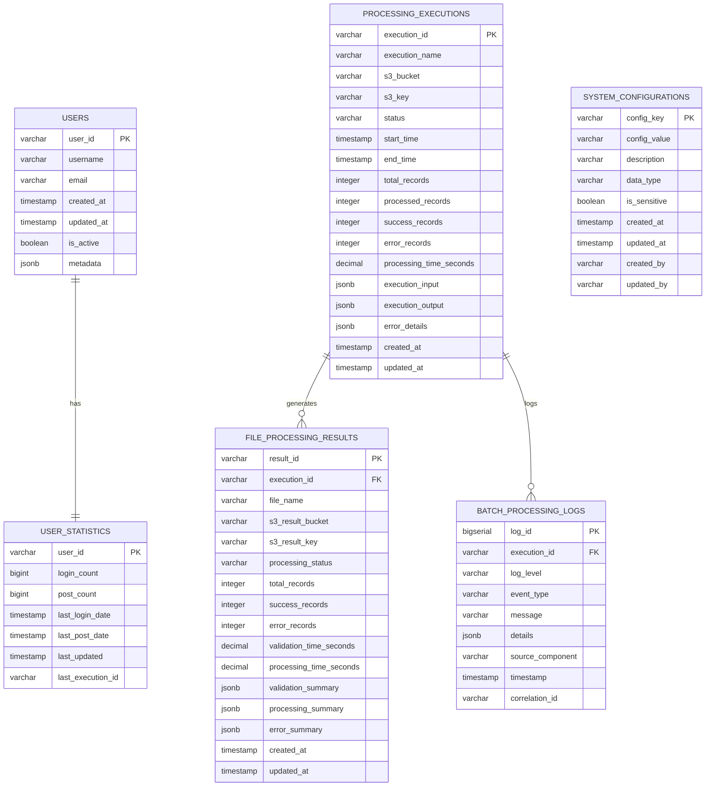

# データモデル詳細設計書

## 1. ドキュメント情報

| 項目 | 内容 |
|------|------|
| ドキュメント名 | データモデル詳細設計書 |
| バージョン | 1.0 |
| 作成日 | 2025-08-04 |
| 作成者 | システム設計チーム |
| 更新日 | 2025-08-04 |
| 承認者 | - |

## 2. 概要

### 2.1 目的
CSVファイル並列処理システムにおけるデータモデルの詳細設計を定義する。Aurora PostgreSQL（メインデータ）とDynamoDB（監査ログ・メタデータ）の具体的なテーブル構造、インデックス設計、制約条件、データ型定義を明確化する。

### 2.2 設計方針
- **正規化**: Aurora PostgreSQLは第3正規形を基本とした設計
- **パフォーマンス**: 効率的なインデックス設計による高速クエリ
- **整合性**: 外部キー制約による参照整合性確保
- **監査性**: DynamoDBによる包括的な監査ログ記録
- **スケーラビリティ**: DynamoDBパーティション設計による性能確保

### 2.3 データストア分類

#### 2.3.1 Aurora PostgreSQL（OLTP）
- **用途**: ユーザーマスタ、統計データ、処理結果
- **特徴**: ACID特性、複雑クエリ対応、参照整合性
- **データ保存期間**: 永続化（ライフサイクル管理あり）

#### 2.3.2 DynamoDB（NoSQL）
- **用途**: 監査ログ、処理メタデータ、一時データ
- **特徴**: 高スループット、TTL対応、イベント駆動
- **データ保存期間**: TTL設定による自動削除（30-90日）

## 3. Aurora PostgreSQL データモデル

### 3.1 ER図



### 3.2 テーブル詳細設計

#### 3.2.1 users テーブル
```sql
-- ユーザーマスタテーブル
CREATE TABLE users (
    user_id VARCHAR(10) PRIMARY KEY,
    username VARCHAR(100) NOT NULL,
    email VARCHAR(255) NOT NULL,
    created_at TIMESTAMP WITH TIME ZONE NOT NULL DEFAULT CURRENT_TIMESTAMP,
    updated_at TIMESTAMP WITH TIME ZONE NOT NULL DEFAULT CURRENT_TIMESTAMP,
    is_active BOOLEAN NOT NULL DEFAULT TRUE,
    metadata JSONB DEFAULT '{}',
    
    -- 制約
    CONSTRAINT users_user_id_format CHECK (user_id ~ '^U[0-9]{5}$'),
    CONSTRAINT users_email_format CHECK (email ~ '^[^@\s]+@[^@\s]+\.[^@\s]+$'),
    CONSTRAINT users_username_length CHECK (LENGTH(username) >= 2)
);

-- インデックス
CREATE UNIQUE INDEX idx_users_email ON users(email);
CREATE INDEX idx_users_username ON users(username);
CREATE INDEX idx_users_created_at ON users(created_at);
CREATE INDEX idx_users_active_status ON users(is_active) WHERE is_active = TRUE;

-- トリガー（更新日時自動更新）
CREATE OR REPLACE FUNCTION update_updated_at_column()
RETURNS TRIGGER AS $$
BEGIN
    NEW.updated_at = CURRENT_TIMESTAMP;
    RETURN NEW;
END;
$$ LANGUAGE plpgsql;

CREATE TRIGGER users_updated_at_trigger
    BEFORE UPDATE ON users
    FOR EACH ROW
    EXECUTE FUNCTION update_updated_at_column();

-- コメント
COMMENT ON TABLE users IS 'ユーザーマスタテーブル';
COMMENT ON COLUMN users.user_id IS 'ユーザーID（U + 5桁数字）';
COMMENT ON COLUMN users.username IS 'ユーザー名';
COMMENT ON COLUMN users.email IS 'メールアドレス（一意制約）';
COMMENT ON COLUMN users.metadata IS 'ユーザー追加属性（JSON形式）';
```

#### 3.2.2 user_statistics テーブル
```sql
-- ユーザー統計テーブル
CREATE TABLE user_statistics (
    user_id VARCHAR(10) PRIMARY KEY REFERENCES users(user_id) ON DELETE CASCADE,
    login_count BIGINT NOT NULL DEFAULT 0,
    post_count BIGINT NOT NULL DEFAULT 0,
    last_login_date TIMESTAMP WITH TIME ZONE,
    last_post_date TIMESTAMP WITH TIME ZONE,
    last_updated TIMESTAMP WITH TIME ZONE NOT NULL DEFAULT CURRENT_TIMESTAMP,
    last_execution_id VARCHAR(100),
    
    -- 制約
    CONSTRAINT user_statistics_login_count_positive CHECK (login_count >= 0),
    CONSTRAINT user_statistics_post_count_positive CHECK (post_count >= 0),
    CONSTRAINT user_statistics_dates_valid CHECK (
        last_login_date IS NULL OR last_login_date <= CURRENT_TIMESTAMP
    ),
    CONSTRAINT user_statistics_execution_id_format CHECK (
        last_execution_id IS NULL OR LENGTH(last_execution_id) <= 100
    )
);

-- インデックス
CREATE INDEX idx_user_statistics_login_count ON user_statistics(login_count DESC);
CREATE INDEX idx_user_statistics_post_count ON user_statistics(post_count DESC);
CREATE INDEX idx_user_statistics_last_updated ON user_statistics(last_updated);
CREATE INDEX idx_user_statistics_last_execution_id ON user_statistics(last_execution_id);

-- 統計ランキング用複合インデックス
CREATE INDEX idx_user_statistics_ranking ON user_statistics(login_count DESC, post_count DESC);

-- トリガー（最終更新日時自動更新）
CREATE TRIGGER user_statistics_updated_at_trigger
    BEFORE UPDATE ON user_statistics
    FOR EACH ROW
    EXECUTE FUNCTION update_updated_at_column();

-- 統計更新用関数
CREATE OR REPLACE FUNCTION update_user_statistics(
    p_user_id VARCHAR(10),
    p_login_increment BIGINT DEFAULT 0,
    p_post_increment BIGINT DEFAULT 0,
    p_execution_id VARCHAR(100) DEFAULT NULL
)
RETURNS VOID AS $$
BEGIN
    INSERT INTO user_statistics (
        user_id, 
        login_count, 
        post_count, 
        last_login_date, 
        last_post_date,
        last_execution_id
    )
    VALUES (
        p_user_id,
        p_login_increment,
        p_post_increment,
        CASE WHEN p_login_increment > 0 THEN CURRENT_TIMESTAMP ELSE NULL END,
        CASE WHEN p_post_increment > 0 THEN CURRENT_TIMESTAMP ELSE NULL END,
        p_execution_id
    )
    ON CONFLICT (user_id) DO UPDATE SET
        login_count = user_statistics.login_count + p_login_increment,
        post_count = user_statistics.post_count + p_post_increment,
        last_login_date = CASE 
            WHEN p_login_increment > 0 THEN CURRENT_TIMESTAMP 
            ELSE user_statistics.last_login_date 
        END,
        last_post_date = CASE 
            WHEN p_post_increment > 0 THEN CURRENT_TIMESTAMP 
            ELSE user_statistics.last_post_date 
        END,
        last_updated = CURRENT_TIMESTAMP,
        last_execution_id = COALESCE(p_execution_id, user_statistics.last_execution_id);
END;
$$ LANGUAGE plpgsql;

-- コメント
COMMENT ON TABLE user_statistics IS 'ユーザー統計情報テーブル（ログイン・投稿回数）';
COMMENT ON FUNCTION update_user_statistics IS 'ユーザー統計更新関数（UPSERT処理）';
```

#### 3.2.3 processing_executions テーブル
```sql
-- 処理実行管理テーブル
CREATE TABLE processing_executions (
    execution_id VARCHAR(100) PRIMARY KEY,
    execution_name VARCHAR(100) NOT NULL,
    s3_bucket VARCHAR(63) NOT NULL,
    s3_key VARCHAR(1024) NOT NULL,
    status VARCHAR(20) NOT NULL DEFAULT 'RUNNING',
    start_time TIMESTAMP WITH TIME ZONE NOT NULL DEFAULT CURRENT_TIMESTAMP,
    end_time TIMESTAMP WITH TIME ZONE,
    total_records INTEGER DEFAULT 0,
    processed_records INTEGER DEFAULT 0,
    success_records INTEGER DEFAULT 0,
    error_records INTEGER DEFAULT 0,
    processing_time_seconds DECIMAL(10,3),
    execution_input JSONB,
    execution_output JSONB,
    error_details JSONB,
    created_at TIMESTAMP WITH TIME ZONE NOT NULL DEFAULT CURRENT_TIMESTAMP,
    updated_at TIMESTAMP WITH TIME ZONE NOT NULL DEFAULT CURRENT_TIMESTAMP,
    
    -- 制約
    CONSTRAINT processing_executions_status_valid CHECK (
        status IN ('RUNNING', 'SUCCEEDED', 'FAILED', 'TIMED_OUT', 'ABORTED')
    ),
    CONSTRAINT processing_executions_records_valid CHECK (
        total_records >= 0 AND
        processed_records >= 0 AND
        success_records >= 0 AND
        error_records >= 0 AND
        processed_records = success_records + error_records
    ),
    CONSTRAINT processing_executions_time_valid CHECK (
        end_time IS NULL OR end_time >= start_time
    ),
    CONSTRAINT processing_executions_processing_time_positive CHECK (
        processing_time_seconds IS NULL OR processing_time_seconds >= 0
    )
);

-- インデックス
CREATE UNIQUE INDEX idx_processing_executions_name ON processing_executions(execution_name);
CREATE INDEX idx_processing_executions_status ON processing_executions(status);
CREATE INDEX idx_processing_executions_start_time ON processing_executions(start_time DESC);
CREATE INDEX idx_processing_executions_s3_location ON processing_executions(s3_bucket, s3_key);
CREATE INDEX idx_processing_executions_processing_time ON processing_executions(processing_time_seconds DESC);

-- 複合インデックス（よく使用されるクエリパターン用）
CREATE INDEX idx_processing_executions_status_time ON processing_executions(status, start_time DESC);
CREATE INDEX idx_processing_executions_daily_summary ON processing_executions(
    DATE(start_time), status
) WHERE status IN ('SUCCEEDED', 'FAILED');

-- トリガー
CREATE TRIGGER processing_executions_updated_at_trigger
    BEFORE UPDATE ON processing_executions
    FOR EACH ROW
    EXECUTE FUNCTION update_updated_at_column();

-- パーティショニング（月次）
-- 本番環境では月次パーティショニングを検討
-- CREATE TABLE processing_executions_y2025m08 PARTITION OF processing_executions
-- FOR VALUES FROM ('2025-08-01') TO ('2025-09-01');

-- コメント
COMMENT ON TABLE processing_executions IS 'Step Functions実行管理テーブル';
COMMENT ON COLUMN processing_executions.execution_id IS 'Step Functions実行ID';
COMMENT ON COLUMN processing_executions.processing_time_seconds IS '処理時間（秒、小数点以下3桁）';
```

#### 3.2.4 file_processing_results テーブル
```sql
-- ファイル処理結果テーブル
CREATE TABLE file_processing_results (
    result_id VARCHAR(100) PRIMARY KEY,
    execution_id VARCHAR(100) NOT NULL REFERENCES processing_executions(execution_id) ON DELETE CASCADE,
    file_name VARCHAR(255) NOT NULL,
    s3_result_bucket VARCHAR(63),
    s3_result_key VARCHAR(1024),
    processing_status VARCHAR(20) NOT NULL DEFAULT 'PROCESSING',
    total_records INTEGER NOT NULL DEFAULT 0,
    success_records INTEGER NOT NULL DEFAULT 0,
    error_records INTEGER NOT NULL DEFAULT 0,
    validation_time_seconds DECIMAL(8,3),
    processing_time_seconds DECIMAL(8,3),
    validation_summary JSONB DEFAULT '{}',
    processing_summary JSONB DEFAULT '{}',
    error_summary JSONB DEFAULT '{}',
    created_at TIMESTAMP WITH TIME ZONE NOT NULL DEFAULT CURRENT_TIMESTAMP,
    updated_at TIMESTAMP WITH TIME ZONE NOT NULL DEFAULT CURRENT_TIMESTAMP,
    
    -- 制約
    CONSTRAINT file_processing_results_status_valid CHECK (
        processing_status IN ('PROCESSING', 'COMPLETED', 'FAILED', 'CANCELLED')
    ),
    CONSTRAINT file_processing_results_records_valid CHECK (
        total_records >= 0 AND
        success_records >= 0 AND
        error_records >= 0 AND
        total_records = success_records + error_records
    ),
    CONSTRAINT file_processing_results_time_positive CHECK (
        (validation_time_seconds IS NULL OR validation_time_seconds >= 0) AND
        (processing_time_seconds IS NULL OR processing_time_seconds >= 0)
    )
);

-- インデックス
CREATE INDEX idx_file_processing_results_execution_id ON file_processing_results(execution_id);
CREATE INDEX idx_file_processing_results_status ON file_processing_results(processing_status);
CREATE INDEX idx_file_processing_results_file_name ON file_processing_results(file_name);
CREATE INDEX idx_file_processing_results_created_at ON file_processing_results(created_at DESC);

-- JSON フィールド用 GIN インデックス
CREATE INDEX idx_file_processing_results_validation_summary_gin ON file_processing_results USING GIN (validation_summary);
CREATE INDEX idx_file_processing_results_error_summary_gin ON file_processing_results USING GIN (error_summary);

-- トリガー
CREATE TRIGGER file_processing_results_updated_at_trigger
    BEFORE UPDATE ON file_processing_results
    FOR EACH ROW
    EXECUTE FUNCTION update_updated_at_column();

-- コメント
COMMENT ON TABLE file_processing_results IS 'ファイル処理結果テーブル';
COMMENT ON COLUMN file_processing_results.validation_summary IS 'バリデーション結果サマリー（JSON）';
COMMENT ON COLUMN file_processing_results.error_summary IS 'エラー詳細サマリー（JSON）';
```

#### 3.2.5 batch_processing_logs テーブル
```sql
-- バッチ処理ログテーブル（構造化ログ用）
CREATE TABLE batch_processing_logs (
    log_id BIGSERIAL PRIMARY KEY,
    execution_id VARCHAR(100) REFERENCES processing_executions(execution_id) ON DELETE SET NULL,
    log_level VARCHAR(10) NOT NULL,
    event_type VARCHAR(50) NOT NULL,
    message TEXT NOT NULL,
    details JSONB DEFAULT '{}',
    source_component VARCHAR(50),
    timestamp TIMESTAMP WITH TIME ZONE NOT NULL DEFAULT CURRENT_TIMESTAMP,
    correlation_id VARCHAR(100),
    
    -- 制約
    CONSTRAINT batch_processing_logs_level_valid CHECK (
        log_level IN ('DEBUG', 'INFO', 'WARN', 'ERROR', 'FATAL')
    )
);

-- インデックス
CREATE INDEX idx_batch_processing_logs_execution_id ON batch_processing_logs(execution_id);
CREATE INDEX idx_batch_processing_logs_timestamp ON batch_processing_logs(timestamp DESC);
CREATE INDEX idx_batch_processing_logs_level ON batch_processing_logs(log_level);
CREATE INDEX idx_batch_processing_logs_event_type ON batch_processing_logs(event_type);
CREATE INDEX idx_batch_processing_logs_correlation_id ON batch_processing_logs(correlation_id);

-- 複合インデックス（ログ検索用）
CREATE INDEX idx_batch_processing_logs_search ON batch_processing_logs(
    execution_id, log_level, timestamp DESC
);

-- JSON フィールド用 GIN インデックス
CREATE INDEX idx_batch_processing_logs_details_gin ON batch_processing_logs USING GIN (details);

-- パーティショニング（日次）
-- CREATE TABLE batch_processing_logs_y2025m08d04 PARTITION OF batch_processing_logs
-- FOR VALUES FROM ('2025-08-04') TO ('2025-08-05');

-- データ保持期間設定（90日後自動削除）
-- pg_cron または外部スケジューラーで実行
-- DELETE FROM batch_processing_logs WHERE timestamp < CURRENT_TIMESTAMP - INTERVAL '90 days';

-- コメント
COMMENT ON TABLE batch_processing_logs IS 'バッチ処理構造化ログテーブル';
COMMENT ON COLUMN batch_processing_logs.details IS 'ログ詳細情報（JSON）';
```

#### 3.2.6 system_configurations テーブル
```sql
-- システム設定テーブル
CREATE TABLE system_configurations (
    config_key VARCHAR(100) PRIMARY KEY,
    config_value TEXT NOT NULL,
    description TEXT,
    data_type VARCHAR(20) NOT NULL DEFAULT 'string',
    is_sensitive BOOLEAN NOT NULL DEFAULT FALSE,
    created_at TIMESTAMP WITH TIME ZONE NOT NULL DEFAULT CURRENT_TIMESTAMP,
    updated_at TIMESTAMP WITH TIME ZONE NOT NULL DEFAULT CURRENT_TIMESTAMP,
    created_by VARCHAR(100),
    updated_by VARCHAR(100),
    
    -- 制約
    CONSTRAINT system_configurations_data_type_valid CHECK (
        data_type IN ('string', 'integer', 'boolean', 'json', 'decimal')
    )
);

-- インデックス
CREATE INDEX idx_system_configurations_data_type ON system_configurations(data_type);
CREATE INDEX idx_system_configurations_sensitive ON system_configurations(is_sensitive);

-- トリガー
CREATE TRIGGER system_configurations_updated_at_trigger
    BEFORE UPDATE ON system_configurations
    FOR EACH ROW
    EXECUTE FUNCTION update_updated_at_column();

-- 設定値取得関数
CREATE OR REPLACE FUNCTION get_config_value(
    p_config_key VARCHAR(100),
    p_default_value TEXT DEFAULT NULL
)
RETURNS TEXT AS $$
DECLARE
    v_config_value TEXT;
BEGIN
    SELECT config_value INTO v_config_value
    FROM system_configurations
    WHERE config_key = p_config_key;
    
    RETURN COALESCE(v_config_value, p_default_value);
END;
$$ LANGUAGE plpgsql;

-- 初期設定データ
INSERT INTO system_configurations (config_key, config_value, description, data_type) VALUES
('max_parallel_executions', '5', '最大並列実行数', 'integer'),
('csv_max_file_size_mb', '100', 'CSV最大ファイルサイズ（MB）', 'integer'),
('processing_timeout_minutes', '15', '処理タイムアウト（分）', 'integer'),
('validation_enabled', 'true', 'バリデーション有効フラグ', 'boolean'),
('audit_log_retention_days', '90', '監査ログ保持期間（日）', 'integer');

-- コメント
COMMENT ON TABLE system_configurations IS 'システム設定テーブル';
COMMENT ON FUNCTION get_config_value IS '設定値取得関数（デフォルト値対応）';
```

### 3.3 ビュー定義

#### 3.3.1 実行統計ビュー
```sql
-- 実行統計ビュー
CREATE VIEW v_execution_statistics AS
SELECT
    DATE(start_time) AS execution_date,
    status,
    COUNT(*) AS execution_count,
    AVG(processing_time_seconds) AS avg_processing_time,
    MIN(processing_time_seconds) AS min_processing_time,
    MAX(processing_time_seconds) AS max_processing_time,
    SUM(total_records) AS total_records_processed,
    SUM(success_records) AS total_success_records,
    SUM(error_records) AS total_error_records,
    ROUND(
        (SUM(success_records)::DECIMAL / NULLIF(SUM(total_records), 0)) * 100, 2
    ) AS success_rate_percentage
FROM processing_executions
WHERE start_time >= CURRENT_DATE - INTERVAL '30 days'
GROUP BY DATE(start_time), status
ORDER BY execution_date DESC, status;

COMMENT ON VIEW v_execution_statistics IS '実行統計ビュー（日次・ステータス別）';
```

#### 3.3.2 ユーザー統計ランキングビュー
```sql
-- ユーザー統計ランキングビュー
CREATE VIEW v_user_statistics_ranking AS
SELECT
    ROW_NUMBER() OVER (ORDER BY us.login_count DESC, us.post_count DESC) AS rank,
    u.user_id,
    u.username,
    us.login_count,
    us.post_count,
    us.last_login_date,
    us.last_post_date,
    us.last_updated
FROM users u
JOIN user_statistics us ON u.user_id = us.user_id
WHERE u.is_active = TRUE
ORDER BY us.login_count DESC, us.post_count DESC;

COMMENT ON VIEW v_user_statistics_ranking IS 'ユーザー統計ランキングビュー（アクティブユーザーのみ）';
```

## 4. DynamoDB データモデル

### 4.1 テーブル設計概要

#### 4.1.1 audit_logs テーブル
```yaml
TableName: csv-processing-audit-logs
BillingMode: PAY_PER_REQUEST
PointInTimeRecovery: Enabled
Encryption:
  SSESpecification:
    SSEEnabled: true
    KMSMasterKeyId: alias/dynamodb-csv-processing

AttributeDefinitions:
  - AttributeName: execution_id
    AttributeType: S
  - AttributeName: timestamp
    AttributeType: S
  - AttributeName: log_level
    AttributeType: S
  - AttributeName: event_type
    AttributeType: S

KeySchema:
  - AttributeName: execution_id
    KeyType: HASH
  - AttributeName: timestamp
    KeyType: RANGE

GlobalSecondaryIndexes:
  - IndexName: LogLevelIndex
    KeySchema:
      - AttributeName: log_level
        KeyType: HASH
      - AttributeName: timestamp
        KeyType: RANGE
    Projection:
      ProjectionType: ALL
      
  - IndexName: EventTypeIndex
    KeySchema:
      - AttributeName: event_type
        KeyType: HASH
      - AttributeName: timestamp
        KeyType: RANGE
    Projection:
      ProjectionType: ALL

TimeToLive:
  AttributeName: ttl
  Enabled: true

Tags:
  - Key: Project
    Value: CSV-Processing
  - Key: Environment
    Value: Production
```

#### 4.1.2 processing_metadata テーブル
```yaml
TableName: csv-processing-metadata
BillingMode: PAY_PER_REQUEST

AttributeDefinitions:
  - AttributeName: file_id
    AttributeType: S
  - AttributeName: processing_stage
    AttributeType: S
  - AttributeName: created_at
    AttributeType: S

KeySchema:
  - AttributeName: file_id
    KeyType: HASH
  - AttributeName: processing_stage
    KeyType: RANGE

GlobalSecondaryIndexes:
  - IndexName: ProcessingStageIndex
    KeySchema:
      - AttributeName: processing_stage
        KeyType: HASH
      - AttributeName: created_at
        KeyType: RANGE
    Projection:
      ProjectionType: ALL

TimeToLive:
  AttributeName: ttl
  Enabled: true
```

### 4.2 DynamoDB アイテム構造

#### 4.2.1 audit_logs アイテム
```json
{
  "execution_id": "user-log-20250804-001-123456",
  "timestamp": "2025-08-04T10:30:15.123Z",
  "log_level": "INFO",
  "event_type": "CSV_VALIDATION_COMPLETED",
  "function_name": "csv-processor",
  "request_id": "12345678-1234-1234-1234-123456789012",
  "message": "CSV validation completed successfully",
  "details": {
    "file_name": "user-log-20250804-001.csv",
    "total_records": 1000,
    "validation_time_ms": 1250,
    "validation_errors": 0,
    "memory_used_mb": 128,
    "billing_duration_ms": 1300
  },
  "correlation_id": "correlation-123456",
  "user_id": "U00001",
  "trace_id": "1-64f8a2b4-12345678901234567890abcd",
  "span_id": "abcdef1234567890",
  "source_ip": "10.0.1.100",
  "ttl": 1730726400
}
```

#### 4.2.2 processing_metadata アイテム
```json
{
  "file_id": "file-20250804-001",
  "processing_stage": "VALIDATION",
  "created_at": "2025-08-04T10:30:00.000Z",
  "updated_at": "2025-08-04T10:30:15.123Z",
  "status": "COMPLETED",
  "execution_id": "user-log-20250804-001-123456",
  "s3_location": {
    "bucket": "csv-input-123456789012",
    "key": "incoming/2025/08/04/user-log-20250804-001.csv",
    "size": 2048576,
    "etag": "d85b1234567890abcdef"
  },
  "processing_info": {
    "start_time": "2025-08-04T10:30:00.000Z",
    "end_time": "2025-08-04T10:30:15.123Z",
    "duration_ms": 15123,
    "records_processed": 1000,
    "success_count": 985,
    "error_count": 15
  },
  "validation_result": {
    "is_valid": true,
    "header_valid": true,
    "encoding": "UTF-8",
    "delimiter": ",",
    "row_count": 1000,
    "column_count": 3
  },
  "metadata": {
    "source_system": "external-api",
    "upload_user": "admin",
    "priority": "NORMAL",
    "retry_count": 0
  },
  "ttl": 1725465600
}
```

### 4.3 DynamoDB アクセスパターン

#### 4.3.1 クエリパターン定義
```typescript
// DynamoDB アクセスパターン定義
interface DynamoDBAccessPatterns {
  // 実行ID別監査ログ取得
  getAuditLogsByExecution: {
    TableName: 'audit_logs';
    KeyConditionExpression: 'execution_id = :execution_id';
    SortKeyCondition?: 'timestamp BETWEEN :start_time AND :end_time';
  };

  // ログレベル別ログ取得
  getAuditLogsByLevel: {
    IndexName: 'LogLevelIndex';
    KeyConditionExpression: 'log_level = :log_level';
    SortKeyCondition?: 'timestamp BETWEEN :start_time AND :end_time';
  };

  // イベントタイプ別ログ取得
  getAuditLogsByEventType: {
    IndexName: 'EventTypeIndex';
    KeyConditionExpression: 'event_type = :event_type';
    SortKeyCondition?: 'timestamp BETWEEN :start_time AND :end_time';
  };

  // ファイル処理メタデータ取得
  getProcessingMetadata: {
    TableName: 'processing_metadata';
    KeyConditionExpression: 'file_id = :file_id';
    SortKeyCondition?: 'processing_stage = :stage';
  };

  // 処理ステージ別メタデータ取得
  getMetadataByStage: {
    IndexName: 'ProcessingStageIndex';
    KeyConditionExpression: 'processing_stage = :stage';
    SortKeyCondition?: 'created_at BETWEEN :start_time AND :end_time';
  };
}
```

#### 4.3.2 DynamoDB操作実装例
```typescript
// services/dynamodb-service.ts
import { DynamoDB } from 'aws-sdk';

export class DynamoDBService {
  private dynamoDB: DynamoDB.DocumentClient;

  constructor() {
    this.dynamoDB = new DynamoDB.DocumentClient({
      region: process.env.AWS_REGION,
    });
  }

  // 監査ログ記録
  async putAuditLog(auditLog: AuditLogItem): Promise<void> {
    const ttl = Math.floor(Date.now() / 1000) + (90 * 24 * 60 * 60); // 90日後
    
    const params: DynamoDB.DocumentClient.PutItemInput = {
      TableName: 'csv-processing-audit-logs',
      Item: {
        ...auditLog,
        ttl,
      },
    };

    await this.dynamoDB.put(params).promise();
  }

  // 実行ID別監査ログ取得
  async getAuditLogsByExecution(
    executionId: string,
    startTime?: string,
    endTime?: string,
    limit: number = 100
  ): Promise<AuditLogItem[]> {
    const params: DynamoDB.DocumentClient.QueryInput = {
      TableName: 'csv-processing-audit-logs',
      KeyConditionExpression: 'execution_id = :execution_id',
      ExpressionAttributeValues: {
        ':execution_id': executionId,
      },
      Limit: limit,
      ScanIndexForward: false, // 降順（最新から）
    };

    if (startTime && endTime) {
      params.KeyConditionExpression += ' AND #timestamp BETWEEN :start_time AND :end_time';
      params.ExpressionAttributeNames = { '#timestamp': 'timestamp' };
      params.ExpressionAttributeValues![':start_time'] = startTime;
      params.ExpressionAttributeValues![':end_time'] = endTime;
    }

    const result = await this.dynamoDB.query(params).promise();
    return result.Items as AuditLogItem[];
  }

  // エラーログのみ取得
  async getErrorLogs(
    startTime: string,
    endTime: string,
    limit: number = 50
  ): Promise<AuditLogItem[]> {
    const params: DynamoDB.DocumentClient.QueryInput = {
      TableName: 'csv-processing-audit-logs',
      IndexName: 'LogLevelIndex',
      KeyConditionExpression: 'log_level = :log_level AND #timestamp BETWEEN :start_time AND :end_time',
      ExpressionAttributeNames: { '#timestamp': 'timestamp' },
      ExpressionAttributeValues: {
        ':log_level': 'ERROR',
        ':start_time': startTime,
        ':end_time': endTime,
      },
      Limit: limit,
      ScanIndexForward: false,
    };

    const result = await this.dynamoDB.query(params).promise();
    return result.Items as AuditLogItem[];
  }

  // 処理メタデータ更新
  async updateProcessingMetadata(
    fileId: string,
    stage: string,
    updates: Partial<ProcessingMetadataItem>
  ): Promise<void> {
    const updateExpression = Object.keys(updates)
      .map(key => `#${key} = :${key}`)
      .join(', ');
    
    const expressionAttributeNames = Object.keys(updates)
      .reduce((acc, key) => ({ ...acc, [`#${key}`]: key }), {});
    
    const expressionAttributeValues = Object.keys(updates)
      .reduce((acc, key) => ({ ...acc, [`:${key}`]: updates[key] }), {});

    const params: DynamoDB.DocumentClient.UpdateItemInput = {
      TableName: 'csv-processing-metadata',
      Key: {
        file_id: fileId,
        processing_stage: stage,
      },
      UpdateExpression: `SET ${updateExpression}, updated_at = :updated_at`,
      ExpressionAttributeNames: {
        ...expressionAttributeNames,
        '#updated_at': 'updated_at',
      },
      ExpressionAttributeValues: {
        ...expressionAttributeValues,
        ':updated_at': new Date().toISOString(),
      },
    };

    await this.dynamoDB.update(params).promise();
  }
}
```

## 5. データ型定義

### 5.1 TypeScript型定義

#### 5.1.1 Aurora PostgreSQL モデル
```typescript
// types/aurora-models.ts

// ユーザー
export interface User {
  user_id: string;
  username: string;
  email: string;
  created_at: Date;
  updated_at: Date;
  is_active: boolean;
  metadata: Record<string, unknown>;
}

// ユーザー統計
export interface UserStatistics {
  user_id: string;
  login_count: number;
  post_count: number;
  last_login_date?: Date;
  last_post_date?: Date;
  last_updated: Date;
  last_execution_id?: string;
}

// 処理実行
export interface ProcessingExecution {
  execution_id: string;
  execution_name: string;
  s3_bucket: string;
  s3_key: string;
  status: 'RUNNING' | 'SUCCEEDED' | 'FAILED' | 'TIMED_OUT' | 'ABORTED';
  start_time: Date;
  end_time?: Date;
  total_records: number;
  processed_records: number;
  success_records: number;
  error_records: number;
  processing_time_seconds?: number;
  execution_input?: Record<string, unknown>;
  execution_output?: Record<string, unknown>;
  error_details?: Record<string, unknown>;
  created_at: Date;
  updated_at: Date;
}

// ファイル処理結果
export interface FileProcessingResult {
  result_id: string;
  execution_id: string;
  file_name: string;
  s3_result_bucket?: string;
  s3_result_key?: string;
  processing_status: 'PROCESSING' | 'COMPLETED' | 'FAILED' | 'CANCELLED';
  total_records: number;
  success_records: number;
  error_records: number;
  validation_time_seconds?: number;
  processing_time_seconds?: number;
  validation_summary: Record<string, unknown>;
  processing_summary: Record<string, unknown>;
  error_summary: Record<string, unknown>;
  created_at: Date;
  updated_at: Date;
}

// システム設定
export interface SystemConfiguration {
  config_key: string;
  config_value: string;
  description?: string;
  data_type: 'string' | 'integer' | 'boolean' | 'json' | 'decimal';
  is_sensitive: boolean;
  created_at: Date;
  updated_at: Date;
  created_by?: string;
  updated_by?: string;
}
```

#### 5.1.2 DynamoDB モデル
```typescript
// types/dynamodb-models.ts

// 監査ログ
export interface AuditLogItem {
  execution_id: string;
  timestamp: string;
  log_level: 'DEBUG' | 'INFO' | 'WARN' | 'ERROR' | 'FATAL';
  event_type: string;
  function_name: string;
  request_id: string;
  message: string;
  details: Record<string, unknown>;
  correlation_id?: string;
  user_id?: string;
  trace_id?: string;
  span_id?: string;
  source_ip?: string;
  ttl: number;
}

// 処理メタデータ
export interface ProcessingMetadataItem {
  file_id: string;
  processing_stage: string;
  created_at: string;
  updated_at: string;
  status: string;
  execution_id: string;
  s3_location: {
    bucket: string;
    key: string;
    size: number;
    etag: string;
  };
  processing_info: {
    start_time: string;
    end_time?: string;
    duration_ms?: number;
    records_processed?: number;
    success_count?: number;
    error_count?: number;
  };
  validation_result?: {
    is_valid: boolean;
    header_valid: boolean;
    encoding: string;
    delimiter: string;
    row_count: number;
    column_count: number;
  };
  metadata: {
    source_system?: string;
    upload_user?: string;
    priority?: string;
    retry_count?: number;
  };
  ttl: number;
}

// CSV行データ
export interface CsvRowData {
  ユーザーID: string;
  ログイン回数: string;
  投稿回数: string;
  [key: string]: string; // 追加カラム対応
}

// 処理結果サマリー
export interface ProcessingSummary {
  total_files: number;
  total_records: number;
  success_records: number;
  error_records: number;
  processing_time_seconds: number;
  throughput_records_per_second: number;
  success_rate_percentage: number;
}
```

## 6. データ保持・アーカイブ設計

### 6.1 データライフサイクル管理

#### 6.1.1 Aurora PostgreSQL
```sql
-- データ保持ポリシー
-- 1. 処理実行データ: 1年間保持後アーカイブ
-- 2. ファイル処理結果: 6ヶ月間保持後削除
-- 3. バッチ処理ログ: 3ヶ月間保持後削除
-- 4. ユーザーデータ: 永続保持（論理削除）

-- アーカイブテーブル作成
CREATE TABLE processing_executions_archive (
    LIKE processing_executions INCLUDING ALL
);

-- アーカイブ処理関数
CREATE OR REPLACE FUNCTION archive_old_executions()
RETURNS INTEGER AS $$
DECLARE
    archived_count INTEGER;
BEGIN
    -- 1年以上前のデータをアーカイブテーブルに移動
    WITH archived_data AS (
        DELETE FROM processing_executions
        WHERE created_at < CURRENT_DATE - INTERVAL '1 year'
        RETURNING *
    )
    INSERT INTO processing_executions_archive
    SELECT * FROM archived_data;
    
    GET DIAGNOSTICS archived_count = ROW_COUNT;
    
    -- 関連データも削除
    DELETE FROM file_processing_results
    WHERE execution_id NOT IN (
        SELECT execution_id FROM processing_executions
    );
    
    RETURN archived_count;
END;
$$ LANGUAGE plpgsql;

-- 定期実行設定（pg_cron使用）
-- SELECT cron.schedule('archive-old-data', '0 2 1 * *', 'SELECT archive_old_executions();');
```

#### 6.1.2 DynamoDB TTL設定
```typescript
// DynamoDB TTL計算関数
export class TTLCalculator {
  // 監査ログ: 90日間保持
  static getAuditLogTTL(): number {
    return Math.floor(Date.now() / 1000) + (90 * 24 * 60 * 60);
  }

  // 処理メタデータ: 30日間保持
  static getProcessingMetadataTTL(): number {
    return Math.floor(Date.now() / 1000) + (30 * 24 * 60 * 60);
  }

  // カスタム保持期間
  static getCustomTTL(days: number): number {
    return Math.floor(Date.now() / 1000) + (days * 24 * 60 * 60);
  }
}
```

## 7. パフォーマンス最適化

### 7.1 インデックス戦略

#### 7.1.1 Aurora PostgreSQL
```sql
-- パフォーマンス監視クエリ
-- 使用されていないインデックスの特定
SELECT
    schemaname,
    tablename,
    indexname,
    idx_tup_read,
    idx_tup_fetch,
    idx_scan
FROM pg_stat_user_indexes
WHERE idx_scan = 0
ORDER BY schemaname, tablename;

-- インデックス使用率の確認
SELECT
    schemaname,
    tablename,
    indexname,
    idx_scan,
    pg_size_pretty(pg_relation_size(indexname::regclass)) as index_size
FROM pg_stat_user_indexes
ORDER BY idx_scan DESC;
```

#### 7.1.2 DynamoDB
```yaml
# DynamoDB パフォーマンス設定
ReadCapacityUnits: 10  # 自動スケーリング設定
WriteCapacityUnits: 10
AutoScaling:
  TargetTrackingScalingPolicies:
    - TargetValue: 70.0
      ScaleInCooldown: 300
      ScaleOutCooldown: 60
      MetricType: DynamoDBReadCapacityUtilization
```

### 7.2 クエリ最適化

#### 7.2.1 頻出クエリの最適化
```sql
-- ユーザー統計更新の最適化（バッチ処理用）
CREATE OR REPLACE FUNCTION batch_update_user_statistics(
    p_user_updates JSONB
)
RETURNS VOID AS $$
BEGIN
    -- 一括更新処理
    INSERT INTO user_statistics (user_id, login_count, post_count, last_updated)
    SELECT 
        (value->>'user_id')::VARCHAR(10),
        (value->>'login_increment')::BIGINT,
        (value->>'post_increment')::BIGINT,
        CURRENT_TIMESTAMP
    FROM jsonb_array_elements(p_user_updates) AS value
    ON CONFLICT (user_id) DO UPDATE SET
        login_count = user_statistics.login_count + EXCLUDED.login_count,
        post_count = user_statistics.post_count + EXCLUDED.post_count,
        last_updated = CURRENT_TIMESTAMP;
END;
$$ LANGUAGE plpgsql;
```

## 8. セキュリティ設計

### 8.1 データ暗号化

#### 8.1.1 Aurora PostgreSQL
```sql
-- 機密データ暗号化関数
CREATE EXTENSION IF NOT EXISTS pgcrypto;

-- 機密設定値暗号化
CREATE OR REPLACE FUNCTION encrypt_sensitive_config(
    p_config_key VARCHAR(100),
    p_config_value TEXT
)
RETURNS VOID AS $$
BEGIN
    UPDATE system_configurations
    SET config_value = crypt(p_config_value, gen_salt('bf', 8))
    WHERE config_key = p_config_key AND is_sensitive = TRUE;
END;
$$ LANGUAGE plpgsql;

-- 機密データ復号化
CREATE OR REPLACE FUNCTION decrypt_sensitive_config(
    p_config_key VARCHAR(100),
    p_input_value TEXT
)
RETURNS BOOLEAN AS $$
DECLARE
    stored_value TEXT;
BEGIN
    SELECT config_value INTO stored_value
    FROM system_configurations
    WHERE config_key = p_config_key AND is_sensitive = TRUE;
    
    RETURN stored_value = crypt(p_input_value, stored_value);
END;
$$ LANGUAGE plpgsql;
```

### 8.2 アクセス制御

#### 8.2.1 Row Level Security (RLS)
```sql
-- RLS有効化
ALTER TABLE users ENABLE ROW LEVEL SECURITY;
ALTER TABLE user_statistics ENABLE ROW LEVEL SECURITY;

-- ポリシー作成（例：ユーザーは自分のデータのみアクセス可能）
CREATE POLICY user_data_policy ON users
    FOR ALL
    TO application_role
    USING (user_id = current_setting('app.current_user_id'));

CREATE POLICY user_statistics_policy ON user_statistics
    FOR ALL
    TO application_role
    USING (user_id = current_setting('app.current_user_id'));
```

このデータモデル詳細設計書により、CSVファイル並列処理システムの堅牢で効率的なデータ基盤が定義され、Aurora PostgreSQLとDynamoDBの適切な使い分けによる最適なデータ管理が実現されます。