# Mermaid概要と使い方

## 1. Mermaidとは

Mermaidは、テキストベースの図表作成ツールです。マークダウン形式のシンプルな記法で、フローチャート、シーケンス図、ガントチャート、クラス図などの様々な図表を作成できます。

### 主な特徴
- **テキストベース**: コードで図を定義するため、バージョン管理が容易
- **リアルタイム描画**: 記述した内容が即座に図として表示される
- **多様な図表タイプ**: ビジネス図表から技術図表まで幅広くサポート
- **統合性**: GitHub、GitLab、多くのマークダウンエディタで直接レンダリング可能

## 2. 基本的な使い方

### 2.1 マークダウンでの記述方法

````markdown
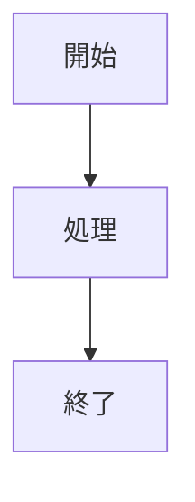
````

### 2.2 対応環境
- GitHub/GitLab（自動レンダリング）
- VS Code（拡張機能）
- Notion
- Obsidian
- オンラインエディタ（mermaid.live）

## 3. 主要な図表タイプ

### 3.1 フローチャート（graph/flowchart）

基本的な方向指定：
- `TB` / `TD`: 上から下（Top to Bottom / Top Down）
- `BT`: 下から上（Bottom to Top）
- `RL`: 右から左（Right to Left）
- `LR`: 左から右（Left to Right）

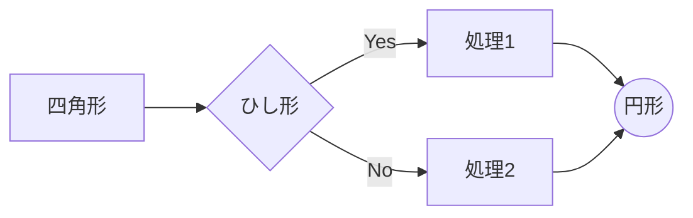

### 3.2 シーケンス図（sequenceDiagram）

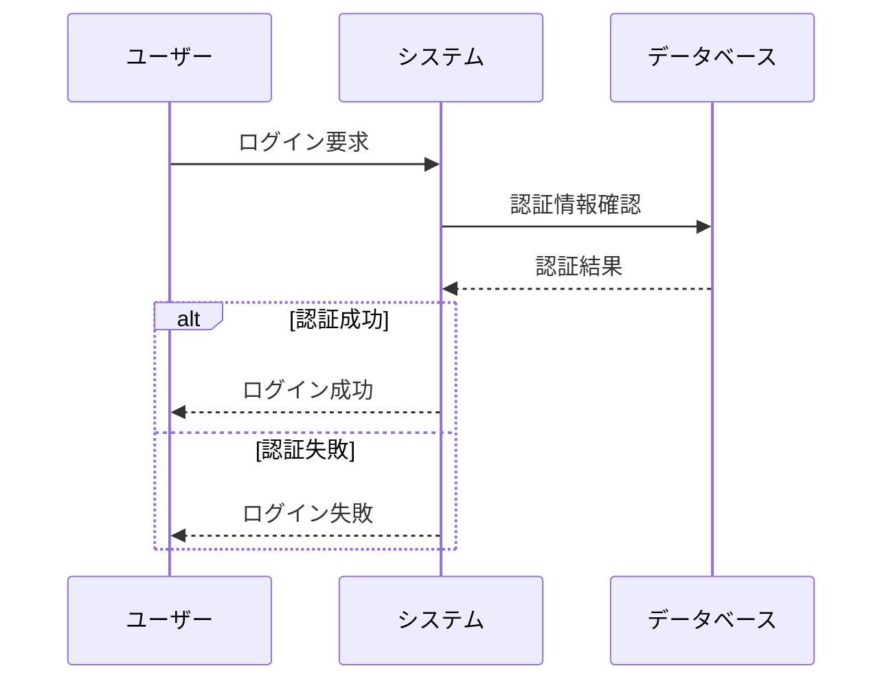

### 3.3 クラス図（classDiagram）

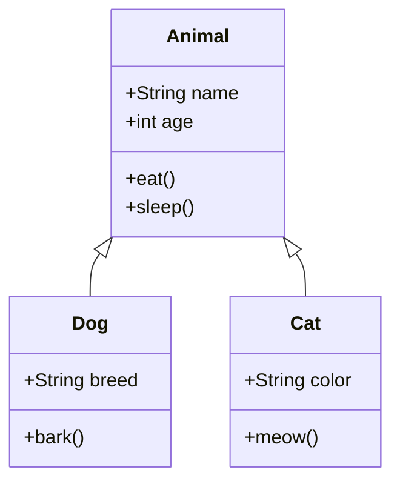

### 3.4 状態図（stateDiagram）

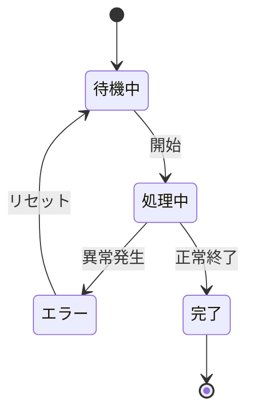

### 3.5 ガントチャート（gantt）

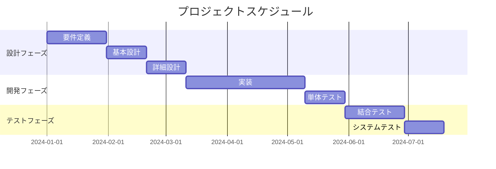

### 3.6 円グラフ（pie）

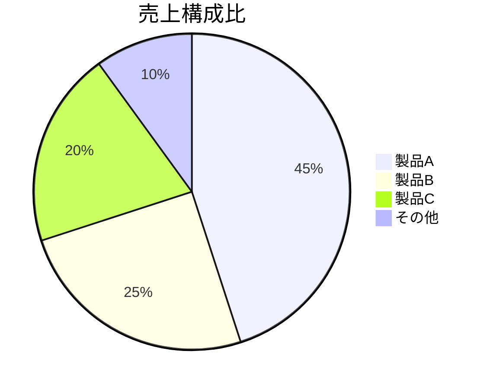

### 3.7 ER図（erDiagram）

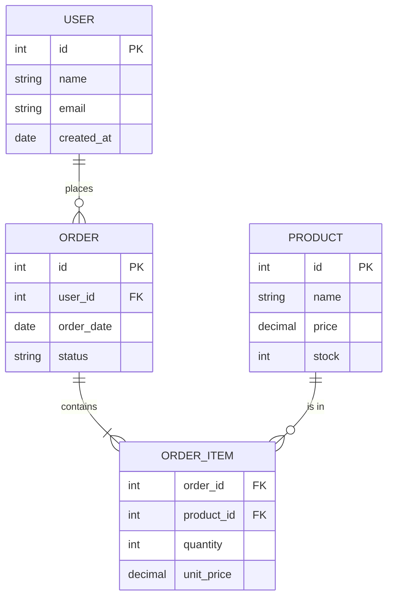

## 4. ノード（図形）の種類

### 4.1 基本図形

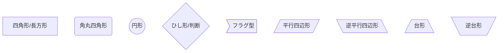

### 4.2 特殊図形

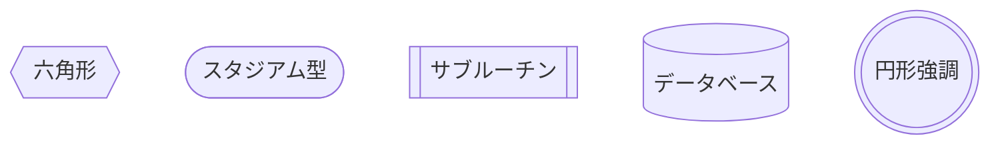

## 5. 矢印とリンクのスタイル

### 5.1 矢印の種類

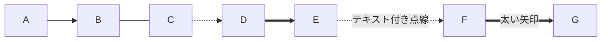

### 5.2 リンクの長さ調整

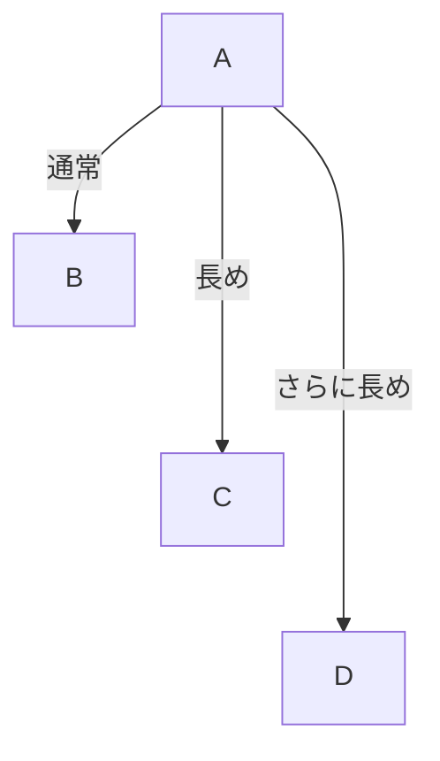

## 6. スタイリングとテーマ

### 6.1 ノードのスタイル定義

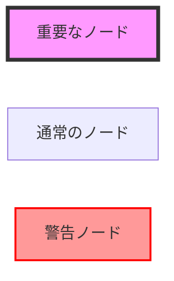

### 6.2 クラスの使用

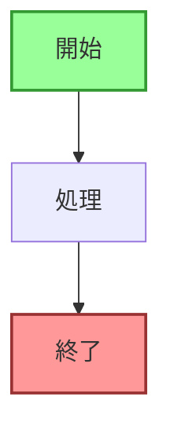

## 7. 実践的な使用例

### 7.1 AWS アーキテクチャ図

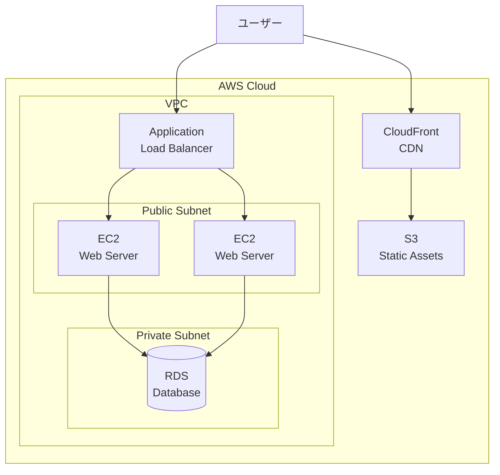

### 7.2 CI/CDパイプライン

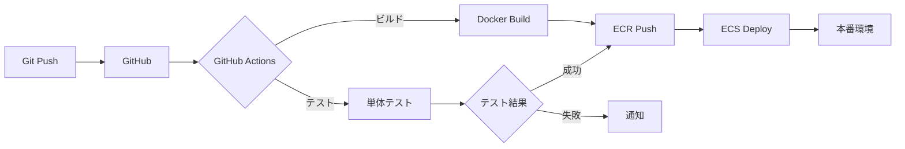

## 8. Tips とベストプラクティス

### 8.1 可読性の向上
- ノードIDは意味のある名前を使用
- 複雑な図は`subgraph`で構造化
- 適切な方向（TD/LR）を選択

### 8.2 メンテナンス性
- コメントを活用（`%% コメント %%`）
- 一貫性のある命名規則
- 図が大きくなりすぎないよう分割

### 8.3 トラブルシューティング
- 特殊文字はエスケープまたは引用符で囲む
- 日本語は問題なく使用可能
- 構文エラーは行番号で特定可能

## 9. オンラインリソース

- 公式ドキュメント: https://mermaid.js.org/
- ライブエディタ: https://mermaid.live/
- GitHub統合: マークダウンファイルで自動レンダリング
- VS Code拡張: Mermaid Preview

## 10. まとめ

Mermaidは、エンジニアリング文書やプレゼンテーションで図を作成する際の強力なツールです。テキストベースであるため、コードと同じようにバージョン管理でき、レビューやコラボレーションも容易です。基本的な構文を覚えれば、複雑な図表も効率的に作成できます。