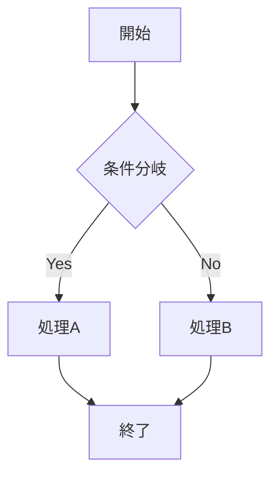
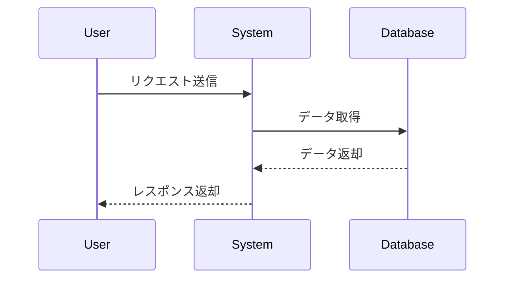
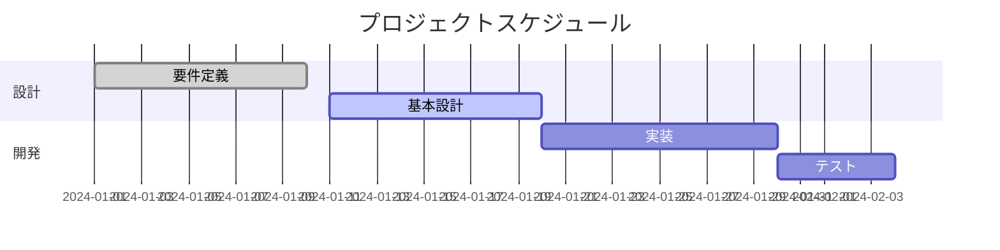
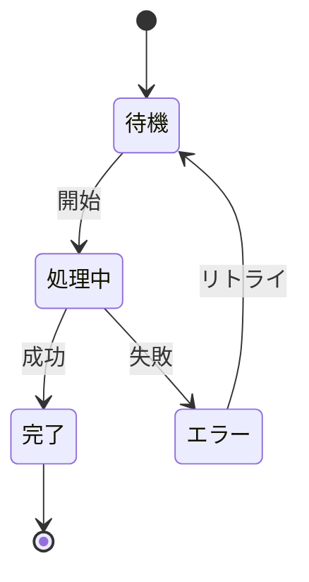

# VSCodeでMermaidプレビュー表示方法

## 1. 標準機能でのサポート状況

VSCode 1.66以降では、**拡張機能なしで**Markdownプレビューが標準でMermaidをサポートしています。

### 確認方法
1. `.md`ファイルを開く
2. `Ctrl+Shift+V`（Windows/Linux）または`Cmd+Shift+V`（Mac）でプレビューを開く
3. Mermaidのコードブロックが自動的にレンダリングされる

## 2. プレビュー表示の方法

### 2.1 プレビューを開く方法

#### 方法1: ショートカットキー
- Windows/Linux: `Ctrl+Shift+V`
- Mac: `Cmd+Shift+V`

#### 方法2: コマンドパレット
1. `Ctrl+Shift+P`（Mac: `Cmd+Shift+P`）でコマンドパレットを開く
2. "Markdown: Open Preview"を選択

#### 方法3: エディタ右上のアイコン
- Markdownファイルを開いた際、右上に表示されるプレビューアイコンをクリック

### 2.2 サイドバイサイド表示
- Windows/Linux: `Ctrl+K V`
- Mac: `Cmd+K V`
- エディタとプレビューを並べて表示（リアルタイム更新）

## 3. 推奨される拡張機能

標準機能で十分ですが、より高度な機能が必要な場合は以下の拡張機能が有用です：

### 3.1 Markdown Preview Mermaid Support
- **名前**: Markdown Preview Mermaid Support
- **ID**: bierner.markdown-mermaid
- **特徴**:
  - より高度なMermaidレンダリング
  - テーマのカスタマイズ
  - 追加の図表タイプサポート

### 3.2 Mermaid Markdown Syntax Highlighting
- **名前**: Mermaid Markdown Syntax Highlighting
- **ID**: bpruitt-goddard.mermaid-markdown-syntax-highlighting
- **特徴**:
  - Mermaidコードのシンタックスハイライト
  - コード編集時の視認性向上

### 3.3 Markdown Preview Enhanced
- **名前**: Markdown Preview Enhanced
- **ID**: shd101wyy.markdown-preview-enhanced
- **特徴**:
  - 高機能なMarkdownプレビュー
  - PDF/HTML/画像へのエクスポート
  - PlantUMLなど他の図表ツールもサポート

## 4. トラブルシューティング

### 4.1 Mermaidが表示されない場合

#### 確認事項1: VSCodeのバージョン
```bash
code --version
```
- 1.66以降であることを確認

#### 確認事項2: 設定の確認（重要）

**方法1: 設定UIから確認**
1. `Ctrl+,` (Windows/Linux) または `Cmd+,` (Mac) で設定を開く
2. 検索ボックスに `markdown.preview.mermaid` と入力
3. **"Markdown › Preview: Mermaid"** 項目を探す
4. チェックボックスが✅になっていることを確認
   - ✅の場合: 有効（Mermaidが表示される）
   - ☐の場合: 無効（Mermaidが表示されない） → チェックを入れる

**方法2: settings.jsonから直接確認**
1. `Ctrl+Shift+P` (Windows/Linux) または `Cmd+Shift+P` (Mac) でコマンドパレットを開く
2. `Preferences: Open User Settings (JSON)` を選択
3. 以下の設定があるか確認:
```json
{
    "markdown.preview.mermaid": true
}
```
4. 設定がない場合や `false` の場合は追加/変更:
```json
{
    "markdown.preview.mermaid": true
}
```

**方法3: ワークスペース設定の確認**
1. プロジェクトフォルダ内の `.vscode/settings.json` を確認
2. 以下の設定で無効になっていないかチェック:
```json
{
    "markdown.preview.mermaid": false  // これがあると無効
}
```
3. 無効になっている場合は削除するか `true` に変更

**設定確認後の手順:**
1. 設定を変更した場合は VSCode を再起動
2. Markdownファイルを開き直す
3. プレビューを更新（`Ctrl+Shift+V` を再実行）

#### 確認事項3: コードブロックの記述
正しい記述:
````markdown

````

間違った記述:
````markdown
```Mermaid  // 大文字はNG
graph TD
    A --> B
```
````

## 実際のMermaidサンプル

以下のMermaid図が正しく表示されているかプレビューで確認してください：

### サンプル1: 基本的なフローチャート


### サンプル2: シーケンス図


### サンプル3: ガントチャート


### サンプル4: クラス図
```mermaid
classDiagram
    class User {
        +String name
        +String email
        +login()
        +logout()
    }
    class Order {
        +int orderId
        +Date orderDate
        +calculateTotal()
    }
    User ||--o{ Order : places
```

### サンプル5: 状態遷移図


**確認方法:**
1. この文書で `Ctrl+Shift+V` (Windows/Linux) または `Cmd+Shift+V` (Mac) を押してプレビューを開く
2. 上記の5つのMermaid図が正しく図として表示されることを確認
3. もし図にならずにテキストのままの場合は、次のトラブルシューティングセクションを参照

### 4.2 プレビューが更新されない場合
1. プレビューを一度閉じて再度開く
2. VSCodeを再起動
3. 拡張機能の無効化/有効化

### 4.3 よくある問題と解決方法

#### 問題1: Mermaidがテキストのまま表示される
**解決方法:**
1. VSCodeのバージョンを確認（1.66以降が必要）
2. 設定で `markdown.preview.mermaid` が有効になっているか確認
3. コードブロックが正確に ` ```mermaid ` で始まっているか確認（大文字小文字の区別）

#### 問題2: 一部の図表タイプが表示されない
**解決方法:**
1. **Markdown Preview Mermaid Support** 拡張機能をインストール
2. VSCodeを再起動
3. 古いMermaid記法の場合は新しい記法に更新

#### 問題3: 日本語が文字化けする
**解決方法:**
1. ファイルのエンコーディングをUTF-8に設定
2. 設定で `files.encoding` が "utf8" になっているか確認

#### 問題4: 複雑な図が表示されない
**解決方法:**
1. 図を分割して単純化
2. Mermaidの記法が正しいかオンラインエディタで確認
3. **Markdown Preview Enhanced** 拡張機能の利用を検討

## 5. 設定のカスタマイズ

### 5.1 settings.jsonでの設定例
```json
{
    "markdown.preview.mermaid.theme": "dark",
    "markdown.preview.fontSize": 14,
    "markdown.preview.lineHeight": 1.6
}
```

### 5.2 カスタムCSSの適用
```json
{
    "markdown.styles": ["file:///path/to/custom.css"]
}
```

## 6. 便利なTips

### 6.1 自動更新の有効化
- プレビューは編集に応じて自動的に更新される
- 大きなファイルの場合は遅延が発生する可能性あり

### 6.2 プレビューのズーム
- `Ctrl+`（拡大）
- `Ctrl-`（縮小）
- `Ctrl+0`（リセット）

### 6.3 Mermaidのエクスポート
1. Markdown Preview Enhancedを使用
2. 右クリック → "Save as Image"
3. PNG/SVG形式で保存可能

## まとめ

VSCode 1.66以降では、**追加の拡張機能なしで**MermaidをMarkdownプレビューで表示できます。基本的な使用には標準機能で十分ですが、より高度な機能が必要な場合は、推奨拡張機能の導入を検討してください。