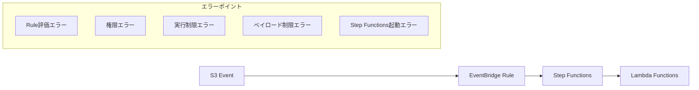

# EventBridge-StepFunctions連携エラー・例外ケース調査

## 1. 連携アーキテクチャの概要



## 2. EventBridge側のエラー・例外ケース

### 2.1 ルール評価エラー
#### 発生要因
- イベントパターンの構文エラー
- 不正なJSONパス指定
- 存在しないフィールドの参照

#### 具体例
```json
// 問題のあるイベントパターン
{
  "source": ["aws.s3"],
  "detail-type": ["Object Created"],
  "detail": {
    "eventSource": ["aws:s3"],
    "eventName": {
      "exists": "invalid_syntax"  // 不正な構文
    }
  }
}
```

#### 影響
- イベントが処理されずStep Functionsが起動しない
- CloudWatch Logsにエラーログなし（無視される）

### 2.2 権限関連エラー
#### 発生要因
```json
{
  "errorType": "AccessDenied",
  "errorMessage": "User: arn:aws:sts::123456789012:assumed-role/EventBridgeRole is not authorized to perform: states:StartExecution"
}
```

#### 必要な権限
```json
{
  "Version": "2012-10-17",
  "Statement": [
    {
      "Effect": "Allow",
      "Action": [
        "states:StartExecution"
      ],
      "Resource": "arn:aws:states:*:*:stateMachine:*"
    }
  ]
}
```

### 2.3 実行制限エラー
#### 同時実行数制限
- **Express Workflows**: 同一アカウント内で5,000実行/秒
- **Standard Workflows**: 同一アカウント内で2,000実行/秒

#### 制限超過時の動作
```json
{
  "errorType": "ExecutionLimitExceeded",
  "errorMessage": "Maximum number of running executions exceeded"
}
```

### 2.4 ペイロード制限エラー
#### サイズ制限
- **EventBridge → Step Functions**: 256KB
- **S3イベント通知**: 通常数KB程度だが大量ファイル時に注意

#### 制限超過例
```json
{
  "errorType": "PayloadTooLarge",
  "errorMessage": "Event payload size exceeds 256KB limit"
}
```

## 3. Step Functions起動時のエラー・例外ケース

### 3.1 ステートマシン起動エラー
#### 発生要因
```json
{
  "errorType": "StateMachineDoesNotExist",
  "errorMessage": "State Machine Does Not Exist: arn:aws:states:us-east-1:123456789012:stateMachine:NonExistentSM"
}
```

#### 対処方法
- ARNの正確性確認
- リージョン間違いのチェック
- ステートマシンの存在確認

### 3.2 入力データ形式エラー
#### JSON形式エラー
```json
// EventBridgeから送信される不正JSON
{
  "input": "invalid_json_string"  // JSONでない文字列
}
```

#### Step Functions側での検証
```json
{
  "Type": "Pass",
  "Parameters": {
    "bucket.$": "$.detail.bucket.name",
    "key.$": "$.detail.object.key"
  },
  "Next": "ValidateInput"
}
```

### 3.3 リソース制限エラー
#### 同時実行数制限
```json
{
  "errorType": "ExecutionLimitExceeded",
  "errorMessage": "The maximum number of running executions for this state machine has been reached"
}
```

#### 実行履歴制限
- Standard: 25,000イベント/実行
- Express: 制限なし（ただしCloudWatch Logsに依存）

## 4. 統合エラーパターン

### 4.1 ネットワーク関連エラー
#### VPCエンドポイント使用時
```json
{
  "errorType": "NetworkError",
  "errorMessage": "Unable to reach Step Functions endpoint"
}
```

#### DNS解決エラー
- プライベートDNSの設定問題
- セキュリティグループの制限

### 4.2 サービス間通信エラー
#### 一時的な障害
```json
{
  "errorType": "ServiceUnavailable", 
  "errorMessage": "Step Functions service is temporarily unavailable"
}
```

#### 再試行メカニズム
- EventBridgeは自動再試行しない
- Dead Letter Queue（DLQ）の設定推奨

## 5. 監視・検知方法

### 5.1 CloudWatch Metrics
```json
{
  "MetricName": "FailedInvocations",
  "Namespace": "AWS/Events",
  "Dimensions": [
    {
      "Name": "RuleName",
      "Value": "S3-to-StepFunctions"
    }
  ]
}
```

### 5.2 CloudWatch Alarms設定例
```json
{
  "AlarmName": "EventBridge-StepFunctions-Failures",
  "MetricName": "FailedInvocations",
  "ComparisonOperator": "GreaterThanThreshold",
  "Threshold": 0,
  "EvaluationPeriods": 1,
  "Period": 300
}
```

### 5.3 CloudTrail監査
```json
{
  "eventName": "StartExecution",
  "eventSource": "states.amazonaws.com",
  "errorCode": "AccessDenied",
  "errorMessage": "User is not authorized to perform states:StartExecution"
}
```

## 6. エラーハンドリング戦略

### 6.1 EventBridge側対策
#### Dead Letter Queue設定
```json
{
  "DeadLetterConfig": {
    "Arn": "arn:aws:sqs:us-east-1:123456789012:eventbridge-dlq"
  }
}
```

#### 再試行設定
```json
{
  "RetryPolicy": {
    "MaximumRetryAttempts": 3,
    "MaximumEventAge": 3600
  }
}
```

### 6.2 Step Functions側対策
#### 入力検証ステート
```json
{
  "ValidateInput": {
    "Type": "Choice",
    "Choices": [
      {
        "Variable": "$.detail.bucket.name",
        "IsPresent": true,
        "Next": "ProcessFile"
      }
    ],
    "Default": "InputError"
  }
}
```

#### エラー処理ステート
```json
{
  "InputError": {
    "Type": "Task",
    "Resource": "arn:aws:lambda:us-east-1:123456789012:function:HandleError",
    "End": true
  }
}
```

## 7. 実践的なトラブルシューティング

### 7.1 問題特定手順
1. **EventBridge Metrics確認**
   - SuccessfulInvocations vs FailedInvocations
2. **Step Functions実行履歴確認**
   - 実行が開始されているか
3. **CloudWatch Logs確認**
   - エラーの詳細内容
4. **CloudTrail確認**
   - API呼び出しの成功/失敗

### 7.2 よくある問題と解決方法

| 問題 | 症状 | 解決方法 |
|------|------|----------|
| 権限不足 | Step Functions実行されず | IAMロール権限見直し |
| ARN間違い | ターゲット見つからず | ARN再確認 |
| ペイロード超過 | イベント配信失敗 | データサイズ制限実装 |
| 同時実行制限 | 実行開始失敗 | 制限値調整またはキュー実装 |

## 8. 推奨監視・アラート設定

### 8.1 必須監視項目
- EventBridge FailedInvocations
- Step Functions StartExecution Errors
- Step Functions ExecutionsFailed
- Lambda Function Errors

### 8.2 アラート通知設定
```json
{
  "AlarmActions": [
    "arn:aws:sns:us-east-1:123456789012:error-notifications"
  ],
  "AlarmDescription": "EventBridge to Step Functions integration failure"
}
```

## 9. 高可用性設計での考慮事項

### 9.1 マルチリージョン対応
- プライマリ/セカンダリリージョン設定
- リージョン間でのイベント複製

### 9.2 障害時の自動復旧
- Lambda関数での代替処理実装
- SQSを使用したイベントバッファリング

## 10. まとめ

EventBridge-StepFunctions連携では以下のエラー対策が重要：

1. **権限設定の確認**：IAMロールと信頼関係
2. **制限値の監視**：同時実行数、ペイロードサイズ
3. **適切な監視設定**：CloudWatch、CloudTrail
4. **エラーハンドリング**：DLQ、再試行設定
5. **入力検証**：Step Functions側での検証ロジック

これらの対策により、堅牢で信頼性の高いイベント連携システムを構築できる。