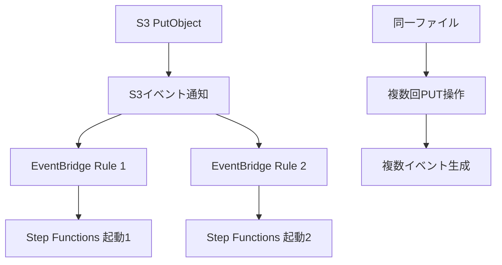
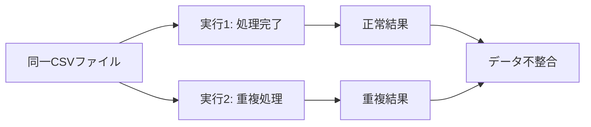

# EventBridge重複起動とStepFunctions2重実行対策

## 1. 結論：重複起動は発生する可能性が高い

**EventBridgeによるStepFunctions重複起動は十分に考えられ、対策が必要です。**

## 2. 重複起動が発生するケース

### 2.1 S3イベント通知の重複
#### 発生要因


#### 具体例
1. **アプリケーション側の重複PUT**
   - ネットワーク障害によるリトライ
   - 同じファイルの複数回アップロード
   - マルチパート上传の重複

2. **S3イベント設定の重複**
   - 複数のEventBridgeルールが同じS3イベントを監視
   - prefix/suffixの重複設定

### 2.2 EventBridge側の重複
#### 設定ミスによる重複
```json
// ルール1
{
  "Name": "S3-CSV-Processing-Rule-1",
  "EventPattern": {
    "source": ["aws.s3"],
    "detail": {
      "eventName": ["PutObject"],
      "requestParameters": {
        "key": [{"suffix": ".csv"}]
      }
    }
  }
}

// ルール2（重複）
{
  "Name": "S3-CSV-Processing-Rule-2", 
  "EventPattern": {
    "source": ["aws.s3"],
    "detail": {
      "eventName": ["PutObject"],
      "requestParameters": {
        "key": [{"suffix": ".csv"}]
      }
    }
  }
}
```

### 2.3 再試行による重複
#### EventBridge再試行設定
```json
{
  "RetryPolicy": {
    "MaximumRetryAttempts": 3,
    "MaximumEventAge": 3600
  }
}
```

#### 問題のケース
- 一時的なStep Functions障害
- ネットワーク遅延
- 権限エラーの一時的解決

## 3. 重複実行の影響とリスク

### 3.1 データ処理への影響


### 3.2 具体的なリスク
1. **データ重複**
   - 同じCSVが2回処理される
   - 結果データの重複登録

2. **コスト増加**
   - Lambda実行時間の2倍化
   - Step Functions実行回数の増加

3. **競合状態**
   - 同一リソースへの並行アクセス
   - ファイルロックの競合

## 4. 重複検知・防止戦略

### 4.1 ユニークキーによる冪等性確保
#### Step Functions実行名での制御
```json
{
  "StartAt": "CheckExecution",
  "States": {
    "CheckExecution": {
      "Type": "Task",
      "Resource": "arn:aws:lambda:...:function:check-duplicate",
      "Parameters": {
        "executionKey.$": "$.detail.object.key",
        "timestamp.$": "$.time"
      },
      "Next": "Choice"
    },
    "Choice": {
      "Type": "Choice", 
      "Choices": [
        {
          "Variable": "$.isDuplicate",
          "BooleanEquals": true,
          "Next": "SkipProcessing"
        }
      ],
      "Default": "ProcessFile"
    }
  }
}
```

#### Lambda関数での重複チェック
```python
import boto3
import hashlib

def check_duplicate(event, context):
    # ファイルのユニークキー生成
    s3_key = event['detail']['object']['key']
    timestamp = event['time']
    
    # ハッシュ値による一意性確保
    unique_key = hashlib.md5(f"{s3_key}_{timestamp}".encode()).hexdigest()
    
    # DynamoDBで重複チェック
    dynamodb = boto3.resource('dynamodb')
    table = dynamodb.Table('processing-history')
    
    try:
        table.put_item(
            Item={'unique_key': unique_key, 'status': 'processing'},
            ConditionExpression='attribute_not_exists(unique_key)'
        )
        return {'isDuplicate': False}
    except ClientError as e:
        if e.response['Error']['Code'] == 'ConditionalCheckFailedException':
            return {'isDuplicate': True}
        raise
```

### 4.2 DynamoDBによる実行状態管理
#### テーブル設計
```json
{
  "TableName": "csv-processing-tracker",
  "KeySchema": [
    {
      "AttributeName": "file_key",
      "KeyType": "HASH"
    }
  ],
  "AttributeDefinitions": [
    {
      "AttributeName": "file_key",
      "AttributeType": "S"
    }
  ]
}
```

#### 条件付き書き込みでの排他制御
```python
def ensure_single_execution(s3_key):
    try:
        table.put_item(
            Item={
                'file_key': s3_key,
                'status': 'processing',
                'execution_id': context.aws_request_id,
                'timestamp': int(time.time())
            },
            ConditionExpression='attribute_not_exists(file_key)'
        )
        return True  # 処理継続
    except ClientError as e:
        if e.response['Error']['Code'] == 'ConditionalCheckFailedException':
            return False  # 重複のため処理スキップ
```

### 4.3 S3オブジェクトバージョニングの活用
#### バージョン情報での重複判定
```json
{
  "EventPattern": {
    "source": ["aws.s3"],
    "detail": {
      "eventName": ["PutObject"],
      "responseElements": {
        "versionId": [{"exists": true}]
      }
    }
  }
}
```

#### 処理済みバージョンの記録
```python
def track_processed_version(bucket, key, version_id):
    processed_key = f"{bucket}/{key}/{version_id}"
    
    table.put_item(
        Item={
            'processed_key': processed_key,
            'processed_at': datetime.utcnow().isoformat()
        },
        ConditionExpression='attribute_not_exists(processed_key)'
    )
```

## 5. 実装パターン別対策

### 5.1 軽量対策（推奨開始点）
#### Step Functions実行名による制御
```json
{
  "StateMachineName": "CSV-Processing",
  "ExecutionName": {
    "Fn::Sub": "${BucketName}-${ObjectKey}-${Timestamp}"
  }
}
```

#### メリット・デメリット
| 項目 | 評価 |
|------|------|
| 実装コスト | 低 |
| 信頼性 | 中 |
| 運用負荷 | 低 |

### 5.2 中程度対策
#### DynamoDB + 条件付き書き込み
```python
def lambda_handler(event, context):
    s3_event = event['detail']
    file_key = f"{s3_event['bucket']['name']}/{s3_event['object']['key']}"
    
    # 重複チェック
    if is_duplicate_execution(file_key):
        return {'statusCode': 200, 'body': 'Duplicate execution skipped'}
    
    # Step Functions起動
    stepfunctions.start_execution(...)
```

### 5.3 完全対策（高信頼性要求時）
#### 分散ロック + タイムスタンプ検証
```python
import time
from contextlib import contextmanager

@contextmanager
def distributed_lock(lock_key, ttl=300):
    try:
        # 分散ロック取得
        table.put_item(
            Item={
                'lock_key': lock_key,
                'expires_at': int(time.time()) + ttl,
                'owner': context.aws_request_id
            },
            ConditionExpression='attribute_not_exists(lock_key) OR expires_at < :now',
            ExpressionAttributeValues={':now': int(time.time())}
        )
        yield True
    except ClientError:
        yield False
    finally:
        # ロック解放
        table.delete_item(
            Key={'lock_key': lock_key},
            ConditionExpression='owner = :owner',
            ExpressionAttributeValues={':owner': context.aws_request_id}
        )
```

## 6. 監視・アラート設定

### 6.1 重複実行検知メトリクス
```json
{
  "MetricName": "DuplicateExecutions",
  "Namespace": "Custom/StepFunctions",
  "Value": 1,
  "Dimensions": [
    {
      "Name": "StateMachine",
      "Value": "CSV-Processing"
    }
  ]
}
```

### 6.2 CloudWatch Alarm
```json
{
  "AlarmName": "StepFunctions-Duplicate-Executions",
  "MetricName": "DuplicateExecutions", 
  "ComparisonOperator": "GreaterThanThreshold",
  "Threshold": 0,
  "EvaluationPeriods": 1
}
```

## 7. 推奨実装手順

### 7.1 段階的実装
1. **Phase 1**: Step Functions実行名による基本制御
2. **Phase 2**: DynamoDB条件付き書き込み追加  
3. **Phase 3**: 完全な分散ロック実装（必要時）

### 7.2 最小実装例
```json
{
  "Comment": "重複防止付きCSV処理",
  "StartAt": "DuplicateCheck",
  "States": {
    "DuplicateCheck": {
      "Type": "Task",
      "Resource": "arn:aws:lambda:...:function:duplicate-check",
      "Next": "Choice"
    },
    "Choice": {
      "Type": "Choice",
      "Choices": [
        {
          "Variable": "$.isDuplicate",
          "BooleanEquals": false,
          "Next": "ProcessCSV"
        }
      ],
      "Default": "SkipProcessing"
    },
    "ProcessCSV": {
      "Type": "Task", 
      "Resource": "arn:aws:lambda:...:function:process-csv",
      "End": true
    },
    "SkipProcessing": {
      "Type": "Succeed"
    }
  }
}
```

## 8. まとめ

EventBridge重複起動対策は**必須の考慮事項**です：

1. **発生可能性**: S3イベント重複、設定ミス、再試行で発生
2. **影響**: データ重複、コスト増、競合状態
3. **対策**: 段階的実装（実行名→DynamoDB→分散ロック）
4. **監視**: 重複検知メトリクスとアラート

**推奨**: まずStep Functions実行名による軽量対策から開始し、要件に応じて強化する。