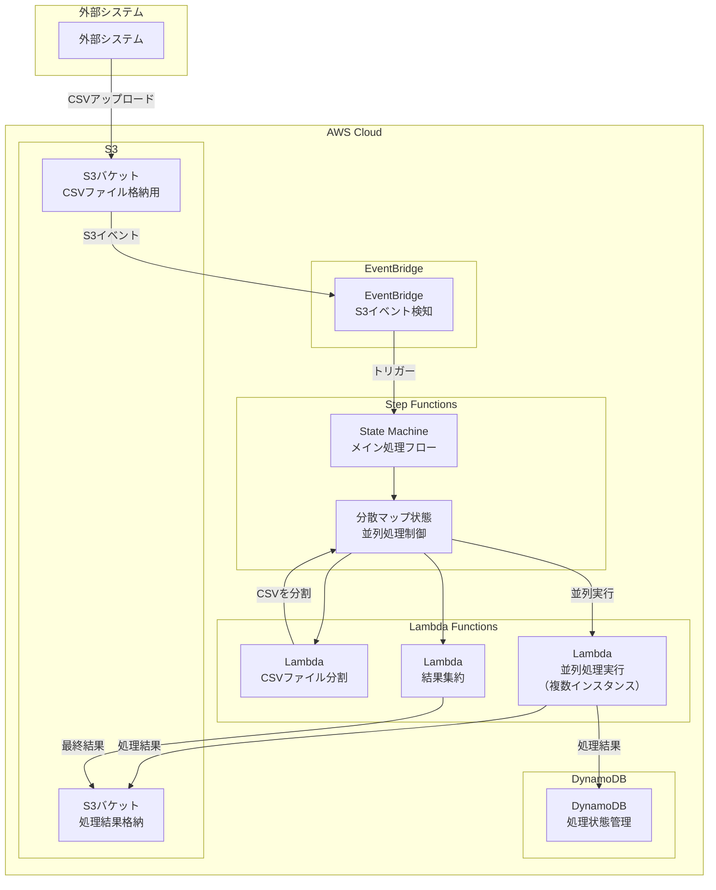

# Step Functions分散マップによるCSV並列処理アーキテクチャ

## 1. システム構成図



## 2. 処理フロー詳細

### 2.1 CSVファイルアップロード検知
1. 外部システムがS3バケットにCSVファイルをアップロード
2. S3のPutObjectイベントをEventBridgeが検知
3. EventBridgeがStep Functionsのステートマシンを起動

### 2.2 Step Functions処理フロー

```json
{
  "Comment": "CSV並列処理ステートマシン",
  "StartAt": "ファイル検証",
  "States": {
    "ファイル検証": {
      "Type": "Task",
      "Resource": "arn:aws:lambda:REGION:ACCOUNT:function:validate-csv",
      "Next": "CSV分割処理"
    },
    "CSV分割処理": {
      "Type": "Task",
      "Resource": "arn:aws:lambda:REGION:ACCOUNT:function:split-csv",
      "ResultPath": "$.chunks",
      "Next": "分散マップ処理"
    },
    "分散マップ処理": {
      "Type": "Map",
      "ItemProcessor": {
        "ProcessorConfig": {
          "Mode": "DISTRIBUTED",
          "ExecutionType": "EXPRESS"
        },
        "StartAt": "チャンク処理",
        "States": {
          "チャンク処理": {
            "Type": "Task",
            "Resource": "arn:aws:lambda:REGION:ACCOUNT:function:process-chunk",
            "End": true
          }
        }
      },
      "MaxConcurrency": 100,
      "ItemsPath": "$.chunks",
      "ResultPath": "$.results",
      "Next": "結果集約"
    },
    "結果集約": {
      "Type": "Task",
      "Resource": "arn:aws:lambda:REGION:ACCOUNT:function:aggregate-results",
      "End": true
    }
  }
}
```

### 2.3 Lambda関数の役割

#### validate-csv（ファイル検証）
- CSVファイルの形式チェック
- ヘッダー検証
- 文字コード確認

#### split-csv（CSV分割）
- 大きなCSVファイルを複数のチャンクに分割
- 各チャンクのS3パスをリストで返す
- チャンクサイズは設定可能（例：1000行ごと）

#### process-chunk（チャンク処理）
- 分割されたCSVチャンクを処理
- ビジネスロジックの実装
- 処理結果をDynamoDBに保存

#### aggregate-results（結果集約）
- 全チャンクの処理結果を集約
- 最終的な処理結果をS3に出力

## 3. アーキテクチャの特徴とメリット

### 3.1 分散マップの利点
- **高並列性**: 最大10,000個の並列実行が可能
- **自動スケーリング**: 処理量に応じて自動的にスケール
- **エラーハンドリング**: 部分的な失敗に対する再試行機能
- **コスト最適化**: EXPRESS実行モードによる低コスト化

### 3.2 考慮事項
- **ペイロード制限**: 各アイテムのペイロードサイズは256KB以下
- **実行時間制限**: EXPRESS実行モードは5分まで
- **同時実行数**: Lambda関数の同時実行数制限に注意

## 4. 実装推奨事項

### 4.1 エラーハンドリング
```json
"Retry": [
  {
    "ErrorEquals": ["States.TaskFailed"],
    "IntervalSeconds": 2,
    "MaxAttempts": 3,
    "BackoffRate": 2
  }
]
```

### 4.2 モニタリング
- CloudWatch Logsでログ収集
- X-Rayでトレーシング
- CloudWatch Metricsでパフォーマンス監視

### 4.3 セキュリティ
- S3バケットの暗号化
- Lambda関数のIAMロール最小権限
- VPCエンドポイントの利用（必要に応じて）

## 5. コスト見積もり例

月間処理量: 1,000ファイル（各100万行）の場合
- Step Functions分散マップ: 約$50
- Lambda実行: 約$100
- S3ストレージ: 約$23
- DynamoDB: 約$25

合計: 約$200/月

## 6. 代替案の検討

### 6.1 AWS Batch
- より大規模な処理に適している
- コンテナベースの実行環境
- 長時間実行が必要な場合に有効

### 6.2 EMR Serverless
- Sparkベースの並列処理
- より複雑なデータ変換に適している
- 大規模データセットに最適

### 6.3 標準的なStep Functions（非分散）
- 小規模なファイルには十分
- より簡単な実装
- コストが低い