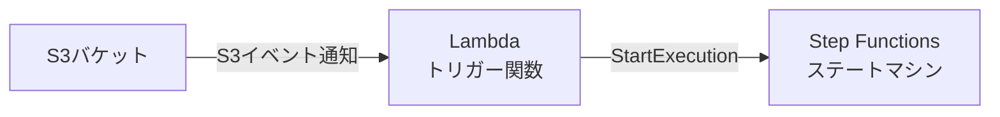
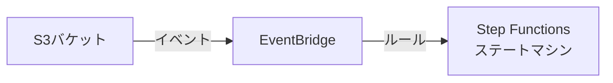

# S3イベント通知によるStep Functions実行パターン検討

## 1. 概要

本ドキュメントでは、S3にCSVファイルがアップロードされた際にStep Functionsを実行する方法について、EventBridgeとS3イベント通知の両パターンを比較検討します。

## 2. 実装パターンの比較

### 2.1 パターン1: S3イベント通知 → Lambda → Step Functions



#### 特徴
- **シンプルな構成**: S3 → Lambda → Step Functionsの直接的な連携
- **低レイテンシ**: イベント発生から実行まで最短パス
- **コスト効率**: EventBridgeを経由しないため、追加コストなし

#### 実装例

Lambda関数（S3イベントトリガー）:
```python
import json
import boto3

stepfunctions = boto3.client('stepfunctions')

def lambda_handler(event, context):
    # S3イベントからファイル情報を取得
    for record in event['Records']:
        bucket = record['s3']['bucket']['name']
        key = record['s3']['object']['key']
        
        # Step Functions入力データの準備
        input_data = {
            "bucket": bucket,
            "key": key,
            "eventTime": record['eventTime']
        }
        
        # Step Functionsの実行
        response = stepfunctions.start_execution(
            stateMachineArn='arn:aws:states:region:account:stateMachine:CSVProcessor',
            input=json.dumps(input_data)
        )
    
    return {
        'statusCode': 200,
        'body': json.dumps('Step Functions execution started')
    }
```

### 2.2 パターン2: S3 → EventBridge → Step Functions



#### 特徴
- **フィルタリング機能**: EventBridgeルールで高度な条件設定が可能
- **複数ターゲット**: 同一イベントで複数の処理を起動可能
- **統一管理**: すべてのイベントをEventBridgeで一元管理

#### EventBridgeルール例
```json
{
  "source": ["aws.s3"],
  "detail-type": ["Object Created"],
  "detail": {
    "bucket": {
      "name": ["csv-input-bucket"]
    },
    "object": {
      "key": [{
        "suffix": ".csv"
      }]
    }
  }
}
```

## 3. 比較分析

### 3.1 機能比較表

| 項目 | S3イベント通知 + Lambda | EventBridge |
|------|------------------------|-------------|
| **設定の簡単さ** | ◎ シンプル | ○ やや複雑 |
| **レイテンシ** | ◎ 低い | ○ 若干高い |
| **フィルタリング** | △ 基本的 | ◎ 高度 |
| **複数ターゲット** | × 不可 | ◎ 可能 |
| **コスト** | ◎ Lambda実行のみ | ○ EventBridge料金追加 |
| **再試行制御** | ○ Lambda内で実装 | ◎ 組み込み機能 |
| **監視・ログ** | ○ Lambda経由 | ◎ 統合監視 |
| **スケーラビリティ** | ○ Lambda同時実行数に依存 | ◎ 自動スケール |

### 3.2 ユースケース別推奨

#### S3イベント通知 + Lambdaを推奨
- シンプルな1対1の処理フロー
- 低レイテンシが重要
- コストを最小限に抑えたい
- 小規模〜中規模のファイル処理

#### EventBridgeを推奨
- 複雑なルーティングやフィルタリングが必要
- 複数の処理を並行して実行したい
- 企業全体でイベント駆動アーキテクチャを統一したい
- 大規模システムの一部として組み込む

## 4. 制限事項と考慮点

### 4.1 S3イベント通知の制限
- 1つのS3バケットイベントに対して設定できる通知先は限定的
- プレフィックス/サフィックスの重複設定は不可
- Lambda関数の同時実行数制限（デフォルト1,000）

### 4.2 EventBridgeの制限
- イベントサイズ: 最大256KB
- ルール数: リージョンあたり300ルール（デフォルト）
- ターゲット数: 1ルールあたり最大5ターゲット

### 4.3 Step Functions実行の制限
- 標準ワークフロー: 最大実行時間1年
- Expressワークフロー: 最大実行時間5分
- 実行履歴: 最大25,000イベント

## 5. 実装推奨事項

### 5.1 S3イベント通知 + Lambda方式の場合

1. **エラーハンドリング**
   - Lambda関数内でリトライロジックを実装
   - DLQ（Dead Letter Queue）の設定

2. **並行処理制御**
   - Lambda予約済み同時実行数の設定
   - Step Functions側での並行度制御

3. **モニタリング**
   - CloudWatch Logsでのログ集約
   - Lambda関数のメトリクス監視

### 5.2 EventBridge方式の場合

1. **ルール設計**
   - 明確なイベントパターンの定義
   - 適切なターゲット設定

2. **再試行設定**
   - ターゲットごとのリトライ設定
   - DLQの構成

3. **コスト管理**
   - イベント数の監視
   - 不要なルールの定期的な見直し

## 6. 結論

**推奨アプローチ**: S3イベント通知 + Lambda + Step Functions

理由：
1. シンプルで理解しやすい構成
2. 実装が容易で保守性が高い
3. コスト効率が良い
4. CSVファイル処理という単一目的には十分な機能

ただし、以下の場合はEventBridgeの採用を検討：
- 将来的に複数の処理パターンが追加される可能性がある
- 企業全体のイベント駆動アーキテクチャの一部として統合する
- 高度なフィルタリングやルーティングが必要

## 7. 実装サンプル

### S3イベント通知設定（Terraform）

```hcl
resource "aws_s3_bucket_notification" "csv_upload" {
  bucket = aws_s3_bucket.csv_input.id

  lambda_function {
    lambda_function_arn = aws_lambda_function.trigger_stepfunctions.arn
    events              = ["s3:ObjectCreated:*"]
    filter_suffix       = ".csv"
  }
}

resource "aws_lambda_permission" "allow_s3" {
  statement_id  = "AllowExecutionFromS3"
  action        = "lambda:InvokeFunction"
  function_name = aws_lambda_function.trigger_stepfunctions.function_name
  principal     = "s3.amazonaws.com"
  source_arn    = aws_s3_bucket.csv_input.arn
}
```

この構成により、EventBridgeを使用せずに、S3イベント通知とLambda関数の組み合わせでStep Functionsを効率的に実行できます。