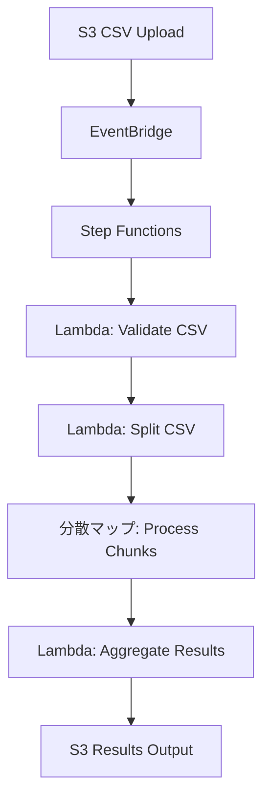

# S3-EventBridge-StepFunctions-LambdaアーキテクチャでのDynamoDB必要性検討

## 1. 結論：必要性は処理要件により決まる

DynamoDBの必要性は以下の要因により決定される：

### 1.1 **必要なケース**
- 大容量CSVファイル（数GB以上）の並列処理
- 処理の進捗監視が重要
- 障害時の部分再実行が必要
- 外部システムからのリアルタイム状況確認

### 1.2 **不要なケース**  
- 小容量ファイル（数MB～数百MB）
- 単純な一括処理で十分
- 失敗時は全体再実行で問題なし
- 処理状況の監視が不要

## 2. Step Functionsの標準機能による代替

### 2.1 Step Functions実行履歴
```json
{
  "executionArn": "arn:aws:states:...",
  "status": "RUNNING|SUCCEEDED|FAILED",
  "startDate": "2025-08-02T10:00:00Z",
  "input": {...},
  "output": {...}
}
```

### 2.2 CloudWatch Logsでの追跡
- 各Lambda関数の実行ログ
- Step Functionsの状態遷移ログ
- エラー詳細の記録

### 2.3 X-Rayでのトレーシング
- 処理フローの可視化
- 性能ボトルネックの特定
- エラー箇所の特定

## 3. DynamoDB不要なシンプルアーキテクチャ

### 3.1 基本フロー


### 3.2 Step Functions定義（簡略版）
```json
{
  "States": {
    "分散マップ処理": {
      "Type": "Map",
      "ItemProcessor": {
        "ProcessorConfig": {
          "Mode": "DISTRIBUTED"
        },
        "StartAt": "チャンク処理",
        "States": {
          "チャンク処理": {
            "Type": "Task",
            "Resource": "arn:aws:lambda:...:function:process-chunk",
            "Retry": [
              {
                "ErrorEquals": ["States.TaskFailed"],
                "IntervalSeconds": 2,
                "MaxAttempts": 3
              }
            ],
            "End": true
          }
        }
      }
    }
  }
}
```

## 4. DynamoDB追加による利点・欠点比較

### 4.1 利点
| 項目 | DynamoDBあり | DynamoDBなし |
|------|--------------|--------------|
| 進捗監視 | リアルタイム | Step Functions実行履歴のみ |
| 部分再実行 | 可能 | 全体再実行のみ |
| 外部連携 | API経由で状況取得可能 | Step Functions APIのみ |
| 障害復旧 | 柔軟 | 限定的 |

### 4.2 欠点
| 項目 | DynamoDBあり | DynamoDBなし |
|------|--------------|--------------|
| 複雑さ | 高 | 低 |
| コスト | 高 | 低 |
| 開発工数 | 多 | 少 |
| 運用負荷 | 高 | 低 |

## 5. 具体的な判断基準

### 5.1 ファイルサイズによる判断
```
< 100MB    : DynamoDB不要
100MB-1GB  : 要件により判断
> 1GB      : DynamoDB推奨
```

### 5.2 処理時間による判断
```
< 5分      : DynamoDB不要
5分-30分   : 要件により判断  
> 30分     : DynamoDB推奨
```

### 5.3 ビジネス要件による判断
```
バッチ処理メイン        : DynamoDB不要
リアルタイム監視必要    : DynamoDB必要
SLA厳格                : DynamoDB必要
開発速度優先           : DynamoDB不要
```

## 6. 推奨アプローチ

### 6.1 段階的実装
1. **フェーズ1**: DynamoDBなしでシンプル実装
2. **フェーズ2**: 要件に応じてDynamoDB追加

### 6.2 最小実装から開始
```json
{
  "Comment": "最小構成CSV処理",
  "StartAt": "CSV処理",
  "States": {
    "CSV処理": {
      "Type": "Task",
      "Resource": "arn:aws:lambda:...:function:process-csv",
      "End": true
    }
  }
}
```

### 6.3 必要に応じて拡張
- 処理時間が長くなった → 分散マップ追加
- 監視が必要になった → DynamoDB追加
- 部分再実行が必要 → 状態管理強化

## 7. 結論と推奨事項

### 7.1 **DynamoDB不要の場合**（推奨開始点）
- Step Functions + Lambda のみで実装
- CloudWatch Logs/X-Rayで監視
- シンプルで高速な開発
- 多くのユースケースで十分

### 7.2 **DynamoDB必要な場合**
- 大容量ファイル処理
- 厳格な監視要件
- 部分再実行の必要性
- 外部システム連携

**まずはシンプルなアーキテクチャから始めて、必要に応じてDynamoDBを追加することを強く推奨します。**