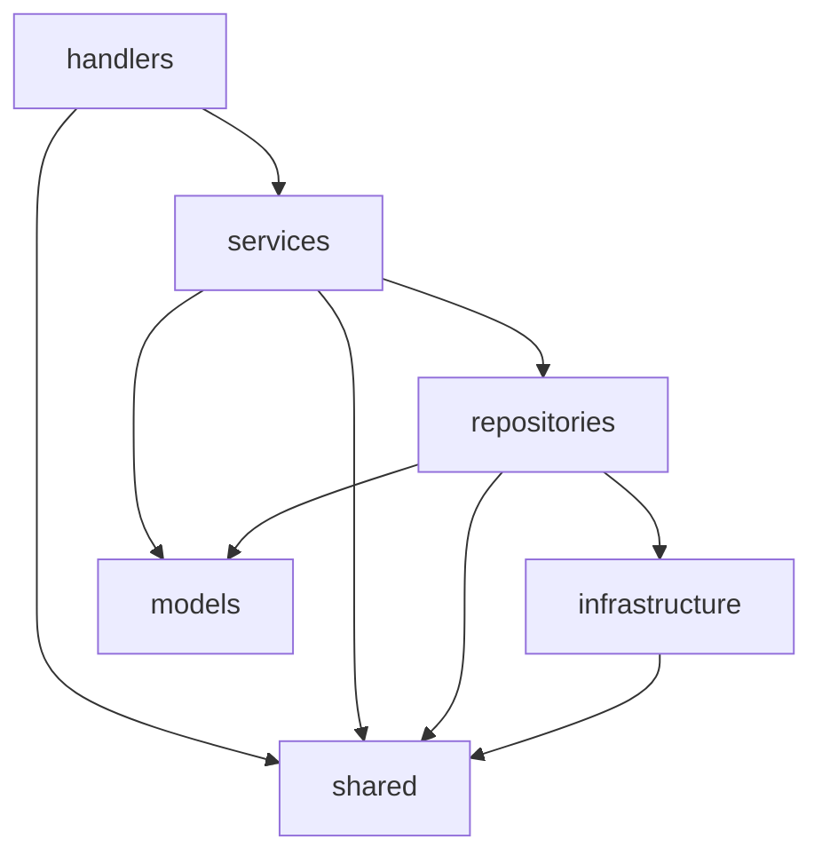
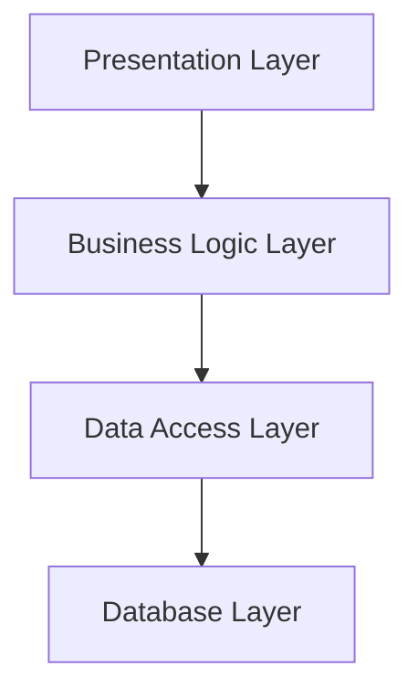
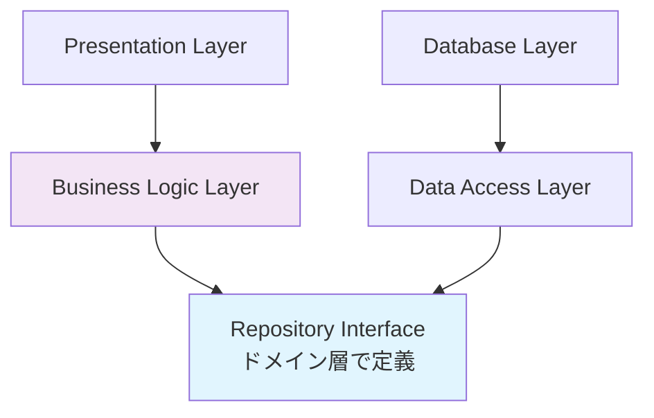

# Lambda開発標準仕様書アーキテクチャ分析

## 1. 概要

Lambda開発標準仕様書のアーキテクチャを分析し、依存性逆転の原則（DIP：Dependency Inversion Principle）が適用されているか、通常のレイヤードアーキテクチャとの違いを検証します。

## 2. 現在の仕様書のアーキテクチャ分析

### 2.1 仕様書で定義されているレイヤー構成

```
src/
├── handlers/           # エントリーポイント層
├── services/          # ビジネスロジック層
├── repositories/      # データアクセス層
├── models/           # ドメインモデル層
├── infrastructure/   # インフラ層
└── shared/          # 共通ユーティリティ
```

### 2.2 依存関係の方向

仕様書に記載されている依存関係：


### 2.3 現在の実装例の分析

#### Services層の実装
```typescript
export class UserProcessingService {
  constructor(
    private userRepo: IUserRepository,
    private auditRepo: IAuditLogRepository
  ) {}
}
```

#### Repositories層の実装
```typescript
export interface IUserRepository {
  findById(userId: string): Promise<User | null>;
  updateStatistics(userId: string, stats: UserStatistics): Promise<void>;
}

export class UserRepository implements IUserRepository {
  constructor(private auroraClient: IAuroraClient) {}
}
```

## 3. 依存性逆転の原則（DIP）とは

### 3.1 DIPの定義
1. **高レベルモジュールは低レベルモジュールに依存してはならない。両方とも抽象に依存すべきである**
2. **抽象は詳細に依存してはならない。詳細が抽象に依存すべきである**

### 3.2 通常のレイヤードアーキテクチャ vs DIP適用アーキテクチャ

#### 通常のレイヤードアーキテクチャ（問題のあるパターン）


- **問題点**：
  - 上位レイヤーが下位レイヤーに直接依存
  - 下位レイヤーの変更が上位レイヤーに影響
  - テストが困難（実際のデータベースが必要）
  - コードの柔軟性が低い

#### DIP適用レイヤードアーキテクチャ（推奨パターン）


- **特徴**：
  - インターフェースはドメイン層（Business Logic）で定義
  - データアクセス層がインターフェースに依存
  - 依存関係が逆転している

## 4. 現在の仕様書の評価

### 4.1 **結論：部分的にDIPが適用されている**

#### ✅ DIPが適用されている部分
1. **インターフェースの使用**
   - `IUserRepository`、`IAuditLogRepository` などのインターフェースを定義
   - Services層がインターフェースに依存
   
2. **依存性注入の実装**
   - コンストラクタインジェクションを使用
   - DIコンテナパターンの実装

3. **抽象化の層**
   - Infrastructure層でクライアントの抽象化（`IAuroraClient`、`IDynamoDBClient`）

#### ❌ DIPが完全ではない部分

1. **インターフェース定義の場所**
   ```typescript
   // 現在の構造（問題あり）
   repositories/
   ├── IUserRepository.ts      // インターフェースがrepositories層に定義
   └── UserRepository.ts
   
   // DIP適用の正しい構造
   models/                     // ドメイン層
   ├── User.ts
   └── interfaces/
       └── IUserRepository.ts  // インターフェースはドメイン層で定義
   
   repositories/               # インフラ層
   └── UserRepository.ts       # 実装がインターフェースに依存
   ```

2. **依存関係の方向**
   - 現在：Services → Repositories → Infrastructure
   - DIP適用：Services → Domain Interfaces ← Repositories

## 5. 改善提案

### 5.1 正しいDIP適用のディレクトリ構成

```
src/
├── handlers/              # Presentation Layer
│   └── csvValidator.ts
├── services/             # Application Service Layer
│   └── UserProcessingService.ts
├── domain/               # Domain Layer（ドメイン層）
│   ├── models/
│   │   ├── User.ts
│   │   └── ProcessingLog.ts
│   ├── interfaces/       # ドメインインターフェース
│   │   ├── IUserRepository.ts
│   │   ├── IAuditLogRepository.ts
│   │   └── IS3Repository.ts
│   └── services/         # ドメインサービス
│       └── UserDomainService.ts
├── infrastructure/       # Infrastructure Layer
│   ├── repositories/     # インフラ実装
│   │   ├── UserRepository.ts
│   │   ├── AuditLogRepository.ts
│   │   └── S3Repository.ts
│   └── aws/
│       ├── AuroraClient.ts
│       └── DynamoDBClient.ts
└── shared/
    ├── types/
    └── utils/
```

### 5.2 DIP適用の実装例

#### Domain Layer（インターフェース定義）
```typescript
// domain/interfaces/IUserRepository.ts
export interface IUserRepository {
  findById(userId: string): Promise<User | null>;
  updateStatistics(userId: string, stats: UserStatistics): Promise<void>;
}

// domain/models/User.ts
export class User {
  // ドメインロジックを含む
  constructor(
    public readonly id: string,
    public readonly username: string,
    private statistics: UserStatistics
  ) {}

  updateStatistics(loginCount: number, postCount: number): void {
    // ドメインルールの実装
    if (loginCount < 0 || postCount < 0) {
      throw new Error('統計値は0以上である必要があります');
    }
    this.statistics = new UserStatistics(loginCount, postCount);
  }
}
```

#### Application Service Layer
```typescript
// services/UserProcessingService.ts
import { IUserRepository } from '../domain/interfaces/IUserRepository';
import { User } from '../domain/models/User';

export class UserProcessingService {
  constructor(
    private userRepo: IUserRepository,  // ドメイン層のインターフェースに依存
    private auditRepo: IAuditLogRepository
  ) {}

  async processUserLog(userLogInput: UserLogInput): Promise<void> {
    // アプリケーションロジック
    const user = await this.userRepo.findById(userLogInput.userId);
    if (!user) {
      throw new UserNotFoundError(userLogInput.userId);
    }

    // ドメインオブジェクトのメソッドを使用
    user.updateStatistics(userLogInput.loginCount, userLogInput.postCount);
    
    await this.userRepo.updateStatistics(user.id, user.statistics);
  }
}
```

#### Infrastructure Layer（実装）
```typescript
// infrastructure/repositories/UserRepository.ts
import { IUserRepository } from '../../domain/interfaces/IUserRepository';
import { User } from '../../domain/models/User';

export class UserRepository implements IUserRepository {
  constructor(private auroraClient: IAuroraClient) {}

  async findById(userId: string): Promise<User | null> {
    // インフラストラクチャ固有の実装
    const result = await this.auroraClient.query(
      'SELECT * FROM users WHERE user_id = $1',
      [userId]
    );
    
    return result.records.length > 0 
      ? User.fromDatabase(result.records[0])
      : null;
  }

  async updateStatistics(userId: string, stats: UserStatistics): Promise<void> {
    // データベース更新の実装
    await this.auroraClient.query(
      'UPDATE user_statistics SET login_count = $1, post_count = $2 WHERE user_id = $3',
      [stats.loginCount, stats.postCount, userId]
    );
  }
}
```

#### DI Container（依存性の注入）
```typescript
// infrastructure/di/DIContainer.ts
export class DIContainer {
  createUserProcessingService(): UserProcessingService {
    // 具象クラスを注入するが、インターフェースを通じて
    const auroraClient = new AuroraClient(Environment.getDatabaseConfig());
    const dynamoClient = new DynamoDBClient(Environment.getDynamoConfig());
    
    const userRepo: IUserRepository = new UserRepository(auroraClient);
    const auditRepo: IAuditLogRepository = new AuditLogRepository(dynamoClient);
    
    return new UserProcessingService(userRepo, auditRepo);
  }
}
```

## 6. DIP適用のメリット

### 6.1 テスタビリティの向上
```typescript
// テスト時のMock実装が容易
class MockUserRepository implements IUserRepository {
  async findById(userId: string): Promise<User | null> {
    return new User(userId, 'testuser', new UserStatistics(0, 0));
  }
  
  async updateStatistics(userId: string, stats: UserStatistics): Promise<void> {
    // テスト用の実装
  }
}

// テストコード
describe('UserProcessingService', () => {
  it('should process user log successfully', async () => {
    const mockUserRepo = new MockUserRepository();
    const mockAuditRepo = new MockAuditLogRepository();
    const service = new UserProcessingService(mockUserRepo, mockAuditRepo);
    
    // テスト実行
  });
});
```

### 6.2 柔軟性の向上
```typescript
// 異なる実装への切り替えが容易
export class InMemoryUserRepository implements IUserRepository {
  private users = new Map<string, User>();
  
  async findById(userId: string): Promise<User | null> {
    return this.users.get(userId) || null;
  }
  
  async updateStatistics(userId: string, stats: UserStatistics): Promise<void> {
    const user = this.users.get(userId);
    if (user) {
      user.updateStatistics(stats.loginCount, stats.postCount);
    }
  }
}
```

### 6.3 ドメインロジックの保護
- ビジネスロジックがインフラストラクチャの詳細から独立
- ドメインモデルが純粋なビジネスルールに集中
- 外部システムの変更がドメインロジックに影響しない

## 7. Lambda開発における注意点

### 7.1 Cold Startの考慮
```typescript
// Lambdaでは初期化コストを考慮
let diContainer: DIContainer;

export const handler = async (event: any, context: Context) => {
  // DIコンテナの初期化（Cold Start時のみ）
  if (!diContainer) {
    diContainer = new DIContainer();
  }
  
  const service = diContainer.createUserProcessingService();
  return await service.processUserLog(event);
};
```

### 7.2 パフォーマンスの最適化
- 過度な抽象化はパフォーマンスに悪影響
- Lambda固有の制約（メモリ、実行時間）を考慮
- 必要に応じてインターフェースの粒度を調整

## 8. 結論と推奨事項

### 8.1 現在の状況
現在のLambda開発標準仕様書は**部分的にDIPを適用**していますが、完全なDIP実装ではありません。

### 8.2 推奨改善案
1. **インターフェース定義場所の変更**
   - Repositories層からDomain層へインターフェースを移動
   
2. **Domain層の明確化**
   - ドメインモデルとインターフェースを分離した層を作成
   
3. **依存関係の見直し**
   - Infrastructure層がDomain層のインターフェースに依存する構造に変更

### 8.3 段階的な移行計画
1. **Phase 1**: Domain層の作成とインターフェース移動
2. **Phase 2**: ドメインモデルの豊富化
3. **Phase 3**: テストコードの充実化
4. **Phase 4**: 運用での効果測定

### 8.4 適用判断
- **小規模なLambda関数**: 通常のレイヤードアーキテクチャで十分
- **複雑なビジネスロジック**: DIP適用を推奨
- **テストの重要性が高い**: DIP適用を強く推奨
- **将来的な拡張性を重視**: DIP適用を推奨

この分析により、現在の仕様書をベースにより適切なDIP適用アーキテクチャへの改善が可能になります。